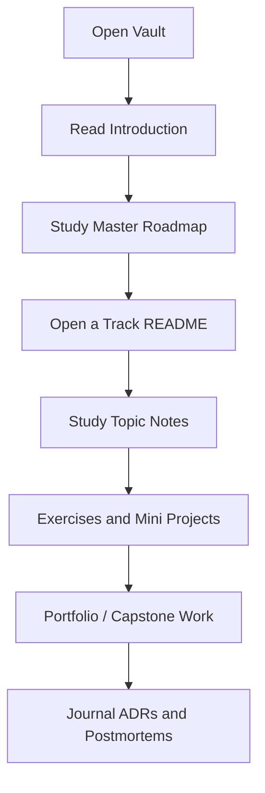

# 00 Introduction

Welcome to the Software Engineering Bible vault.

This repository is a structured curriculum, not a pile of notes. Use it to move from first principles to production judgment.

## Objectives

- Understand how this vault is organized
- Learn the Understand → Implement → Optimize → Teach loop
- Navigate tracks, templates, projects, and references
- Adopt contribution and documentation standards early

## How to Use This Vault

1. Read the root [[README|README]] for purpose and licensing.
2. Follow the [[00-Introduction/Roadmap|Master Roadmap]].
3. Open one track README and work topics in order when prerequisites matter.
4. Create new notes from [[00-Templates/README|Templates]].
5. Log real project work under [[Projects/README|Projects]] using the project template set.
6. Capture career practice under [[Career/README|Career]].

## Learning Philosophy

Every concept should answer:

- What is it?
- Why was it invented?
- What problem does it solve?
- How does it work internally?
- What are the trade-offs?
- When should I use it?
- When should I not use it?
- How would I implement one myself?
- How would large companies use it?

## Repository Map

| Section | Purpose |
| --- | --- |
| [[00-Templates/README\|Templates]] | Reusable note and project structures |
| [[00-Assets/README\|Assets]] | Shared images and media |
| [[00-References/README\|References]] | Curated sources |
| [[Projects/README\|Projects]] | Production project documentation |
| [[Career/README\|Career]] | Interviews and professional growth |
| [ROADMAP.md](../ROADMAP.md) | Repository build phases |
| [CONTRIBUTING.md](../CONTRIBUTING.md) | Writing standards |

## Curriculum Tracks

1. [[01-Computer-Science/README|Computer Science]]
2. [[02-JavaScript/README|JavaScript]]
3. [[03-Python/README|Python]]
4. [[04-Data-Structures/README|Data Structures]]
5. [[05-Algorithms/README|Algorithms]]
6. [[06-NodeJS/README|Node.js]]
7. [[07-Backend/README|Backend]]
8. [[08-Databases/README|Databases]]
9. [[09-System-Design/README|System Design]]
10. [[10-Linux/README|Linux]]
11. [[11-AWS/README|AWS]]
12. [[12-Azure/README|Azure]]
13. [[13-Google-Cloud/README|Google Cloud]]
14. [[14-Docker/README|Docker]]
15. [[15-Kubernetes/README|Kubernetes]]
16. [[16-DevOps/README|DevOps]]
17. [[17-Architecture/README|Architecture]]
18. [[18-Security/README|Security]]
19. [[19-AI/README|AI]]
20. [[20-Capstone-Projects/README|Capstone Projects]]

## Recommended First Week

1. Skim [[00-Introduction/Roadmap|Master Roadmap]] end to end.
2. Open [[01-Computer-Science/README|Computer Science]] and note prerequisites.
3. Copy [[00-Templates/Topic Template|Topic Template]] once to learn the note shape.
4. Create an empty project folder using [[00-Templates/Project/README|Project templates]] so documentation habits form early.
5. Start an engineering journal entry for your current work system.

## Topics

- [[00-Introduction/Roadmap|Master Roadmap]]

## Mini Projects

- Set up this vault in Obsidian and create one practice note from the Topic Template.
- Instantiate a sample project documentation set under `Projects/_sandbox/` locally (do not commit personal sandbox work).

## Portfolio Project

- Maintain this repository as a public-quality curriculum artifact: every note you add should be releasable.

## Exercises

1. Explain the difference between a notes dump and a curriculum.
2. Rewrite one concept you already know using the nine first-principles questions.
3. Identify which track maps to a production pain point in your current job.

## Interview Questions

- How do you learn a new technology without becoming dependent on tutorials?
- What does “production-oriented understanding” mean for a backend engineer?
- How would you structure a personal engineering knowledge base for a team?

## References

- [PROJECT_CONTEXT.md](../PROJECT_CONTEXT.md)
- [AGENTS.md](../AGENTS.md)
- [[00-Templates/README|Templates]]
