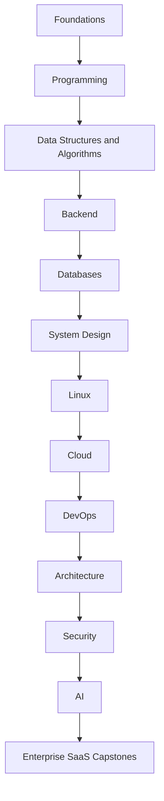

# Master Roadmap

Canonical learner-facing path through the Software Engineering Bible.

Each stage should culminate in a real-world project before moving on.

For repository build phases (what the maintainers implement next), see [ROADMAP.md](../ROADMAP.md).

## End-to-End Path

## Stage Map

### 1. Foundations

- [[01-Computer-Science/README|Computer Science]] — **complete curriculum available**

Outcome: memory, processes, networking, and computation models from first principles.

Start here: [[01-Computer-Science/00-Orientation/How Computers Run Programs|How Computers Run Programs]], then follow the module order on the CS track README. Use [[01-Computer-Science/code/README|code labs]] for dual TypeScript/Python implementations.

### 2. Programming

- [[02-JavaScript/README|JavaScript]] — **complete curriculum available**
- [[03-Python/README|Python]] — **complete curriculum available**

Outcome: language internals, not syntax tourism.

JavaScript begins at [[02-JavaScript/00-Orientation/Why JavaScript Exists|Why JavaScript Exists]] and progresses through values, execution contexts, objects, engines, asynchronous scheduling, modules, and production practice.

Python begins at [[03-Python/00-Orientation/Why Python Exists|Why Python Exists]] and progresses through the data model, descriptors, CPython runtime/memory, typing, concurrency (including free-threading), packaging, and production practice.

### 3. Data Structures and Algorithms

- [[04-Data-Structures/README|Data Structures]] — **complete curriculum available**
- [[05-Algorithms/README|Algorithms]] — **complete curriculum available**

Outcome: implement core structures and reason about complexity, locality, and failure modes; design and prove algorithms under explicit contracts.

Data Structures begins at [[04-Data-Structures/00-Orientation-and-Contracts/Why Data Structures Exist|Why Data Structures Exist]] and progresses through ADT contracts, contiguous and linked layouts, hash tables, trees, heaps, tries, graphs, probabilistic structures, caches, persistence, concurrency-aware variants, and production selection. Use [[04-Data-Structures/code/README|code labs]] for paired TypeScript/Python implementations against shared test vectors.

Algorithms begins at [[05-Algorithms/00-Foundations-and-Correctness/Why Algorithms Exist|Why Algorithms Exist]] and progresses through complexity analysis, searching and sorting, divide-and-conquer, greedy and dynamic programming, graph traversal and shortest paths, MST and advanced graphs, string algorithms, randomized/online methods, and production selection. Use [[05-Algorithms/code/README|Algorithms code labs]] for paired TypeScript/Python implementations against shared test vectors.

### 4. Backend

- [[06-NodeJS/README|Node.js]] — **complete curriculum available**
- [[07-Backend/README|Backend]] — **complete curriculum available**

Outcome: HTTP servers, auth, APIs, reliability patterns, and operational concerns.

Node.js begins at [[06-NodeJS/00-Orientation/Why Node.js Exists|Why Node.js Exists]] and progresses through process lifecycle, libuv event-loop phases, module execution, buffers and streams, thin `http`/`net` servers, workers and clustering, diagnostics, supply-chain security, and production process readiness. Use [[06-NodeJS/code/README|Node.js code labs]] for TypeScript mechanism implementations (event-loop ordering, backpressure, pipeline errors, HTTP server, worker pool, graceful shutdown, path safety, perf sampling).

Backend begins at [[07-Backend/00-Orientation/Why Backend Services Exist|Why Backend Services Exist]] and progresses through REST/OpenAPI contracts, Express middleware pipelines, authentication and authorization, validation and versioning, reliability and abuse resistance, cache-aside and outbox patterns, repository/data-access discipline, API observability, and production service readiness. Use [[07-Backend/code/README|Backend code labs]] for TypeScript Express mechanism implementations (Express-lite router, problem+json validation, session/JWT auth, RBAC, timeouts/retries/idempotency, rate limiting, cache-aside, job queue/outbox, repository, OpenAPI contract checks).

### 5. Databases

- [[08-Databases/README|Databases]] — **complete curriculum available**

Outcome: storage engines, indexing, transactions, and data modeling trade-offs.

Databases begins at [[08-Databases/00-Orientation/Why Databases Exist|Why Databases Exist]] and progresses through pages and buffer pools, WAL and crash recovery, on-disk indexes, query planning, transactions and isolation, concurrency internals, replication mechanics, PostgreSQL / MongoDB / Redis engine depth, modeling for access paths, and production database operations. Use [[08-Databases/code/README|Databases code labs]] for TypeScript educational engine implementations (page store, buffer pool, WAL redo, B+ index pages, lock manager, MVCC visibility, cost-based planner, Redis dict + AOF replay, SQL fixture runner). Practice with module exercises and interview sets under `08-Databases/_exercises/` and `_interview/`, five mini projects, and the [[08-Databases/projects/Database Engines Workbench/README|Database Engines Workbench]] portfolio.

### 6. System Design

- [[09-System-Design/README|System Design]] — **complete curriculum available**

Outcome: capacity, consistency, partitioning, caching, and graceful degradation.

System Design begins at [[09-System-Design/00-Orientation-and-Boundaries/Why System Design Exists|Why System Design Exists]] and progresses through capacity and latency budgets, load balancing and edge entry, CAP/PACELC product constraints, partitioning and hotspots, caching at fleet scale, messaging topologies, multi-region design, coordination for designers, product-scale failure modes, multi-service observability, reference architectures, and clone case studies. Use [[09-System-Design/code/README|System Design code labs]] for TypeScript simulations (capacity, percentiles, consistent hash, LB health/drain, quorum N/R/W, partition skew, cache stampede, queue lag, multi-region failover policy, fencing tokens). Practice with module exercises and interview sets under `09-System-Design/_exercises/` and `_interview/`, five mini projects, and the [[09-System-Design/projects/Distributed Systems Workbench/README|Distributed Systems Workbench]] portfolio.

### 7. Linux

- [[10-Linux/README|Linux]] — **complete curriculum available**

Outcome: production fluency with processes, filesystems, networking, and observability basics.

Linux begins at [[10-Linux/00-Orientation-and-Boundaries/Why Linux Exists for Engineers|Why Linux Exists for Engineers]] and progresses through shell and permissions, processes and signals, memory and OOM, filesystems and disk I/O, networking and nftables, systemd and journald, cgroups and namespaces, observability (`strace`/`perf`/eBPF intro), host security primitives, performance tuning, packaging basics, and incident runbooks. Use [[10-Linux/code/README|Linux code labs]] for TypeScript host simulations (procfs, permissions, signals/rlimits, page-cache/OOM, mounts/ENOSPC, sockets, cgroup v2, namespaces, systemd unit graphs, journal rate limits). Practice with module exercises and interview sets under `10-Linux/_exercises/` and `_interview/`, five mini projects, and the [[10-Linux/projects/Linux Host Workbench/README|Linux Host Workbench]] portfolio.

### 8. Cloud

- [[11-AWS/README|AWS]] — **next milestone (M13)**
- [[12-Azure/README|Azure]]
- [[13-Google-Cloud/README|Google Cloud]]

Outcome: portable cloud concepts with vendor-specific mapping where useful.

### 9. DevOps and Platforms

- [[14-Docker/README|Docker]]
- [[15-Kubernetes/README|Kubernetes]]
- [[16-DevOps/README|DevOps]]

Outcome: packaging, delivery, runtime platforms, and feedback loops.

### 10. Architecture, Security, AI

- [[17-Architecture/README|Architecture]]
- [[18-Security/README|Security]]
- [[19-AI/README|AI]]

Outcome: system shape, threat models, and AI systems with production constraints.

### 11. Capstones and Professional Practice

- [[20-Capstone-Projects/README|Capstone Projects]]
- [[Projects/README|Projects]]
- [[Career/README|Career]]

Outcome: enterprise SaaS-grade projects with ADRs, journals, and postmortems.

## Project Ladder

Suggested progression of portfolio work (details live under [[Projects/README|Projects]]):

1. Calculator / CLI Todo
2. HTTP Server
3. Authentication Server
4. Blog Platform
5. Chat Server
6. URL Shortener
7. Instagram / Discord / Netflix / Jira / GitHub style clones
8. Enterprise SaaS

## Stage Gate Checklist

Before advancing a stage:

- [ ] Core topic notes for the stage are understood enough to teach
- [ ] At least one from-scratch implementation completed
- [ ] Mini project completed and documented
- [ ] Interview questions practiced aloud
- [ ] Trade-offs written down, not only happy paths
- [ ] Related notes cross-linked

## Related Notes

- [[00-Introduction/README|Introduction]]
- [[00-Templates/README|Templates]]
- [[00-References/README|References]]
- [ROADMAP.md](../ROADMAP.md)
