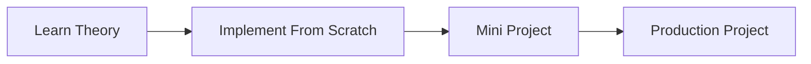

# {{title}}

## Objectives

- Understand the fundamentals
- Learn how systems work internally
- Build practical projects
- Prepare for interviews
- Apply concepts in production

## Why This Track Matters

<!-- Production pain this track removes -->

## Prerequisites

- 

## Roadmap

## Topics

<!-- Link each topic note as it is created -->

- 

## Suggested Study Order

1. 
2. 
3. 

## Mini Projects

- 

## Portfolio Project

- 

## Exercises

- 

## Interview Questions

- 

## Implementation Checklist

From-scratch artifacts this track should eventually include:

- [ ] 

## References

- 

## Related Tracks

- [[00-Introduction/Roadmap|Master Roadmap]]
- 
