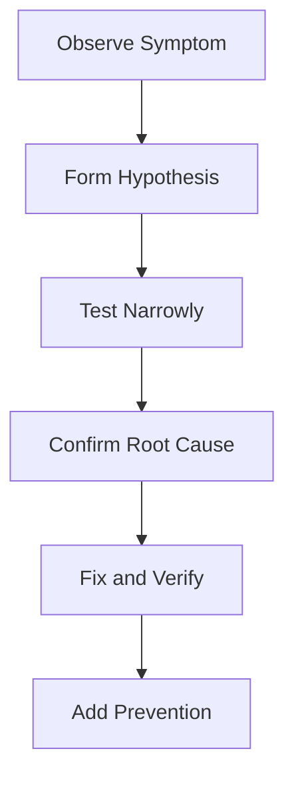

# Debug Diary — {{title}}

## Symptoms

<!-- Observable wrong behavior, including environment and frequency -->

## Impact

- Users / systems affected:
- Severity:
- Started at:

## Cause

<!-- Confirmed root cause, not the first guess -->

## Debugging Process

1. 
2. 
3. 

## Final Solution

## Prevention

- Tests:
- Alerts:
- Guardrails / docs:

## Related Notes

- [[00-Templates/Engineering Journal Template|Engineering Journal Template]]
- [[00-Templates/Postmortem Template|Postmortem Template]]
