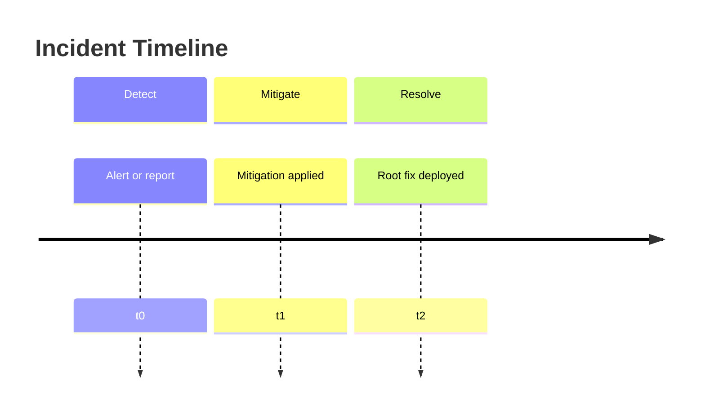

# Postmortem — {{title}}

## Summary

<!-- Blameless, factual, short enough for executives and engineers -->

## Impact

- Duration:
- Customer / user impact:
- Internal impact:
- Severity:

## Timeline

| Time | Event |
| --- | --- |
|  | Detected |
|  | Mitigated |
|  | Resolved |

## Root Cause

## Contributing Factors

- 

## What Went Well

- 

## What Went Poorly

- 

## Lessons Learned

- 

## Action Items

| Action | Owner | Due | Status |
| --- | --- | --- | --- |
|  |  |  |  |

## Related Notes

- [[00-Templates/Debug Diary Template|Debug Diary Template]]
- [[00-Templates/Project/Lessons Learned|Lessons Learned]]
- 
