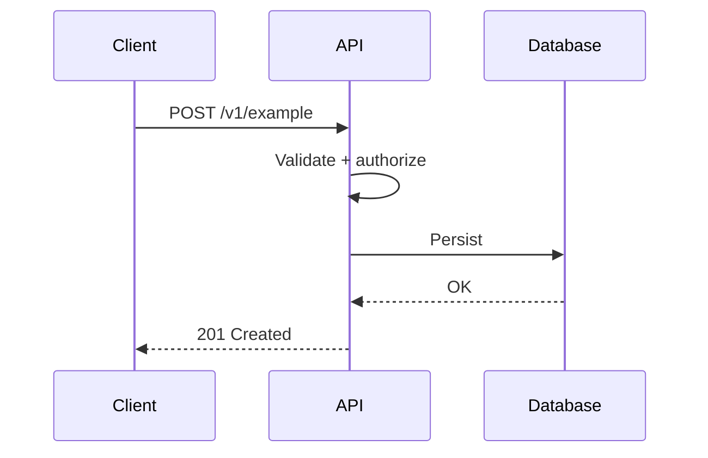

# API — {{project}}

## Style

`REST` | `RPC` | `GraphQL` | `Events` | mixed

## Auth Model

- Authentication:
- Authorization:
- Tenancy boundary:

## Endpoints

| Method | Path | Purpose | Authz | Idempotent |
| --- | --- | --- | --- | --- |
| POST | /v1/example |  |  |  |

## Contracts

### Request

```json
{
  "example": true
}
```

### Response

```json
{
  "id": "…",
  "status": "ok"
}
```

## Error Model

| Code | Meaning | Client action |
| --- | --- | --- |
| 400 |  |  |
| 401 |  |  |
| 409 |  |  |
| 429 |  |  |
| 500 |  |  |

## Versioning and Compatibility

- 

## Sequence — Core Write Path



## Related Documents

- [[00-Templates/Project/Requirements|Requirements]]
- [[00-Templates/Project/Security|Security]]
- [[00-Templates/Project/Testing|Testing]]
