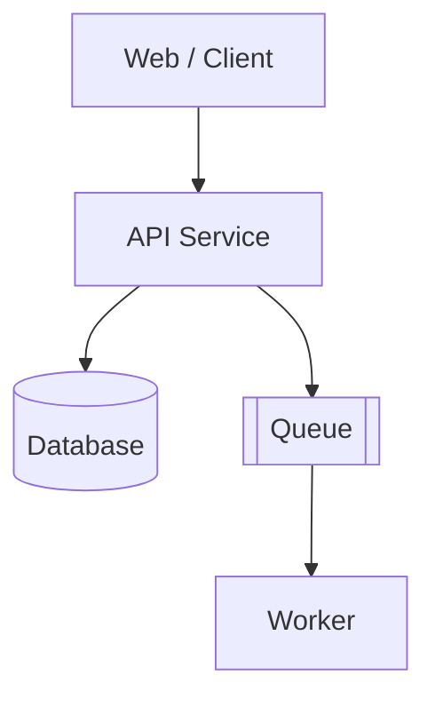
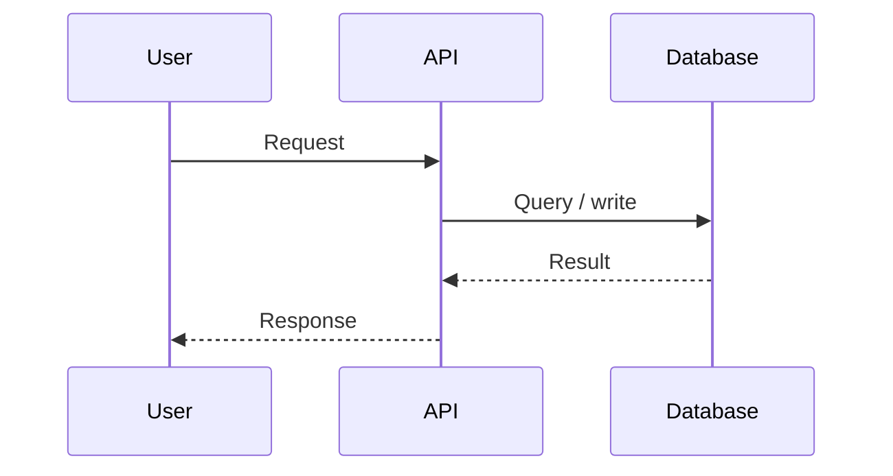

# Architecture — {{project}}

## Summary

<!-- Architectural style and primary constraints -->

## Context Diagram

```mermaid
flowchart LR
    Users[Users] --> System[{{project}}]
    System --> ExtA[External System A]
    System --> ExtB[External System B]
```

## Container Diagram



## Key Components

| Component | Responsibility | Owner mindset |
| --- | --- | --- |
|  |  |  |

## Data Flow



## Cross-Cutting Concerns

- Authn / authz:
- Consistency model:
- Caching:
- Idempotency:
- Failure isolation:
- Multi-tenancy:

## Quality Attribute Scenarios

| Attribute | Scenario | Response measure |
| --- | --- | --- |
| Availability |  |  |
| Latency |  |  |
| Durability |  |  |
| Scalability |  |  |

## Trade-offs

| Decision | Benefit | Cost | Alternative rejected |
| --- | --- | --- | --- |
|  |  |  |  |

## Open Questions

- 

## Related Documents

- [[00-Templates/Project/Requirements|Requirements]]
- [[00-Templates/Project/Database|Database]]
- [[00-Templates/Project/API|API]]
- [[00-Templates/Project/ADR/ADR Template|ADR Template]]
