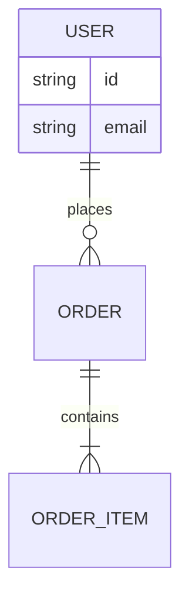

# Database — {{project}}

## Storage Choices

| Store | Role | Why chosen | Why not alternatives |
| --- | --- | --- | --- |
| PostgreSQL / MongoDB / Redis / … |  |  |  |

## Conceptual Model

## Physical Design Notes

- Keys and indexes:
- Cardinality assumptions:
- Hot paths:
- Retention / TTL:

## Consistency and Transactions

- Isolation level:
- Multi-document / multi-store transactions:
- Idempotency keys:

## Migrations

- Tooling:
- Expand/contract strategy:
- Rollback plan:

## Operational Concerns

- Backups:
- Restore drill cadence:
- Connection pooling:
- Migration locks / downtime:

## Related Documents

- [[00-Templates/Project/Architecture|Architecture]]
- [[00-Templates/Project/ADR/ADR Template|ADR Template]]
- [[00-Templates/Project/Security|Security]]
