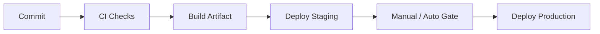

# Deployment — {{project}}

## Environments

| Environment | Purpose | Promotion rule |
| --- | --- | --- |
| local |  |  |
| staging |  |  |
| production |  |  |

## Release Pipeline

## Runtime Topology

- Compute:
- Networking:
- Secrets delivery:
- Config management:

## Rollback

- Trigger conditions:
- Procedure:
- Data compatibility constraints:

## Infrastructure as Code

- Tooling:
- State location:
- Review requirements:

## Checklist

- [ ] Migrations are backward compatible or gated
- [ ] Health checks and readiness probes defined
- [ ] Secrets are not in git
- [ ] Rollback tested at least once

## Related Documents

- [[00-Templates/Project/Monitoring|Monitoring]]
- [[00-Templates/Project/Security|Security]]
- [[00-Templates/Project/Architecture|Architecture]]
