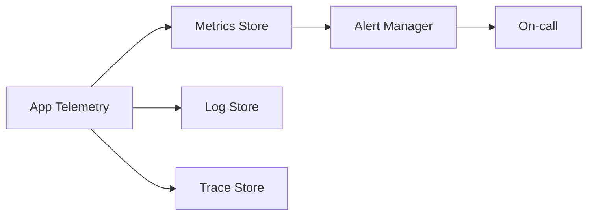

# Monitoring — {{project}}

## Service Level Objectives

| SLO | Target | Window | Burn-alert idea |
| --- | --- | --- | --- |
| Availability |  |  |  |
| Latency p95 |  |  |  |
| Error rate |  |  |  |

## Golden Signals

- Latency:
- Traffic:
- Errors:
- Saturation:

## Instrumentation Plan

| Event / metric | Type | Labels | Why |
| --- | --- | --- | --- |
|  | counter/histogram/gauge |  |  |

## Logging

- Structured fields required:
- PII policy:
- Correlation IDs:

## Tracing

- Critical spans:
- Sampling strategy:

## Alerting

| Alert | Condition | Severity | Runbook |
| --- | --- | --- | --- |
|  |  |  |  |

## Dashboards

- Overview:
- Dependency health:
- Business KPIs:

## Related Documents

- [[00-Templates/Project/Deployment|Deployment]]
- [[00-Templates/Project/Postmortem|Postmortem]]
- [[00-Templates/Project/Known Issues|Known Issues]]
