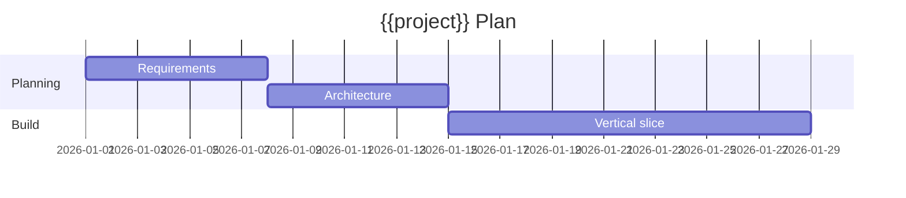

# Planning — {{project}}

## Problem Statement

## Success Definition

<!-- Measurable outcomes, not vibes -->

## Scope

### In Scope

- 

### Out of Scope

- 

## Milestones

| Milestone | Outcome | Exit criteria |
| --- | --- | --- |
| M1 |  |  |
| M2 |  |  |
| M3 |  |  |

## Risks

| Risk | Likelihood | Impact | Mitigation |
| --- | --- | --- | --- |
|  |  |  |  |

## Dependencies

- 

## Estimation Notes

<!-- What is uncertain and how you will buy information -->

## Related Documents

- [[00-Templates/Project/Requirements|Requirements]]
- [[00-Templates/Project/Roadmap|Roadmap]]
- [[00-Templates/Project/README|README]]
