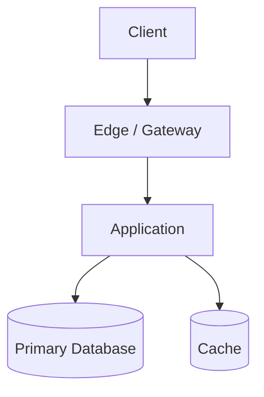

# {{project}}

## One-Line Purpose

<!-- What production problem does this project solve? -->

## Status

`idea` | `planning` | `building` | `operating` | `archived`

## Document Map

| Document | Purpose |
| --- | --- |
| [[00-Templates/Project/Planning\|Planning]] | Scope, milestones, risks |
| [[00-Templates/Project/Requirements\|Requirements]] | Functional and non-functional requirements |
| [[00-Templates/Project/Architecture\|Architecture]] | System shape and major components |
| [[00-Templates/Project/Database\|Database]] | Data model and storage decisions |
| [[00-Templates/Project/API\|API]] | Interfaces and contracts |
| [[00-Templates/Project/Deployment\|Deployment]] | Environments and release path |
| [[00-Templates/Project/Security\|Security]] | Threats, controls, secrets |
| [[00-Templates/Project/Testing\|Testing]] | Verification strategy |
| [[00-Templates/Project/Monitoring\|Monitoring]] | SLOs, alerts, observability |
| [[00-Templates/Project/Engineering Journal\|Engineering Journal]] | Session logs |
| [[00-Templates/Project/Debug Diary\|Debug Diary]] | Bug investigations |
| [[00-Templates/Project/Known Issues\|Known Issues]] | Open defects and debt |
| [[00-Templates/Project/Lessons Learned\|Lessons Learned]] | Durable takeaways |
| [[00-Templates/Project/Postmortem\|Postmortem]] | Incident / project retrospectives |
| [[00-Templates/Project/Ideas\|Ideas]] | Backlog of future directions |
| [[00-Templates/Project/Roadmap\|Roadmap]] | Phased delivery plan |
| [[00-Templates/Project/ADR/ADR Template\|ADR Template]] | Decision records |

## Context

<!-- Users, business constraints, current system pain -->

## Goals

- 

## Non-Goals

- 

## Tech Stack

- Language:
- Runtime:
- Data stores:
- Messaging:
- Infra:

## Architecture Snapshot



## How to Run Locally

```bash
# Add reproducible bootstrap commands
```

## Acceptance Checklist

- [ ] Requirements are measurable
- [ ] Architecture and ADRs explain major choices
- [ ] Security and testing plans exist before production traffic
- [ ] Monitoring defines what “healthy” means
- [ ] Lessons, journals, and known issues are maintained

## Related Notes

- [[Projects/README|Projects]]
- [[00-Introduction/Roadmap|Master Roadmap]]
