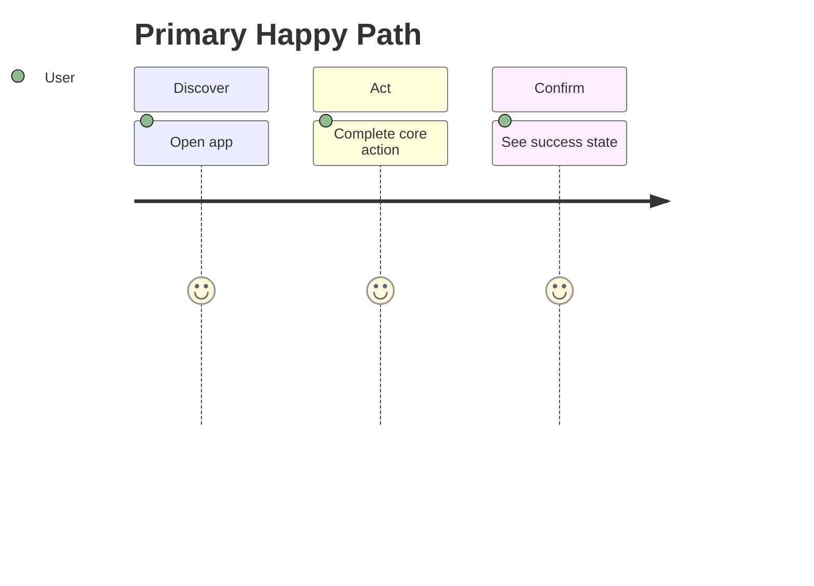

# Requirements — {{project}}

## Actors

| Actor | Goals |
| --- | --- |
|  |  |

## Functional Requirements

| ID | Requirement | Priority | Acceptance criteria |
| --- | --- | --- | --- |
| FR-001 |  | must |  |

## Non-Functional Requirements

| ID | Category | Requirement | Measurement |
| --- | --- | --- | --- |
| NFR-001 | Latency |  | p95 < |
| NFR-002 | Availability |  |  |
| NFR-003 | Security |  |  |
| NFR-004 | Observability |  |  |

## User Journeys

## Edge Cases

- 

## Explicit Non-Requirements

- 

## Traceability

| Requirement | Architecture component | Test case |
| --- | --- | --- |
| FR-001 |  |  |

## Related Documents

- [[00-Templates/Project/Planning|Planning]]
- [[00-Templates/Project/Testing|Testing]]
- [[00-Templates/Project/Security|Security]]
