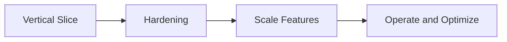

# Roadmap — {{project}}

## Current Phase

## Phases

| Phase | Outcome | Exit criteria |
| --- | --- | --- |
| P0 |  |  |
| P1 |  |  |
| P2 |  |  |

## Now / Next / Later

### Now

- 

### Next

- 

### Later

- 

## Completed

| Item | Date | Notes |
| --- | --- | --- |
|  |  |  |

## Related Documents

- [[00-Templates/Project/Planning|Planning]]
- [[00-Templates/Project/Ideas|Ideas]]
- [[00-Templates/Project/Known Issues|Known Issues]]
