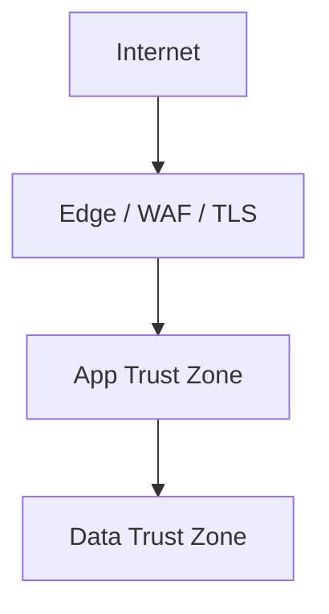

# Security — {{project}}

## Trust Boundaries

## Assets

| Asset | Sensitivity | Location |
| --- | --- | --- |
|  |  |  |

## Threat Model (STRIDE-oriented)

| Threat | Example | Mitigation |
| --- | --- | --- |
| Spoofing |  |  |
| Tampering |  |  |
| Repudiation |  |  |
| Information disclosure |  |  |
| Denial of service |  |  |
| Elevation of privilege |  |  |

## Controls

- Authentication:
- Authorization:
- Encryption in transit:
- Encryption at rest:
- Secrets management:
- Input validation:
- Dependency scanning:
- Audit logging:

## Abuse Cases

- 

## Incident Response Hooks

- Who is paged:
- Evidence to preserve:
- Customer notification criteria:

## Checklist

- [ ] Least privilege applied
- [ ] No secrets in repository
- [ ] Authz tests cover negative cases
- [ ] Dependency and image scanning enabled

## Related Documents

- [[00-Templates/Project/API|API]]
- [[00-Templates/Project/Deployment|Deployment]]
- [[00-Templates/Project/Postmortem|Postmortem]]
