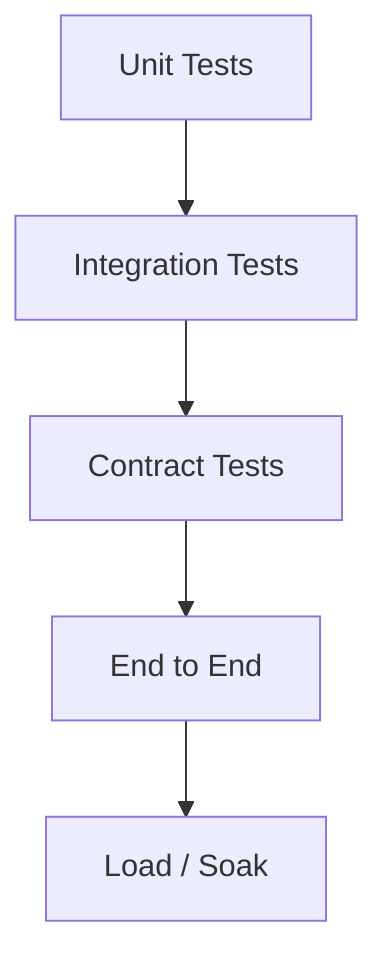

# Testing — {{project}}

## Strategy

## Test Pyramid Targets

| Layer | Goal | Notes |
| --- | --- | --- |
| Unit | Fast feedback on domain logic |  |
| Integration | DB, queue, and adapter truth |  |
| Contract | API compatibility |  |
| E2E | Critical user journeys | Keep few and stable |
| Non-functional | Latency, load, chaos as needed |  |

## Critical Paths to Cover

1. 
2. 
3. 

## Negative Cases

- Auth failures
- Idempotent retries
- Partial outages
- Invalid payloads

## Data and Fixtures

- 
- Seeding strategy:
- Cleanup strategy:

## Definition of Done for a Change

- [ ] Tests updated or justified as N/A
- [ ] Failure modes asserted, not only happy path
- [ ] Flaky tests quarantined with owner

## Related Documents

- [[00-Templates/Project/Requirements|Requirements]]
- [[00-Templates/Project/API|API]]
- [[00-Templates/Project/Monitoring|Monitoring]]
