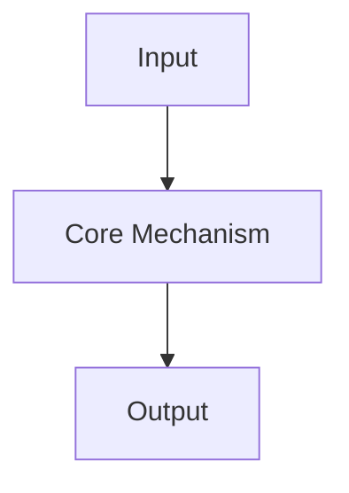
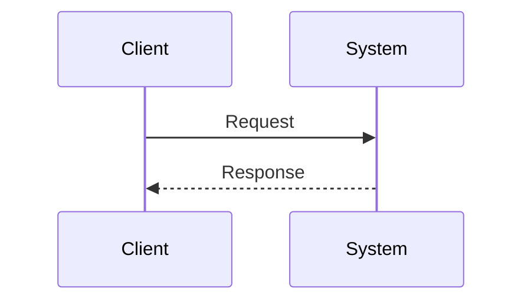

# {{title}}

## Overview

<!-- What is this concept in precise terms? -->

## Learning Objectives

- 
- 
- 

## Prerequisites

- 

## Difficulty

`beginner` | `intermediate` | `advanced` | `expert`

## Estimated Time

<!-- Reading + exercises + mini project -->

## History

<!-- Why did this exist historically? What constraints forced its invention? -->

## Problem It Solves

<!-- Concrete failure mode or inefficiency this addresses -->

## Internal Implementation

<!-- Data structures, algorithms, runtime behavior, memory/network implications -->



## Mermaid Diagrams

### Structure

```mermaid
flowchart LR
    Concept[{{title}}] --> PartA[Component A]
    Concept --> PartB[Component B]
```

### Sequence / Lifecycle



## Examples

### Minimal Example

```text
<!-- Replace with language-appropriate code -->
```

### Production-Shaped Example

```text
<!-- Show constraints: errors, timeouts, concurrency, observability -->
```

## Trade-offs

| Dimension | Upside | Downside | When it matters |
| --- | --- | --- | --- |
| Performance |  |  |  |
| Complexity |  |  |  |
| Operability |  |  |  |

### When to Use

- 

### When Not to Use

- 

## Exercises

1. 
2. 
3. 

## Mini Project

<!-- Scoped project that forces implementation, not only reading -->

## Portfolio Project

<!-- Larger artifact suitable for public demonstration -->

## Interview Questions

1. 
2. 
3. 

### Stretch / Staff-Level

1. 

## Common Mistakes

- 

## Best Practices

- 

## Summary

<!-- Teach-back paragraph: if you cannot write this clearly, revisit internals -->

## Further Reading

- 

## Related Notes

- 

## Progress Checklist

- [ ] Explained from first principles
- [ ] Drew at least one Mermaid diagram
- [ ] Implemented a minimal version
- [ ] Documented trade-offs and non-goals
- [ ] Completed exercises
- [ ] Practiced interview questions aloud
- [ ] Linked prerequisites and dependents
