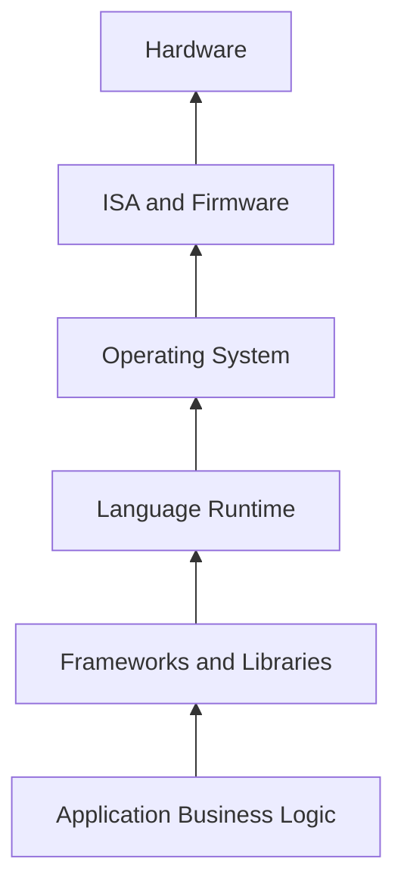
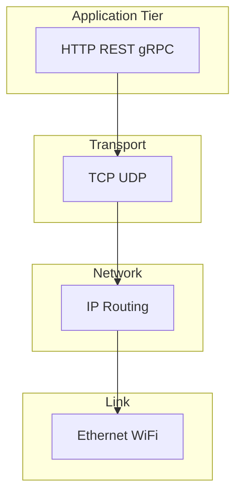
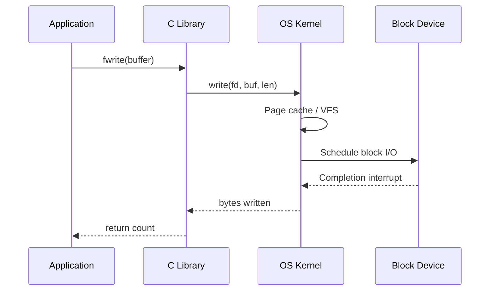

# Abstraction Layers in Computing

## Overview

An **abstraction layer** hides irrelevant detail behind a **stable interface** while preserving the behaviors callers depend on. Computing is stacked abstractions: transistors → gates → CPU → ISA → OS → runtime → framework → application. Each layer **contracts** with adjacent layers: upper layers assume lower layers meet invariants; lower layers assume upper layers call correctly.

Abstractions are not "simplifications for beginners." They are **engineering compression**: without them, every HTTP handler would require fluency in PHY, TCP congestion control, and page tables. The cost is **leakage**: when lower layers violate assumptions (slow disk, partial network write, float rounding), upper layers must understand enough internals to diagnose and design around failure.

This note frames the CS track as a descent through layers—from [[01-Computer-Science/01-Information-and-Representation/Bits Bytes and Information|Bits Bytes and Information]] up through [[01-Computer-Science/07-Networking-Fundamentals/Layered Network Models|Layered Network Models]] and into [[09-System-Design/README|System Design]].

## Learning Objectives

- Name the major layers from hardware to application and state each layer's contract
- Distinguish **interface** (what) from **implementation** (how)
- Identify **abstraction leaks** in production incidents and map them to the responsible layer
- Apply the **end-to-end principle** when deciding where to place functionality
- Design APIs that preserve invariants without exposing unsafe internals

## Prerequisites

- [[01-Computer-Science/00-Orientation/How Computers Run Programs|How Computers Run Programs]]
- [[00-Introduction/README|Introduction]]

## Difficulty

`beginner`

## Estimated Time

- Reading: 2 hours
- Exercises: 2 hours
- Mini project: 3–5 hours

## History

**Structured programming** (1960s–70s) modularized code inside one process. **Operating systems** abstracted hardware into processes, files, and sockets. **Networking** formalized layers in the OSI model (1984) and the pragmatic TCP/IP stack. **Virtual machines** and **containers** added OS-level abstraction over physical machines. Cloud **managed services** (RDS, S3, Lambda) abstract operations—but not physics: latency, quotas, and failure modes remain.

## Problem It Solves

Without layered thinking, teams:

- Re-implement TCP in application code (duplicate, buggy)
- Blame "the network" when the issue is DNS TTL or TLS cert rotation
- Build "leaky" ORMs that expose SQL dialect in every query
- Cannot reason about **blast radius** when a layer fails

Layers provide **separation of concerns** and **substitutability**: swap SQLite for Postgres if the SQL abstraction holds; swap NVMe for network storage if the block interface holds.

## Internal Implementation

### The canonical stack (simplified)



Each arrow is an **API contract**. Violations propagate upward as exceptions, errno, HTTP 503, or silent corruption.

### Layer responsibilities (production-oriented)

| Layer | Provides | Caller must not assume |
| --- | --- | --- |
| **Hardware** | Correct execution of ISA ops within timing specs | Infinite memory or zero failure |
| **ISA / microcode** | Instruction semantics, privileged traps | Cross-vendor identical perf |
| **OS kernel** | Processes, VM, files, sockets, scheduling fairness | Instant I/O; unbounded fds |
| **Runtime** | Memory management, threads, stdlib | Same perf on all platforms |
| **Framework** | Routing, DI, ORM patterns | Correct business rules by default |
| **Application** | Domain invariants, UX, SLAs | That lower layers never fail |

### Abstraction mechanisms

1. **Naming and addressing** — IP addresses hide MAC topology; URLs hide server location
2. **Virtualization** — [[01-Computer-Science/03-Memory-and-Addressing/Virtual Memory|Virtual Memory]] maps virtual pages to physical frames
3. **Buffering** — [[01-Computer-Science/06-IO-and-Persistence/Buffers Streams and Zero Copy|Buffers]] decouple producer/consumer rates
4. **Serialization** — [[01-Computer-Science/01-Information-and-Representation/Data Serialization Fundamentals|Data Serialization]] hides memory layout across machines
5. **Protocol state machines** — TCP hides packet loss from byte streams

### Leakage examples

| Symptom | Leaking layer | Why it surfaces |
| --- | --- | --- |
| `0.1 + 0.2 !== 0.3` | Numeric representation | IEEE-754 is exposed through language number type |
| Stale read after write | Database / cache | Consistency model not abstracted |
| `EMFILE` errors | OS file descriptor limit | Process table visible to app |
| Tail latency spikes | CPU cache / GC | Memory hierarchy breaks "uniform cost" fiction |

## Mermaid Diagrams

### Structure: network layering (TCP/IP vs app)



See [[01-Computer-Science/07-Networking-Fundamentals/Layered Network Models|Layered Network Models]] for full treatment.

### Sequence: syscall as layer boundary



Every `fs.writeFile` in Node or `open()` in Python crosses a similar boundary.

## Examples

### Minimal Example

**TypeScript** — file API hides inode and block allocation:

```typescript
import { writeFile } from "node:fs/promises";

await writeFile("out.txt", "hello", "utf8");
// OS owns durability, permissions, and encoding to bytes
```

**Python**:

```python
from pathlib import Path

Path("out.txt").write_text("hello", encoding="utf-8")
# UTF-8 encoding bridges Unicode abstraction → bytes → kernel write
```

The character-to-byte step is **not** hidden if you ignore [[01-Computer-Science/01-Information-and-Representation/Character Encoding|Character Encoding]].

### Production-Shaped Example

A payment service "abstracts" card processing behind `PaymentGateway.charge()`. Production requirements:

- **Idempotency keys** at app layer (not provided by PCI SDK alone)
- **Timeout + circuit breaker** at HTTP client layer (leaky network)
- **Structured logs** with correlation IDs crossing async boundaries
- **Explicit failure taxonomy**: `DECLINED` vs `GATEWAY_TIMEOUT` vs `INVALID_SIGNATURE`

```typescript
interface ChargeResult {
  status: "succeeded" | "declined" | "retryable_error";
  gatewayRef: string;
  latencyMs: number;
}

async function charge(idempotencyKey: string, amountCents: number): Promise<ChargeResult> {
  const controller = new AbortController();
  const timer = setTimeout(() => controller.abort(), 5_000);
  try {
    const res = await fetch(GATEWAY_URL, {
      method: "POST",
      signal: controller.signal,
      headers: { "Idempotency-Key": idempotencyKey },
      body: JSON.stringify({ amountCents }),
    });
    // Map HTTP + JSON to domain enum — do not leak raw status codes to UI
    return mapGatewayResponse(res);
  } finally {
    clearTimeout(timer);
  }
}
```

Lab implementations: [[01-Computer-Science/code/README|code labs]].

## Trade-offs

| Dimension | Upside | Downside | When it matters |
| --- | --- | --- | --- |
| Productivity | Faster feature delivery | Wrong layer = rework | Startups scaling to prod |
| Substitutability | Swap vendors, databases | Lowest-common-denominator APIs | Multi-cloud |
| Debuggability | Clear boundaries in diagrams | Blame ping-pong across teams | Incidents |
| Performance | Skip layers when needed | Tight coupling to internals | Hot paths, games |
| Correctness | Enforce invariants at boundaries | Hidden assumptions | Financial, safety systems |

### When to Use

- **Default**: depend on the **lowest layer that satisfies** your invariant
- **API design**: expose intent (`SchedulePayment`) not mechanism (`INSERT INTO jobs`)
- **On-call**: draw the layer diagram first, then dive

### When Not to Use

- Do not add indirection with no invariant to protect ("abstract for abstract's sake")
- Do not trust a layer to provide **end-to-end properties** it cannot (TCP does not guarantee application-level delivery semantics without app logic)

## Exercises

1. For your current project, draw a 6-layer stack and label one failure that leaked through each boundary.
2. Read one production postmortem and rewrite it identifying which layer owned the root cause vs contributing factors.
3. Implement the same "key-value store" twice: raw file append vs SQLite—document which invariants each layer provides.
4. Explain why "the database is down" might mean connection pool exhaustion at the app layer.
5. Compare OSI 7-layer model to TCP/IP 4-layer—what does each optimize for?

## Mini Project

**Layer Violation Detector**

Write a linter-style tool that scans logs for phrases that confuse layers (e.g., "TCP failed" when the log shows DNS NXDOMAIN). Classify each line into App / Runtime / OS / Network. Ship with a small golden test file.

## Portfolio Project

Document the abstraction stack for the [[01-Computer-Science/projects/Concurrent Runtime and Protocol Workbench/README|Concurrent Runtime and Protocol Workbench]]: which invariants are guaranteed at the protocol layer vs left to the application?

## Interview Questions

1. What is an abstraction leak? Give three examples from web backends.
2. Where should retry logic live: TCP, HTTP client, or business service?
3. Why did the end-to-end argument favor application-layer encryption over link-layer only?
4. How do containers differ from VMs as an abstraction?
5. When would you bypass an ORM for raw SQL?

### Stretch / Staff-Level

1. Design a platform API that exposes object storage without leaking S3 key semantics or eventual consistency unless requested.
2. Argue for or against "serverless" as an abstraction over ops—what still leaks?

## Common Mistakes

- Treating abstractions as **truth** instead of **contracts with failure modes**
- Placing **business rules** in frameworks (version-lock and untestable)
- **Over-stacking** wrappers until stack traces are unreadable
- Ignoring **cross-cutting concerns** (auth, observability) at every boundary

## Best Practices

- Document **invariants** at module boundaries (`@throws`, ADRs)
- Test with **fault injection** at the layer you depend on (iptables drop, disk full)
- Prefer **narrow interfaces** over god-objects
- When debugging, **descend one layer at a time** with evidence
- Cross-link notes in this vault so leaks have a landing page

## Summary

Abstraction layers compress complexity by hiding implementation behind interfaces—but every layer has a contract, and contracts break under real physics and economics. Strong engineers know which layer owns durability, consistency, ordering, and failure notification. The CS track teaches the layers from bits upward so that when a framework promise fails in production, you know exactly which note to open next.

## Further Reading

- [[00-References/Computer Science/README|Computer Science References]]
- Saltzer, Reed, Clark — *End-to-End Arguments in System Design* (1984)
- Joel Spolsky — *The Law of Leaky Abstractions*

## Related Notes

- [[01-Computer-Science/00-Orientation/How Computers Run Programs|How Computers Run Programs]]
- [[01-Computer-Science/07-Networking-Fundamentals/Layered Network Models|Layered Network Models]]
- [[01-Computer-Science/02-Machine-Model/Hardware Software Interface|Hardware Software Interface]]
- [[01-Computer-Science/06-IO-and-Persistence/Files as Abstractions|Files as Abstractions]]
- [[09-System-Design/README|System Design]]
- [[17-Architecture/README|Architecture]]
- [[01-Computer-Science/README|Computer Science Track]]

## Progress Checklist

- [ ] Explained from first principles
- [ ] Drew at least one Mermaid diagram
- [ ] Implemented a minimal version
- [ ] Documented trade-offs and non-goals
- [ ] Completed exercises
- [ ] Practiced interview questions aloud
- [ ] Linked prerequisites and dependents
