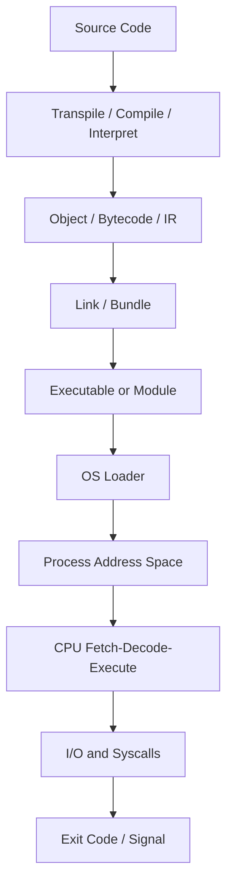
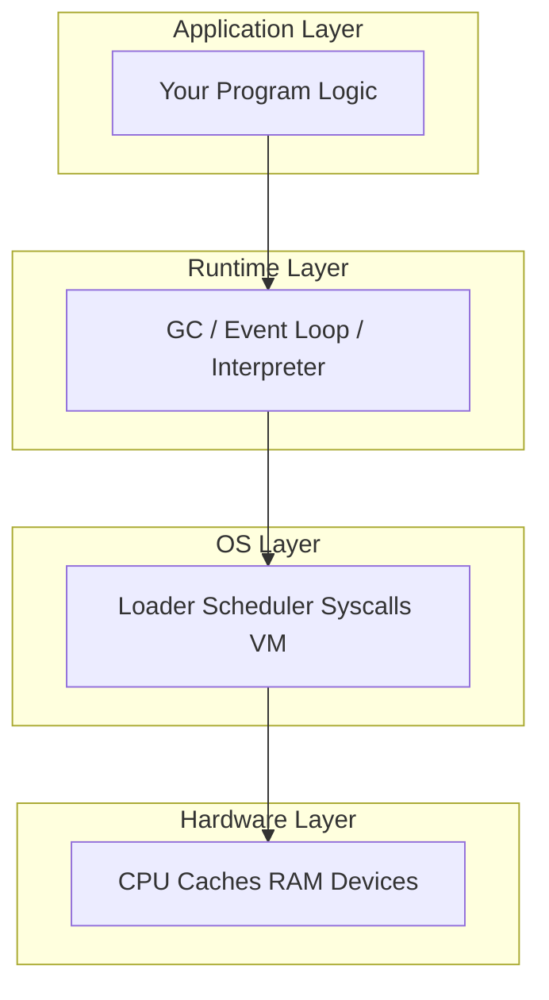
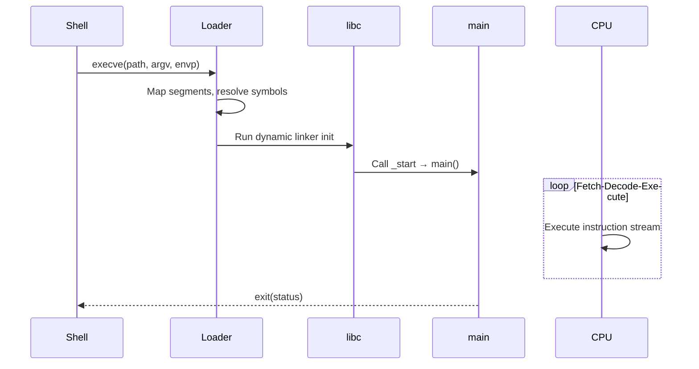

# How Computers Run Programs

## Overview

A **program** is a finite sequence of **machine instructions** stored as bytes in memory. A **computer** does not "understand" your intent—it repeatedly **fetches** the next instruction, **decodes** what it means, and **executes** its effect on registers, memory, and I/O devices. Everything you write in TypeScript, Python, Rust, or SQL is eventually transformed into this fetch-decode-execute loop (or an equivalent virtual machine that emulates it).

Understanding program execution from first principles means tracing a single line of high-level code through:

1. **Translation** (compiler, interpreter, or JIT)
2. **Loading** (OS loader, dynamic linker)
3. **Address space setup** (stack, heap, code segment)
4. **CPU execution** (registers, ALU, memory hierarchy)
5. **Observability** (exit codes, signals, logs)

This note is the entry point for the entire Computer Science track. Later notes on [[01-Computer-Science/01-Information-and-Representation/Bits Bytes and Information|Bits Bytes and Information]], [[01-Computer-Science/02-Machine-Model/Fetch Decode Execute|Fetch Decode Execute]], and [[01-Computer-Science/04-Processes-and-Execution/Processes|Processes]] extend each layer.

## Learning Objectives

- Explain the fetch-decode-execute cycle and how it relates to any programming language
- Trace a program from source file to running process with named artifacts at each stage
- Distinguish compile-time, link-time, load-time, and run-time behavior
- Identify where errors, performance, and security properties emerge in the execution pipeline
- Read a minimal disassembly or bytecode trace and map it back to source intent

## Prerequisites

- [[00-Introduction/README|Introduction]] — comfort reading code and running small programs
- [[00-Introduction/Roadmap|Master Roadmap]] — awareness of track ordering

## Difficulty

`beginner`

## Estimated Time

- Reading and diagrams: 2–3 hours
- Exercises: 2–3 hours
- Mini project: 4–6 hours

## History

Early computers (1940s–50s) were programmed by rewiring or entering **machine code** directly. Assemblers (1950s) introduced mnemonics; **Fortran** (1957) pioneered high-level compilation. Operating systems (1960s+) added **multiprogramming**: multiple programs sharing one machine via time-slicing. Virtual memory (1970s) let processes believe they owned contiguous address spaces. JIT compilation (1990s–2000s) blurred the compile/run boundary for Java, JavaScript, and Python.

Each innovation responded to a constraint: human productivity, memory scarcity, security isolation, or startup latency.

## Problem It Solves

Without a clear execution model, developers treat runtime behavior as magic:

- "Why did my function run twice?" (inlining, memoization, or duplicate event handlers)
- "Why is this fast in dev but slow in prod?" (different CPU, cold start, interpreter vs compiled path)
- "Why did the process exit with code 137?" (SIGKILL, OOM killer—see [[01-Computer-Science/04-Processes-and-Execution/Processes|Processes]])

A precise execution model turns mystery bugs into inspectable stages.

## Internal Implementation

### The execution pipeline (conceptual)



### What lives in a process address space

| Region | Typical contents | Grows toward |
| --- | --- | --- |
| **Text (code)** | Machine instructions, read-only | Fixed size |
| **Data / BSS** | Global and static variables | Fixed size |
| **Heap** | Dynamic allocations (`malloc`, `new`, GC objects) | Higher addresses |
| **Stack** | Function frames, local variables, return addresses | Lower addresses |
| **Mapped files** | Shared libraries, memory-mapped I/O | Varies |

The OS and CPU enforce **permissions**: code is executable but not writable; stack has guard pages; heap is read/write but not executable (W^X / DEP).

### Translation strategies

| Strategy | When work happens | Examples | Trade-off |
| --- | --- | --- | --- |
| **Ahead-of-time (AOT)** | Before run | C, Go, Rust | Fast startup; platform-specific binary |
| **Just-in-time (JIT)** | During run, hot paths | JVM, V8, PyPy | Adaptive optimization; warmup cost |
| **Interpreted** | Every instruction at run | CPython bytecode loop | Portable; slower hot loops |
| **Transpiled** | Build step to another HLL | TypeScript → JS | Ergonomics; target runtime owns perf |

### Fetch-decode-execute (preview)

The CPU maintains a **program counter (PC)** pointing at the next instruction. Each cycle:

1. **Fetch** instruction bytes from memory (often via L1 I-cache)
2. **Decode** opcode and operand specifiers
3. **Execute** (ALU op, load/store, branch, syscall trap)

Branches and calls update PC. Pipelining and speculation (see [[01-Computer-Science/02-Machine-Model/Pipelining and Speculative Execution|Pipelining and Speculative Execution]]) overlap these stages for throughput.

## Mermaid Diagrams

### Structure: layers from program to hardware



### Sequence: launching a compiled binary



## Examples

### Minimal Example

**TypeScript** (transpiled; Node executes via V8 JIT):

```typescript
function sum(a: number, b: number): number {
  return a + b;
}

console.log(sum(2, 3));
```

**Python** (compiled to bytecode, interpreted by CPython VM):

```python
def sum(a: int, b: int) -> int:
    return a + b

print(sum(2, 3))
```

Inspect Python bytecode:

```python
import dis
dis.dis(sum)
# LOAD_FAST, LOAD_FAST, BINARY_ADD, RETURN_VALUE
```

Both ultimately become numeric operations on representations defined in [[01-Computer-Science/01-Information-and-Representation/Integer Representation|Integer Representation]].

### Production-Shaped Example

A Node.js API service at startup:

1. **Container entrypoint** invokes `node dist/server.js`
2. **V8** parses JS, compiles functions on first invocation
3. **libuv** initializes thread pool and event loop
4. **OS** assigns PID, virtual address space, file descriptors
5. **First request** triggers JIT optimization of hot handlers
6. **SIGTERM** from orchestrator → graceful shutdown hook → `process.exit(0)`

Observability hooks belong at each boundary: build ID in logs, startup timing, memory RSS after warmup, exit code policy for restarts (see [[01-Computer-Science/09-Correctness-and-Reliability/Observability Fundamentals|Observability Fundamentals]]).

Implement similar tracing in [[01-Computer-Science/code/README|code labs]].

## Trade-offs

| Dimension | Upside | Downside | When it matters |
| --- | --- | --- | --- |
| Performance | AOT + static linking = predictable latency | Long build times, large binaries | Edge, games, HFT |
| Portability | Bytecode + VM runs everywhere | Warmup and GC pauses | Cross-platform SaaS |
| Debuggability | Interpreted = rich stack traces | Harder to reproduce prod perf | Early development |
| Security | W^X, ASLR, sandboxing | Complexity, perf overhead | Multi-tenant platforms |
| Operability | Container + exit codes + health checks | Must understand full stack | SRE on-call |

### When to Use

- **Mental model first**: before optimizing or blaming "the compiler"
- **Incident response**: map symptoms to loader, runtime, or syscall layer
- **Language choice**: match translation strategy to deployment constraints

### When Not to Use

- Do not memorize opcode tables before understanding address spaces and I/O
- Do not assume one language's execution model applies to another (Python GIL ≠ Node event loop ≠ Go goroutines)

## Exercises

1. Run `python -m dis` on a function with a loop and label each bytecode instruction's effect on the stack.
2. Compile a C "hello world" with `gcc -S` and identify `.text`, `.data`, and the call to `puts` or `write`.
3. Run a program with `echo $?` (bash) or `$LASTEXITCODE` (PowerShell) after success and after `kill -9`; record exit codes.
4. Use `strace` / `dtrace` / Process Monitor to list the first 20 syscalls of a Python or Node process at startup.
5. Draw your project's execution pipeline from git push to request handling in production.

## Mini Project

**Execution Trace Journal**

Build a CLI that runs a subprocess and records:

- PID and parent PID
- Wall-clock phases: fork → first stdout byte → exit
- Exit code and signal (if any)
- Optional: parse `/proc/<pid>/maps` on Linux or equivalent

Deliver in TypeScript or Python with tests for normal exit, non-zero exit, and signal termination.

## Portfolio Project

Extend the [[01-Computer-Science/projects/Concurrent Runtime and Protocol Workbench/README|Concurrent Runtime and Protocol Workbench]] with a **startup timeline dashboard**: visualize loader, runtime init, and first-request JIT milestones for a sample HTTP server.

## Interview Questions

1. Walk me from `python script.py` to the first line of bytecode executed.
2. What is the difference between a thread stack and the heap?
3. Why can a program crash with segfault vs exit with code 1?
4. Where does "compilation" happen for TypeScript in production?
5. What does `exit code 137` usually mean in Kubernetes?

### Stretch / Staff-Level

1. Explain how position-independent executables (PIE) and ASLR interact at load time.
2. Compare the failure modes of fork+exec vs spawning a WASM module in a sandbox.

## Common Mistakes

- Conflating **language semantics** with **runtime implementation** (e.g., "JavaScript is single-threaded" vs "Node runs one OS thread per process by default for JS")
- Ignoring **link-time** and **load-time** failures (missing `.so`, symbol mismatch)
- Measuring performance before **warmup** on JIT runtimes
- Assuming `main()` is the true entry point (CRT and runtime init run first)

## Best Practices

- Always know your **artifact**: source, IR, bytecode, native binary, container image
- Log **build ID + runtime version** alongside application errors
- Use **timeouts and exit-code alerts** in orchestration
- Profile at the layer that matches the bottleneck (CPU vs GC vs I/O)
- Read one disassembly or bytecode dump per month to keep the model honest

## Summary

Computers run programs by loading bytes into an address space and driving a fetch-decode-execute loop (possibly through a virtual machine). High-level languages insert translation and runtime layers—compilers, interpreters, garbage collectors, event loops—between your intent and the CPU. Production debugging requires knowing which stage owns a failure: build, link, load, init, hot path, syscall, or shutdown. Master this pipeline once; every later CS topic attaches to a specific box in the diagram.

## Further Reading

- [[00-References/Computer Science/README|Computer Science References]]
- *Computer Systems: A Programmer's Perspective* (Bryant & O'Hallaron) — Ch. 1, 7, 8
- *Structured Computer Organization* (Tanenbaum) — execution and ISA overview

## Related Notes

- [[01-Computer-Science/00-Orientation/Abstraction Layers in Computing|Abstraction Layers in Computing]]
- [[01-Computer-Science/02-Machine-Model/Fetch Decode Execute|Fetch Decode Execute]]
- [[01-Computer-Science/02-Machine-Model/CPU and Instruction Set Architecture|CPU and Instruction Set Architecture]]
- [[01-Computer-Science/03-Memory-and-Addressing/Stack and Heap|Stack and Heap]]
- [[01-Computer-Science/04-Processes-and-Execution/Processes|Processes]]
- [[01-Computer-Science/08-Languages-and-Computation/Compilers Interpreters and Virtual Machines|Compilers Interpreters and Virtual Machines]]
- [[01-Computer-Science/README|Computer Science Track]]
- [[02-JavaScript/README|JavaScript]] / [[03-Python/README|Python]] for language-specific runtimes

## Progress Checklist

- [ ] Explained from first principles
- [ ] Drew at least one Mermaid diagram
- [ ] Implemented a minimal version
- [ ] Documented trade-offs and non-goals
- [ ] Completed exercises
- [ ] Practiced interview questions aloud
- [ ] Linked prerequisites and dependents
