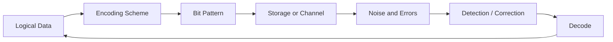
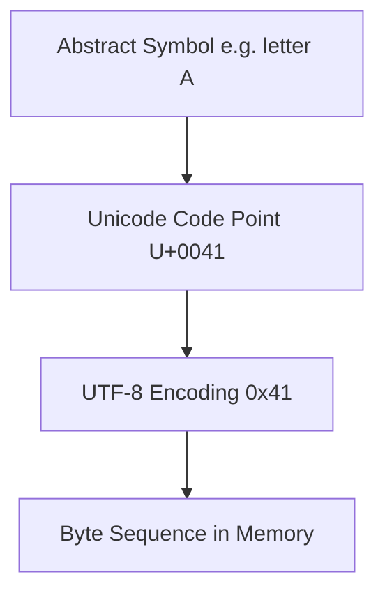
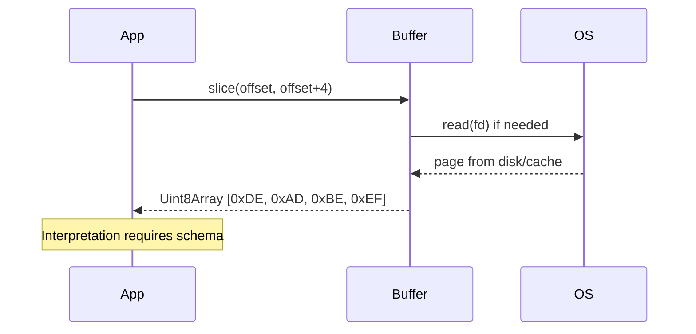

# Bits Bytes and Information

## Overview

A **bit** (binary digit) is the smallest unit of information in digital systems: one of two distinguishable states, conventionally `0` and `1`. Physically, a bit might be a voltage level, magnetic domain orientation, phase of light, or charge in a floating gate—but **logic** treats it as an abstract symbol. A **byte** is a conventionally 8-bit grouping; it is not a law of physics but a **de facto standard** (ISO/IEC 2382) that aligns with hex notation, ASCII history, and addressable memory granularity.

**Information** (in the Shannon sense) quantifies how much uncertainty a message resolves, measured in bits. A fair coin flip carries 1 bit; 256 equally likely outcomes carry 8 bits. Storage capacity (gigabytes) and channel capacity (megabits per second) are engineering measures built on the same foundation.

Everything in [[01-Computer-Science/README|Computer Science]]—integers, floats, Unicode, TCP segments, JPEG coefficients—is **patterns of bits** with agreed interpretation. This note establishes that foundation before [[01-Computer-Science/01-Information-and-Representation/Number Systems|Number Systems]] and specialized encodings.

## Learning Objectives

- Define bit, byte, nibble, word, and block in hardware and software contexts
- Convert between binary, decimal, and hexadecimal fluently
- Relate Shannon information to encoding length and compression limits
- Calculate storage and transfer sizes with SI vs IEC units (GB vs GiB)
- Read memory dumps and wire formats as bit patterns without guessing semantics

## Prerequisites

- [[01-Computer-Science/00-Orientation/How Computers Run Programs|How Computers Run Programs]]
- [[01-Computer-Science/00-Orientation/Abstraction Layers in Computing|Abstraction Layers in Computing]]

## Difficulty

`beginner`

## Estimated Time

- Reading: 2–3 hours
- Exercises: 3 hours
- Mini project: 4 hours

## History

George Boole (1854) formalized binary logic. Claude Shannon (1948) linked logic to communication and defined **information entropy**. Early machines used word sizes of 12, 18, or 36 bits; the **8-bit byte** stabilized with the IBM System/360 (1964). ASCII (1963) fixed 7-bit character codes; extended to 8-bit "extended ASCII" and eventually superseded by Unicode for global text.

## Problem It Solves

Ambiguity about "what is stored" causes:

- Off-by-one errors in protocol fields sized in bits vs bytes
- Billing disputes (1 GB = 10⁹ vs 2³⁰ bytes)
- Security bugs (padding oracles, incorrect length prefixes)
- Inability to debug hex dumps during incidents

Precise bit/byte vocabulary is prerequisite for every binary format and performance estimate.

## Internal Implementation

### Physical to logical mapping

Storage elements are **analog**; digital abstraction uses **thresholds** and **error correction**. RAM cells hold charge; SSDs use voltage levels in NAND; networking uses symbol encoding (PAM-4 on modern Ethernet). The OS and CPU never see raw physics—they see **aligned byte addresses** in [[01-Computer-Science/03-Memory-and-Addressing/Address Spaces|Address Spaces]].

### Bit ordering within a byte

Within a single byte, bit index `b7 … b0` often maps MSB to LSB left-to-right in documentation:

```
byte 0xA5 = 1010 0101
           b7       b0
```

**Multi-byte** field order is separate: see [[01-Computer-Science/01-Information-and-Representation/Endianness and Binary Layout|Endianness and Binary Layout]].

### Information and encoding length

For independent outcomes with probability `p(x)`, Shannon entropy:

\[
H(X) = -\sum_x p(x) \log_2 p(x)
\]

**Key insight**: you cannot losslessly compress below entropy on average. UTF-8 and gzip exploit **skewed** distributions (common letters, repeated JSON keys).

### Capacity arithmetic

| Unit | Definition | Bytes (exact) |
| --- | --- | --- |
| 1 KiB | 2¹⁰ | 1,024 |
| 1 MiB | 2²⁰ | 1,048,576 |
| 1 KB (SI) | 10³ | 1,000 |
| 1 Kibit | 2¹⁰ bits | 128 bytes |

Production SLAs often quote **Gbps** (wire speed) while developers think **GiB** (RAM)—convert explicitly.



## Mermaid Diagrams

### Structure: from symbol to bytes



Detailed in [[01-Computer-Science/01-Information-and-Representation/Character Encoding|Character Encoding]].

### Sequence: reading bytes from a buffer



## Examples

### Minimal Example

**TypeScript**:

```typescript
const text = "Hi";
const bytes = new TextEncoder().encode(text);
console.log([...bytes]); // [72, 105] — ASCII/UTF-8 for H, i

const word = 0xdeadbeef;
const buf = new ArrayBuffer(4);
new DataView(buf).setUint32(0, word, false); // big-endian
console.log([...new Uint8Array(buf)]); // [222, 173, 190, 239]
```

**Python**:

```python
text = "Hi"
data = text.encode("utf-8")
print(list(data))  # [72, 105]

import struct
packed = struct.pack(">I", 0xDEADBEEF)
print(list(packed))  # [222, 173, 190, 239]
```

See [[01-Computer-Science/code/README|code labs]] for bit/byte utilities.

### Production-Shaped Example

A metrics pipeline ingests 500-byte JSON events at 50k events/sec:

- **Ingress bandwidth** ≈ 25 MB/s raw JSON
- **Columnar batch** (Parquet) might shrink text fields 5–10×
- **Length-prefix framing** adds 4 bytes/event → 200 KB/s overhead—non-negligible at scale
- **Checksum** per frame (see [[01-Computer-Science/01-Information-and-Representation/Checksums and Error Detection|Checksums and Error Detection]]) adds 4–32 bytes

Design choices must account for **bit-level overhead** in cost models.

```typescript
function framePayload(payload: Uint8Array): Uint8Array {
  const header = new ArrayBuffer(4);
  new DataView(header).setUint32(0, payload.length, false);
  const out = new Uint8Array(4 + payload.length);
  out.set(new Uint8Array(header), 0);
  out.set(payload, 4);
  return out;
}
```

## Trade-offs

| Dimension | Upside | Downside | When it matters |
| --- | --- | --- | --- |
| Fixed-width fields | O(1) random access in buffers | Wastes space for sparse data | Binary protocols |
| Variable-length (UTF-8) | Compact for ASCII-heavy text | Scan to find nth character | Log parsing |
| Human-readable (hex, base64) | Debuggable | 2× or 4/3 size inflation | Incidents, JWT payloads |
| Compression | Lower egress cost | CPU + latency tail | Batch analytics |

### When to Use

- **Bit-level specs** for wire protocols, file formats, crypto
- **Byte-aligned structs** for performance-critical IPC
- **Entropy reasoning** before inventing a "compact" custom encoding

### When Not to Use

- Do not hand-roll compression for general text—use gzip/zstd
- Do not store monetary values as floats—see [[01-Computer-Science/01-Information-and-Representation/Floating Point|Floating Point]]

## Exercises

1. Convert `0x3F8` to decimal and binary; identify which bits are set.
2. How many distinct values fit in 12 bits? 36 bits?
3. A channel delivers 1 Gbit/s. How long to transfer a 4 GiB file (both SI and IEC interpretations)?
4. Write a function to reverse bits in a byte; test against known vectors.
5. Given hex dump `48 65 6c 6c 6f`, identify encoding and string.

## Mini Project

**Hex Dump Tool**

Implement `hexdump --offset 0 --width 16` behavior: address | hex | ASCII gutter. Support reading from file and stdin. Include tests for non-UTF-8 binary (replacement dots in gutter).

## Portfolio Project

Integrate a **binary inspector panel** into [[01-Computer-Science/projects/UTF-8 and Float Inspector/README|UTF-8 and Float Inspector]] showing bit toggles for selected bytes.

## Interview Questions

1. How many bytes in a UTF-8 encoded string of N ASCII characters?
2. Difference between a bit and a byte; is a byte always 8 bits?
3. Why do disk manufacturers use decimal GB while `df` often shows GiB?
4. What is Shannon entropy in one sentence?
5. How would you size a length-prefix field for messages up to 16 MiB?

### Stretch / Staff-Level

1. Prove that lossless compression cannot shrink all files (pigeonhole principle).
2. Explain why base64 expands size by 4/3 and where padding bits go.

## Common Mistakes

- Confusing **character count** with **byte length** for Unicode
- Using floating point for **bit masks** on integers > 2⁵³ in JavaScript
- Off-by-one in **bit indices** (0-based vs MSB-first docs)
- Ignoring **alignment padding** in structs

## Best Practices

- Specify sizes in **bits or bytes explicitly** in schemas (Protobuf, Cap'n Proto)
- Use `Uint8Array` / `bytes` types—not strings—for binary data
- Log **hex** for small binary blobs; log **length + hash** for large
- Document **endianness** on every multi-byte field
- Cross-check sizes with `wc -c`, `stat`, and language byte APIs

## Summary

Bits are abstract two-state symbols; bytes are 8-bit groupings that humans and tools use as the atomic addressable unit in most modern systems. Information theory sets lower bounds on representation size. Production systems fail when teams treat "string," "number," and "byte array" as interchangeable— they are different layers of interpretation over the same physical storage. Master bits and bytes before integers, floats, or protocols.

## Further Reading

- [[00-References/Computer Science/README|Computer Science References]]
- Shannon — *A Mathematical Theory of Communication* (1948)
- [[01-Computer-Science/_exercises/Information and Representation Exercises|Information and Representation Exercises]]

## Related Notes

- [[01-Computer-Science/01-Information-and-Representation/Number Systems|Number Systems]]
- [[01-Computer-Science/01-Information-and-Representation/Integer Representation|Integer Representation]]
- [[01-Computer-Science/01-Information-and-Representation/Character Encoding|Character Encoding]]
- [[01-Computer-Science/01-Information-and-Representation/Endianness and Binary Layout|Endianness and Binary Layout]]
- [[01-Computer-Science/01-Information-and-Representation/Data Serialization Fundamentals|Data Serialization Fundamentals]]
- [[01-Computer-Science/README|Computer Science Track]]

## Progress Checklist

- [ ] Explained from first principles
- [ ] Drew at least one Mermaid diagram
- [ ] Implemented a minimal version
- [ ] Documented trade-offs and non-goals
- [ ] Completed exercises
- [ ] Practiced interview questions aloud
- [ ] Linked prerequisites and dependents
