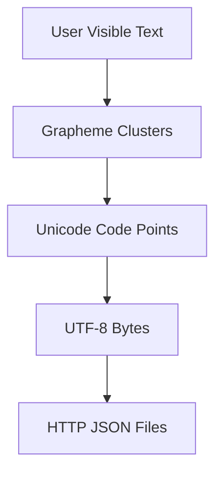
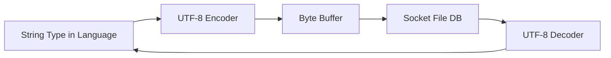
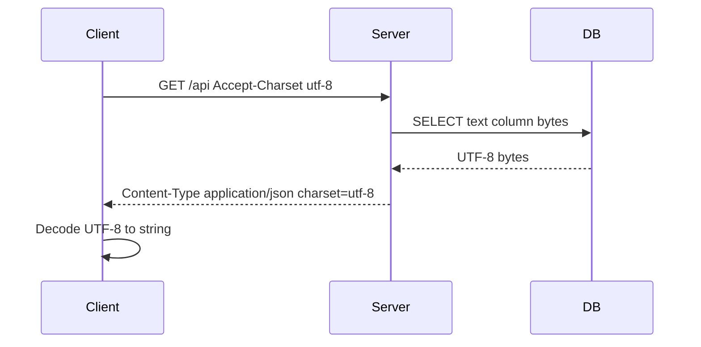

# Character Encoding

## Overview

**Character encoding** maps abstract **characters** (Unicode **code points**, written `U+0041`) to **byte sequences** for storage and transmission. **Unicode** defines the repertoire and code point space; **UTF-8** is the dominant **encoding form**—variable-length, ASCII-compatible, self-synchronizing on byte boundaries for valid streams.

Text is not "just strings." It is **bytes + agreed interpretation**. Mixing encodings causes mojibake (`é` instead of `é`), security issues (homoglyph phishing, overlong UTF-8), and subtle length mismatches (Twitter character counts vs byte limits). HTTP, JSON, SQL, and filesystems all assume UTF-8 by default in modern stacks—but legacy Windows-1252, Latin-1, and locale-specific paths persist.

## Learning Objectives

- Distinguish code point, grapheme cluster, glyph, and encoded bytes
- Encode/decode UTF-8 manually for BMP and supplementary characters
- Handle invalid sequences with replacement, strict error, or security-aware policies
- Normalize Unicode (NFC/NFD) for comparison and indexing
- Debug production text bugs in logs, databases, and filenames

## Prerequisites

- [[01-Computer-Science/01-Information-and-Representation/Bits Bytes and Information|Bits Bytes and Information]]
- [[01-Computer-Science/01-Information-and-Representation/Integer Representation|Integer Representation]]

## Difficulty

`intermediate`

## Estimated Time

- Reading: 3 hours
- Exercises: 3 hours
- Mini project: 6 hours

## History

**ASCII** (1963) covered 128 English-centric characters. National **extended ASCII** and DBCS (Shift-JIS, GB2312) fragmented encodings. **Unicode** (1991+) unified repertoires; **UTF-8** (1993, Ken Thompson) won on the wire due to backward compatibility with ASCII tools. Emoji (post-2010) pushed supplementary plane usage into everyday text.

## Problem It Solves

Without encoding discipline:

- Database `VARCHAR(255)` truncates **bytes** not **graphemes**—splits emoji
- `strlen` vs `mb_strlen` diverge in PHP; JS `.length` counts UTF-16 code units
- Case-insensitive search fails across NFC/NFD (`é` precomposed vs `e` + combining acute)
- Security filters miss **visual spoofing** (`paypal.com` vs homoglyph domain)

## Internal Implementation

### Unicode code point space

- **Plane 0 (BMP)**: U+0000–U+FFFF — most modern scripts
- **Supplementary**: U+10000–U+10FFFF — emoji, rare CJK
- **Surrogate pairs** in UTF-16: high + low surrogate encode supplementary

### UTF-8 encoding rules

| Code point range | Byte pattern (bits) | Length |
| --- | --- | --- |
| U+0000–U+007F | `0xxxxxxx` | 1 |
| U+0080–U+07FF | `110xxxxx 10xxxxxx` | 2 |
| U+0800–U+FFFF | `1110xxxx 10xxxxxx 10xxxxxx` | 3 |
| U+10000–U+10FFFF | `11110xxx 10xxxxxx 10xxxxxx 10xxxxxx` | 4 |

**Overlong encodings** (e.g., ASCII as 2-byte) are **invalid** and must be rejected in security-sensitive parsers.

### Normalization forms

- **NFC**: canonical composition (preferred for storage)
- **NFD**: decomposed (base + combining marks)
- Comparison for uniqueness should specify normalization + case folding (see Unicode TR #15)



## Mermaid Diagrams

### Structure: encoding stack



### Sequence: HTTP response charset negotiation



Modern best practice: **always UTF-8**; avoid charset parameters except legacy.

## Examples

### Minimal Example

**TypeScript**:

```typescript
const emoji = "😀"; // U+1F600
const bytes = new TextEncoder().encode(emoji);
console.log(bytes.length); // 4 UTF-8 bytes
console.log(emoji.length); // 2 UTF-16 code units in JS string

const broken = new Uint8Array([0xff, 0xfe, 0x61]);
const text = new TextDecoder("utf-8", { fatal: false }).decode(broken);
console.log(text); // replacement chars
```

**Python**:

```python
emoji = "😀"
data = emoji.encode("utf-8")
print(len(data))  # 4
print(len(emoji))  # 1 code points

broken = b"\xff\xfea"
print(broken.decode("utf-8", errors="replace"))
```

### Production-Shaped Example

Username validation with normalization:

```python
import unicodedata
import re

ALLOWED = re.compile(r"^[\w.-]+$", re.UNICODE)

def normalize_username(raw: str) -> str:
    s = unicodedata.normalize("NFC", raw.strip())
    if not ALLOWED.match(s):
        raise ValueError("invalid characters")
    if s != raw.strip():
        raise ValueError("must be NFC normalized")
    return s
```

Log pipeline: declare **UTF-8** on ingest; count **bytes** for billing, **graphemes** for UI limits.

UTF-8 codec lab: [[01-Computer-Science/code/README|code labs]].

## Trade-offs

| Dimension | Upside | Downside | When it matters |
| --- | --- | --- | --- |
| UTF-8 | ASCII compatible, compact Latin | 2–4 bytes per CJK char | Web default |
| UTF-16 | Fixed indexing for BMP in JS/Java | Surrogate complexity | Windows APIs, JS |
| UTF-32 | O(1) code point index | 4× space | Internal processing |
| Latin-1 | 1 byte per char Western | Not global | Legacy CSV |

### When to Use

- **UTF-8** for HTTP, JSON, Postgres `text`, object storage, logs
- **NFC** at identity boundaries (usernames, URLs slugs after punycode)
- **Explicit error policy** (`fatal` vs `replace`) in parsers

### When Not to Use

- Do not guess encoding from bytes without evidence—detect or require metadata
- Do not use `string.length` in JS for **user-visible character limits** with emoji

## Exercises

1. Hand-encode `U+00A9` (©) and `U+1F525` (🔥) to UTF-8 hex bytes.
2. How many UTF-8 bytes for "Hello 世界"?
3. Explain why `strlen("é")` differs in UTF-8 vs Latin-1.
4. Implement UTF-8 decode with strict rejection of overlong sequences.
5. Normalize `"e\u0301"` and `"é"`—are they equal in NFC?

## Mini Project

**UTF-8 Codec**

Encode/decode with modes: strict, replace, skip. Property tests: round-trip all code points U+0–U+10FFFF excluding surrogates.

## Portfolio Project

[[01-Computer-Science/projects/UTF-8 and Float Inspector/README|UTF-8 and Float Inspector]] — visual byte breakdown per character.

## Interview Questions

1. Difference between Unicode and UTF-8?
2. Why is UTF-8 self-synchronizing?
3. How does JavaScript string length relate to UTF-16?
4. What is mojibake and a common cause?
5. Why normalize before comparing usernames?

### Stretch / Staff-Level

1. Explain IDNA/punycode for internationalized domain names.
2. Design a slugify function safe for URLs across scripts.

## Common Mistakes

- Storing bytes in `TEXT` column without knowing client encoding
- **Truncating UTF-8** by byte count without resync
- Case mapping with **Turkish I** (`toLowerCase` locale issues)
- Assuming **base64** is encoding—it's transport, not charset

## Best Practices

- Standardize on **UTF-8 end-to-end**; convert at the edge once
- Set `Content-Type: charset=utf-8` and DB client encoding explicitly
- Use ICU / `Intl` / `unicodedata` for locale-sensitive operations
- Index and compare with declared **normalization form**
- Test with **emoji, RTL marks, combining characters, ZWJ sequences**

## Summary

Characters are abstract code points; encodings are concrete byte layouts. UTF-8 dominates modern systems because it respects ASCII while covering all of Unicode. Production text handling requires normalization, valid UTF-8 enforcement, and awareness of language string models—especially where length limits, security, and display intersect.

## Further Reading

- [[00-References/Computer Science/README|Computer Science References]]
- Unicode Standard, Chapter 3 (Conformance)
- UTF-8 Everywhere manifesto
- [[01-Computer-Science/_exercises/Information and Representation Exercises|Information and Representation Exercises]]

## Related Notes

- [[01-Computer-Science/01-Information-and-Representation/Bits Bytes and Information|Bits Bytes and Information]]
- [[01-Computer-Science/01-Information-and-Representation/Data Serialization Fundamentals|Data Serialization Fundamentals]]
- [[01-Computer-Science/07-Networking-Fundamentals/HTTP as a Protocol|HTTP as a Protocol]]
- [[18-Security/README|Security]] — homoglyph attacks
- [[08-Databases/README|Databases]] — collation
- [[01-Computer-Science/README|Computer Science Track]]

## Progress Checklist

- [ ] Explained from first principles
- [ ] Drew at least one Mermaid diagram
- [ ] Implemented a minimal version
- [ ] Documented trade-offs and non-goals
- [ ] Completed exercises
- [ ] Practiced interview questions aloud
- [ ] Linked prerequisites and dependents
