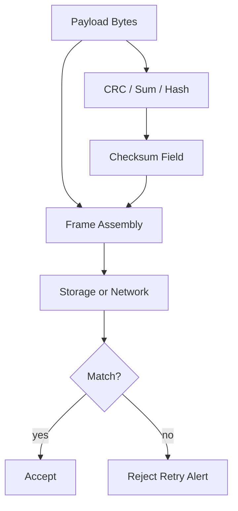
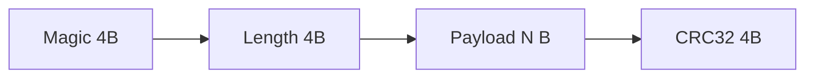
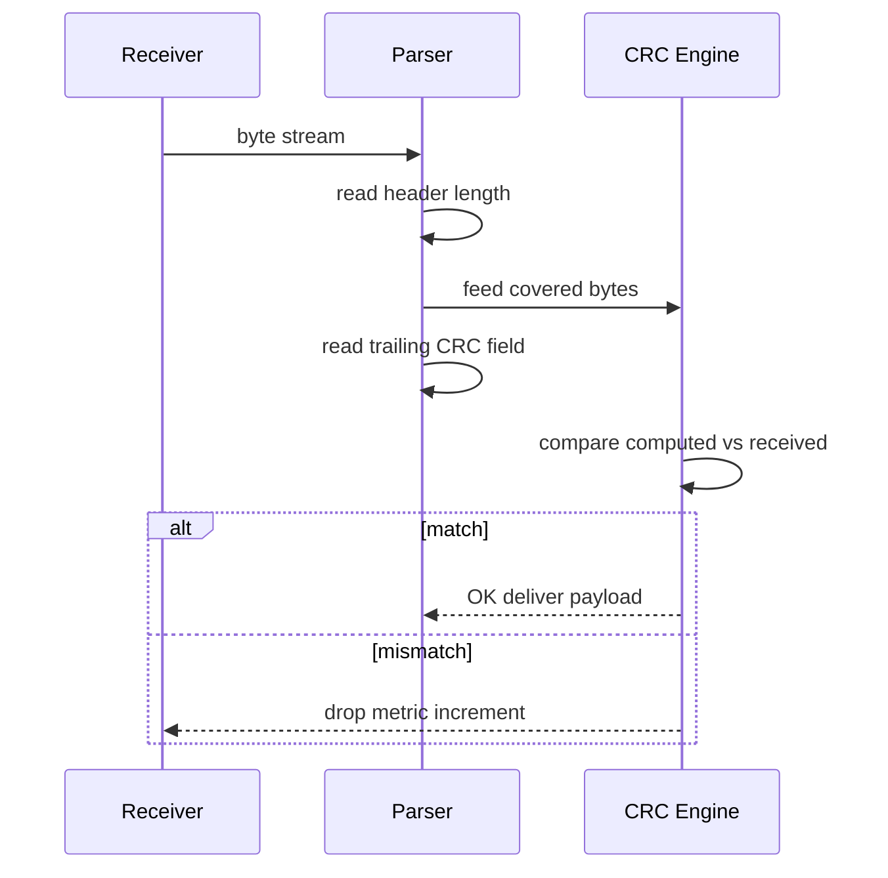

# Checksums and Error Detection

## Overview

**Error detection codes** append redundant bits derived from payload data so receivers can detect (not always correct) accidental corruption. A **checksum** is a compact summary—often an integer or fixed-width tag—computed by a deterministic function over bytes. **CRC (Cyclic Redundancy Check)** treats data as polynomials modulo 2 and provides strong burst-error detection; simpler schemes (XOR, sum, Fletcher) trade strength for speed.

Detection ≠ authentication. A checksum without a **secret key** does not stop malicious tampering—use **MAC/HMAC** (see [[01-Computer-Science/09-Correctness-and-Reliability/Cryptographic Primitives Overview|Cryptographic Primitives Overview]]). In production, checksums guard disk pages, network frames, firmware images, and serialized messages against bit flips, truncated reads, and buggy memcpy.

## Learning Objectives

- Distinguish error detection, error correction, and cryptographic authentication
- Implement CRC-32 (IEEE 802.3) and compare to simple additive checksums
- Choose detection strength vs CPU cost for a given channel error model
- Integrate checksums into framed protocols with endian-safe layout
- Debug mismatches caused by including/excluding header bytes in coverage

## Prerequisites

- [[01-Computer-Science/01-Information-and-Representation/Bits Bytes and Information|Bits Bytes and Information]]
- [[01-Computer-Science/01-Information-and-Representation/Endianness and Binary Layout|Endianness and Binary Layout]]

## Difficulty

`intermediate`

## Estimated Time

- Reading: 2–3 hours
- Exercises: 3 hours
- Mini project: 5 hours

## History

Parity bits appeared on paper tape (1950s). Checksums in IP/TCP/UDP headers (1980s) protect headers and payloads with modest cost. **CRC** dominated Ethernet (IEEE 802.3), ZIP/GZIP, and storage (SATA/NVMe). Modern systems add **cryptographic hashes** (SHA-256) for integrity at rest, but CRC remains king for line-rate networking.

## Problem It Solves

Silent corruption causes:

- JSON that parses but with wrong IDs
- Database pages applied half-written after crash
- OTA firmware bricking devices
- Cross-AZ replication applying garbage without detection

Detection triggers retry, discard, or halt—turning **silent data corruption** into observable failures.

## Internal Implementation

### Taxonomy

| Mechanism | Detects | Corrects | Anti-malicious |
| --- | --- | --- | --- |
| Parity bit | Single-bit | No | No |
| Sum / XOR checksum | Some multi-bit | No | No |
| CRC | Burst errors (configurable) | No | No |
| Hamming / Reed-Solomon | Configured model | Yes | No |
| HMAC-SHA256 | Any change w/ key | No | Yes |

### CRC intuition

Treat bit string as polynomial coefficients over GF(2). Divide message polynomial (padded) by generator polynomial; remainder is CRC. Hardware implements with **Linear Feedback Shift Register (LFSR)**; software uses lookup tables for speed.

**CRC-32 (Ethernet)** polynomial: `0x04C11DB7` (reflected implementations common).

### Coverage scope

Define precisely:

- Which bytes are checksummed (payload only vs header+payload)
- **Initial value**, **final XOR**, **reflection** (CRC variants differ)
- Byte order of stored checksum field



## Mermaid Diagrams

### Structure: protocol frame with checksum



Checksum often computed over `Len + Body` but **not** Magic—document invariant.

### Sequence: verify on receive



## Examples

### Minimal Example

**TypeScript** (CRC-32 via `crc-32` pattern or zlib):

```typescript
import { createHash } from "node:crypto";

function crc32Simple(data: Uint8Array): number {
  let crc = 0xffffffff;
  for (const byte of data) {
    crc ^= byte;
    for (let i = 0; i < 8; i++) {
      crc = crc & 1 ? (crc >>> 1) ^ 0xedb88320 : crc >>> 1;
    }
  }
  return (crc ^ 0xffffffff) >>> 0;
}

function sha256(data: Uint8Array): string {
  return createHash("sha256").update(data).digest("hex");
}
```

**Python**:

```python
import binascii
import hashlib
import zlib

data = b"hello frame"
crc = binascii.crc32(data) & 0xFFFFFFFF
zlib_crc = zlib.crc32(data) & 0xFFFFFFFF
assert crc == zlib_crc

print(hashlib.sha256(data).hexdigest())
```

Note: `binascii.crc32` matches IEEE CRC-32 used in ZIP/Ethernet software stacks.

### Production-Shaped Example

Framed writer with checksum coverage documented:

```typescript
interface Frame {
  magic: number;
  payload: Uint8Array;
  crc32: number;
}

function serialize(frame: Omit<Frame, "crc32">): Uint8Array {
  const lenBuf = new ArrayBuffer(4);
  new DataView(lenBuf).setUint32(0, frame.payload.length, false);
  const covered = concat(new Uint8Array(lenBuf), frame.payload);
  const crc32 = crc32Simple(covered);
  const crcBuf = new ArrayBuffer(4);
  new DataView(crcBuf).setUint32(0, crc32, false);
  const magicBuf = new ArrayBuffer(4);
  new DataView(magicBuf).setUint32(0, frame.magic, false);
  return concat(new Uint8Array(magicBuf), covered, new Uint8Array(crcBuf));
}
```

Metrics: `checksum_mismatch_total{reason="crc"}` with sampled hex prefix for debugging—not full payload in logs.

Lab: [[01-Computer-Science/code/README|code labs]] checksum + framed serializer.

## Trade-offs

| Dimension | Upside | Downside | When it matters |
| --- | --- | --- | --- |
| Additive sum | Tiny CPU | Weak detection | Legacy IP header |
| CRC-32 | Fast table-driven | Not collision-resistant vs attacker | Ethernet, files |
| SHA-256 | Strong integrity | Too slow for 100Gbps line rate | Artifacts, S3 ETag |
| FEC (Reed-Solomon) | Corrects errors | Complex, latency | QR codes, HDFS |

### When to Use

- **CRC** on frames, chunks, download segments
- **Hash** on release artifacts and config snapshots
- **Dual-layer**: TCP checksum + app-level hash for end-to-end at rest

### When Not to Use

- Do not use CRC as **password fingerprint**
- Do not assume TCP checksum alone protects **end-to-end** app data (middleboxes, bugs)

## Exercises

1. Compute manual XOR checksum over `[0x01, 0x02, 0x03, 0x04]`.
2. Flip one bit in payload—does CRC-32 always detect single-bit error?
3. Why might CRC differ between two implementations (initial xor, reflection)?
4. Implement Fletcher-16 and compare collision rate on random 1-bit flips vs CRC.
5. Design coverage rules for a protocol: is length included in CRC?

## Mini Project

**Framed Message Library**

Magic + length + payload + CRC32-BE. Property test: random payloads round-trip; single-bit flip fails verify.

## Portfolio Project

Add checksum verification stage to [[01-Computer-Science/projects/Binary Protocol Lab/README|Binary Protocol Lab]] with fault injection toggle.

## Interview Questions

1. Difference between checksum and cryptographic hash?
2. What error model is CRC good at detecting?
3. Does TCP checksum protect application data end-to-end?
4. Where would you use CRC vs SHA-256?
5. What happens if checksum field is included in its own coverage?

### Stretch / Staff-Level

1. Explain CRC polynomial degree vs Hamming distance intuition.
2. How do storage systems combine checksums with scrubbing jobs?

## Common Mistakes

- **Endian mismatch** on stored CRC field
- Different **CRC variants** between languages without checking params
- Checksumming **serialized JSON** before canonicalization → false mismatches
- Using `% 65521` Adler32 on large data without modulo timing side channels (rare but documented in zlib contexts)

## Best Practices

- Pin **algorithm name + parameters** in protocol version doc (CRC32C vs CRC32 IEEE)
- Unit test vectors from **known-good** implementations (RFC examples, zlib test vectors)
- Separate **detection** (CRC) from **authentication** (HMAC)
- On mismatch: increment metric, drop frame, **do not** partially process
- For large files, use **streaming** CRC to bound memory

## Summary

Checksums and CRCs detect accidental corruption cheaply by comparing a computed tag to one sent or stored with data. They are not cryptography. Production reliability requires specifying exactly which bytes are covered, which algorithm variant runs, and how failures propagate—usually discard and retry with observability.

## Further Reading

- [[00-References/Computer Science/README|Computer Science References]]
- RFC 1071 — Computing the Internet Checksum
- Williams — CRC tutorial (Rocksoft model)
- [[01-Computer-Science/_interview/Information and Representation Interview Questions|Information and Representation Interview Questions]]

## Related Notes

- [[01-Computer-Science/01-Information-and-Representation/Data Serialization Fundamentals|Data Serialization Fundamentals]]
- [[01-Computer-Science/01-Information-and-Representation/Endianness and Binary Layout|Endianness and Binary Layout]]
- [[01-Computer-Science/07-Networking-Fundamentals/TCP|TCP]]
- [[01-Computer-Science/09-Correctness-and-Reliability/Cryptographic Primitives Overview|Cryptographic Primitives Overview]]
- [[18-Security/README|Security]]
- [[01-Computer-Science/README|Computer Science Track]]

## Progress Checklist

- [ ] Explained from first principles
- [ ] Drew at least one Mermaid diagram
- [ ] Implemented a minimal version
- [ ] Documented trade-offs and non-goals
- [ ] Completed exercises
- [ ] Practiced interview questions aloud
- [ ] Linked prerequisites and dependents
