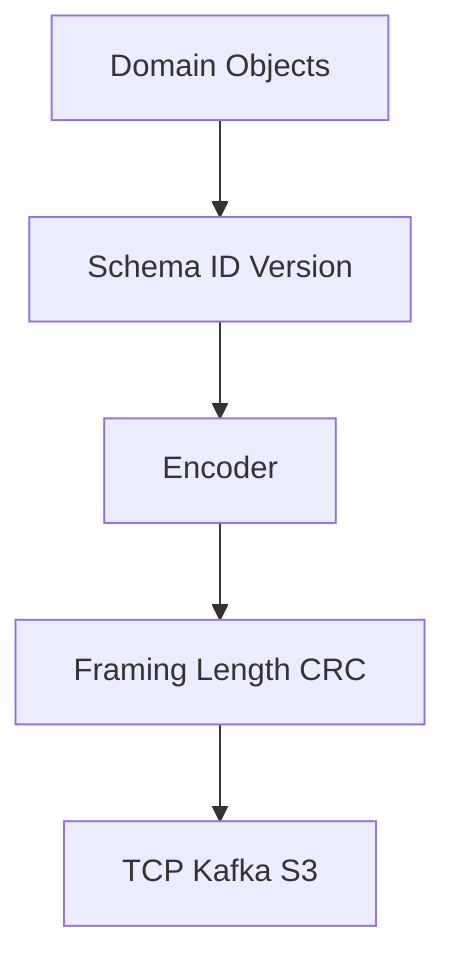
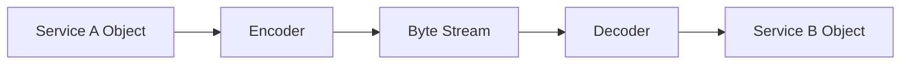
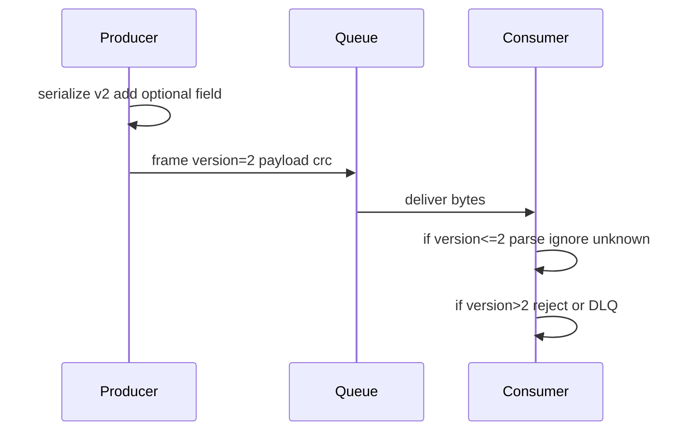

# Data Serialization Fundamentals

## Overview

**Serialization** converts in-memory data structures into a **byte sequence** for storage, messaging, or replication. **Deserialization** reconstructs values (or compatible views) from bytes. The format may be **textual** (JSON, YAML, CSV) or **binary** (Protobuf, MessagePack, CBOR, Cap'n Proto, custom frames).

Every API boundary—HTTP, queues, databases, disk, IPC—depends on agreed **schema**, **byte order**, **versioning**, and **error detection**. Serialization is where [[01-Computer-Science/01-Information-and-Representation/Integer Representation|Integer Representation]], [[01-Computer-Science/01-Information-and-Representation/Floating Point|Floating Point]], [[01-Computer-Science/01-Information-and-Representation/Character Encoding|Character Encoding]], and [[01-Computer-Science/01-Information-and-Representation/Endianness and Binary Layout|Endianness and Binary Layout]] collide with product requirements (evolvability, latency, human debuggability).

## Learning Objectives

- Compare text vs binary serialization on size, speed, schema, and tooling
- Design versioned message formats with forward/backward compatibility rules
- Apply length-prefix framing, checksums, and canonical JSON where needed
- Avoid float/integer/Unicode pitfalls at language boundaries
- Evaluate Protobuf, JSON, and custom binary for a given service contract

## Prerequisites

- [[01-Computer-Science/01-Information-and-Representation/Character Encoding|Character Encoding]]
- [[01-Computer-Science/01-Information-and-Representation/Endianness and Binary Layout|Endianness and Binary Layout]]
- [[01-Computer-Science/01-Information-and-Representation/Checksums and Error Detection|Checksums and Error Detection]]
- [[01-Computer-Science/01-Information-and-Representation/Floating Point|Floating Point]]

## Difficulty

`intermediate`

## Estimated Time

- Reading: 3–4 hours
- Exercises: 4 hours
- Mini project: 8 hours

## History

**ASN.1/BER** (1980s) telephony; **XDR** (1987) Sun RPC; **XML** (1990s) enterprise; **JSON** (2000s) web; **Protocol Buffers** (2008) and **Thrift** popularized schema-first binary RPC; **MessagePack/CBOR** bridge JSON data model to binary; **Avro** emphasizes schema evolution with embedded writers' schema.

## Problem It Solves

Ad hoc serialization (`join fields with commas`) fails on:

- Escaping delimiters in strings
- Endian mismatches across services
- Silent field addition/removal breaking consumers
- Non-canonical JSON breaking signature verification
- Giant messages without **length limits** (DoS)

Formal serialization separates **data model** from **encoding rules** and enables evolution.

## Internal Implementation

### Layers of a message



### Text vs binary (conceptual)

| Aspect | JSON | Protobuf (typical) |
| --- | --- | --- |
| Schema | Optional (JSON Schema) | Required `.proto` |
| Size | Verbose field names | Compact tags + varint |
| Parse cost | UTF-8 scan + alloc | Zero-copy possible |
| Human debug | Excellent | Needs `protoc --decode` |
| Evolution | Add keys; avoid remove | Field numbers + optional/required rules |

### Framing strategies

1. **Length-prefix** — 4-byte BE length then payload (simple, stream-friendly)
2. **Delimiter** — newline-delimited JSON (NDJSON)
3. **Self-describing** — Avro embeds schema hash
4. **Fixed records** — only when sizes constant (sensor grids)

Always pair with **max length** checks and [[01-Computer-Science/01-Information-and-Representation/Checksums and Error Detection|Checksums and Error Detection]] on untrusted inputs.

### Versioning patterns

- **Additive only**: new optional fields; never reuse field numbers/tags
- **Explicit version byte** in header
- **Dual write / dual read** during migrations
- **Unknown field preservation** (Protobuf `UnknownFieldSet`)

### Type mapping pitfalls

| Concept | JSON | JS | Python | Fix |
| --- | --- | --- | --- | --- |
| int64 ID | number | loses >2⁵³ | OK | string in JSON |
| decimal money | number | float error | Decimal | string or minor int |
| datetime | ISO string | timezone bugs | naive vs aware | RFC3339 + UTC |
| bytes | base64 string | overhead | `b64decode` | binary format |

## Mermaid Diagrams

### Structure: RPC encode/decode path



### Sequence: versioned envelope



## Examples

### Minimal Example

**TypeScript — JSON vs typed bytes**:

```typescript
interface User {
  id: string; // stringified int64
  name: string;
  balanceCents: number;
}

const json = JSON.stringify({ id: "9223372036854775807", name: "Ada", balanceCents: 1999 });

const buf = new ArrayBuffer(8);
new DataView(buf).setBigUint64(0, 9223372036854775807n, false);
```

**Python — JSON + struct binary field**:

```python
import json
import struct

msg = {"id": "9223372036854775807", "name": "Ada", "balanceCents": 1999}
json_bytes = json.dumps(msg).encode("utf-8")

binary_id = struct.pack(">Q", 9223372036854775807)
```

### Production-Shaped Example

Envelope with schema version + CRC (pattern from [[01-Computer-Science/code/README|code labs]]):

```typescript
type EnvelopeV1 = {
  version: 1;
  type: "user.created";
  body: Uint8Array; // inner encoding: JSON or protobuf
};

function encodeEnvelope(e: EnvelopeV1): Uint8Array {
  const typeBytes = new TextEncoder().encode(e.type);
  const header = new ArrayBuffer(1 + 1 + typeBytes.length + 4 + e.body.length);
  const view = new DataView(header);
  let off = 0;
  view.setUint8(off++, e.version);
  view.setUint8(off++, typeBytes.length);
  new Uint8Array(header, off, typeBytes.length).set(typeBytes);
  off += typeBytes.length;
  view.setUint32(off, e.body.length, false);
  off += 4;
  new Uint8Array(header, off, e.body.length).set(e.body);
  off += e.body.length;
  const bytes = new Uint8Array(header, 0, off);
  const crc = crc32Simple(bytes);
  const out = new Uint8Array(bytes.length + 4);
  out.set(bytes, 0);
  new DataView(out.buffer).setUint32(bytes.length, crc, false);
  return out;
}
```

Operational checklist:

- **Reject** unknown `version` > supported max
- **Cap** `body.length` before allocation (prevent OOM)
- Log **type + version + crc_ok**—not raw PII body

Handoff: [[07-Backend/README|Backend]] for API contracts; [[08-Databases/README|Databases]] for column types.

## Trade-offs

| Dimension | Upside | Downside | When it matters |
| --- | --- | --- | --- |
| JSON | Universal, debuggable | Size + parse CPU | Public REST |
| Protobuf | Compact, codegen | Build step, schema discipline | gRPC internal |
| Custom binary | Minimal bytes | You own compatibility | Gaming, firmware |
| Schema-less | Fast iteration | Breakage at scale | Prototypes only |

### When to Use

- **JSON** for public APIs and config with JSON Schema validation
- **Protobuf/Avro** for high-throughput internal events
- **Custom framed binary** when nanoseconds and size dominate—and you staff schema owners

### When Not to Use

- Do not pickle/Python `eval` across trust boundaries
- Do not embed **non-canonical JSON** in signed webhooks
- Do not version by **reusing field indices** in Protobuf

## Exercises

1. Serialize `{a:1,b:2}` and `{b:2,a:1}`—are JSON byte sequences equal? Implications for signing?
2. Design a envelope for messages up to 16 MiB with version and CRC.
3. Map Protobuf `int64` to JavaScript client types—what breaks?
4. Implement NDJSON reader that handles partial lines across TCP chunks.
5. Compare encoded size of same object in JSON vs MessagePack (measure).

## Mini Project

**Dual-Format User Event**

Define `UserCreated` event. Implement JSON and binary encodings + golden tests. Benchmark encode/decode ops/sec and bytes on 10k events.

## Portfolio Project

[[01-Computer-Science/projects/Binary Protocol Lab/README|Binary Protocol Lab]] — full versioned protocol with migration story from v1→v2.

## Interview Questions

1. JSON vs Protobuf—trade-offs?
2. How do you evolve a schema without breaking consumers?
3. Why length-prefix framing?
4. Where do big integers go in JSON APIs?
5. What is canonical JSON and why do signatures need it?

### Stretch / Staff-Level

1. Compare Avro schema evolution vs Protobuf field rules with dual-write migration plan.
2. Design serialization for a multi-tenant audit log: compression, encryption, checksum order.

## Common Mistakes

- **Float** for currency in JSON APIs
- Deserializing before **length/CRC** validation
- Assuming **Unicode normalization** across serializers
- Clock skew in serialized timestamps without timezone
- **Breaking** consumers by changing field semantics under same name

## Best Practices

- Schema repo as **source of truth**; codegen clients
- Document **compatibility matrix** (backward/forward)
- Fuzz deserializers; cap allocations
- Use **content-type** headers (`application/json`, `application/protobuf`)
- Store **version + checksum** on disk segments; verify on read path
- Cross-link [[01-Computer-Science/09-Correctness-and-Reliability/Invariants Assertions and Contracts|Invariants Assertions and Contracts]] for decode validators

## Summary

Serialization is the contract between memory and bytes. Text formats optimize interoperability and debuggability; binary formats optimize cost and throughput. Production systems combine explicit schemas, framing, versioning, checksums, and type discipline at boundaries so services evolve without silent corruption or precision loss.

## Further Reading

- [[00-References/Computer Science/README|Computer Science References]]
- Protocol Buffers Language Guide (Google)
- JSON RFC 8259; RFC 8785 (JCS canonical JSON)
- [[01-Computer-Science/_exercises/Information and Representation Exercises|Information and Representation Exercises]]

## Related Notes

- [[01-Computer-Science/01-Information-and-Representation/Character Encoding|Character Encoding]]
- [[01-Computer-Science/01-Information-and-Representation/Endianness and Binary Layout|Endianness and Binary Layout]]
- [[01-Computer-Science/01-Information-and-Representation/Checksums and Error Detection|Checksums and Error Detection]]
- [[01-Computer-Science/01-Information-and-Representation/Floating Point|Floating Point]]
- [[01-Computer-Science/07-Networking-Fundamentals/HTTP as a Protocol|HTTP as a Protocol]]
- [[07-Backend/README|Backend]]
- [[08-Databases/README|Databases]]
- [[09-System-Design/README|System Design]]
- [[01-Computer-Science/README|Computer Science Track]]

## Progress Checklist

- [ ] Explained from first principles
- [ ] Drew at least one Mermaid diagram
- [ ] Implemented a minimal version
- [ ] Documented trade-offs and non-goals
- [ ] Completed exercises
- [ ] Practiced interview questions aloud
- [ ] Linked prerequisites and dependents
