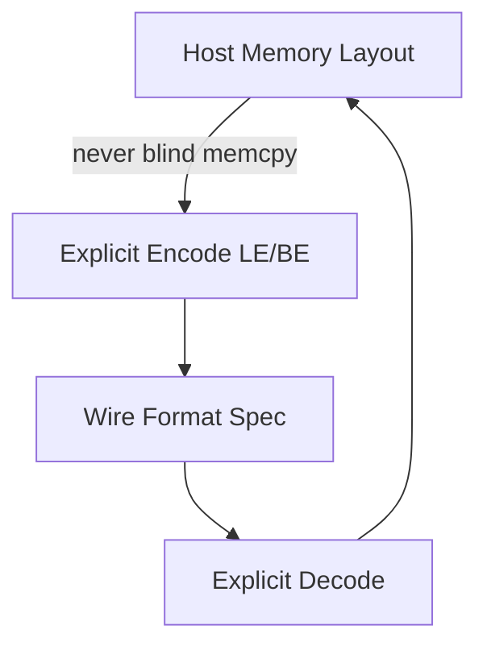
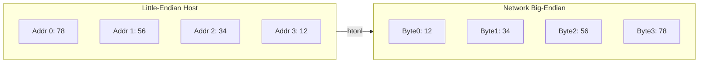
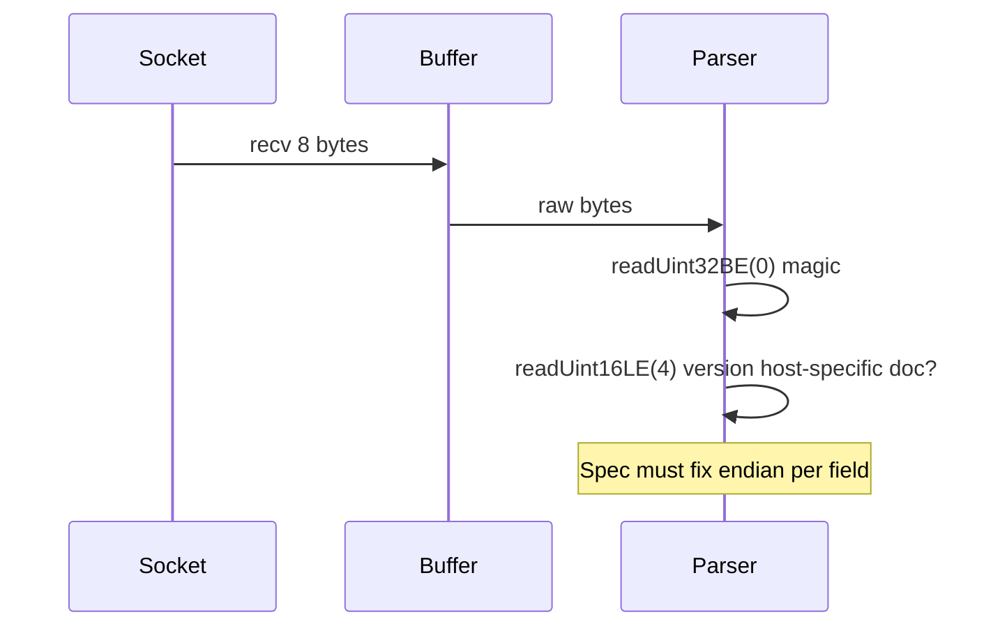

# Endianness and Binary Layout

## Overview

**Endianness** defines how multi-byte integers are **ordered in memory**. In **little-endian** (x86, ARM default), the least significant byte (LSB) sits at the lowest address. In **big-endian** (network byte order, many legacy protocols), the most significant byte (MSB) is first. **Binary layout** extends this to **structs**: field order, alignment padding, and bitfields determine the exact byte image written to disk or wire.

Same logical struct can produce **different byte patterns** on different CPUs, compilers, or compiler flags. Protocols therefore specify **explicit wire formats** independent of host memory layout—see [[01-Computer-Science/01-Information-and-Representation/Data Serialization Fundamentals|Data Serialization Fundamentals]].

## Learning Objectives

- Read and write 16-, 32-, and 64-bit integers in LE and BE
- Explain why `htonl` / `ntohs` exist and when they are no-ops
- Predict struct padding given alignment rules
- Avoid undefined behavior from unaligned loads and type punning
- Parse binary captures from tcpdump, PCAP, and hex editors reliably

## Prerequisites

- [[01-Computer-Science/01-Information-and-Representation/Integer Representation|Integer Representation]]
- [[01-Computer-Science/01-Information-and-Representation/Bits Bytes and Information|Bits Bytes and Information]]

## Difficulty

`intermediate`

## Estimated Time

- Reading: 2–3 hours
- Exercises: 3 hours
- Mini project: 5 hours

## History

Endianness names come from *Gulliver's Travels* (1726). Mixed-endian hardware existed (PDP-11). Internet RFCs standardized **big-endian network byte order** so heterogeneous hosts interoperate. Modern little-endian dominance reflects x86 market share, not inherent superiority.

## Problem It Solves

Classic failures:

- Reading `0x1234` from wire as `[0x12, 0x34]` but interpreting as LE on BE host → `0x3412`
- Assuming C struct `memcpy` to socket is portable
- **Heartbleed-class** adjacent issues remind us layout + bounds matter
- Rust/Go safe types still require explicit endian APIs at boundaries

## Internal Implementation

### Endianness example

Value `0x12345678` (32-bit):

| Address | LE byte | BE byte |
| --- | --- | --- |
| +0 | `0x78` | `0x12` |
| +1 | `0x56` | `0x34` |
| +2 | `0x34` | `0x56` |
| +3 | `0x12` | `0x78` |

**BOM in UTF-16/UTF-32** (`FE FF` vs `FF FE`) signals endianness of text streams.

### Alignment and padding

CPUs load faster from **aligned** addresses (multiples of field size, often 4/8). Compiler inserts **padding bytes** between struct members:

```c
struct Example {
    uint8_t  a;   // offset 0
    /* 3 bytes padding */
    uint32_t b;   // offset 4
    uint16_t c;   // offset 8
    /* 2 bytes padding to align struct size to 4 */
}; // sizeof may be 12, not 7
```

**Packed structs** (`#pragma pack`, `__attribute__((packed))`) trade safety/perf for exact layout—may cause unaligned access faults on some ARM cores.

### Type punning and strict aliasing

Reinterpreting float bits as int via pointer cast is **UB in C**; use `memcpy` or compiler intrinsics. Languages expose safe views: `DataView`, `struct.pack`.



## Mermaid Diagrams

### Structure: byte order in a frame



### Sequence: parsing a binary header



## Examples

### Minimal Example

**TypeScript**:

```typescript
const buf = new ArrayBuffer(4);
const view = new DataView(buf);
view.setUint32(0, 0x12345678, true);  // LE
console.log([...new Uint8Array(buf)]); // [120, 86, 52, 18]

view.setUint32(0, 0x12345678, false); // BE
console.log([...new Uint8Array(buf)]); // [18, 52, 86, 120]
```

**Python**:

```python
import struct

print(list(struct.pack("<I", 0x12345678)))  # LE
print(list(struct.pack(">I", 0x12345678)))  # BE

# Explicit layout: magic BE, length LE — common in hybrid formats
header = struct.pack(">IH", 0xDEADBEEF, 42)  # doc which fields are which
```

### Production-Shaped Example

Binary protocol header (explicit spec):

| Offset | Size | Field | Endian |
| --- | --- | --- | --- |
| 0 | 4 | Magic `0x50524956` | BE |
| 4 | 2 | Version | BE |
| 6 | 2 | Flags | BE |
| 8 | 4 | Payload length | BE |
| 12 | N | Payload | — |

```typescript
const MAGIC = 0x50524956;

function parseHeader(buf: DataView): { version: number; length: number } {
  if (buf.byteLength < 12) throw new Error("truncated");
  if (buf.getUint32(0, false) !== MAGIC) throw new Error("bad magic");
  const version = buf.getUint16(4, false);
  const length = buf.getUint32(8, false);
  return { version, length };
}
```

Never `struct.pack` a Python tuple assuming it matches a C struct on another machine without a schema.

Endian utilities: [[01-Computer-Science/code/README|code labs]].

## Trade-offs

| Dimension | Upside | Downside | When it matters |
| --- | --- | --- | --- |
| Little-endian host | Natural for x86 arithmetic | Wire conversion needed | PC servers |
| Big-endian wire | Human-readable hex dumps match MSB-first | Host swap cost | TCP/IP headers |
| Packed structs | Minimal size | Unaligned access, portability | Bootloaders |
| Schema codecs (Protobuf) | Cross-platform | Encoding CPU cost | Microservices |

### When to Use

- **Network byte order (BE)** for portable protocol numeric fields unless spec says otherwise
- **`DataView` / `struct`** with explicit endian flags at every read/write
- **Documented padding** in file formats (PNG, WAV, ELF)

### When Not to Use

- Do not serialize C structs directly to untrusted peers
- Do not assume **ARM** is always little-endian (bi-endian exists historically)

## Exercises

1. Write bytes for `0xDEAD` as uint16 LE and BE.
2. Given struct `{ char a; int b; }`, predict `sizeof` on 64-bit Linux vs packed.
3. Parse hex `00 00 01 00` as BE uint32 and LE uint32.
4. Implement `swap32(n)` with bitwise ops only.
5. Read PNG signature bytes and explain why they are chosen for detectable error.

## Mini Project

**Struct Layout Calculator**

Input: ordered list of `(type, name)` pairs. Output: offsets, padding, total size for alignment 1/4/8. Compare with `#pragma pack(1)`.

## Portfolio Project

Define a versioned header for [[01-Computer-Science/projects/Binary Protocol Lab/README|Binary Protocol Lab]] with explicit BE fields and fuzz tests on malformed lengths.

## Interview Questions

1. Define little vs big endian with byte example.
2. What is network byte order?
3. Why can't you blindly send a C struct over TCP?
4. What is struct padding and why does it exist?
5. How does BOM indicate UTF-16 endianness?

### Stretch / Staff-Level

1. Explain how ARM handles unaligned access vs x86.
2. Compare Cap'n Proto "struct in memory" vs Protobuf varint layout trade-offs.

## Common Mistakes

- Using host endian on wire "because our servers are all x86"
- Forgetting alignment when **appending** fields to a format version
- Reading beyond buffer on **length** fields without validation
- Mixing bitfields across compilers in shared headers

## Best Practices

- Specify **endian per field** in schema docs and OpenAPI extensions for binary
- Centralize **encode/decode** helpers; ban raw pointer casts at boundaries
- Fuzz decoders with random bytes
- Log **hex dumps** with endian labeled in incident tools
- Test on **both** LE host and emulated BE if you ship embedded

## Summary

Endianness orders bytes within multi-byte words; alignment pads structs to hardware preferences. Host memory layout is not a wire format. Production binary protocols succeed when every field's byte order, size, and padding are explicit—and decoders validate lengths before interpretation.

## Further Reading

- [[00-References/Computer Science/README|Computer Science References]]
- RFC 1700 (data representation — historical)
- *Understanding the Linux Kernel* — ELF struct sections
- [[01-Computer-Science/_interview/Information and Representation Interview Questions|Information and Representation Interview Questions]]

## Related Notes

- [[01-Computer-Science/01-Information-and-Representation/Integer Representation|Integer Representation]]
- [[01-Computer-Science/01-Information-and-Representation/Data Serialization Fundamentals|Data Serialization Fundamentals]]
- [[01-Computer-Science/01-Information-and-Representation/Checksums and Error Detection|Checksums and Error Detection]]
- [[01-Computer-Science/07-Networking-Fundamentals/IP Addressing and Routing|IP Addressing and Routing]]
- [[01-Computer-Science/03-Memory-and-Addressing/Address Spaces|Address Spaces]]
- [[01-Computer-Science/README|Computer Science Track]]

## Progress Checklist

- [ ] Explained from first principles
- [ ] Drew at least one Mermaid diagram
- [ ] Implemented a minimal version
- [ ] Documented trade-offs and non-goals
- [ ] Completed exercises
- [ ] Practiced interview questions aloud
- [ ] Linked prerequisites and dependents
