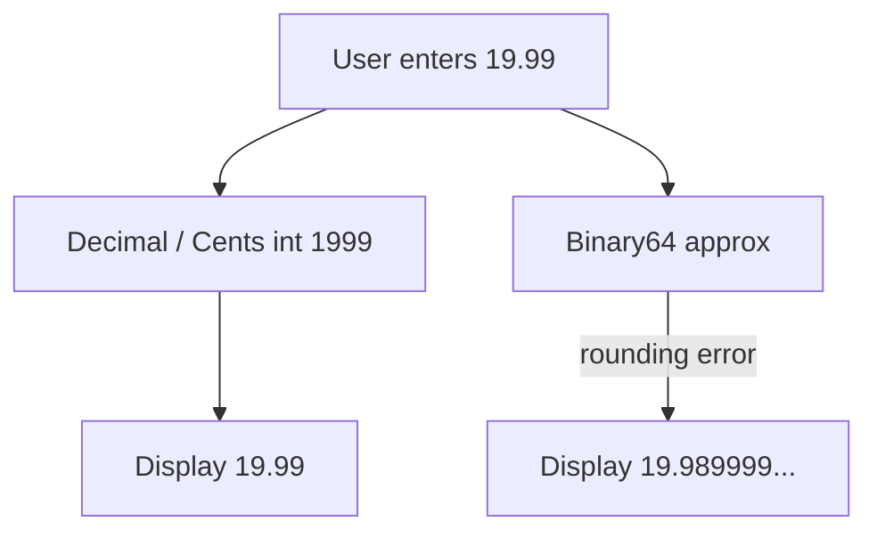
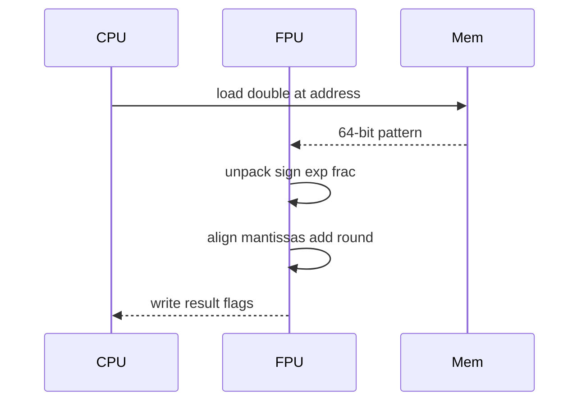

# Floating Point

## Overview

**Floating-point** numbers approximate real values using a **sign**, **exponent**, and **significand (mantissa)** stored in a fixed bit width. The dominant standard is **IEEE-754** (1985, revised 2008/2019): binary32 (`float`, 32 bits) and binary64 (`double`, 64 bits) power virtually all languages and GPUs. Values are of the form:

\[
(-1)^{sign} \times 1.m \times 2^{exp - bias}
\]

(for normalized numbers; denormals, zero, infinity, and NaN have special exponent patterns).

Floating point is **not** decimal arithmetic—it is **base-2** with finite precision. Hence `0.1 + 0.2 !== 0.3` in JavaScript and Python. Production systems use floats for science, ML, graphics, and metrics; they use **integers or decimals** for money and ledgering.

## Learning Objectives

- Decode IEEE-754 binary64 fields from hex bit patterns
- Explain rounding modes, ULP error, and catastrophic cancellation
- Identify when float comparison requires epsilon or decimal types
- Map language `number`/`float` semantics to hardware instructions
- Debug NaN propagation, `-0`, and subnormal performance cliffs

## Prerequisites

- [[01-Computer-Science/01-Information-and-Representation/Integer Representation|Integer Representation]]
- [[01-Computer-Science/01-Information-and-Representation/Number Systems|Number Systems]]

## Difficulty

`intermediate`

## Estimated Time

- Reading: 3 hours
- Exercises: 3–4 hours
- Mini project: 5–6 hours

## History

Before IEEE-754, vendors used incompatible formats—portable numerical libraries were painful. William Kahan led the standard; Intel 8087 implemented it in hardware. GPU and SIMD extensions (AVX, NEON) batch float ops. Recent interest in **bfloat16** and **float8** trades precision for ML throughput.

## Problem It Solves

Fixed-point integers cannot span astronomy and microscopy in one type. Floating point provides **wide dynamic range** with hardware support in ALUs. The cost is **rounding error**, non-associativity, and subtle comparison semantics—acceptable in simulation if you engineer around them; unacceptable in accounting without mitigation.

## Internal Implementation

### binary64 layout (64 bits)

| Field | Bits | Role |
| --- | --- | --- |
| Sign | 1 | 0 = positive, 1 = negative |
| Exponent | 11 | Biased by 1023; `2047` = special |
| Fraction | 52 | Mantissa bits (implicit leading 1) |

Special values:

- **Exp all 0, frac 0**: ±0
- **Exp all 1, frac 0**: ±∞
- **Exp all 1, frac ≠ 0**: NaN (quiet vs signaling via MSB of frac)

```mermaid
flowchart LR
    Bits[64-bit Word]
    Sign[Sign 1b]
    Exp[Exponent 11b]
    Frac[Fraction 52b]
    Bits --> Sign
    Bits --> Exp
    Bits --> Frac
    Exp --> Class{Special?}
    Class -->|normal| Value[(-1)^s * 1.frac * 2^e-bias]
    Class -->|NaN Inf| Special[Non-numeric behavior]
```

### Rounding and errors

Operations round to nearest representable value (default **roundTiesToEven**). Error accumulates in:

- **Accumulation loops** (Kahan summation mitigates)
- **Subtraction of similar magnitudes** (catastrophic cancellation)
- **Decimal literals** not exactly representable in binary

ULP (unit in last place) measures spacing between floats at a magnitude.

### Performance notes

Subnormals can be **100× slower** on some CPUs—flush-to-zero flags used in games/ML. `-ffast-math` breaks IEEE strictness for speed.

## Mermaid Diagrams

### Structure: float vs decimal money path



### Sequence: FPU add instruction



## Examples

### Minimal Example

**TypeScript**:

```typescript
console.log(0.1 + 0.2); // 0.30000000000000004

const buf = new ArrayBuffer(8);
const view = new DataView(buf);
view.setFloat64(0, 0.1, true);
console.log([...new Uint8Array(buf)].map(b => b.toString(16).padStart(2, "0")).join(" "));
// 9a 99 99 99 99 99 b9 3f (little-endian host)

function almostEqual(a: number, b: number, eps = Number.EPSILON * 8): boolean {
  return Math.abs(a - b) <= eps * Math.max(1, Math.abs(a), Math.abs(b));
}
```

**Python**:

```python
import struct

print(0.1 + 0.2)  # 0.30000000000000004

bits = struct.pack("<d", 0.1)
print(bits.hex())

from decimal import Decimal
price = Decimal("19.99")
tax = Decimal("0.0825")
print(price * (1 + tax))  # exact decimal arithmetic
```

### Production-Shaped Example

Metrics aggregation (Prometheus-style):

```typescript
function rateIncrease(samples: { t: number; v: number }[]): number {
  if (samples.length < 2) return 0;
  const first = samples[0].v;
  const last = samples[samples.length - 1].v;
  const dt = samples[samples.length - 1].t - samples[0].t;
  // Counter reset detection — compare with epsilon, not ===
  if (last < first - 1e-9) return last / dt; // reset assumed
  return (last - first) / dt;
}
```

Billing service rule: **never** `float` for currency—store `int64` minor units; format at UI only.

IEEE inspector lab: [[01-Computer-Science/code/README|code labs]] and [[01-Computer-Science/projects/UTF-8 and Float Inspector/README|UTF-8 and Float Inspector]].

## Trade-offs

| Dimension | Upside | Downside | When it matters |
| --- | --- | --- | --- |
| Range | ±10^±308 approx in binary64 | Gaps between representable values | Scientific data |
| Hardware speed | FMA, SIMD vectorization | Non-associative reductions | ML training |
| Interop | Standard across languages | Decimal literals trap humans | JSON APIs |
| Decimal types | Exact money, base-10 | Slower, not in all langs | FinTech |

### When to Use

- Physics, ML weights, audio samples, approximate analytics
- Geospatial coordinates (with precision awareness)
- **Relative** comparisons with epsilon

### When Not to Use

- Money, tax, inventory quantities requiring exact decimal law
- Primary keys or hash substitutes
- Equality tests without tolerance (`===` on floats)

## Exercises

1. Decode binary64 hex `40490fdb` pattern for π approximation (use LE float).
2. What is the next representable float after `1.0` (binary64)?
3. Explain why `NaN !== NaN` and how `Object.is(NaN, NaN)` differs in JS.
4. Implement `nextAfter(x, direction)` conceptually.
5. Sum `0.1` ten times in a loop—compare to `1.0` with ULP analysis.

## Mini Project

**IEEE-754 Inspector CLI**

Input: hex 8-byte word or decimal number. Output: sign, exponent, mantissa, class (normal/subnormal/inf/NaN), and nearest decimal. Support binary32 and binary64.

## Portfolio Project

Embed float inspector into [[01-Computer-Science/projects/UTF-8 and Float Inspector/README|UTF-8 and Float Inspector]] with bit-toggle UI.

## Interview Questions

1. Why is `0.1 + 0.2 !== 0.3`?
2. Layout of IEEE-754 double—field widths?
3. What is NaN and how does it propagate?
4. How would you store $19.99 in a database?
5. Difference between `-0` and `+0`?

### Stretch / Staff-Level

1. Explain Kahan summation and when vectorized parallel sum violates associativity.
2. Compare float8 formats (E4M3, E5M2) for ML inference trade-offs.

## Common Mistakes

- Using float counters for **financial reconciliation**
- Sorting with `a - b` when values span large magnitudes
- Serializing floats without **stable decimal formatting** in logs
- Ignoring **NaN** in JSON (non-standard extensions)

## Best Practices

- Use **integer minor units** or **decimal** libraries for money
- Document **tolerance** in float comparisons; use `Math.fma` when available
- Avoid `==` on floats; use ULP-aware helpers
- Test **edge cases**: max, min, subnormal, inf, NaN
- For aggregates, consider **compensated summation** or deterministic decimal paths

## Summary

Floating point encodes real-ish numbers in binary scientific notation with finite precision. IEEE-754 standardizes bit layout and special values so hardware and languages interoperate—but does not eliminate rounding. Engineers must know when floats are appropriate, when to use integers or decimals, and how errors compound in production pipelines.

## Further Reading

- [[00-References/Computer Science/README|Computer Science References]]
- IEEE 754 standard (2019)
- Goldberg — *What Every Computer Scientist Should Know About Floating-Point Arithmetic*
- [[01-Computer-Science/_interview/Information and Representation Interview Questions|Information and Representation Interview Questions]]

## Related Notes

- [[01-Computer-Science/01-Information-and-Representation/Integer Representation|Integer Representation]]
- [[01-Computer-Science/01-Information-and-Representation/Data Serialization Fundamentals|Data Serialization Fundamentals]]
- [[08-Databases/README|Databases]] — `NUMERIC` types
- [[02-JavaScript/README|JavaScript]] — IEEE-754 `number`
- [[03-Python/README|Python]] — `float`, `decimal`
- [[01-Computer-Science/README|Computer Science Track]]

## Progress Checklist

- [ ] Explained from first principles
- [ ] Drew at least one Mermaid diagram
- [ ] Implemented a minimal version
- [ ] Documented trade-offs and non-goals
- [ ] Completed exercises
- [ ] Practiced interview questions aloud
- [ ] Linked prerequisites and dependents
