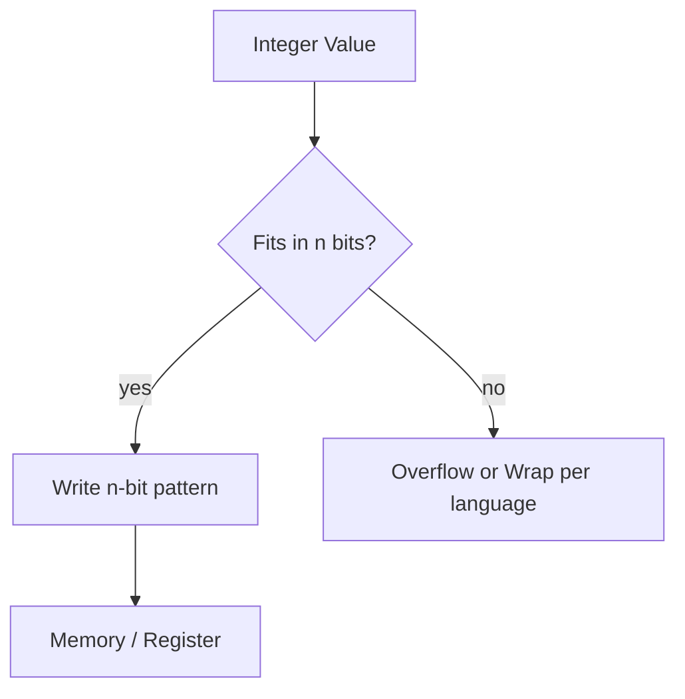
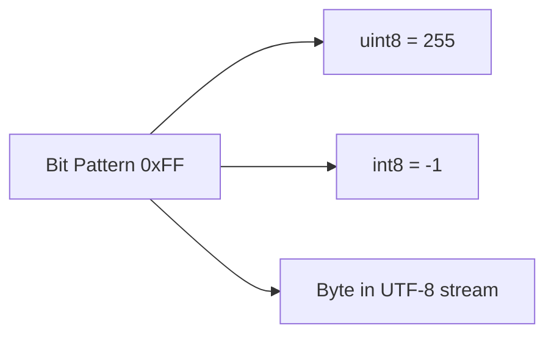
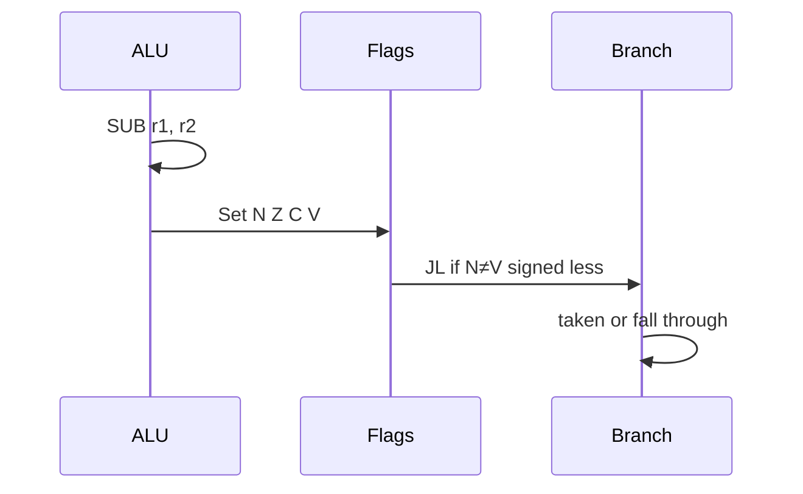

# Integer Representation

## Overview

Computers store integers as **fixed-width bit patterns** in registers and memory. The **same bits** can mean different numbers depending on interpretation: **unsigned** (pure binary magnitude), **signed two's complement** (modern default), or legacy schemes (sign-magnitude, one's complement). Two's complement maps the MSB as sign bit: for width `n`, range is \([-2^{n-1}, 2^{n-1}-1]\).

Languages expose integers with varying widths (`uint8`, `int32`, `BigInt`) and **promotion rules** that hide hardware details until overflow, shifting, or serialization exposes them. Production bugs—invoice off-by-one-cent at scale, buffer length underflow, timestamp wrap—often trace here.

This note bridges [[01-Computer-Science/01-Information-and-Representation/Number Systems|Number Systems]] to [[01-Computer-Science/01-Information-and-Representation/Floating Point|Floating Point]], [[01-Computer-Science/01-Information-and-Representation/Endianness and Binary Layout|Endianness and Binary Layout]], and [[01-Computer-Science/01-Information-and-Representation/Data Serialization Fundamentals|Data Serialization Fundamentals]].

## Learning Objectives

- Encode and decode two's complement for 8-, 16-, 32-, and 64-bit widths
- Predict overflow, truncation, and sign-extension behavior
- Explain why `-x` is implemented as `~x + 1` in hardware
- Choose integer types for counters, IDs, timestamps, and money (with decimals)
- Read disassembly and struct layouts involving integer fields

## Prerequisites

- [[01-Computer-Science/01-Information-and-Representation/Number Systems|Number Systems]]
- [[01-Computer-Science/01-Information-and-Representation/Bits Bytes and Information|Bits Bytes and Information]]

## Difficulty

`beginner`

## Estimated Time

- Reading: 2–3 hours
- Exercises: 3 hours
- Mini project: 5 hours

## History

Early machines used **sign-magnitude** (separate sign bit) and **one's complement** (negate by bitwise NOT). Two's complement won because addition/subtraction use **one adder circuit** without special zero cases (ones' complement had two zeros). IBM System/360 standardized two's complement for commercial computing; it remains universal in ARM and x86.

## Problem It Solves

Without fixed-width discipline:

- `length - 1` underflows to 4,294,967,295 when `length = 0` (unsigned 32)
- Casting negative `int` to `unsigned` creates huge positive bounds checks
- JSON numbers > 2⁵³ lose precision in JavaScript—IDs must be strings
- Cross-language APIs misread `int32` as `int64` or vice versa

## Internal Implementation

### Two's complement encoding

For n-bit signed value:

- Non-negative `k`: binary of `k`
- Negative `-k`: binary of `2ⁿ - k`

Example 8-bit: `+5` = `0000 0101`, `-5` = `1111 1011` (`~5 + 1`).

| Bits (8-bit) | Unsigned | Signed |
| --- | --- | --- |
| `0000 0000` | 0 | 0 |
| `0111 1111` | 127 | 127 |
| `1000 0000` | 128 | −128 |
| `1111 1111` | 255 | −1 |

### Operations and flags

Hardware ALU sets **condition flags**:

- **Overflow (V)**: signed result unrepresentable
- **Carry (C)**: unsigned borrow/carry
- **Zero (Z)**, **Negative (N)**

Right shift: **logical** (`>>>` in JS) fills with 0; **arithmetic** (`>>`) fills with sign bit.

### Extension and truncation

- **Zero-extend**: `uint8` → `uint32` (pad high with 0)
- **Sign-extend**: `int8` → `int32` (replicate MSB)
- **Truncation**: keep low n bits—silent modulo 2ⁿ



## Mermaid Diagrams

### Structure: interpretation layers



Context defines semantics—protocol specs must say which.

### Sequence: signed compare in CPU



## Examples

### Minimal Example

**TypeScript** (all numbers are IEEE-754 doubles—use TypedArrays for widths):

```typescript
const buf = new ArrayBuffer(2);
const view = new DataView(buf);
view.setInt16(0, -1, true); // little-endian
console.log(view.getUint16(0, true)); // 65535 — same bits, unsigned read

const x = 0x7fffffff;
console.log(x + 1); // 2147483648 — exceeds int32; double still exact
```

**Python** (arbitrary precision `int`; use `struct` for fixed width):

```python
import struct

packed = struct.pack("<h", -1)  # signed int16 LE
unsigned_read = struct.unpack("<H", packed)[0]
print(unsigned_read)  # 65535

# True int32 overflow simulation
def add_i32(a: int, b: int) -> int:
    r = (a + b) & 0xFFFFFFFF
    return r if r < 0x80000000 else r - 0x100000000

print(add_i32(0x7FFFFFFF, 1))  # -2147483648
```

### Production-Shaped Example

**Snowflake-style 64-bit ID** (timestamp | machine | sequence):

```typescript
// Conceptual layout — document bit widths in schema
const TIMESTAMP_BITS = 41n;
const MACHINE_BITS = 10n;
const SEQUENCE_BITS = 12n;

function composeId(ts: bigint, machine: bigint, seq: bigint): bigint {
  return (ts << (MACHINE_BITS + SEQUENCE_BITS)) |
         (machine << SEQUENCE_BITS) |
         seq;
}
```

Failure modes:

- Sequence overflow within one millisecond → must wait or widen field
- Clock backward → duplicate IDs if not handled
- JavaScript: IDs **> 2⁵³−1** break JSON number interoperability—emit strings

Money: store **minor units** as `int64` cents, not float.

Lab code: [[01-Computer-Science/code/README|code labs]].

## Trade-offs

| Dimension | Upside | Downside | When it matters |
| --- | --- | --- | --- |
| Fixed width | Hardware-native speed | Wrap/overflow | Embedded, kernels |
| BigInt / arbitrary | No overflow in math | Heap allocation, no SIMD | Crypto, ledgers |
| Unsigned for lengths | Extra positive range | Underflow traps | Buffer sizing |
| Zigzag encoding | Compact signed in protobuf | Decode cost | RPC at scale |

### When to Use

- **int64** (or wider) for timestamps, counters, money minor units
- **Explicit unsigned** for bitfields, hashes, lengths with invariant `>= 0`
- **Sign-extension** when widening signed wire values

### When Not to Use

- Do not use signed integers for **array lengths** without validation
- Do not assume JavaScript `number` is int32

## Exercises

1. What is 8-bit two's complement for −128? Can you negate it in place?
2. Sign-extend `0xFE` (8-bit) to 32-bit hex.
3. Predict `(uint8)0 - 1` in C vs Python `struct` unpack `<B`.
4. Implement `addUint8(a, b)` with explicit overflow error.
5. Bit-pack three fields (5, 5, 6 bits) into one `uint16`; extract each.

## Mini Project

**Fixed-Width Integer Library**

Implement `Int32`, `Uint32` classes with `add`, `sub`, `mul` that wrap or throw per policy. Serialize to little/big endian bytes. 100+ unit tests including edge cases.

## Portfolio Project

Wire integer fields with documented widths into [[01-Computer-Science/projects/Binary Protocol Lab/README|Binary Protocol Lab]] frames.

## Interview Questions

1. Why does two's complement have only one zero?
2. Range of `n`-bit signed vs unsigned?
3. What happens on `INT_MAX + 1` in C? In Python?
4. Difference between logical and arithmetic right shift?
5. Why are Twitter/Discord IDs often strings in JSON?

### Stretch / Staff-Level

1. Explain modular arithmetic view of two's complement overflow.
2. How does ZigZag encoding map signed integers to unsigned for varint?

## Common Mistakes

- Mixing signed/unsigned in comparisons (C promotes oddly)
- Using `parseInt` without radix; hex truncation surprises
- **Implicit widening** in struct packing without alignment docs
- Storing **boolean** as anything wider than 1 byte without schema agreement

## Best Practices

- Document **width, signedness, endianness** on every wire field
- Validate lengths **before** subtracting one for zero-based indices
- Use **BigInt or string** for IDs in JSON JavaScript clients
- Test boundary values: `0`, `−1`, `MAX`, `MIN`, `MAX+1`
- Prefer **explicit casts** at language boundaries (FFI, WASM)

## Summary

Integers in computers are not infinite mathematical objects—they are fixed-width bit vectors with chosen interpretation. Two's complement unifies addition and subtraction in hardware but introduces overflow, sign extension, and reinterpretation hazards at API boundaries. Production correctness demands explicit widths and invariants, especially for lengths, money, and identifiers crossing languages.

## Further Reading

- [[00-References/Computer Science/README|Computer Science References]]
- *Hacker's Delight* (Warren) — Ch. 2–4
- [[01-Computer-Science/_interview/Information and Representation Interview Questions|Information and Representation Interview Questions]]

## Related Notes

- [[01-Computer-Science/01-Information-and-Representation/Number Systems|Number Systems]]
- [[01-Computer-Science/01-Information-and-Representation/Floating Point|Floating Point]]
- [[01-Computer-Science/01-Information-and-Representation/Endianness and Binary Layout|Endianness and Binary Layout]]
- [[01-Computer-Science/01-Information-and-Representation/Data Serialization Fundamentals|Data Serialization Fundamentals]]
- [[02-JavaScript/README|JavaScript]] — `Number` vs `BigInt`
- [[03-Python/README|Python]] — arbitrary precision ints
- [[01-Computer-Science/README|Computer Science Track]]

## Progress Checklist

- [ ] Explained from first principles
- [ ] Drew at least one Mermaid diagram
- [ ] Implemented a minimal version
- [ ] Documented trade-offs and non-goals
- [ ] Completed exercises
- [ ] Practiced interview questions aloud
- [ ] Linked prerequisites and dependents
