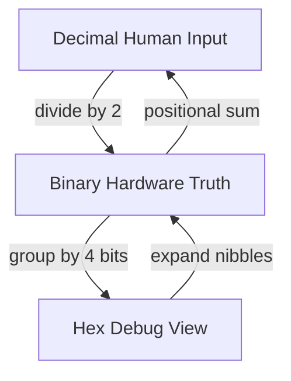
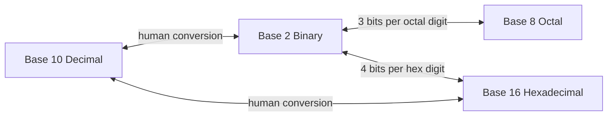
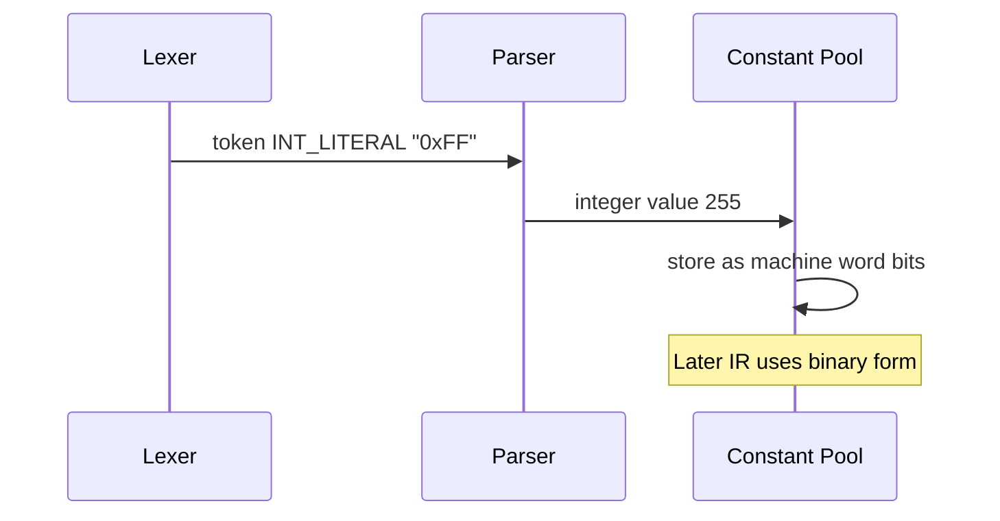

# Number Systems

## Overview

A **positional number system** represents values as a sequence of digits where each position carries weight \(r^i\) for base \(r\). Humans default to **base 10** (decimal); digital hardware defaults to **base 2** (binary) because two-level signals are robust against noise. **Hexadecimal** (base 16) is a compression notation for binary: one hex digit maps to exactly four bits, making dumps readable.

Understanding number systems is not school arithmetic—it is the **interface language** between debuggers, register dumps, color codes (`#RRGGBB`), permission bits (`chmod 755`), IPv6 addresses, and memory maps. Every [[01-Computer-Science/01-Information-and-Representation/Integer Representation|Integer Representation]] scheme is a **reinterpretation** of the same bit pattern under different rules (unsigned, two's complement, BCD).

## Learning Objectives

- Convert integers between binary, decimal, and hexadecimal without calculators
- Perform addition and subtraction in binary and verify with decimal
- Explain why hex pairs align with bytes and bit nibbles
- Use positional notation to derive bit-width limits (n bits → 2ⁿ values)
- Read production artifacts (UUIDs, MAC addresses, crash PCs) as structured hex

## Prerequisites

- [[01-Computer-Science/01-Information-and-Representation/Bits Bytes and Information|Bits Bytes and Information]]

## Difficulty

`beginner`

## Estimated Time

- Reading: 2 hours
- Exercises: 3–4 hours
- Mini project: 3 hours

## History

Babylonian base-60 remnants survive in minutes and degrees. Hindu-Arabic decimal spread globally; Leibniz championed binary as philosophically fundamental. Hex entered computing via IBM documentation and core dumps where 16 characters map cleanly to 4-bit patterns. Octal persists in Unix permission literals and legacy PDP-11 traces.

## Problem It Solves

Incidents stall when engineers cannot:

- Map `0x7fff` to a signed 16-bit boundary
- Read a **program counter** in a crash log
- Parse **bitfields** in a status register
- Debug **off-by-one** mask errors (`0xFF` vs `0xFFFF`)

Fluency converts hours of confusion into minutes of inspection.

## Internal Implementation

### Positional expansion

Value \(V = \sum_{i=0}^{k-1 d_i \cdot r^i\) where \(d_i \in [0, r-1]\).

Example: `0x2A` (hex) = \(2 \cdot 16^1 + 10 \cdot 16^0 = 42\) (decimal) = `0010 1010` (binary).

### Binary ↔ hex shortcut

Group binary bits from the **right** in fours:

```
1011 1100 0010 1111
 B    C    2    F   → 0xBC2F
```

### n-bit unsigned range

For `n` bits, unsigned range is `[0, 2ⁿ - 1]`. Common widths:

| Bits | Max unsigned | Hex digits (whole bytes) |
| --- | --- | --- |
| 8 | 255 | 2 |
| 16 | 65,535 | 4 |
| 32 | 4,294,967,295 | 8 |
| 64 | 2⁶⁴−1 | 16 |

Signed ranges use [[01-Computer-Science/01-Information-and-Representation/Integer Representation|Integer Representation]] (two's complement).

### Arithmetic in binary (hardware view)

Addition is column-wise with carry; subtraction often implemented as addition with **two's complement** negation. Multiplication by 2 is **left shift**; division by 2 is **right shift** (with signed shift caveats).



## Mermaid Diagrams

### Structure: radix relationships



### Sequence: parsing a hex literal in source code



## Examples

### Minimal Example

**TypeScript**:

```typescript
const dec = 42;
const hex = 0x2a;
const bin = 0b101010;

console.log(dec === hex && hex === bin); // true
console.log((255).toString(16)); // "ff"
console.log(parseInt("bc2f", 16)); // 48175
```

**Python**:

```python
dec = 42
hex_val = 0x2A
bin_val = 0b101010

assert dec == hex_val == bin_val
assert format(255, "x") == "ff"
assert int("bc2f", 16) == 48175
```

### Production-Shaped Example

Linux file mode `0755`:

- Octal `755` → binary `111 101 101` grouped as `rwxr-xr-x`
- Each triplet is 3 bits (octal digit)

Crash register dump:

```
RIP: 00007f3a2bc40123
```

Engineers convert to module offset with `addr2line`—hex fluency tells you this is a **canonical 64-bit user-space address** (high nibble often `0x00007f…` for ASLR mappings on Linux).

Bitmask for feature flags:

```typescript
const FEATURE_A = 1 << 0; // 0b001
const FEATURE_B = 1 << 1; // 0b010
const FEATURE_C = 1 << 2; // 0b100

function hasFeature(flags: number, mask: number): boolean {
  return (flags & mask) === mask;
}
```

Implement conversions in [[01-Computer-Science/code/README|code labs]].

## Trade-offs

| Dimension | Upside | Downside | When it matters |
| --- | --- | --- | --- |
| Decimal | Human commerce, UI | Poor alignment with bit widths | Billing APIs |
| Binary | Exact hardware mapping | Unreadable long strings | Verilog, masks |
| Hex | Compact, byte-aligned | Still manual for large values | Core dumps |
| Base64 | Text-safe transport | Not human arithmetic | JWT, email |

### When to Use

- **Hex** in logs, registers, UUIDs, cryptographic material fingerprints
- **Binary** for bitfields, masks, CRC polynomials
- **Decimal** for user-facing numbers only—convert at boundaries

### When Not to Use

- Do not display raw hex to end users without grouping/formatting
- Do not parse user decimal input with `parseInt` without radix discipline in JS

## Exercises

1. Convert `0xDEAD` to decimal and binary; add `0x0001` in hex.
2. What is the smallest n such that 2ⁿ > 1,000,000?
3. Express Unix mode `0644` as `rwx` string via binary grouping.
4. Implement `toHex(bytes: Uint8Array): string` with lowercase and zero padding.
5. Given 12-bit value `0xFFF`, what is the unsigned decimal value?

## Mini Project

**Radix Converter REPL**

Build a CLI accepting `convert --from hex --to bin 0xBC2F` with validation and round-trip tests. Support optional prefixes `0x`, `0b`, `0o`.

## Portfolio Project

Add **multi-radix display** (bin/hex/dec) to [[01-Computer-Science/projects/Binary Protocol Lab/README|Binary Protocol Lab]] field inspector.

## Interview Questions

1. Convert `0x7FFFFFFF` to decimal; why is it special for 32-bit signed ints?
2. How many hex digits to represent a 256-bit hash?
3. What is `1010 & 1100` in binary and decimal?
4. Why do IPv6 addresses use hex colon notation?
5. Difference between `>>` and `>>>` in JavaScript?

### Stretch / Staff-Level

1. Explain bijective base-64 vs standard base-64 encoding lengths.
2. How would you implement arbitrary-precision decimal parsing without floating point?

## Common Mistakes

- Forgetting **leading zeros** change hex string length but not value (`0x0F` vs `0xF`)
- Grouping binary from the **wrong end** when converting to hex
- Using **decimal fractions** where only dyadic rationals are exact in binary floats
- Mixing **signed decimal interpretation** with unsigned hex dumps

## Best Practices

- Pad hex to **byte boundaries** in logs (`0x0a` not `0xa` for protocol fields)
- Use language literals: `0x`, `0b` (TS/JS, Python 3)
- Centralize **bit mask constants** with comments showing binary
- In code reviews, verify **width** of masks matches field spec

## Summary

Number systems are interchangeable views of the same underlying quantity. Hardware stores binary; humans debug in hex; users see decimal. Positional notation explains overflow, bit widths, and mask algebra. Fluency at conversion and bitwise operations is mandatory before integer encodings, floating point, and binary protocols make sense.

## Further Reading

- [[00-References/Computer Science/README|Computer Science References]]
- [[01-Computer-Science/_exercises/Information and Representation Exercises|Information and Representation Exercises]]

## Related Notes

- [[01-Computer-Science/01-Information-and-Representation/Bits Bytes and Information|Bits Bytes and Information]]
- [[01-Computer-Science/01-Information-and-Representation/Integer Representation|Integer Representation]]
- [[01-Computer-Science/01-Information-and-Representation/Endianness and Binary Layout|Endianness and Binary Layout]]
- [[01-Computer-Science/02-Machine-Model/Registers and Calling Conventions|Registers and Calling Conventions]]
- [[01-Computer-Science/README|Computer Science Track]]

## Progress Checklist

- [ ] Explained from first principles
- [ ] Drew at least one Mermaid diagram
- [ ] Implemented a minimal version
- [ ] Documented trade-offs and non-goals
- [ ] Completed exercises
- [ ] Practiced interview questions aloud
- [ ] Linked prerequisites and dependents
