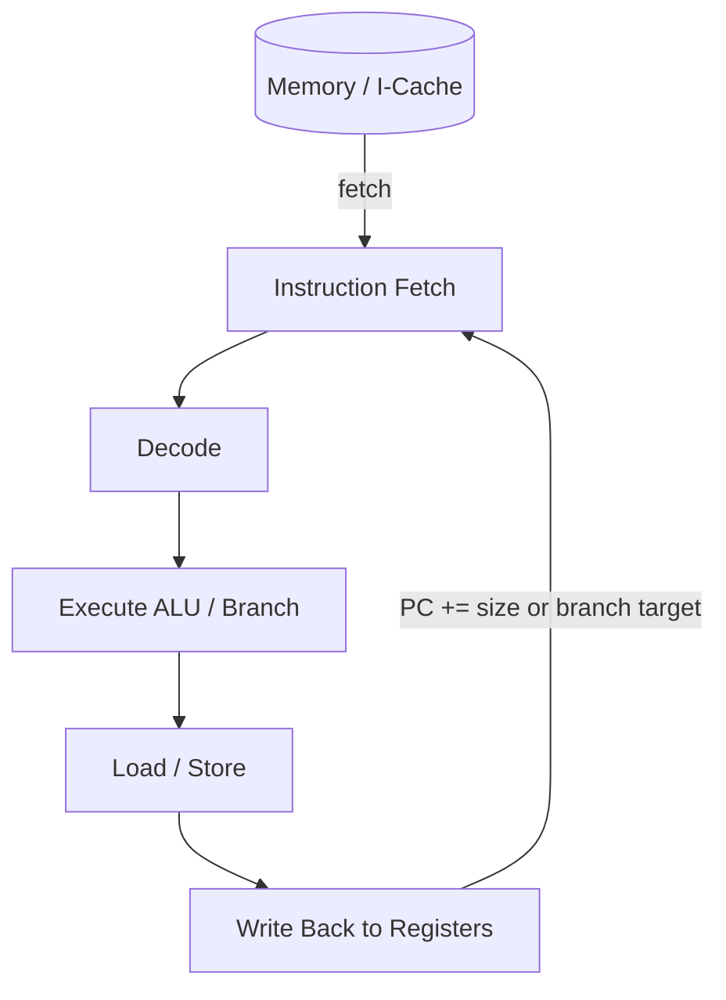
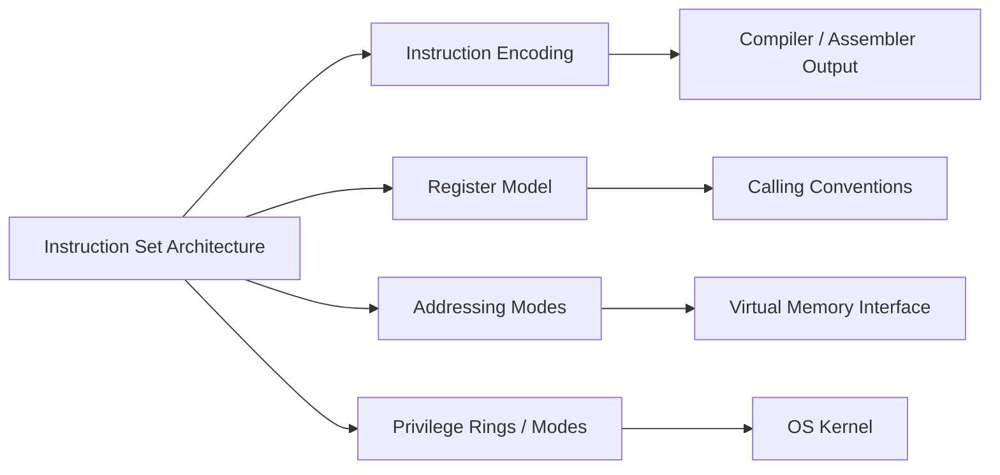
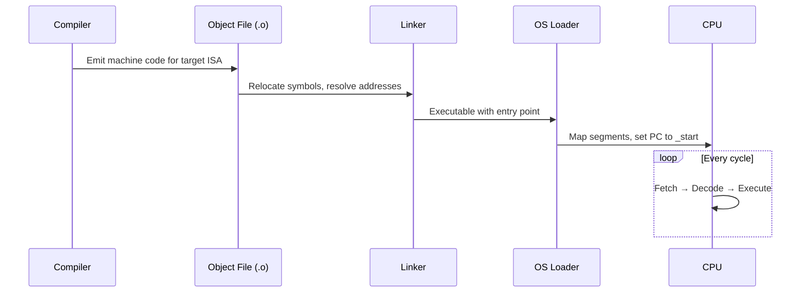

# CPU and Instruction Set Architecture

## Overview

A **CPU** (Central Processing Unit) is the hardware component that repeatedly reads instructions from memory, decodes them, and executes the operations they specify. The **Instruction Set Architecture (ISA)** is the contract between hardware and software: it defines the set of operations the CPU can perform, how instructions are encoded as bit patterns, which registers exist, how memory is addressed, and how control flow works.

The ISA is not the microarchitecture. x86-64 and AArch64 are ISAs; Intel Golden Cove and Apple Firestorm are microarchitectures that implement those ISAs with different pipelines, caches, and power budgets. Software compiled to an ISA runs on any conforming implementation, though performance varies dramatically.

Understanding the ISA from first principles means knowing what the machine can *express*—not just what your high-level language syntax looks like after compilation.

## Learning Objectives

- Distinguish ISA, microarchitecture, and machine code
- Decode the anatomy of an instruction: opcode, operands, addressing modes
- Compare RISC vs CISC design philosophies and their production consequences
- Relate ISA choices to compiler output, security features, and portability
- Read simple disassembly and map it back to source-level intent

## Prerequisites

- [[01-Computer-Science/01-Information-and-Representation/Bits Bytes and Information|Bits Bytes and Information]] — instructions are bit patterns
- [[01-Computer-Science/01-Information-and-Representation/Integer Representation|Integer Representation]] — two's complement arithmetic in ALU ops
- [[01-Computer-Science/01-Information-and-Representation/Endianness and Binary Layout|Endianness and Binary Layout]] — multi-byte instruction fetch and data layout
- [[01-Computer-Science/00-Orientation/How Computers Run Programs|How Computers Run Programs]] — program as stored instruction sequence

## Difficulty

`intermediate`

## Estimated Time

- Reading and diagrams: 90 minutes
- Exercises: 2–3 hours
- Mini project (toy ISA emulator): 4–6 hours

## History

Early computers were programmed by rewiring panels (ENIAC). Stored-program machines (von Neumann architecture, ~1945) put instructions and data in the same addressable memory, enabling software to modify software. ISAs evolved from minimal one-address machines to complex x86 (CISC, variable-length encoding, rich addressing modes) and clean RISC designs (MIPS, ARM, RISC-V) optimized for pipelined implementations. Each generation added instructions for multimedia (SIMD), cryptography (AES-NI), and virtualization (VMX/SVM).

## Problem It Solves

Without a stable ISA contract, every program would be tied to one physical machine design. The ISA abstracts hardware diversity so operating systems, compilers, and application binaries can target a *family* of CPUs. It also defines the boundary where software stops and silicon begins—critical for security (privilege levels), debugging (breakpoints via `int3`), and performance analysis (cycle counters via `rdtsc`).

## Internal Implementation

A CPU core, at minimum, contains:

| Component | Role |
| --- | --- |
| **PC** (Program Counter) | Holds address of next instruction |
| **Register file** | Fast scratch storage (general-purpose + special) |
| **ALU** | Arithmetic and logic on register/immediate operands |
| **Load/Store unit** | Moves data between registers and memory |
| **Branch unit** | Evaluates conditions, updates PC |
| **Decode logic** | Maps bit patterns to control signals |

Instructions are fetched from memory as byte sequences. The decoder interprets opcode and operand fields, then drives the datapath. Modern cores add L1 I-cache, branch predictors, and out-of-order execution—but the *visible* ISA semantics remain sequential unless the programmer uses atomics or memory ordering intrinsics.



### Major ISA Families (Production Context)

| ISA | Typical deployment | Notable traits |
| --- | --- | --- |
| **x86-64** | Servers, desktops, cloud VMs | Variable-length encoding, rich legacy, CISC lineage |
| **AArch64** | Mobile, Apple Silicon, AWS Graviton | Fixed 32-bit encoding, clean RISC, strong SIMD |
| **RISC-V** | Embedded, research, emerging servers | Open spec, modular extensions |
| **WebAssembly** | Browsers, edge runtimes | Portable stack machine, sandboxed |

## Mermaid Diagrams

### Structure



### Sequence / Lifecycle



## Examples

### Minimal Example — Conceptual ISA

Imagine a 16-bit toy ISA with three registers (`R0`–`R2`), 8-bit opcodes, and 8-bit immediate:

```
Encoding: [ opcode:8 | dst:2 | src:2 | imm:4 ]

ADD R1, R0, #3   → 0x10 | 01 | 00 | 0011
LOAD R2, [R0+4]  → 0x20 | 10 | 00 | 0100
JNZ R1, label    → 0x30 | 01 | offset...
```

The compiler's job is to choose encodings that fit operand constraints. If an immediate is too large, it spills to a `LOAD` from a literal pool.

### Production-Shaped Example — Reading Disassembly

TypeScript source:

```typescript
export function sumArray(data: Int32Array): number {
  let total = 0;
  for (let i = 0; i < data.length; i++) {
    total += data[i];
  }
  return total;
}
```

After JIT compilation (V8) or AOT (Node native addon), the hot loop typically becomes something like:

```text
; x86-64 sketch (simplified)
mov    eax, 0              ; total = 0
xor    ecx, ecx            ; i = 0
cmp    ecx, [length]
jge    .done
.loop:
add    eax, [data + rcx*4] ; scale index by 4 (32-bit int)
inc    ecx
cmp    ecx, [length]
jl     .loop
.done:
ret
```

Key ISA concepts visible here: register operands, scaled indexed addressing (`base + index * scale`), compare-and-branch, fixed calling convention for return value in `eax`/`x0`.

Python equivalent at C extension level uses the same ISA after Cython/C compilation—the high-level loop is irrelevant once lowered.

## Trade-offs

| Dimension | Upside | Downside | When it matters |
| --- | --- | --- | --- |
| **CISC (x86)** | Dense code, fewer instructions for complex ops | Decoder complexity, variable length hurts fetch | Legacy binaries, desktop/server ecosystems |
| **RISC (ARM, RISC-V)** | Simple decode, uniform pipeline | More instructions for same task | Mobile power budgets, custom silicon |
| **Fixed vs variable encoding** | Fixed: fast fetch/decode | Variable: better code density | I-cache pressure, branch alignment |
| **Large register file** | Less spill to stack | More silicon area | Hot loops, numeric kernels |
| **ISA extensions (AVX, SVE)** | Vector throughput | Portability, thermal limits | ML inference, video codecs |

### When to Use

- Choosing a deployment target (ARM Graviton vs x86 for cost/perf)
- Writing performance-critical native code or intrinsics
- Debugging crashes at the assembly level (`gdb`, `lldb`, `perf`)
- Evaluating cloud instance types or embedded board specs

### When Not to Use

- Do not hand-write assembly for business logic—compilers and JITs dominate
- Do not assume ISA details across OSes without checking ABI docs
- Do not micro-optimize before profiling; microarchitecture effects often dominate

## Exercises

1. Design a 12-instruction toy ISA (add, sub, load, store, branch, halt). Encode five programs by hand and verify a partner can decode them.
2. Compile the same C function for `-O0` and `-O3` on x86-64 and AArch64. List instruction count differences and identify one SIMD optimization at `-O3`.
3. Use `objdump -d` or `llvm-objdump` on a compiled binary. Trace one function from prologue to epilogue and label register roles.
4. Research one ISA extension (e.g., AES-NI, ARM PAC). Write when software should use intrinsics vs library fallback.

## Mini Project

**Toy ISA Emulator**: Implement a fetch-decode-execute loop for your 12-instruction ISA in TypeScript and Python. Support a hex loader, register dump, and single-step debugger. Cross-link to [[01-Computer-Science/02-Machine-Model/Fetch Decode Execute|Fetch Decode Execute]] and the [[01-Computer-Science/projects/Stack Machine/README|Stack Machine]] lab.

## Portfolio Project

Extend the emulator into a **bytecode VM** with an assembler, disassembler, and benchmark suite comparing interpreted vs JIT-compiled guest code. Document how your ISA choices affect code size and cycle count. Tie results to [[01-Computer-Science/08-Languages-and-Computation/Bytecode and JIT Compilation|Bytecode and JIT Compilation]].

## Interview Questions

1. What is the difference between ISA and microarchitecture? Give an example where the same ISA has 2× performance difference.
2. Why do ARM and x86 both dominate different market segments despite RISC vs CISC history?
3. Explain how a `CALL` instruction interacts with the stack and return address. What can go wrong if the stack is corrupted?
4. What is an addressing mode? Name three and say when a compiler emits each.
5. How does position-independent code (PIC) affect instruction encoding on x86-64?

### Stretch / Staff-Level

1. How would you design an ISA extension for safe sandboxed plugins without breaking backward compatibility?
2. Compare hardware virtualization (Intel VT-x) to pure software VM traps at the ISA boundary. Where does the hypervisor intercept?

## Common Mistakes

- Confusing assembly syntax (AT&T vs Intel) with the underlying encoding
- Assuming `int` size matches register width across languages and ISAs
- Ignoring alignment requirements when reading raw instruction bytes
- Attributing performance purely to ISA rather than cache, branch prediction, or memory bandwidth

## Best Practices

- Always name your target triple when discussing machine code (`x86_64-linux-gnu`)
- Use compiler explorer (godbolt.org) to connect source → asm → perf
- Read the ABI document for your platform before writing FFI or native extensions
- Profile before selecting intrinsics; autovectorization often suffices

## Summary

The CPU executes a stream of encoded instructions defined by the ISA. That contract—registers, opcodes, addressing modes, privilege levels—lets compilers and operating systems build portable systems atop diverse silicon. Production engineers rarely design ISAs, but they constantly depend on ISA semantics: calling conventions, atomic instructions, SIMD availability, and disassembly during incidents. Master the ISA layer and microarchitecture optimizations become legible rather than magical.

## Further Reading

- Hennessy & Patterson, *Computer Architecture: A Quantitative Approach* — ISA and performance chapters
- Intel® 64 and IA-32 Architectures Software Developer's Manual (Volume 2: Instruction Set Reference)
- ARM Architecture Reference Manual (A-profile)
- RISC-V Specifications — [riscv.org](https://riscv.org/technical/specifications/)

## Related Notes

- [[01-Computer-Science/02-Machine-Model/Fetch Decode Execute|Fetch Decode Execute]]
- [[01-Computer-Science/02-Machine-Model/Registers and Calling Conventions|Registers and Calling Conventions]]
- [[01-Computer-Science/02-Machine-Model/Hardware Software Interface|Hardware Software Interface]]
- [[01-Computer-Science/02-Machine-Model/Pipelining and Speculative Execution|Pipelining and Speculative Execution]]
- [[01-Computer-Science/02-Machine-Model/Measuring Computer Performance|Measuring Computer Performance]]
- [[01-Computer-Science/01-Information-and-Representation/Endianness and Binary Layout|Endianness and Binary Layout]]
- [[01-Computer-Science/04-Processes-and-Execution/System Calls|System Calls]]
- [[01-Computer-Science/08-Languages-and-Computation/Compilers Interpreters and Virtual Machines|Compilers Interpreters and Virtual Machines]]
- [[02-JavaScript/README|JavaScript]] — V8 JIT and WebAssembly
- [[03-Python/README|Python]] — CPython bytecode vs native extensions
- [[10-Linux/README|Linux]] — ELF, `objdump`, `readelf`

## Progress Checklist

- [ ] Explained from first principles
- [ ] Drew at least one Mermaid diagram
- [ ] Implemented a minimal version
- [ ] Documented trade-offs and non-goals
- [ ] Completed exercises
- [ ] Practiced interview questions aloud
- [ ] Linked prerequisites and dependents
