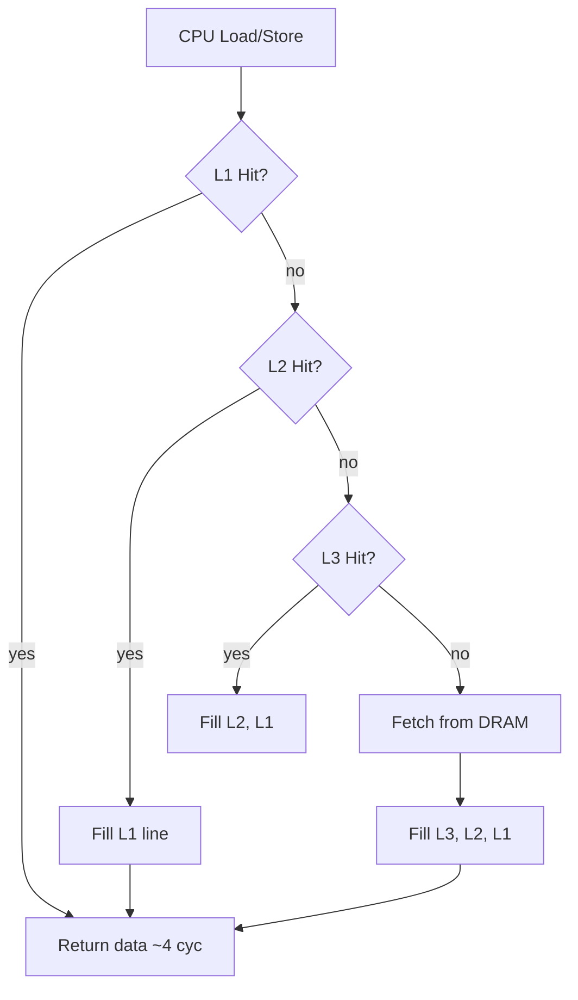
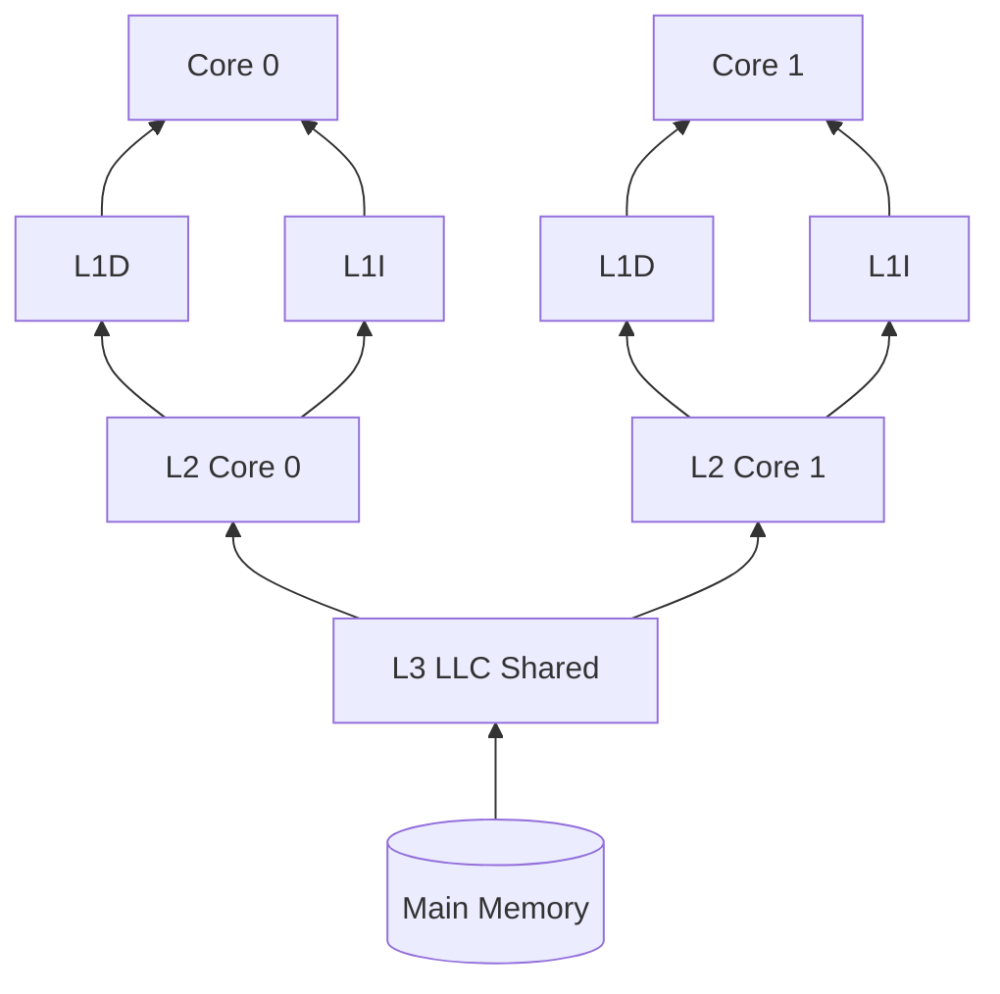
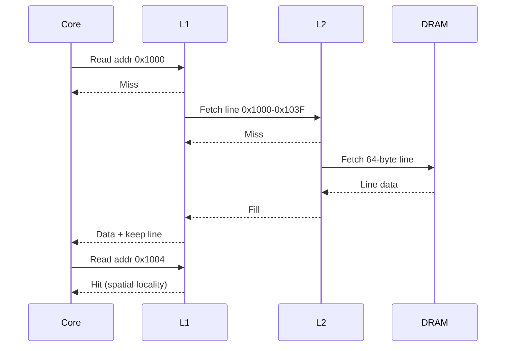

# Cache Hierarchy and Locality

## Overview

Main DRAM is hundreds of cycles away from the CPU. **Caches** are small, fast SRAM buffers that hold recently used copies of memory lines (typically 64 bytes on x86/ARM). A **cache hierarchy** stacks levels—L1I, L1D, L2, L3 (LLC)—each larger, slower, and shared among more cores. Programs that exhibit **temporal locality** (reuse the same data soon) and **spatial locality** (access nearby addresses) run faster because hits avoid DRAM latency.

Locality is not a compiler hint—it is a physical consequence of access patterns. Production performance work—database buffer pools, columnar layouts, struct-of-arrays vs array-of-structs—often reduces to making your working set fit cache and minimizing misses.

## Learning Objectives

- Define cache line, set, tag, and associativity
- Distinguish compulsory, capacity, conflict, and coherence misses
- Quantify how stride and data layout affect miss rate
- Use cache-aware algorithm design in application code
- Interpret `perf stat` cache metrics in production profiling

## Prerequisites

- [[01-Computer-Science/02-Machine-Model/Fetch Decode Execute|Fetch Decode Execute]] — instruction fetch hits I-cache
- [[01-Computer-Science/01-Information-and-Representation/Bits Bytes and Information|Bits Bytes and Information]]
- [[01-Computer-Science/03-Memory-and-Addressing/Memory Hierarchy Trade-offs|Memory Hierarchy Trade-offs]]

## Difficulty

`intermediate`

## Estimated Time

- Reading: 90 minutes
- Exercises: 3 hours
- Mini project (cache simulator): 5–6 hours

## History

The memory wall (1980s–present): CPU speed outpaced DRAM. First caches were optional external chips; now multi-megabyte L3 is on-die. Multicore added **cache coherence** protocols (MESI and variants) so cores see consistent views of shared lines. NUMA (Non-Uniform Memory Access) extended hierarchy across sockets—local vs remote memory on servers.

## Problem It Solves

Without caches, a 3 GHz CPU would spend most cycles stalled on ~100 ns DRAM accesses. Caches exploit program behavior: loops reuse instructions (I-cache) and data (D-cache); sequential scans benefit from prefetchers pulling the next lines.

Failure mode in production: a "simple" O(n) loop becomes slow at scale because the working set exceeds LLC—tail latency spikes while CPUs wait on memory.

## Internal Implementation

### Typical Hierarchy (Server-Class Sketch)

| Level | Size (order of) | Latency (cycles) | Shared by |
| --- | --- | --- | --- |
| L1D / L1I | 32–64 KiB each | ~4 | One core |
| L2 | 256 KiB – 1 MiB | ~12 | One core |
| L3 (LLC) | 8–64 MiB | ~40 | All cores on chip |
| DRAM | GB | ~200+ | Whole machine |

### Address Mapping (Conceptual)

A memory address splits into **tag | set index | block offset**. On access:

1. Index selects a cache set
2. Tags compared (associativity = how many ways per set)
3. Hit → return data; update LRU/LFU replacement metadata
4. Miss → fetch line from lower level; may evict another line



### Locality Types

| Type | Definition | Example |
| --- | --- | --- |
| **Temporal** | Reuse soon | Loop counter, hot hash bucket |
| **Spatial** | Nearby addresses soon | Array scan, struct fields in one line |
| **Sequential** | Strict order | Memory copy, column-major mistake |

## Mermaid Diagrams

### Structure



### Sequence / Lifecycle



## Examples

### Minimal Example — Row vs Column Major

TypeScript (conceptual timing pattern):

```typescript
const N = 4096;
const matrix = new Float64Array(N * N);

function rowMajorSum(): number {
  let s = 0;
  for (let i = 0; i < N; i++)
    for (let j = 0; j < N; j++)
      s += matrix[i * N + j]; // stride-1 inner → good spatial locality
  return s;
}

function colMajorSum(): number {
  let s = 0;
  for (let j = 0; j < N; j++)
    for (let i = 0; i < N; i++)
      s += matrix[i * N + j]; // stride-N inner → cache thrashing
  return s;
}
```

Row-major inner loop is often 5–10× faster on large N due to line reuse.

Python with NumPy demonstrates the same lesson—`sum(axis=1)` vs bad striding:

```python
import numpy as np

N = 4096
m = np.zeros((N, N), dtype=np.float64)
# Fast: C-contiguous row access
fast = m.sum(axis=1)
# Slow: column access jumps strides
slow = sum(m[:, j].sum() for j in range(N))
```

### Production-Shaped Example — Struct Layout

```c
// Bad for hot path — fields scattered across cache lines
struct BadOrder {
    char flag;      // 1 byte + 7 pad
    double value;   // 8 bytes — likely different line from hot flag checks
    int id;
};

// Better — pack hot fields together, align consciously
struct GoodOrder {
    int id;
    char flag;
    char pad[3];
    double value;
};
```

In services processing millions of records/sec, layout dominates more than Big-O constants. Link to [[04-Data-Structures/README|Data Structures]] for cache-oblivious algorithms.

### Measuring in Production

```bash
perf stat -e cache-references,cache-misses,L1-dcache-load-misses,LLC-load-misses ./service
```

High LLC miss rate with low IPC → memory-bound; optimize layout and working set before micro-optimizing instructions.

## Trade-offs

| Dimension | Upside | Downside | When it matters |
| --- | --- | --- | --- |
| **Large LLC** | Bigger working set fits | Cost, latency, power | Analytics, in-memory DBs |
| **High associativity** | Fewer conflict misses | Slower lookup, power | Pathological stride patterns |
| **Prefetchers** | Hide latency on streams | Wrong prefetch wastes bandwidth | Sequential I/O, ML tensors |
| **False sharing** | — | Independent vars on same line ping-pong between cores | [[01-Computer-Science/05-Concurrency-Fundamentals/Atomics and Memory Ordering|Atomics and Memory Ordering]] counters |

### When to Use

- Optimizing hot loops after profiling confirms cache misses
- Designing in-memory indexes and serialization formats
- Sizing instances (CPU with larger LLC for skewed workloads)

### When Not to Use

- Do not reorder all structs prematurely—measure first
- Do not assume cache size from marketing slides; query `lscpu` / `/sys/devices/system/cpu/cpu0/cache/`

## Exercises

1. Implement a 64-line direct-mapped cache simulator. Plot miss rate vs stride for array traversal.
2. Run row-major vs column-major benchmarks at N=512, 4096, 16384. Explain the knee in the curve.
3. Create two threads incrementing adjacent `int64` counters vs counters 128 bytes apart. Measure false sharing.
4. Use `perf record` on a real service binary. Identify one function with high `mem_load_uops_retired.l3_miss`.

## Mini Project

**Cache simulator lab**: configurable associativity, line size, LRU replacement, read/write traces from CSV. Visualize hit/miss timeline. Connect to [[01-Computer-Science/03-Memory-and-Addressing/Memory Hierarchy Trade-offs|Memory Hierarchy Trade-offs]].

## Portfolio Project

Build a **layout benchmark suite** comparing AoS vs SoA, columnar vs row storage, and padded vs packed structs. Publish results with methodology for [[09-System-Design/README|System Design]] readers choosing data formats.

## Interview Questions

1. What is a cache line? Why does iterating a 2D array in the "wrong" order hurt performance?
2. Explain temporal vs spatial locality with a hash table example.
3. What is false sharing? How do you fix it?
4. Difference between capacity miss and conflict miss?
5. How does NUMA affect cache and memory on a dual-socket server?

### Stretch / Staff-Level

1. Design a cache-conscious hash table for multicore insert-heavy workloads.
2. When would software prefetch intrinsics help vs hurt on modern Intel/ARM cores?

## Common Mistakes

- Optimizing CPU instructions when the bottleneck is LLC misses
- Ignoring alignment padding when measuring struct sizes
- Using synchronized counters on the same cache line across threads
- Assuming JavaScript object property order guarantees memory layout (it does not)

## Best Practices

- Profile with hardware counters before restructuring data
- Prefer contiguous memory (TypedArrays, NumPy, Rust `Vec`) for numeric hot paths
- Pad per-core metrics to cache line boundaries (`alignas(64)`)
- Document expected working set size when sizing pods/VMs

## Summary

Caches bridge the speed gap between CPUs and DRAM by exploiting locality. Understanding hierarchy levels, line size, and miss types turns mysterious slowdowns into actionable layout and algorithm choices. In production, cache behavior shows up as throughput cliffs, tail latency, and scalability limits—often fixed by how you arrange bytes, not which framework you pick.

## Further Reading

- Hennessy & Patterson — memory hierarchy chapter
- Ulrich Drepper, "What Every Programmer Should Know About Memory"
- Intel 64 Optimization Manual — cache and prefetch guidance

## Related Notes

- [[01-Computer-Science/02-Machine-Model/Measuring Computer Performance|Measuring Computer Performance]]
- [[01-Computer-Science/02-Machine-Model/Pipelining and Speculative Execution|Pipelining and Speculative Execution]]
- [[01-Computer-Science/03-Memory-and-Addressing/Memory Hierarchy Trade-offs|Memory Hierarchy Trade-offs]]
- [[01-Computer-Science/03-Memory-and-Addressing/Virtual Memory|Virtual Memory]]
- [[01-Computer-Science/05-Concurrency-Fundamentals/Atomics and Memory Ordering|Atomics and Memory Ordering]]
- [[04-Data-Structures/README|Data Structures]]
- [[05-Algorithms/README|Algorithms]]
- [[09-System-Design/README|System Design]]
- [[10-Linux/08-Observability-Tracing-and-Profiling/perf CPU Profiles and Flame Graph Intuition|perf CPU Profiles and Flame Graph Intuition]] — `perf`, NUMA tools
- [[10-Linux/03-Memory-Swap-and-OOM/NUMA Basics for Host Operators|NUMA Basics for Host Operators]]

## Progress Checklist

- [ ] Explained from first principles
- [ ] Drew at least one Mermaid diagram
- [ ] Implemented a minimal version
- [ ] Documented trade-offs and non-goals
- [ ] Completed exercises
- [ ] Practiced interview questions aloud
- [ ] Linked prerequisites and dependents
