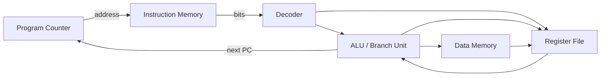
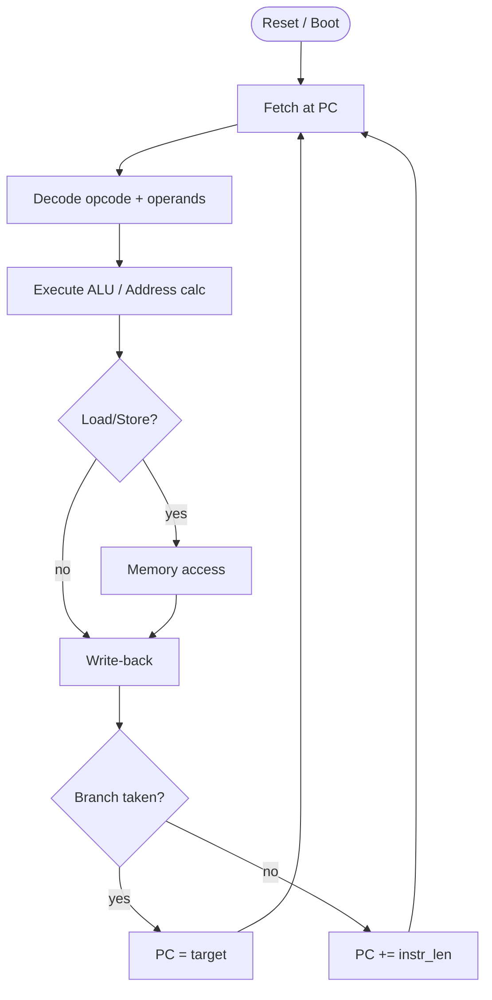
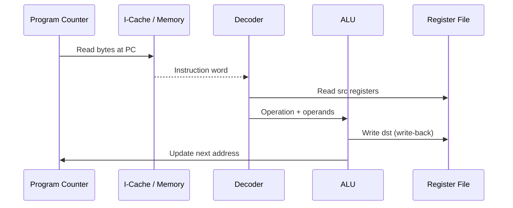

# Fetch Decode Execute

## Overview

**Fetch–Decode–Execute (FDE)** is the fundamental control loop of a stored-program CPU. On each iteration, the processor **fetches** the instruction at the program counter (PC), **decodes** its bit pattern into control signals, **executes** the operation (ALU, load/store, branch), and **updates** the PC to the next instruction or branch target.

This cycle is the atomic unit of computation at the hardware level. Everything above it—operating system scheduling, garbage collection, async event loops—is ultimately sequences of FDE cycles on physical or virtual CPUs. Pipelining overlaps these stages across *different* instructions; out-of-order cores rename and reorder work—but the *architectural* model visible to single-threaded sequential code remains fetch-decode-execute semantics unless memory ordering or atomics say otherwise.

## Learning Objectives

- Trace one instruction through fetch, decode, execute, and write-back stages
- Explain how the PC advances and how branches redirect control flow
- Relate FDE to observable program behavior (crashes, infinite loops, self-modifying code)
- Build a software FDE simulator that mirrors hardware control flow
- Connect FDE to pipeline stalls, exceptions, and interrupts

## Prerequisites

- [[01-Computer-Science/02-Machine-Model/CPU and Instruction Set Architecture|CPU and Instruction Set Architecture]] — instruction encoding and registers
- [[01-Computer-Science/01-Information-and-Representation/Bits Bytes and Information|Bits Bytes and Information]] — memory as byte arrays

## Difficulty

`intermediate`

## Estimated Time

- Reading: 60 minutes
- Exercises: 2 hours
- Mini project (cycle-accurate toy CPU): 4–5 hours

## History

The FDE cycle formalizes the stored-program idea (Turing/von Neumann, 1940s). Early machines executed one full cycle per instruction with multi-cycle micro-operations. Pipelining (IBM 7030 Stretch, 1960s) split FDE into overlapping stages to raise throughput. Modern CPUs still *implement* FDE but hide latency via speculation, caching, and reorder buffers—creating the gap between architectural and microarchitectural state that systems programmers must respect around concurrency and I/O.

## Problem It Solves

FDE gives a deterministic model for "what happens next" when the CPU runs. Without this loop, you cannot reason about:

- Why a segfault occurs at a specific instruction pointer
- How function calls push return addresses
- Why tight loops become hot in the I-cache
- How debuggers single-step (`TF` trap flag on x86) or breakpoints patch instructions

## Internal Implementation

### Single-Cycle Datapath (Conceptual)



**Fetch**: `instr = memory[PC]` (may hit L1 I-cache first)

**Decode**: Split opcode/operands; read source registers; sign-extend immediates

**Execute**: ALU computes result or effective address; branch unit compares flags

**Memory** (if load/store): Read or write data memory

**Write-back**: Store result register; `PC = PC + instr_size` or branch target

### Exception and Interrupt Injection

Between execute and write-back, hardware may override the next PC:

| Event | Effect on FDE |
| --- | --- |
| Page fault on fetch | Trap to OS; PC saved in exception frame |
| Illegal opcode | Signal or kernel trap |
| Timer interrupt | Save PC, jump to interrupt vector |
| `SYSCALL` instruction | Privilege transition; kernel handler |

See [[01-Computer-Science/04-Processes-and-Execution/System Calls|System Calls]] and [[01-Computer-Science/02-Machine-Model/Hardware Software Interface|Hardware Software Interface]].

## Mermaid Diagrams

### Structure



### Sequence / Lifecycle



## Examples

### Minimal Example — TypeScript FDE Simulator

```typescript
type Op = "ADD" | "LOAD" | "STORE" | "JMP" | "HALT";

interface Instr {
  op: Op;
  a: number;
  b: number;
  c: number;
}

class ToyCPU {
  pc = 0;
  regs = new Int32Array(8);
  mem = new Int32Array(256);
  halted = false;

  constructor(private program: Instr[]) {}

  step(): void {
    if (this.halted) return;
    const ins = this.program[this.pc];
    switch (ins.op) {
      case "ADD":
        this.regs[ins.a] = this.regs[ins.b] + this.regs[ins.c];
        this.pc++;
        break;
      case "LOAD":
        this.regs[ins.a] = this.mem[this.regs[ins.b] + ins.c];
        this.pc++;
        break;
      case "STORE":
        this.mem[this.regs[ins.a] + ins.b] = this.regs[ins.c];
        this.pc++;
        break;
      case "JMP":
        this.pc = ins.a;
        break;
      case "HALT":
        this.halted = true;
        break;
    }
  }
}
```

### Minimal Example — Python FDE Simulator

```python
from dataclasses import dataclass
from enum import Enum, auto

class Op(Enum):
    ADD = auto()
    LOAD = auto()
    HALT = auto()

@dataclass
class Instr:
    op: Op
    dst: int
    src: int
    imm: int = 0

class ToyCPU:
    def __init__(self, program: list[Instr]):
        self.pc = 0
        self.regs = [0] * 8
        self.mem = [0] * 256
        self.program = program
        self.halted = False

    def step(self) -> None:
        if self.halted:
            return
        ins = self.program[self.pc]
        if ins.op == Op.ADD:
            self.regs[ins.dst] = self.regs[ins.src] + ins.imm
            self.pc += 1
        elif ins.op == Op.LOAD:
            self.regs[ins.dst] = self.mem[self.regs[ins.src] + ins.imm]
            self.pc += 1
        elif ins.op == Op.HALT:
            self.halted = True
```

### Production-Shaped Example — Observing FDE in Incidents

When a Node.js process crashes with `SIGSEGV`, the kernel captures the faulting **RIP/EIP** (PC). `gdb` backtrace shows the instruction pointer chain—each frame is a saved return address from prior `CALL` FDE cycles. In production:

```bash
# Linux — inspect crash PC
gdb -batch -ex "thread apply all bt" -p <pid>
perf record -g -- sleep 10 && perf report  # hot FDE sites
```

The "hot" functions in `perf` are addresses where the PC spends the most FDE iterations—directly tied to [[01-Computer-Science/02-Machine-Model/Measuring Computer Performance|Measuring Computer Performance]].

## Trade-offs

| Dimension | Upside | Downside | When it matters |
| --- | --- | --- | --- |
| **Single-cycle FDE** | Simple mental model | Low IPC (instructions per cycle) | Teaching, tiny embedded cores |
| **Pipelined FDE** | Higher throughput | Hazards, complexity | All modern CPUs |
| **Microcoded decode** | Flexible opcode mapping | Extra lookup latency | CISC x86 legacy |
| **Hardwired decode** | Fast, regular | Less opcode flexibility | RISC pipelines |

### When to Use

- Building emulators, VM interpreters, or WASM runtimes
- Debugging at the instruction level during native crashes
- Teaching how CPUs relate to [[01-Computer-Science/03-Memory-and-Addressing/Virtual Memory|Virtual Memory]] faults on fetch

### When Not to Use

- Do not model every production CPU as a naive single-cycle loop—microarchitecture matters for perf
- Do not implement self-modifying code in managed runtimes without understanding I-cache coherency

## Exercises

1. Single-step your toy CPU through a program that computes factorial. Log PC, registers, and memory after each cycle.
2. Inject a branch instruction that creates an infinite loop. Explain what external agent (OS, debugger) must do to stop FDE.
3. Add a "illegal instruction" opcode that raises an exception in software; map it to how Linux delivers `SIGILL`.
4. Measure Python vs TypeScript interpreter loop overhead for 10⁷ FDE steps. Where does the host language cost dominate?

## Mini Project

Build a **trace-driven FDE debugger** with breakpoints, register watch, and memory hex dump. Export execution traces as JSON for visualization. Integrate with [[01-Computer-Science/02-Machine-Model/CPU and Instruction Set Architecture|CPU and Instruction Set Architecture]] toy ISA.

## Portfolio Project

Implement a **cycle-counting simulator** that models pipeline stalls (load-use hazard, branch mispredict penalty as configurable constants). Compare naive FDE throughput vs pipelined throughput on the same benchmark. Document crossover points linking to [[01-Computer-Science/02-Machine-Model/Pipelining and Speculative Execution|Pipelining and Speculative Execution]].

## Interview Questions

1. Walk through FDE for `ADD R1, R2, R3` then `BEQ R1, R0, target`. When does the PC change?
2. What happens during FDE if the instruction fetch crosses a page boundary and the second page is unmapped?
3. How does an interrupt differ from a syscall in terms of PC save/restore?
4. Why might self-modifying code cause incorrect behavior on CPUs with separate I-cache and D-cache?
5. Relate the JavaScript event loop to FDE—what actually runs the JS bytecode?

### Stretch / Staff-Level

1. Design an FDE simulator interface that plugs in different decode tables for multi-ISA disassembly tools.
2. Explain how precise exceptions in out-of-order CPUs require reorder buffer rollback—what invariant must hold at the architectural FDE boundary?

## Common Mistakes

- Forgetting that fetch is a memory read subject to alignment, cache, and VM rules
- Assuming decode happens atomically with execute on pipelined hardware
- Ignoring that `HALT`/`WFI` stops FDE until interrupts wake the core

## Best Practices

- When simulating, separate architectural state from timing metadata
- Log PC on every step during bring-up; remove logging in hot paths
- Match your simulator's instruction size model to your ISA definition
- Use hardware performance counters to validate where real FDE time goes

## Summary

Fetch-decode-execute is the heartbeat of computation: read instruction bits, interpret them, mutate state, advance control flow. Every debugger stack frame, every page fault on instruction fetch, and every hot loop in a profiler is evidence of this loop running billions of times per second. Understanding FDE makes pipelines, exceptions, and performance measurement concrete rather than abstract.

## Further Reading

- Patterson & Hennessy, *Computer Organization and Design* — single-cycle and pipelined datapath chapters
- Intel SDM Volume 1 — instruction fetch and cache behavior overview
- Linux `man 2 sigaction` — signal delivery and saved context

## Related Notes

- [[01-Computer-Science/02-Machine-Model/CPU and Instruction Set Architecture|CPU and Instruction Set Architecture]]
- [[01-Computer-Science/02-Machine-Model/Pipelining and Speculative Execution|Pipelining and Speculative Execution]]
- [[01-Computer-Science/02-Machine-Model/Registers and Calling Conventions|Registers and Calling Conventions]]
- [[01-Computer-Science/02-Machine-Model/Cache Hierarchy and Locality|Cache Hierarchy and Locality]]
- [[01-Computer-Science/03-Memory-and-Addressing/Virtual Memory|Virtual Memory]]
- [[01-Computer-Science/04-Processes-and-Execution/Context Switching|Context Switching]]
- [[01-Computer-Science/08-Languages-and-Computation/Compilers Interpreters and Virtual Machines|Compilers Interpreters and Virtual Machines]]
- [[02-JavaScript/README|JavaScript]] — V8 bytecode execution pipeline
- [[03-Python/README|Python]] — CPython eval loop
- [[10-Linux/README|Linux]] — signals, `gdb`, `perf`

## Progress Checklist

- [ ] Explained from first principles
- [ ] Drew at least one Mermaid diagram
- [ ] Implemented a minimal version
- [ ] Documented trade-offs and non-goals
- [ ] Completed exercises
- [ ] Practiced interview questions aloud
- [ ] Linked prerequisites and dependents
