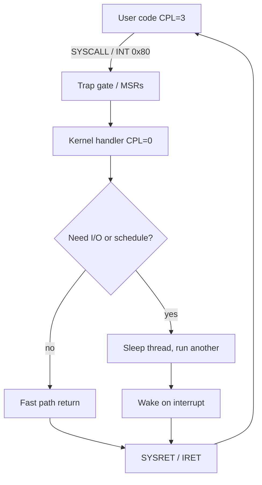
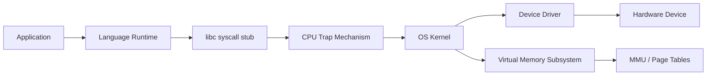
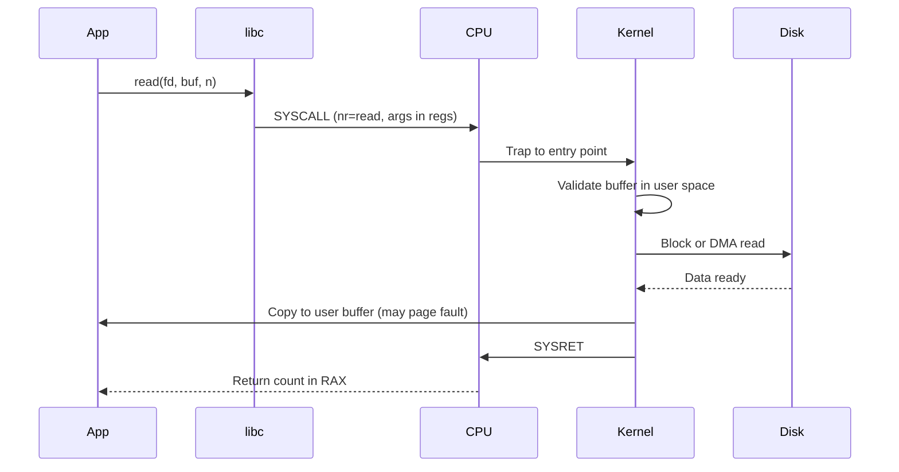

# Hardware Software Interface

## Overview

The **hardware–software interface (HSI)** is the boundary where the CPU transitions between unprivileged application code and privileged operating-system/kernel code. Hardware enforces this boundary through **privilege levels** (x86 rings 0–3, ARM exception levels EL0/EL1), **protected instructions** (only executable in supervisor mode), **MMU** page tables with user/supervisor bits, and **trap mechanisms** (interrupts, exceptions, system calls) that atomically save context and jump to kernel entry points.

Every file read, network packet, memory allocation, and thread schedule in production crosses this interface. Node.js `fs.readFile`, Python `open()`, and Rust `std::fs` all bottom out in syscalls after the language runtime marshals arguments according to the platform ABI.

## Learning Objectives

- Map privilege rings / exception levels to user vs kernel code
- Trace a system call from user stub through trap gate to kernel handler and back
- Distinguish exceptions, interrupts, and traps by cause and handling
- Explain how page tables and MSRs configure the HSI at boot
- Relate HSI to containers, VMs, and security isolation models

## Prerequisites

- [[01-Computer-Science/02-Machine-Model/CPU and Instruction Set Architecture|CPU and Instruction Set Architecture]]
- [[01-Computer-Science/02-Machine-Model/Fetch Decode Execute|Fetch Decode Execute]]
- [[01-Computer-Science/03-Memory-and-Addressing/Virtual Memory|Virtual Memory]]

## Difficulty

`intermediate`

## Estimated Time

- Reading: 90 minutes
- Exercises: 2–3 hours
- Mini project (syscall tracer): 4–5 hours

## History

Early OSes ran in user mode with no hardware protection (1960s). Multics introduced rings; UNIX simplified to user/kernel split. x86 protected mode (80286+) added segmentation then paging; x86-64 uses primarily paging with ring 0 kernel. ARM moved to EL0/EL1/EL2/EL3 for hypervisors. Virtualization extended HSI with **trap-and-emulate** and hardware assist (Intel VT-x, ARM HVC)—hypervisor becomes new software on hardware.

## Problem It Solves

Without hardware-enforced privilege, any bug or malicious app could read all memory, halt the machine, or reprogram devices. The HSI lets the OS:

- Multiplex CPU among processes fairly
- Isolate address spaces via [[01-Computer-Science/03-Memory-and-Addressing/Virtual Memory|Virtual Memory]]
- Mediate I/O safely
- Deliver timer interrupts for scheduling

## Internal Implementation

### Privilege Model (x86-64 Simplified)

| Ring / Level | Typical occupant | Capabilities |
| --- | --- | --- |
| Ring 3 (user) | Apps, language runtimes | User pages, limited instructions |
| Ring 0 (kernel) | Linux kernel, drivers | All pages, `IN/OUT`, MSRs, TLB shootdown |
| Ring -1 (hypervisor) | KVM, Xen, Hyper-V | Guest VM control, nested paging |

Current **CPL** (Current Privilege Level) stored in code segment descriptor; instructions like `HLT`, `LGDT`, `WRMSR` fault if CPL > 0.

### Trap Entry (Conceptual)

On syscall (`SYSCALL`/`SVC`) or page fault:

1. Hardware saves PC, stack, flags to kernel stack / `thread_struct`
2. Switches to kernel page tables (or uses per-process kernel mappings)
3. Dispatches vector in **IDT** (Interrupt Descriptor Table)
4. Kernel handler runs; may block thread, copy data, signal process
5. `IRET`/`SYSRET` restores user context



### Key Hardware Structures

| Structure | Purpose |
| --- | --- |
| **IDT** | Maps vector → handler address + privilege |
| **GDT/TSS** | Segment descriptors, kernel stack pointer on ring switch |
| **CR3** | Root of page table (address space) |
| **MSRs** (e.g., `LSTAR`) | Syscall entry point on x86-64 |
| **APIC** | Timer and IPI delivery |

## Mermaid Diagrams

### Structure



### Sequence / Lifecycle — `read()` Syscall



## Examples

### Minimal Example — Syscall Numbers (Linux x86-64)

```typescript
// Conceptual — never invoke raw syscalls from TS in production
const SYS_READ = 0;
const SYS_WRITE = 1;
// Args: rdi=fd, rsi=buf, rdx=count → rax=bytes or -errno
```

Python exposes the boundary via libc, not direct syscalls in user code:

```python
# Every open() eventually: Python → libc → syscall → kernel VFS
with open("/etc/hosts") as f:
    data = f.read()
# strace would show: openat, read, close syscalls
```

Use `strace -f -e trace=open,read python script.py` on [[10-Linux/README|Linux]] for observability.

### Production-Shaped Example — Container vs VM

| Isolation | Mechanism at HSI |
| --- | --- |
| **Process** | Separate page tables, separate file descriptors |
| **Container** | Shared kernel, namespaces + cgroups (still syscalls into same kernel) |
| **VM** | Guest ring 0 trapped to hypervisor; second address space via EPT/NPT |

A "syscall" in a container is still a real syscall—namespaces filter what the kernel returns, they do not replace the HSI.

### Seccomp (Production Hardening)

Services restrict allowable syscalls:

```text
# Docker default + custom seccomp profile
ALLOW: read, write, exit, futex, clock_gettime, ...
DENY:  mount, ptrace, kexec_load, ...
```

Violating profile → `SIGSYS` kill—HSI policy enforced by kernel after trap dispatch check.

## Trade-offs

| Dimension | Upside | Downside | When it matters |
| --- | --- | --- | --- |
| **Syscall boundary** | Strong isolation | ~100 ns–µs overhead per call | High-QPS microservices |
| **vDSO** | Fast gettimeofday without full syscall | Limited operations | Timing, RNG hot paths |
| **io_uring** | Batch/async kernel interface | Complexity | Databases, proxies |
| **VM isolation** | Stronger boundary | Exit storms, memory overhead | Multi-tenant untrusted code |

### When to Use

- Debugging permission errors (`EPERM`, segfaults in kernel copy)
- Designing sandboxed plugins or WASM runtimes
- Tuning services that are syscall-heavy (use `strace`, `perf trace`)

### When Not to Use

- Do not bypass libc with raw syscalls unless you handle errno, restart, and ABI per arch
- Do not assume syscall numbers match across OSes or bitness

## Exercises

1. Run `strace -c` on a Node and Python HTTP server. Rank top syscalls; propose one reduction.
2. Read Linux `man 2 syscalls` list. Explain why `execve` replaces address space but `fork` copies it (conceptually).
3. Trigger a page fault on guard page; use `dmesg` / core dump to see faulting IP and error code bits.
4. Compare latency of `clock_gettime` via vDSO vs older syscall path (benchmark on your kernel).

## Mini Project

Implement a **syscall tracer** using `ptrace` (Linux) or parse `strace` output into a timeline visualization. Correlate syscalls with latency spikes.

## Portfolio Project

Document an **end-to-end request path** for your stack (browser → API → DB): list every HSI crossing (syscall, DNS resolver, TLS in userspace vs kernel). Quantify syscall rate under load and propose io_uring or batching where justified.

## Interview Questions

1. What happens on a page fault in user mode vs kernel mode?
2. Difference between interrupt, exception, and trap?
3. Why must the kernel validate user pointers on syscall?
4. How does `SYSCALL` differ from legacy `int 0x80` on x86-64?
5. Explain how containers share one kernel but isolate PIDs and mount namespaces.

### Stretch / Staff-Level

1. Describe a VM exit when a guest OS executes `IN` to a virtual device port.
2. How does KPTI (Kernel Page Table Isolation) change the HSI for Meltdown mitigation?

## Common Mistakes

- Confusing language runtime permissions with OS permissions
- Assuming WASM or JS sandboxes remove need for kernel seccomp
- Ignoring that `copy_from_user` can fail on bad pointers—kernel must handle
- Measuring app latency without noticing syscall storms (`write` per log line)

## Best Practices

- Batch I/O; use buffered logging in hot paths
- Apply seccomp/AppArmor profiles for untrusted workloads
- Use `perf trace` alongside application traces
- Understand which operations hit vDSO vs full syscall

## Summary

The hardware–software interface is where CPUs enforce trust: user programs run confined; privileged instructions and kernel memory stay protected until a controlled trap transfers control to the OS. Syscalls, page faults, and interrupts are not edge cases—they are the mechanism by which every production service touches disks, networks, and clocks. Understanding HSI makes containers, VMs, seccomp, and strace output legible.

## Further Reading

- Intel SDM Volume 3 — System Programming (protection, IDT, syscalls)
- ARM ARM — Exception model EL0–EL3
- Linux kernel documentation — syscalls, vDSO, namespaces
- *Operating Systems: Three Easy Pieces* — virtualization and syscall chapters

## Related Notes

- [[01-Computer-Science/02-Machine-Model/CPU and Instruction Set Architecture|CPU and Instruction Set Architecture]]
- [[01-Computer-Science/02-Machine-Model/Registers and Calling Conventions|Registers and Calling Conventions]]
- [[01-Computer-Science/03-Memory-and-Addressing/Virtual Memory|Virtual Memory]]
- [[01-Computer-Science/04-Processes-and-Execution/System Calls|System Calls]]
- [[01-Computer-Science/04-Processes-and-Execution/Processes|Processes]]
- [[01-Computer-Science/04-Processes-and-Execution/Context Switching|Context Switching]]
- [[10-Linux/README|Linux]]
- [[14-Docker/README|Docker]]
- [[18-Security/README|Security]]
- [[02-JavaScript/README|JavaScript]] — libuv thread pool syscalls
- [[03-Python/README|Python]] — GIL vs I/O syscalls

## Progress Checklist

- [ ] Explained from first principles
- [ ] Drew at least one Mermaid diagram
- [ ] Implemented a minimal version
- [ ] Documented trade-offs and non-goals
- [ ] Completed exercises
- [ ] Practiced interview questions aloud
- [ ] Linked prerequisites and dependents
