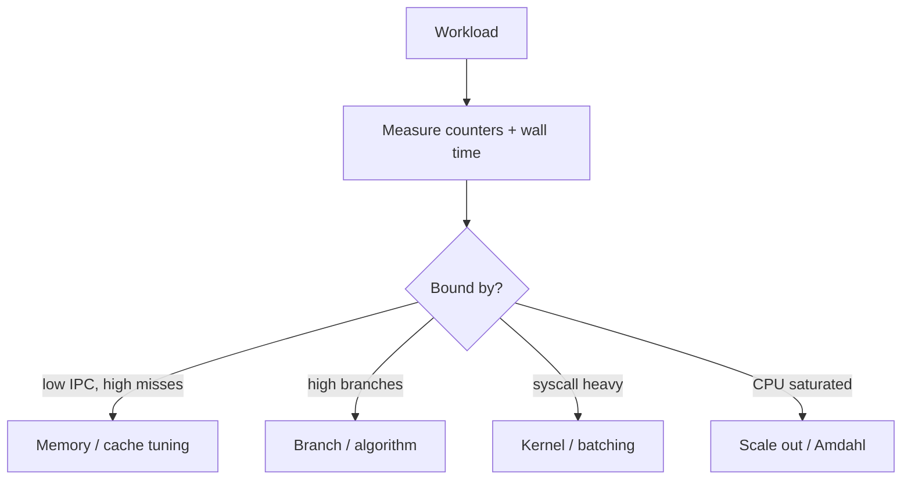
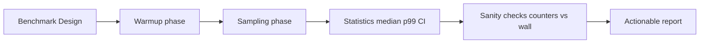
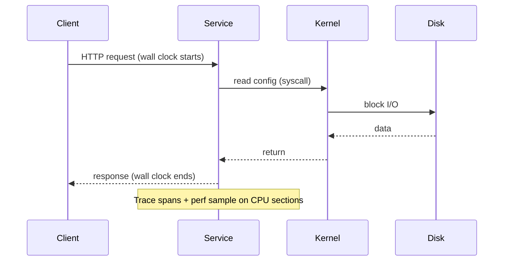

# Measuring Computer Performance

## Overview

**Measuring computer performance** is the disciplined practice of quantifying how fast a system completes work under defined conditions. Raw clock speed (GHz) is insufficient: **throughput** (work per second), **latency** (time per operation), **tail latency** (p99/p999), **IPC** (instructions per cycle), **cache miss rates**, and **resource utilization** together explain behavior on real hardware.

Production SLOs are measured—not guessed. A function that is O(n) on paper may be memory-bound at scale; a microbenchmark may lie due to compiler elision or cold caches. This topic establishes vocabulary and methods to connect machine model concepts to observable metrics in development and operations.

## Learning Objectives

- Define latency, throughput, bandwidth, and utilization precisely
- Use wall-clock, CPU time, and hardware counters appropriately
- Design microbenchmarks that resist dead-code elimination and capture warmup
- Interpret Amdahl's Law and the roofline model for optimization priorities
- Map metrics to Linux/`perf`, Node, and Python profiling tools

## Prerequisites

- [[01-Computer-Science/02-Machine-Model/Cache Hierarchy and Locality|Cache Hierarchy and Locality]]
- [[01-Computer-Science/02-Machine-Model/Pipelining and Speculative Execution|Pipelining and Speculative Execution]]
- [[01-Computer-Science/01-Information-and-Representation/Integer Representation|Integer Representation]]

## Difficulty

`intermediate`

## Estimated Time

- Reading: 75 minutes
- Exercises: 3 hours
- Mini project (benchmark harness): 4–6 hours

## History

Early performance was **MIPS** (misleading—instructions differ). MFLOPS and SPEC benchmarks (1988+) standardized comparable suites. Multicore shifted focus to scalability and tail latency (Dean & Barroso, "Tail at Scale"). Cloud economics tied measurement to **cost per request**. eBPF and always-on profilers (2010s) made production sampling cheap—measurement moved from lab to live fleets.

## Problem It Solves

Without measurement, optimization is superstition. Teams ship "optimizations" that regress tail latency, burn CPU on cache misses, or optimize cold paths. Measurement answers:

- Are we CPU-, memory-, or I/O-bound?
- Did a change improve median but hurt p99?
- Is autoscaling triggered by real load or syscall noise?

## Internal Implementation

### Metric Taxonomy

| Metric | Definition | Tool examples |
| --- | --- | --- |
| **Wall time** | Real elapsed clock | `time`, Chrome DevTools |
| **CPU time** | Time on-CPU (user + sys) | `clock_gettime`, `/usr/bin/time -v` |
| **Cycles** | CPU cycles consumed | `perf stat cycles` |
| **IPC** | Instructions / cycle | `perf stat` derived |
| **CPI** | Cycles / instruction (inverse IPC) | architecture texts |
| **Cache misses** | LLC/L1 miss counts | `perf stat cache-misses` |
| **Throughput** | Ops/sec, RPS, bytes/sec | load generators, `wrk` |
| **Tail latency** | High percentile latency | Prometheus histograms |

### Amdahl's Law

Speedup limited by serial fraction:

\[
S = \frac{1}{(1 - p) + \frac{p}{N}}
\]

If 10% of work is serial, infinite cores yield max 10× speedup—optimize the serial part first (often locks, syscalls, GC pause).

### Roofline Model (Conceptual)

Plot attainable FLOP/s vs operational intensity (FLOPs/byte). Performance bounded by compute roof or memory bandwidth roof—identifies whether to optimize ALU or [[01-Computer-Science/02-Machine-Model/Cache Hierarchy and Locality|Cache Hierarchy and Locality]].



## Mermaid Diagrams

### Structure



### Sequence / Lifecycle — Production Request



## Examples

### Minimal Example — Honest Microbenchmark (TypeScript)

```typescript
function blackhole(n: number): void {
  if (n === 0xdeadbeef) console.log(n); // prevent DCE
}

function bench(fn: () => void, iterations: number): number {
  for (let i = 0; i < 1000; i++) fn(); // warmup
  const t0 = performance.now();
  for (let i = 0; i < iterations; i++) fn();
  return (performance.now() - t0) / iterations;
}

const N = 1_000_000;
const data = new Int32Array(N);
let sink = 0;
const nsPerOp = bench(() => {
  for (let i = 0; i < N; i++) sink += data[i];
  blackhole(sink);
}, 20);
```

### Minimal Example — Python `timeit`

```python
import timeit

setup = "import numpy as np; a = np.arange(1_000_000, dtype=np.int64)"
stmt = "a.sum()"
# repeat=5, number=50 → reports best of batches; still warmup manually for JIT/C extensions
t = min(timeit.repeat(stmt, setup=setup, repeat=5, number=50))
print(f"{t/50*1e6:.2f} µs per sum")
```

### Production-Shaped Example — Linux perf

```bash
# Summary counters for a batch job
perf stat -d ./batch-processor

# Sample CPU stacks at 99 Hz for 60s on live service PID
perf record -F 99 -p $(pidof api-server) -g -- sleep 60
perf report --stdio | head -50

# Compare deploy A vs B: instructions, cycles, LLC-load-misses, task-clock
```

Correlate with application traces (OpenTelemetry) so p99 spikes map to specific code + counter anomalies—handoff to [[09-System-Design/README|System Design]] SLO practice.

## Trade-offs

| Dimension | Upside | Downside | When it matters |
| --- | --- | --- | --- |
| **Microbenchmarks** | Isolated, repeatable | Unrepresentative input/cache state | Algorithm pick |
| **Macro/load tests** | Realistic concurrency | Noisy, expensive | Capacity planning |
| **Always-on profiling** | Catches prod regressions | Overhead, sampling bias | SRE teams |
| **Hardware counters** | Root cause (misses, IPC) | Arch-specific, privilege needed | Native hot paths |

### When to Use

- Before/after any performance PR with defined metric + CI threshold
- Capacity planning and instance type selection
- Incident response when latency SLO breaches

### When Not to Use

- Do not optimize without a regression in measured SLO or cost
- Do not trust single-run microbenchmarks on laptops with variable turbo

## Exercises

1. Benchmark the same sort in TypeScript (V8) and Python (NumPy vs pure Python). Report median and p95 over 30 runs.
2. Run `perf stat` on idle vs busy system. Explain `context-switches` and `cpu-migrations`.
3. Apply Amdahl's Law: 80% parallel section, 8 cores—compute max speedup.
4. Find a benchmark that LLVM optimizes away (empty loop). Fix with `blackhole` or `DoNotOptimize` equivalent.

## Mini Project

Build a **benchmark harness** (TS + Python) with warmup, multiple iterations, confidence intervals, and CSV export. Integrate optional `perf stat` wrapper on Linux.

## Portfolio Project

Publish a **performance case study** on one service component: hypothesis, methodology, counter evidence, change, before/after with graphs (median + p99 + CPU cost). Link to [[01-Computer-Science/09-Correctness-and-Reliability/Observability Fundamentals|Observability Fundamentals]].

## Interview Questions

1. Difference between latency and throughput? Can you improve one while hurting the other?
2. What is tail latency and why do load balancers care about p99?
3. Explain IPC. What does low IPC suggest?
4. Why must microbenchmarks include warmup for JVM/JS JIT?
5. How does coordinated omission affect latency histograms in load tests?

### Stretch / Staff-Level

1. Design an continuous profiling strategy that stays under 1% overhead at 10k RPS.
2. When is Little's Law useful for interpreting queue depth vs latency in a service?

## Common Mistakes

- Optimizing median while p99 regresses
- Comparing runs across different CPU governor settings
- Using `Date.now()` for nanosecond-scale work
- Conflating CPU usage with efficient work (spin loops use CPU too)

## Best Practices

- Define primary metric + guardrail metrics before changing code
- Pin environment for benchmarks; document kernel, CPU model, mitigations
- Report distribution, not just mean
- Pair wall time with hardware counters on native code paths

## Summary

Performance is measured along multiple axes—time, throughput, counters, and tails—not inferred from Big-O alone. The machine model (cache, pipeline, syscalls) explains *why* counters look the way they do. Production engineers instrument services, interpret perf and traces, and apply Amdahl and roofline thinking to spend optimization effort where bounds allow real gains.

## Further Reading

- Hennessy & Patterson — performance evaluation chapters
- Brendan Gregg, *Systems Performance*
- Google SRE Book — monitoring and SLO chapters
- `man perf-stat`, `man time`

## Related Notes

- [[01-Computer-Science/02-Machine-Model/Cache Hierarchy and Locality|Cache Hierarchy and Locality]]
- [[01-Computer-Science/02-Machine-Model/Pipelining and Speculative Execution|Pipelining and Speculative Execution]]
- [[01-Computer-Science/07-Networking-Fundamentals/Latency Bandwidth Throughput and Tail Latency|Latency Bandwidth Throughput and Tail Latency]]
- [[01-Computer-Science/09-Correctness-and-Reliability/Observability Fundamentals|Observability Fundamentals]]
- [[05-Algorithms/README|Algorithms]]
- [[09-System-Design/README|System Design]]
- [[10-Linux/README|Linux]]
- [[16-DevOps/README|DevOps]]
- [[02-JavaScript/README|JavaScript]] — V8 `--prof`, clinic.js
- [[03-Python/README|Python]] — `cProfile`, `py-spy`

## Progress Checklist

- [ ] Explained from first principles
- [ ] Drew at least one Mermaid diagram
- [ ] Implemented a minimal version
- [ ] Documented trade-offs and non-goals
- [ ] Completed exercises
- [ ] Practiced interview questions aloud
- [ ] Linked prerequisites and dependents
