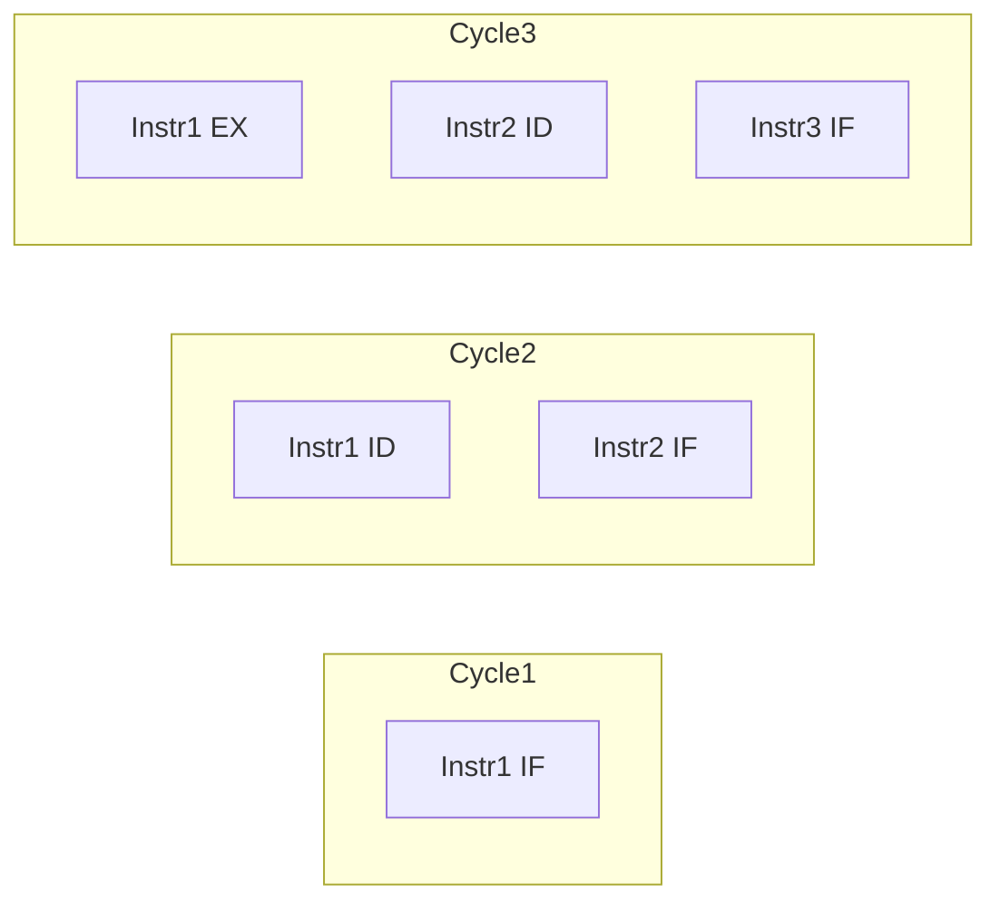
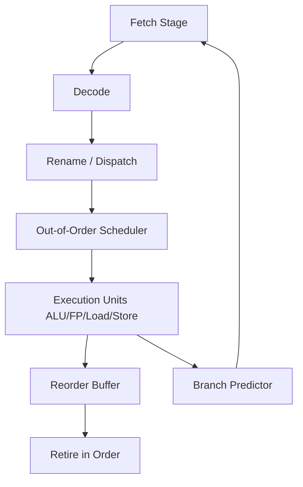
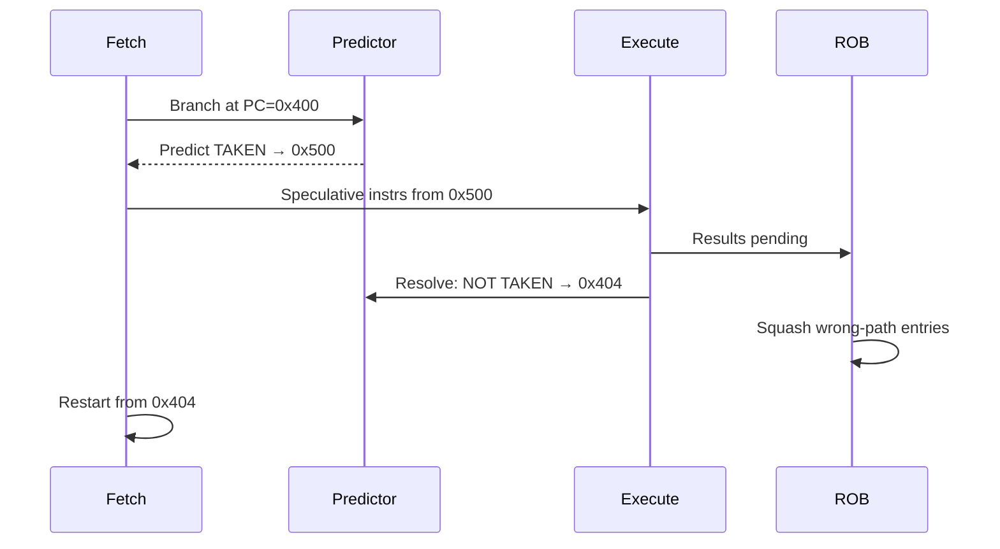

# Pipelining and Speculative Execution

## Overview

**Pipelining** overlaps the stages of fetch-decode-execute across multiple instructions so that, in the steady state, one instruction completes per cycle even though each individual instruction still takes several cycles end-to-end. **Speculative execution** goes further: the CPU predicts branches and executes downstream instructions before the branch direction is known, discarding results if the prediction was wrong.

These techniques raise **IPC** (instructions per cycle) from ~1 toward 3–6 on modern cores—but they introduce hazards (data dependencies, control dependencies), security vulnerabilities (Spectre), and a gap between **architectural state** (what your program observes) and **microarchitectural state** (caches, branch predictors). Systems engineers must understand both performance benefits and failure modes.

## Learning Objectives

- Diagram a classic 5-stage pipeline and identify stall conditions
- Explain branch prediction, mispredict penalty, and why unpredictable branches hurt
- Describe out-of-order execution, reorder buffer, and retirement
- Connect speculation to Spectre/Meltdown-class vulnerabilities at a high level
- Apply pipeline-aware coding (reduce branches, expose ILP) after measurement

## Prerequisites

- [[01-Computer-Science/02-Machine-Model/Fetch Decode Execute|Fetch Decode Execute]]
- [[01-Computer-Science/02-Machine-Model/Cache Hierarchy and Locality|Cache Hierarchy and Locality]]
- [[01-Computer-Science/02-Machine-Model/CPU and Instruction Set Architecture|CPU and Instruction Set Architecture]]

## Difficulty

`advanced`

## Estimated Time

- Reading: 2 hours
- Exercises: 3–4 hours
- Mini project (pipeline simulator with hazards): 6–8 hours

## History

Pipelining appeared in the 1960s (IBM 7030). RISC designs (MIPS, 1980s) made uniform instruction formats pipeline-friendly. Branch prediction evolved from static hints to tournament predictors and TAGE (2010s). Out-of-order execution (Intel P6, 1995) renamed registers and executed ready ops speculatively. Spectre (2018) revealed that speculative memory accesses could leak secrets via cache side channels—forcing OS, compiler, and microcode mitigations in production fleets.

## Problem It Solves

Raw clock speed hit physical limits (~5 GHz air-cooled). Pipelining and speculation extract parallelism *within* a single thread (ILP—instruction-level parallelism) without programmer effort. Without them, modern CPUs would deliver a fraction of today's throughput for serial code.

## Internal Implementation

### Classic 5-Stage Pipeline

| Stage | Name | Work |
| --- | --- | --- |
| IF | Instruction Fetch | PC → I-cache |
| ID | Decode | Read registers |
| EX | Execute | ALU |
| MEM | Memory | Load/store |
| WB | Write Back | Update registers |

**Structural hazard**: two stages need same hardware (dual-port register file fixes many cases)

**Data hazard (RAW)**: `ADD R1,R2,R3` followed by `SUB R4,R1,R5` — need forwarding from EX/MEM to ID

**Control hazard**: branch outcome unknown at fetch — stall or predict



### Branch Prediction and Speculation

When the pipeline encounters a conditional branch:

1. **Predict** taken or not (pattern history, BTB—Branch Target Buffer)
2. **Speculatively fetch** down the predicted path
3. **Execute** dependent ops; results sit in reorder buffer
4. **Resolve** branch; if mispredicted, **squash** wrong-path ops (~10–20 cycle penalty)

Out-of-order cores additionally:

- Rename architectural registers to physical pool
- Schedule ready uops to multiple execution ports
- Retire in program order for precise exceptions

### Security Consequence (Production)

Speculative loads may bring secret data into cache even if the load is later nullified architecturally. Attackers measure cache timing—link to [[18-Security/README|Security]] track. Mitigations: retpoline, IBRS, site isolation in browsers, kernel page table isolation.

## Mermaid Diagrams

### Structure



### Sequence / Lifecycle — Mispredict Recovery



## Examples

### Minimal Example — Branch Sensitivity

TypeScript microbenchmark pattern:

```typescript
function sumWithBranch(data: Int32Array, useBranch: boolean): number {
  let s = 0;
  for (let i = 0; i < data.length; i++) {
    if (useBranch) {
      if (data[i] >= 0) s += data[i]; // unpredictable if data random
    } else {
      s += data[i] & ~(data[i] >> 31); // branchless abs-ish add for negatives skip
    }
  }
  return s;
}
```

Random sign pattern → mispredicts; sequential mostly-positive → predictor learns.

Python suffers similarly in tight loops—NumPy vectorization removes Python-level branches entirely.

### Production-Shaped Example — Parser Branchiness

JSON parsers often branch on character class per byte. Production parsers (simdjson) use SIMD classification to reduce mispredictions and improve IPC. In a 50k RPS API gateway, shaving branch mispredicts on hot parse paths measurably cuts CPU utilization—see [[01-Computer-Science/02-Machine-Model/Measuring Computer Performance|Measuring Computer Performance]].

```bash
perf stat -e branches,branch-misses ./json-benchmark
# branch-misses > ~2% of branches on hot path → investigate
```

### Data Hazard — Forwarding Concept

```text
ADD R1, R2, R3   # writes R1 in WB stage cycle 5
SUB R4, R1, R5   # needs R1 in ID cycle 4 → forward from EX/MEM
```

Without forwarding: 2–3 bubble stalls per dependent chain.

## Trade-offs

| Dimension | Upside | Downside | When it matters |
| --- | --- | --- | --- |
| **Deep pipeline** | Higher clock potential | Longer mispredict penalty | Branch-heavy code |
| **Aggressive OoO** | Hides cache miss latency | Power, complexity, security surface | Mixed workloads |
| **Branch prediction** | Near-zero branch cost when accurate | Catastrophic on unpredictable branches | Parsers, interpreters |
| **Mitigations (Spectre)** | Restored security | 5–30% perf loss on some workloads | Multi-tenant cloud |

### When to Use

- After profiling shows high `branch-misses` or low IPC
- When designing interpreters (computed goto, threaded code)
- When evaluating security vs performance of CPU microcode updates

### When Not to Use

- Do not rewrite code branchless without evidence—readability and compiler autovectorization may win
- Do not disable mitigations in production without explicit risk acceptance

## Exercises

1. Simulate a 5-stage pipeline with forwarding. Count cycles for a 10-instruction basic block with two back-to-back dependent adds.
2. Generate random vs sorted data for a branch-heavy sum. Compare `perf stat branch-misses`.
3. Read one Spectre variant description. Explain which microarchitectural state leaks and why architectural rollback does not undo cache effects.
4. Implement a simple 2-bit saturating branch predictor in software; feed it a trace from a real loop.

## Mini Project

**Pipeline hazard simulator**: configurable stages, forwarding on/off, branch predictor module, mispredict penalty. Export CPI (cycles per instruction) reports. Tie to [[01-Computer-Science/02-Machine-Model/Fetch Decode Execute|Fetch Decode Execute]].

## Portfolio Project

Analyze a real open-source hot path (e.g., hash function, regex engine) with `perf` and llvm-mca. Propose one pipeline-aware change; measure before/after with statistical rigor. Write an engineering note for [[09-System-Design/README|System Design]] on when microarchitectural tuning is worth team time.

## Interview Questions

1. What is a pipeline bubble? Name three causes.
2. How does register renaming help out-of-order execution without violating ISA semantics?
3. Why do `if (x > 0)` branches hurt less when `x` is mostly positive?
4. Explain Spectre variant 1 in one paragraph—speculation, cache, leak.
5. What is the difference between architectural and microarchitectural state?

### Stretch / Staff-Level

1. How do memory ordering and speculative loads interact with ARM LOAD-acquire semantics?
2. When would a compiler insert `lfence`/`speculation barrier` and what is the performance cost?

## Common Mistakes

- Attributing all stalls to branches—cache misses dominate many workloads
- Using microbenchmarks without pinning CPU frequency or warming predictors
- Assuming deeper pipeline always means faster (Netburst lesson)
- Ignoring mitigations when benchmarking across kernel versions

## Best Practices

- Measure branches and IPC alongside wall time
- Prefer predictable control flow in inner loops; batch irregular cases
- Keep security patches current; document perf regression acceptance tests
- Use compiler PGO (Profile-Guided Optimization) to align layout with observed branches

## Summary

Pipelining overlaps instruction stages to raise throughput; speculative execution and out-of-order scheduling push IPC further by guessing branches and executing ahead of dependencies. The wins are real in production CPU utilization—but mispredictions, hazards, and side-channel leaks are the price. Engineers who understand this layer interpret profilers correctly and know when branchless tricks, data layout, or security mitigations matter.

## Further Reading

- Hennessy & Patterson — pipelining and ILP chapters
- Agner Fog microarchitecture manuals
- Google Project Zero Spectre/Meltdown writeups
- Intel SDM — branch prediction and speculation control MSRs

## Related Notes

- [[01-Computer-Science/02-Machine-Model/Fetch Decode Execute|Fetch Decode Execute]]
- [[01-Computer-Science/02-Machine-Model/Cache Hierarchy and Locality|Cache Hierarchy and Locality]]
- [[01-Computer-Science/02-Machine-Model/Measuring Computer Performance|Measuring Computer Performance]]
- [[01-Computer-Science/05-Concurrency-Fundamentals/Atomics and Memory Ordering|Atomics and Memory Ordering]]
- [[05-Algorithms/README|Algorithms]]
- [[18-Security/README|Security]]
- [[10-Linux/08-Observability-Tracing-and-Profiling/perf CPU Profiles and Flame Graph Intuition|perf CPU Profiles and Flame Graph Intuition]] — microcode, `perf`, mitigations sysfs
- [[10-Linux/09-Security-Primitives-on-the-Host/Kernel Hardening Sysctl Surface|Kernel Hardening Sysctl Surface]]

## Progress Checklist

- [ ] Explained from first principles
- [ ] Drew at least one Mermaid diagram
- [ ] Implemented a minimal version
- [ ] Documented trade-offs and non-goals
- [ ] Completed exercises
- [ ] Practiced interview questions aloud
- [ ] Linked prerequisites and dependents
