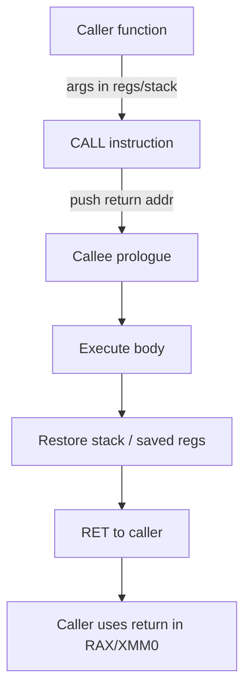
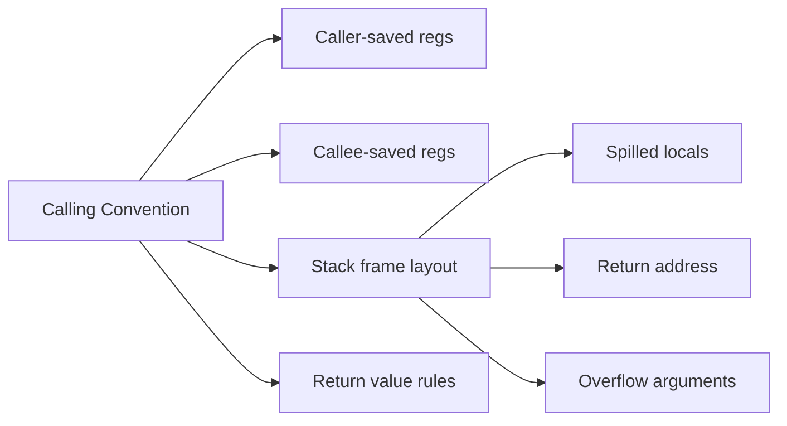

# Registers and Calling Conventions

## Overview

**Registers** are the CPU's fastest storage: a small, directly addressed set of words inside the core, readable and writable in a single cycle (when not stalled). General-purpose registers hold temporaries, arguments, and return values. Special registers (PC, stack pointer, flags, thread pointer) control execution and OS integration.

A **calling convention** (part of the ABI—Application Binary Interface) is the agreed contract for how functions pass arguments, preserve registers, allocate stack frames, and return values across function boundaries. Compilers, linkers, debuggers, and foreign-function interfaces (FFI) all depend on this contract. Violate it and you get subtle corruption, not friendly type errors.

Production relevance: every native crash stack trace, every Node native addon, every Python C extension, and every Rust→C FFI call crosses a calling convention boundary.

## Learning Objectives

- Name the roles of PC, SP, frame pointer, and callee-saved vs caller-saved registers on x86-64 System V
- Trace a function call from caller through prologue, body, epilogue, and return
- Explain why variadic functions (`printf`) and struct returns need special ABI rules
- Connect register pressure to spilling and performance
- Debug ABI mismatches in FFI (wrong types, wrong cleanup)

## Prerequisites

- [[01-Computer-Science/02-Machine-Model/CPU and Instruction Set Architecture|CPU and Instruction Set Architecture]]
- [[01-Computer-Science/02-Machine-Model/Fetch Decode Execute|Fetch Decode Execute]]
- [[01-Computer-Science/03-Memory-and-Addressing/Stack and Heap|Stack and Heap]] — stack grows toward lower addresses on most ISAs

## Difficulty

`intermediate`

## Estimated Time

- Reading: 75 minutes
- Exercises: 2–3 hours
- Mini project (stack frame visualizer): 3–4 hours

## History

Early machines exposed few registers (accumulator + index). Register windows (SPARC) tried to avoid memory traffic for calls. x86's legacy left few registers until x86-64 added eight more (R8–R15). ARM AAPCS and Microsoft x64 ABI diverged on which registers are volatile—breaking naive cross-platform FFI. Modern languages add **shadow space**, **red zones**, and **safepoints** atop the hardware ABI for GC and async stack walking.

## Problem It Solves

Without a calling convention, independently compiled `.o` files could not link: one function might pass the first argument on the stack while another expects it in `RDI`. The convention also defines:

- Which registers a callee must restore (callee-saved)
- Where return values live (RAX, XMM0, or hidden sret pointer)
- Stack alignment requirements (16-byte on x86-64 SysV)
- How exceptions unwind stacks (`.eh_frame`, DWARF)

## Internal Implementation

### x86-64 System V AMD64 ABI (Linux/macOS)

| Purpose | Registers |
| --- | --- |
| Integer args (1–6) | RDI, RSI, RDX, RCX, R8, R9 |
| FP/SIMD args (1–8) | XMM0–XMM7 |
| Return int/ptr | RAX (RDX for 128-bit) |
| Return FP | XMM0 |
| Callee-saved | RBX, RBP, R12–R15 |
| Caller-saved (volatile) | RAX, RCX, RDX, RSI, RDI, R8–R11, XMM0–XMM15 |
| Stack pointer | RSP |
| Frame pointer (optional) | RBP |

**Call sequence**:

1. Caller places register args; spills extras to stack (right-to-left for variadics)
2. `CALL` pushes return address; jumps to callee
3. Callee prologue: `push RBP; mov RBP, RSP; sub RSP, frame_size`
4. Callee body uses frame for locals; may spill when register pressure exceeds availability
5. Epilogue: restore RSP/RBP; `RET` pops return address into PC



### Register Pressure and Spilling

When a function needs more live values than available registers, the compiler **spills** to the stack—extra loads/stores on [[01-Computer-Science/02-Machine-Model/Cache Hierarchy and Locality|Cache Hierarchy and Locality]] hot paths. Optimizers use graph coloring and live-range analysis; inlining reduces call overhead and exposes more optimization scope.

## Mermaid Diagrams

### Structure



### Sequence / Lifecycle

```mermaid
sequenceDiagram
    participant Main
    participant foo
    participant bar
    Main->>foo: mov args → RDI, RSI; call foo
    Note over foo: push RBP; allocate frame
    foo->>bar: call bar (nested)
    bar-->>foo: ret (result in RAX)
    Note over foo: epilogue; ret
    foo-->>Main: ret (result in RAX)
```

## Examples

### Minimal Example — C and Disassembly Sketch

```c
// add.c
int add(int a, int b) {
    return a + b;
}
```

Typical x86-64 SysV when not inlined:

```text
add:
    lea    eax, [rdi + rsi]   ; a in RDI, b in RSI → return in EAX
    ret
```

When inlined into caller, no convention overhead—just register operations.

### Production-Shaped Example — Node.js N-API FFI

TypeScript/JavaScript calling native code must match ABI exactly:

```typescript
// Wrong: passing float where native expects double → wrong XMM register width
import { loadNative } from "./loader";

const lib = loadNative("math.so");
// Native: double hypot(double a, double b) — SysV uses XMM0, XMM1
export function hypot(a: number, b: number): number {
  return lib.hypot(a, b); // N-API marshals to C doubles correctly
}
```

Python `ctypes` pitfalls mirror this:

```python
import ctypes

lib = ctypes.CDLL("libmath.so")
lib.add.argtypes = (ctypes.c_int, ctypes.c_int)  # MUST set — default wrong
lib.add.restype = ctypes.c_int
assert lib.add(2, 3) == 5
```

Missing `argtypes`/`restype` causes stack corruption—ABI violation, not Python exception.

### Stack Frame Layout (Conceptual)

```text
High addresses
    ... caller's frame ...
    return address        ← pushed by CALL
    saved RBP (optional)  ← callee prologue
    local variables
    spilled temps
    outgoing arg space    ← "red zone" / shadow on Windows x64
Low addresses  ← RSP
```

## Trade-offs

| Dimension | Upside | Downside | When it matters |
| --- | --- | --- | --- |
| **Register args** | Fast calls, fewer memory ops | Limited arity before stack spill | Hot microservices FFI, numeric kernels |
| **Callee-saved regs** | Stable across calls | Callee pays save/restore cost | Deep call chains |
| **Frame pointer (RBP)** | Easier stack traces | Extra instruction in prologue | Profiling, `-fno-omit-frame-pointer` in prod debugging |
| **Omit frame pointer** | Smaller/faster code | Harder unwinding | Default optimized builds |

### When to Use

- Writing C/Rust/Go native extensions for [[02-JavaScript/README|JavaScript]] or [[03-Python/README|Python]]
- Interpreting crash dumps and `perf` stack samples on [[10-Linux/08-Observability-Tracing-and-Profiling/perf CPU Profiles and Flame Graph Intuition|perf CPU Profiles and Flame Graph Intuition]]
- Choosing compiler flags for production observability vs peak performance

### When Not to Use

- Do not invent custom calling conventions across module boundaries
- Do not assume Windows x64 matches SysV (different register order and shadow space)

## Exercises

1. Write a C function with six integer arguments. Confirm in godbolt which land in registers vs stack.
2. Implement a minimal assembly function that adds two numbers and call it from C. Verify return value.
3. Deliberately mismatch `ctypes` signatures in Python. Observe crash vs wrong result. Fix with correct ABI types.
4. Compare stack usage of a recursive vs iterative factorial at `-O0` and `-O2`.

## Mini Project

Build a **stack frame visualizer**: parse simple assembly listings or DWARF-lite metadata and render growing/shrinking stack diagrams during simulated calls. Link to [[01-Computer-Science/03-Memory-and-Addressing/Stack and Heap|Stack and Heap]].

## Portfolio Project

Create an **FFI safety checker** for a small TypeScript→Rust binding generator: verify argument counts, types, and calling convention per target triple. Document failure cases found in real open-source projects.

## Interview Questions

1. Which registers must a callee preserve on x86-64 SysV? What happens if you clobber RBX without saving?
2. Where is the return address stored after a `CALL`? Who cleans up stack arguments in SysV vs stdcall?
3. How are structs larger than 16 bytes returned in C on x86-64?
4. Why does the stack need 16-byte alignment before `CALL` on macOS?
5. Explain `extern "C"` in C++ and when name mangling breaks `dlsym`.

### Stretch / Staff-Level

1. How do Go's split stacks and goroutine stacks interact with traditional frame-pointer unwinding?
2. Design a calling convention for a GPU kernel launch—what differs from CPU ABI?

## Common Mistakes

- Mixing Windows and SysV ABIs in cross-platform native libs
- Forgetting struct padding affects pass-by-value size
- Using `float` FFI types for C `double` parameters
- Assuming leaf functions need frame pointers (they may not have one when optimized)

## Best Practices

- Always declare FFI signatures explicitly (`argtypes`, `#[repr(C)]`, N-API typed APIs)
- Enable frame pointers selectively in production when debugging tail latency
- Read platform ABI docs before shipping native binaries
- Use sanitizers (ASan) to catch stack buffer overflows near frame boundaries

## Summary

Registers are the CPU's working memory; calling conventions are the social contract that lets separately compiled code cooperate. Every function call is a carefully choreographed transfer of control: arguments in agreed registers or stack slots, return address pushed, callee frame established, result handed back in RAX or XMM0. Production engineers feel this layer during FFI bugs, corrupted stacks, and unreadable crash traces—master it and native boundaries become debuggable.

## Further Reading

- System V AMD64 ABI document
- Microsoft x64 calling convention documentation
- Agner Fog's calling conventions guide
- Itanium C++ ABI (exception handling, mangling)

## Related Notes

- [[01-Computer-Science/02-Machine-Model/CPU and Instruction Set Architecture|CPU and Instruction Set Architecture]]
- [[01-Computer-Science/02-Machine-Model/Fetch Decode Execute|Fetch Decode Execute]]
- [[01-Computer-Science/03-Memory-and-Addressing/Stack and Heap|Stack and Heap]]
- [[01-Computer-Science/03-Memory-and-Addressing/Address Spaces|Address Spaces]]
- [[01-Computer-Science/04-Processes-and-Execution/Context Switching|Context Switching]]
- [[01-Computer-Science/08-Languages-and-Computation/Compilers Interpreters and Virtual Machines|Compilers Interpreters and Virtual Machines]]
- [[02-JavaScript/README|JavaScript]] — N-API, WebAssembly call conventions
- [[03-Python/README|Python]] — ctypes, Cython, CPython C-API
- [[10-Linux/08-Observability-Tracing-and-Profiling/perf CPU Profiles and Flame Graph Intuition|perf CPU Profiles and Flame Graph Intuition]] — ELF, `backtrace`, core dumps

## Progress Checklist

- [ ] Explained from first principles
- [ ] Drew at least one Mermaid diagram
- [ ] Implemented a minimal version
- [ ] Documented trade-offs and non-goals
- [ ] Completed exercises
- [ ] Practiced interview questions aloud
- [ ] Linked prerequisites and dependents
