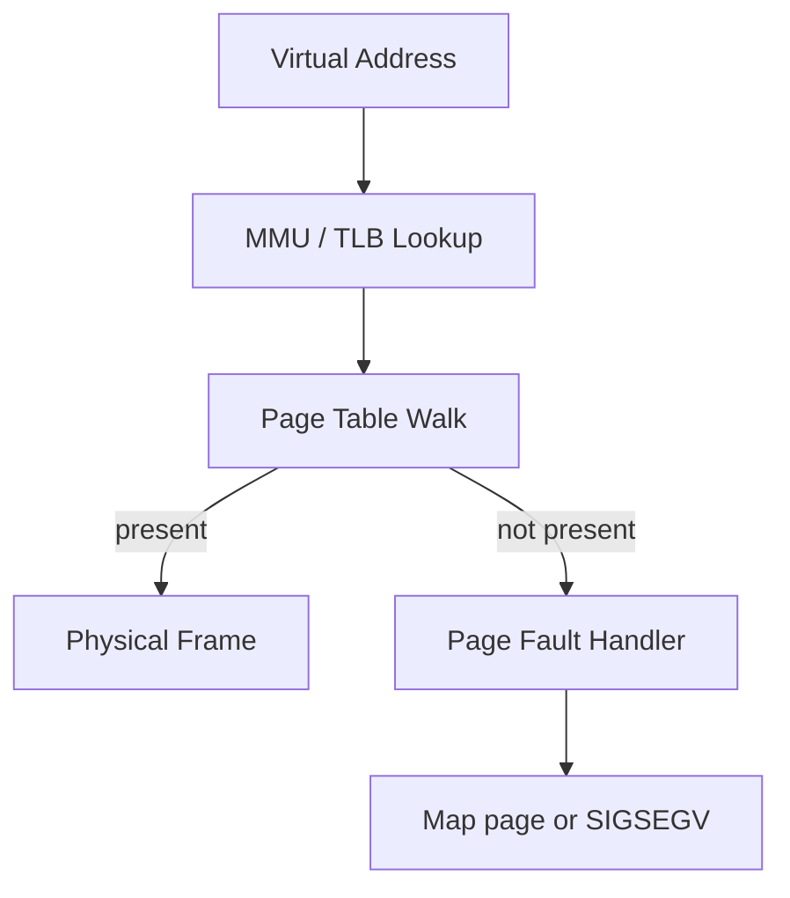
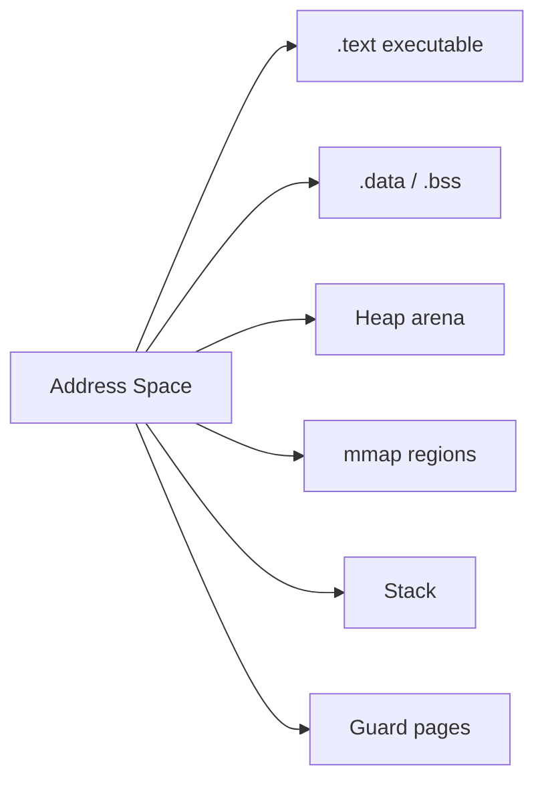
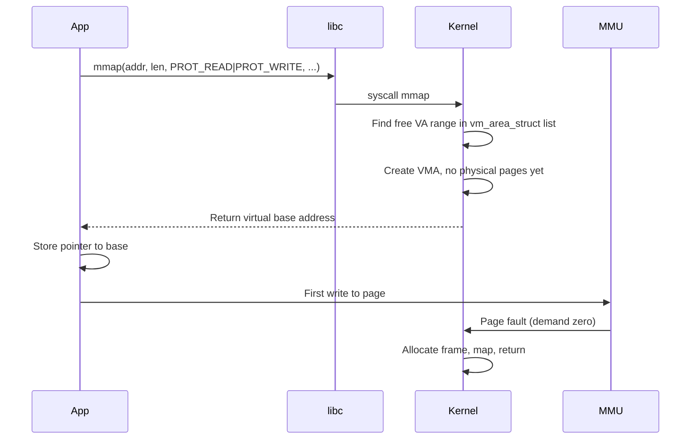

# Address Spaces

## Overview

An **address space** is the set of addresses a program is allowed to generate and interpret. In modern systems, processes use **virtual addresses**—each process sees a contiguous (or nearly contiguous) range from 0 to a large maximum (e.g., 2⁴⁷ bytes on 64-bit Linux user space)—while the OS and MMU map those addresses to **physical frames** in RAM or swap, or mark them unmapped to catch bugs.

The address space is the container for code (text), read-only data, initialized/uninitialized globals, heap, mapped files, and stack. Two processes can use the same virtual address (e.g., `0x00400000`) for different physical content without seeing each other's memory—isolation is foundational to multitasking and security.

## Learning Objectives

- Diagram a typical 64-bit Linux process memory layout (high to low addresses)
- Distinguish virtual, physical, and device addresses
- Explain why ASLR randomizes base addresses
- Relate ELF segments to address space regions
- Debug segfaults using maps (`/proc/pid/maps`) and address interpretation

## Prerequisites

- [[01-Computer-Science/01-Information-and-Representation/Integer Representation|Integer Representation]]
- [[01-Computer-Science/01-Information-and-Representation/Endianness and Binary Layout|Endianness and Binary Layout]]
- [[01-Computer-Science/02-Machine-Model/CPU and Instruction Set Architecture|CPU and Instruction Set Architecture]]

## Difficulty

`intermediate`

## Estimated Time

- Reading: 75 minutes
- Exercises: 2 hours
- Mini project (memory map visualizer): 3–4 hours

## History

Early machines used physical addressing—programs owned all RAM. Batch systems partitioned memory manually. Virtual memory (1960s, Atlas, Multics) introduced indirection via page tables. 32-bit eras hit 4 GiB limits; PAE and then 64-bit expanded spaces. ASLR (2000s) mitigated exploit reliability by randomizing bases. Language runtimes (JVM, V8) add **compressed pointers** and **sandbox cages** within the process address space.

## Problem It Solves

Address spaces solve:

- **Isolation**: Process A cannot read Process B's secrets
- **Simplification**: Each program can assume a large linear address range without managing physical placement
- **Sharing**: Same physical page mapped read-only into many processes (shared libraries)
- **Overcommit**: Virtual size can exceed RAM until touched (demand paging)

Without separate spaces, one wild pointer in Node native code could corrupt the Python process on the same machine.

## Internal Implementation

### Typical Linux x86-64 Layout (Conceptual)

```text
High 0x7FFFFFFFFFFF (user max canonical)
    ┌─────────────────────┐
    │ Stack               │ grows ↓
    ├─────────────────────┤
    │ mmap region         │ shared libs, anonymous mappings, JIT code
    ├─────────────────────┤
    │ Heap                │ grows ↑ (brk/mmap)
    ├─────────────────────┤
    │ BSS (uninit globals)│
    │ Data (init globals) │
    │ Read-only (rodata)  │
    │ Text (code)         │
Low 0x400000 (PIE: randomized)
    ... unmapped hole ...
    Kernel space (not user-accessible)
```

Each region has page permissions: **R**ead, **W**rite, **X**ecute. W^X (no write+execute on same page) hardens JIT and shellcode—relevant for [[18-Security/README|Security]].



See [[01-Computer-Science/03-Memory-and-Addressing/Virtual Memory|Virtual Memory]] for page table depth.

## Mermaid Diagrams

### Structure



### Sequence / Lifecycle — `mmap` Extends Space



## Examples

### Minimal Example — Inspecting Maps on Linux

```bash
cat /proc/self/maps
# sample lines:
# 00400000-00401000 r-xp ... /bin/cat        ← text
# 00600000-00601000 rw-p ... /bin/cat        ← data
# 7f...-... rw-p ... [heap]
# 7f...-... r-xp ... libc.so.6
```

TypeScript/Python programs show similar maps via the same `/proc` interface when run on Linux.

### Minimal Example — Pointer as Virtual Address

```typescript
// In JS, you don't see numeric addresses—but native addons do
// Conceptual C layout the runtime sits on:
// char *p = malloc(16);  → pointer is virtual address in heap VMA

interface MemoryRegion {
  name: string;
  start: bigint;
  end: bigint;
  permissions: string;
}

function parseMapsLine(line: string): MemoryRegion | null {
  const m = line.match(/^([0-9a-f]+)-([0-9a-f]+)\s+(\S+)/);
  if (!m) return null;
  return {
    name: line.split(/\s+/).pop() ?? "",
    start: BigInt("0x" + m[1]),
    end: BigInt("0x" + m[2]),
    permissions: m[3],
  };
}
```

```python
# Python id() is NOT a memory address — objects move with GC
# For real addresses, use ctypes or inspect C extensions
import ctypes
buf = (ctypes.c_char * 64)()
addr = ctypes.addressof(buf)
print(hex(addr))  # virtual address in process space
```

### Production-Shaped Example — PIE and ASLR

Binaries compiled with **PIE** (Position Independent Executable) load at random bases. Production builds enable PIE + ASLR + NX bit. Debugging requires:

```bash
readelf -h ./service | grep Type    # DYN = PIE
cat /proc/$PID/maps | grep service  # note randomized base
gdb -p $PID                         # symbols + ASLR need proper load
```

Container environments inherit host ASLR; some hardened profiles disable it for legacy apps—document security trade-off.

## Trade-offs

| Dimension | Upside | Downside | When it matters |
| --- | --- | --- | --- |
| **Large 64-bit space** | mmap-friendly, sparse heaps | Pointer size, TLB pressure | Big data in-process |
| **ASLR** | Exploit mitigation | Harder repro/debug | Security vs support |
| **Many mmap regions** | Flexible (JIT, shm) | VMA list overhead | Language runtimes |
| **Overcommit** | Higher utilization | OOM killer under stress | Kubernetes limits |

### When to Use

- Debugging segfaults and heap corruption (maps + core dumps)
- Sizing containers (`memory limit` vs virtual size)
- Designing shared-memory IPC between processes on same host

### When Not to Use

- Do not treat JavaScript object references as OS addresses
- Do not hardcode addresses—PIE/ASLR break assumptions

## Exercises

1. Draw the address space of a running Python interpreter with labels for text, heap, stack, and `libpython`.
2. Use `mmap` from C or Python `mmap` module to create an anonymous mapping. Verify permissions in `/proc/self/maps`.
3. Explain why the stack and heap grow toward each other but rarely collide on 64-bit.
4. Compare virtual memory size (`VIRT`) vs resident (`RES`) in `top` for a Node service under load.

## Mini Project

Parse `/proc/pid/maps` into a visual timeline (ASCII or web) colored by permissions. Highlight executable writable regions (security smell).

## Portfolio Project

Write an **incident postmortem template section** for memory corruption: maps snapshot, faulting IP, region permissions, ASLR state. Cross-link [[01-Computer-Science/03-Memory-and-Addressing/Memory Safety Fundamentals|Memory Safety Fundamentals]].

## Interview Questions

1. What is the difference between virtual and physical addresses?
2. Name major regions in a Linux process address space and their typical permissions.
3. What is ASLR and what problem does it solve?
4. Why can two processes both use virtual address 0x1000 for different data?
5. What happens when code tries to jump to an address in an unmapped region?

### Stretch / Staff-Level

1. How does a 48-bit canonical address space work on x86-64? What is a non-canonical address fault?
2. Compare process address space isolation to WebAssembly linear memory within one process.

## Common Mistakes

- Using `id()` in Python as if it were a C pointer
- Forgetting that threads share one address space
- Ignoring that `malloc` returns virtual addresses that may not be backed until write
- Confusing file size with mapped VMA size

## Best Practices

- Capture `/proc/pid/maps` in crash reports
- Build with PIE and hardening flags for production binaries
- Use `mmap` for large read-only config blobs instead of heap copies
- Set ulimits and cgroup memory limits aware of virtual vs resident behavior

## Summary

An address space is the program's view of memory: regions with permissions mapped through the MMU to physical storage or nowhere at all. Isolation between processes, demand paging, and shared libraries all live here. Production debugging—segfaults, OOM, leak tools—requires fluency in virtual layout and maps, not just source-level variables.

## Further Reading

- Linux `man 5 proc` — `/proc/pid/maps`
- ELF specification — program headers and segments
- *Operating Systems: Three Easy Pieces* — address spaces chapter

## Related Notes

- [[01-Computer-Science/03-Memory-and-Addressing/Virtual Memory|Virtual Memory]]
- [[01-Computer-Science/03-Memory-and-Addressing/Stack and Heap|Stack and Heap]]
- [[01-Computer-Science/03-Memory-and-Addressing/Pointers References and Aliasing|Pointers References and Aliasing]]
- [[01-Computer-Science/02-Machine-Model/Hardware Software Interface|Hardware Software Interface]]
- [[01-Computer-Science/04-Processes-and-Execution/Processes|Processes]]
- [[10-Linux/README|Linux]]
- [[18-Security/README|Security]]
- [[02-JavaScript/README|JavaScript]] — V8 heap cages
- [[03-Python/README|Python]] — CPython object layout

## Progress Checklist

- [ ] Explained from first principles
- [ ] Drew at least one Mermaid diagram
- [ ] Implemented a minimal version
- [ ] Documented trade-offs and non-goals
- [ ] Completed exercises
- [ ] Practiced interview questions aloud
- [ ] Linked prerequisites and dependents
