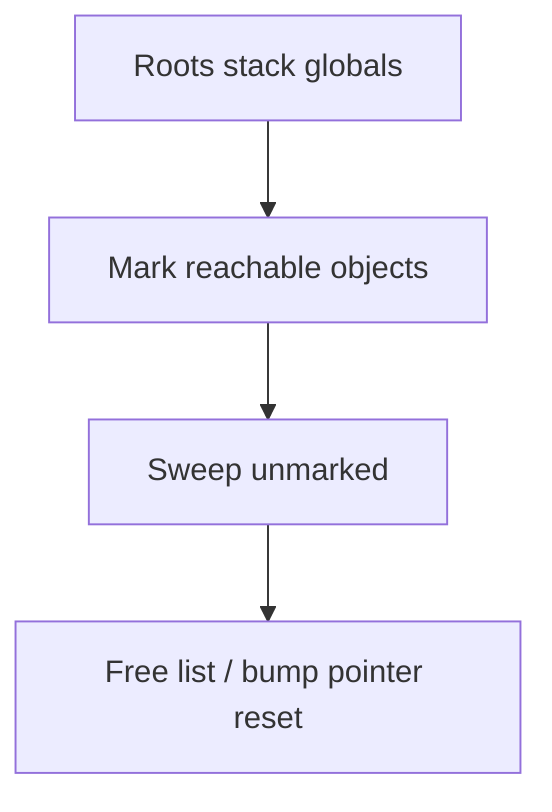
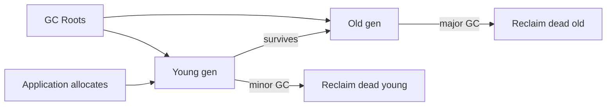
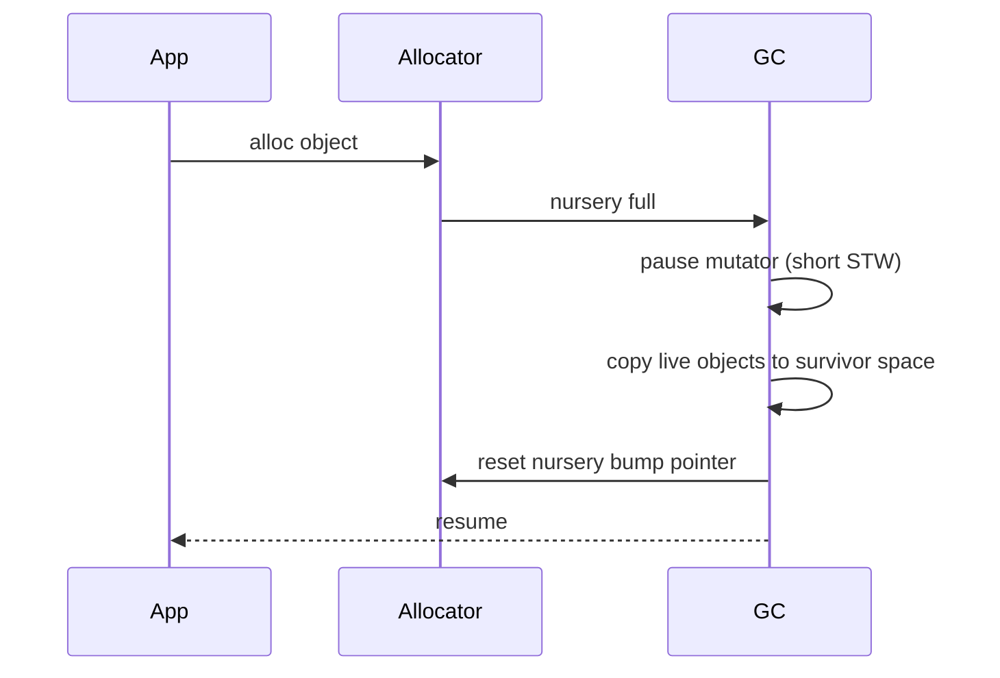

# Garbage Collection Models

## Overview

**Garbage collection (GC)** automatically reclaims heap memory occupied by **unreachable** objects—those not transitively reachable from **roots** (stack frames, globals, registers, VM internal tables). The programmer allocates; the collector determines liveness. Contrasts with manual `free` (C) and compile-time ownership (Rust).

GC models differ in **when** collection runs (allocation pressure, timer, idle), **how** reachability is determined (tracing, reference counting, hybrid), and **how** memory is compacted (copying, mark-sweep, generational promotion). Production runtimes—V8 (Orinoco), CPython (refcount + cycle GC), JVM (G1, ZGC), Go (tri-color concurrent)—tune latency vs throughput for service SLOs.

## Learning Objectives

- Define roots, reachability, and floating garbage
- Compare tracing, reference counting, and generational hypotheses
- Explain stop-the-world vs concurrent/incremental collection
- Diagnose GC pauses and allocation churn in Node/Python services
- Choose GC-friendly data structures and API patterns

## Prerequisites

- [[01-Computer-Science/03-Memory-and-Addressing/Stack and Heap|Stack and Heap]]
- [[01-Computer-Science/03-Memory-and-Addressing/Pointers References and Aliasing|Pointers References and Aliasing]]
- [[01-Computer-Science/03-Memory-and-Addressing/Memory Safety Fundamentals|Memory Safety Fundamentals]]

## Difficulty

`advanced`

## Estimated Time

- Reading: 2 hours
- Exercises: 3–4 hours
- Mini project (toy tracing GC): 6–8 hours

## History

Lisp GC (McCarthy, 1959) introduced automatic reclamation. Reference counting simple but fails cycles. Tracing mark-sweep (1960s+) became dominant. Generational GC (Lieberman & Hewitt, 1983) exploited "most objects die young." Production milestones: JVM ergonomics (2000s), V8 Orinoco concurrent marking (2010s), Go low-latency GC, Java ZGC/Shenandoah sub-ms goals on large heaps.

## Problem It Solves

Manual memory management errors (leak, UAF, double-free) dominate bug classes. GC trades:

- **Developer productivity** (no explicit free in JS/Python/Java)
- **Safety** (no UAF for collected objects)
- **Runtime cost** (CPU for marking, pause latency, memory overhead)

For application servers handling JSON and short-lived request objects, generational GC often matches allocation patterns well.

## Internal Implementation

### Tracing (Mark-Sweep / Mark-Compact)

1. **Mark** phase: from roots, traverse object graph, set mark bit
2. **Sweep** phase: unmarked objects reclaimed
3. Optional **compact** to reduce fragmentation



### Reference Counting

Each object tracks inbound reference count; on zero, reclaim immediately and decrement successors.

| Pros | Cons |
| --- | --- |
| Low latency reclamation | Cycles leak without cycle detector |
| Simple semantics | Atomic refcount cost in multithreaded |

CPython uses refcount **plus** generational cycle GC for containers.

### Generational GC

**Weak generational hypothesis**: most objects die young.

- **Young generation** (nursery): frequent minor collections copying survivors
- **Old generation**: less frequent major collections
- **Promotion** when object survives N scavenge cycles

V8: New Space (Scavenger) → Old Space (Mark-Compact / concurrent marking)

### Concurrent / Incremental / Parallel

| Strategy | Behavior |
| --- | --- |
| **Stop-the-world** | Pause mutator entirely — simple, visible pauses |
| **Incremental** | Slice mark work between mutator steps — write barriers track changes |
| **Concurrent** | GC threads mark while app runs — tri-color invariant + barriers |
| **Parallel** | Multiple GC workers during pause — reduces pause wall time |

Write **barrier**: on pointer store `obj.field = ref`, record for GC (card table, remembered set).

## Mermaid Diagrams

### Structure



### Sequence / Lifecycle — Minor Collection



## Examples

### Minimal Example — Toy Tracing GC (TypeScript Sketch)

```typescript
type GcObject = { marked: boolean; refs: GcObject[] };

function mark(obj: GcObject, visited: Set<GcObject>) {
  if (visited.has(obj)) return;
  visited.add(obj);
  obj.marked = true;
  for (const r of obj.refs) mark(r, visited);
}

function collect(all: GcObject[], roots: GcObject[]): GcObject[] {
  for (const o of all) o.marked = false;
  const visited = new Set<GcObject>();
  for (const r of roots) mark(r, visited);
  const live = all.filter((o) => o.marked);
  return live;
}
```

### Python — Refcount Visible

```python
import sys

a = []
b = a
print(sys.getrefcount(a))  # note: temporary ref inflates count slightly
del b
# refcount drops; if zero, immediate dealloc (no cycles)
```

Cycle example:

```python
import gc

class Node:
    def __init__(self):
        self.peer = None

a, b = Node(), Node()
a.peer, b.peer = b, a
del a, b
gc.collect()  # cycle collector needed
```

### Production-Shaped — Node.js GC Tuning

```bash
node --max-old-space-size=4096 --trace-gc app.js
# clinic heapprofiler / --inspect heap snapshot for retained objects
```

Symptoms:

- **Growing heap + full GC loops** → memory leak (logical retention, not GC bug)
- **Long Mark-Compact** → large old space, fragmented tenured objects
- **Allocation rate spikes** → per-request object churn (JSON parse trees)

Mitigations: object pooling (careful), streaming parsers, struct-like TypedArrays, worker isolation.

Link [[01-Computer-Science/02-Machine-Model/Measuring Computer Performance|Measuring Computer Performance]] for pause correlation to p99.

## Trade-offs

| Model | Throughput | Pause latency | Memory overhead |
| --- | --- | --- | --- |
| **Mark-sweep** | Good | STW pauses | Free list fragmentation |
| **Copying gen** | Excellent for short-lived | Short minor pauses | Needs survivor space |
| **Refcount** | Predictable incremental | Low per dec | Cycles, atomic ops |
| **Concurrent mark** | High | Reduced major pause | Barrier + complexity |
| **Manual/Rust** | Maximum when correct | No GC pause | Developer burden |

### When to Use

- Application languages (JS, Python, Java, Go) — default model
- Long-running services: monitor GC pause metrics
- Choose JVM GC algorithm by heap size and latency SLO (G1 vs ZGC)

### When Not to Use

- Hard real-time with strict sub-ms jitter may reject tracing GC
- Embedded tiny RAM may prefer manual/arena allocation
- Do not fight GC with explicit `free` patterns in managed languages

## Exercises

1. Implement mark-sweep on graph of `{ id, refs[] }` in Python; verify unreachable cycles handled (tracing) vs refcount alone.
2. Capture V8 heap snapshot before/after request; identify retained closure keeping large buffer.
3. Run Java with `-XX:+PrintGC` or Go with `GODEBUG=gctrace=1`; interpret pause lines.
4. Design object pool for HTTP handlers; measure GC improvement and complexity cost.

## Mini Project

**Baby GC**: bump allocator nursery + copying semi-space collector + root list from stack simulation. Visualize before/after memory.

## Portfolio Project

**GC case study** on production Node or Python service: allocation profile, pause histogram, fix one retention leak, document heap limit sizing for Kubernetes.

## Interview Questions

1. How does tracing GC determine liveness?
2. Weak generational hypothesis?
3. Reference counting vs tracing — trade-offs?
4. What causes stop-the-world pause?
5. How would you debug a "memory leak" in JavaScript?

### Stretch / Staff-Level

1. Explain tri-color concurrent marking invariant and write barrier role.
2. Compare Go GC pacing algorithm to JVM G1 IHOP tuning.

## Common Mistakes

- Calling `gc.collect()` in Python expecting to fix leaks (masks retention bugs)
- Holding unbounded caches in global maps (old gen never collects)
- Creating excessive short-lived objects in hot loops (nursery pressure)
- Assuming `--max-old-space-size` fixes retention leaks

## Best Practices

- Stream large payloads; avoid materializing entire dataset as object graph
- Use heap profilers before tuning flags blindly
- Set Kubernetes limits above live set + GC headroom
- WeakMap for caches tied to object lifetime (JS)

## Summary

Garbage collectors reclaim unreachable heap objects by tracing or counting references, often split across generations to match allocation lifetimes. The cost appears as CPU overhead and pause latency—not as explicit free calls. Production fluency means reading GC logs, heap snapshots, and allocation patterns, and designing APIs that do not retain graphs longer than needed. GC does not fix logical leaks; it only recycles what is unreachable.

## Further Reading

- Jones & Lins, *Garbage Collection: Algorithms for Automatic Dynamic Memory Management*
- V8 Orinoco design docs
- Python gc module documentation
- Java GC tuning guide (Oracle/OpenJDK)

## Related Notes

- [[01-Computer-Science/03-Memory-and-Addressing/Stack and Heap|Stack and Heap]]
- [[01-Computer-Science/03-Memory-and-Addressing/Pointers References and Aliasing|Pointers References and Aliasing]]
- [[01-Computer-Science/03-Memory-and-Addressing/Memory Safety Fundamentals|Memory Safety Fundamentals]]
- [[01-Computer-Science/03-Memory-and-Addressing/Memory Hierarchy Trade-offs|Memory Hierarchy Trade-offs]]
- [[01-Computer-Science/08-Languages-and-Computation/Compilers Interpreters and Virtual Machines|Compilers Interpreters and Virtual Machines]]
- [[01-Computer-Science/05-Concurrency-Fundamentals/Concurrency vs Parallelism|Concurrency vs Parallelism]]
- [[02-JavaScript/README|JavaScript]] — V8 GC, heap snapshots
- [[03-Python/README|Python]] — refcount, gc module
- [[06-NodeJS/README|Node.js]] — event loop + GC interaction

## Progress Checklist

- [ ] Explained from first principles
- [ ] Drew at least one Mermaid diagram
- [ ] Implemented a minimal version
- [ ] Documented trade-offs and non-goals
- [ ] Completed exercises
- [ ] Practiced interview questions aloud
- [ ] Linked prerequisites and dependents
