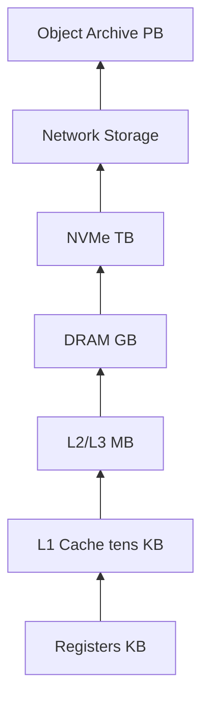
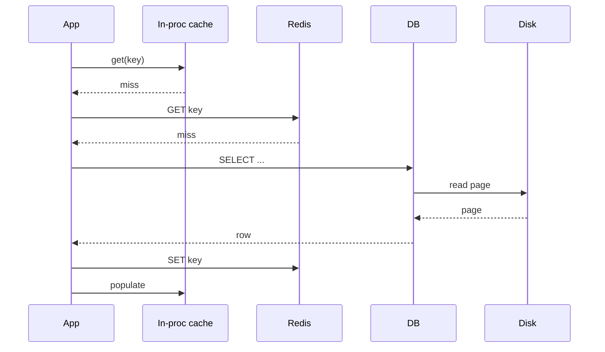

# Memory Hierarchy Trade-offs

## Overview

**Memory hierarchy** organizes storage by speed, size, and cost—from CPU registers through caches, DRAM, NVMe, network storage, to tape/archive. Each level is larger and slower than the one above. Programs implicitly depend on this pyramid: hot data should live near the CPU; cold data can sit on disk or object storage.

**Trade-offs** appear at every boundary: register vs spill, cache vs DRAM bandwidth, RAM vs SSD latency (~100 ns vs ~100 µs), local disk vs network block store. Production architecture—caching layers, CDN, database buffer pools, write-through vs write-back—is largely hierarchy management with explicit policies and measured SLOs.

This note unifies CPU cache concepts with OS VM and application-level caches into one decision framework.

## Learning Objectives

- Order typical latencies and bandwidths from registers to cloud object storage
- Apply inclusion vs exclusion principles across cache levels
- Choose placement of data among RAM, SSD, and remote store given access pattern
- Quantify cost of missing each hierarchy level in request path
- Design tiered storage policies with eviction and durability guarantees

## Prerequisites

- [[01-Computer-Science/02-Machine-Model/Cache Hierarchy and Locality|Cache Hierarchy and Locality]]
- [[01-Computer-Science/03-Memory-and-Addressing/Virtual Memory|Virtual Memory]]
- [[01-Computer-Science/02-Machine-Model/Measuring Computer Performance|Measuring Computer Performance]]

## Difficulty

`intermediate`

## Estimated Time

- Reading: 90 minutes
- Exercises: 3 hours
- Mini project (hierarchy latency lab): 4 hours

## History

The memory hierarchy concept formalized in 1960s computer architecture. Register files stayed tiny; DRAM density followed Moore's Law. SSDs (2000s) inserted a persistent flash tier between RAM and HDD. NUMA split RAM latency by socket. Cloud disaggregated storage (EBS, S3) added network hops—application caches (Redis, Memcached) became mandatory hierarchy levels for web scale.

## Problem It Solves

No single technology satisfies all of:

- Nanosecond access (registers)
- Gigabyte capacity (RAM)
- Persistence across reboot (disk)
- Cheap archival (object storage)

Hierarchy hides slower levels behind faster buffers when locality holds. When locality fails—full table scan bigger than RAM—performance cliffs appear unless software explicitly streams or partitions.

## Internal Implementation

### Latency Orders of Magnitude (2020s Server Sketch)

| Level | Typical latency | Notes |
| --- | --- | --- |
| L1 cache | ~1 ns | Per core |
| L2 / L3 | ~4–40 ns | Shared LLC |
| DRAM | ~100 ns | NUMA remote +50–100 ns |
| NVMe SSD | ~10–100 µs | Queue depth matters |
| HDD | ~5–10 ms | Seek dominated |
| Cross-AZ network | ~1–2 ms | Plus service time |
| S3 GET | ~50–200 ms | Region dependent |

Bandwidth often inversely correlates with latency at each tier—SSD sequential GB/s vs random IOPS limits.



### Inclusion and Coherency

- **Inclusive L3**: L3 contains copies of L1/L2 lines—simpler snoop, larger LLC waste
- **Exclusive**: lower evict may fill upper—better capacity use, complex
- **OS page cache**: file data in RAM; duplicates DB buffer pool unless coordinated—double caching waste

### Virtual Memory as Hierarchy Level

RAM backs VM pages; swap/disk extends apparent memory at latency cost. See [[01-Computer-Science/03-Memory-and-Addressing/Virtual Memory|Virtual Memory]].

Application caches (in-process, Redis) add **software hierarchy levels** with explicit TTL and eviction (LRU, LFU, TTL random).

## Mermaid Diagrams

### Structure


### Sequence / Lifecycle — Cache Miss Cascade



## Examples

### Minimal Example — Tiered Read Path

TypeScript service pattern:

```typescript
async function getUser(id: string): Promise<User> {
  const local = localCache.get(id);
  if (local) return local;

  const remote = await redis.get(`user:${id}`);
  if (remote) {
    const user = JSON.parse(remote) as User;
    localCache.set(id, user, { ttlMs: 5_000 });
    return user;
  }

  const user = await db.queryUser(id); // may hit DB cache + OS page cache + disk
  await redis.set(`user:${id}`, JSON.stringify(user), { ex: 300 });
  localCache.set(id, user, { ttlMs: 5_000 });
  return user;
}
```

Each miss descends the hierarchy—measure which tier dominates p99.

Python with similar layering using `functools.lru_cache` + Redis + ORM.

### Production-Shaped — Double Caching Pitfall

PostgreSQL `shared_buffers` + OS page cache both hold table pages. Direct I/O (`O_DIRECT`) bypasses OS cache for DB-managed buffers—trade-off: DB must tune buffer pool correctly or performance collapses. Link [[08-Databases/README|Databases]].

### NUMA Awareness

On dual-socket servers, allocating on wrong node causes remote DRAM access. Native runtimes expose `numactl --membind`; JVM has `-XX:+UseNUMA`. Node/Python mostly opaque—pin pods to nodes and size per socket.

## Trade-offs

| Decision | Upside | Downside | When it matters |
| --- | --- | --- | --- |
| **More RAM** | Fewer disk faults, larger caches | Cost, power | In-memory workloads |
| **Redis layer** | Sub-ms shared cache | Network hop, invalidation complexity | Multi-instance APIs |
| **Write-through cache** | Consistent reads | Write latency | Financial balances |
| **Write-back cache** | Fast writes | Durability window on crash | Analytics buffers |
| **O_DIRECT** | Predictable DB IO | No OS cache safety net | Large DB instances |
| **Compression in cache** | More effective capacity | CPU cost | Large JSON blobs |

### When to Use

- Designing read-heavy APIs with skewed key access
- Sizing instances (RAM for page cache vs application heap)
- Choosing storage class (gp3 vs io2 vs S3) by access pattern

### When Not to Use

- Do not add cache tier without measuring miss path—may add latency to hits
- Do not cache without eviction policy and stampede protection

## Exercises

1. Estimate end-to-end latency if L1 hit 90%, Redis hit 9%, DB miss 1%. Assign latencies and compute average vs p99 scenario.
2. Run `dd` sequential vs random I/O on NVMe; compare to RAM `memcpy` benchmark order-of-magnitude.
3. Draw hierarchy for your current project—label TTLs and invalidation paths.
4. Explain when **memory disaggregation** (CXL) might blur RAM/SSD boundary.

## Mini Project

**Latency ladder benchmark**: measure register spill (microbench), array scan (cache), `malloc` touch (page fault), file read (cached vs cold), Redis round-trip. Plot log-scale chart.

## Portfolio Project

Design **cache policy document** for a service: what lives at each tier, TTL, invalidation on write, stampede mitigation (singleflight), durability guarantees. Load-test and validate p99.

## Interview Questions

1. List memory hierarchy levels with approximate latencies.
2. What is a cache miss cascade in a web stack?
3. Inclusion vs exclusive caches?
4. When is double caching harmful?
5. How does NUMA affect hierarchy on servers?

### Stretch / Staff-Level

1. Design tiered storage for 100 TB logs with query SLA—hot/warm/cold paths.
2. Compare erasure-coded object storage vs replicated block storage in hierarchy terms.

## Common Mistakes

- Caching unbounded keys (memory blowup at app tier)
- Same TTL at every layer (stale reads or useless L1)
- Ignoring cold start after deploy (empty caches → DB shock)
- Optimizing L1 CPU cache while Redis RTT dominates p99

## Best Practices

- Measure each tier's hit rate independently
- Use consistent hashing or key namespaces for distributed caches
- Protect origin with circuit breakers on cache miss storms
- Align DB buffer pool + OS memory guidance (document `shared_buffers` vs RAM)

## Summary

Memory hierarchy is the organizing principle of computer performance—from registers to S3. Each level trades capacity for speed; misses at deeper levels dominate tail latency. Production systems stack software caches atop OS VM and hardware caches; successful designs measure hit rates, enforce eviction, and align durability with business requirements rather than treating RAM and disk as interchangeable.

## Further Reading

- Hennessy & Patterson — memory hierarchy
- Ulrich Drepper memory document
- AWS storage services latency whitepapers
- Redis documentation — eviction policies

## Related Notes

- [[01-Computer-Science/02-Machine-Model/Cache Hierarchy and Locality|Cache Hierarchy and Locality]]
- [[01-Computer-Science/03-Memory-and-Addressing/Virtual Memory|Virtual Memory]]
- [[01-Computer-Science/02-Machine-Model/Measuring Computer Performance|Measuring Computer Performance]]
- [[01-Computer-Science/06-IO-and-Persistence/Buffers Streams and Zero Copy|Buffers Streams and Zero Copy]]
- [[08-Databases/README|Databases]]
- [[09-System-Design/README|System Design]]
- [[07-Backend/README|Backend]]

## Progress Checklist

- [ ] Explained from first principles
- [ ] Drew at least one Mermaid diagram
- [ ] Implemented a minimal version
- [ ] Documented trade-offs and non-goals
- [ ] Completed exercises
- [ ] Practiced interview questions aloud
- [ ] Linked prerequisites and dependents
