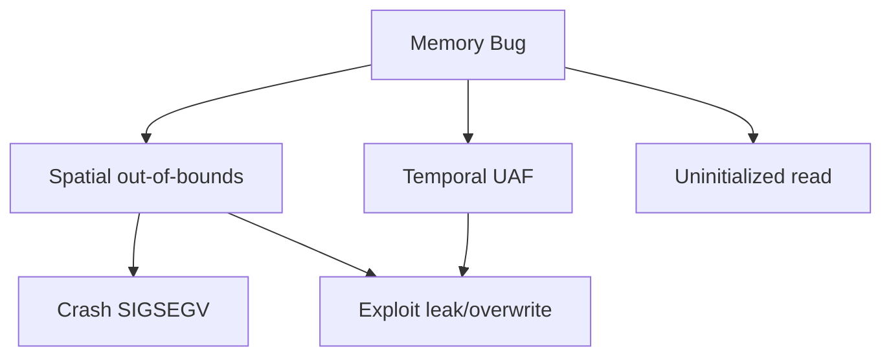
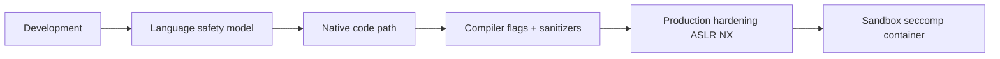
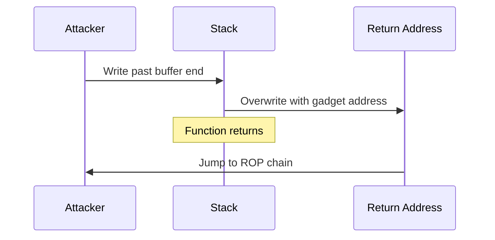

# Memory Safety Fundamentals

## Overview

**Memory safety** means a program accesses memory only in ways the language/runtime permits: valid addresses, correct bounds, defined lifetimes, and no use-after-free. **Memory-unsafe** languages (C, C++, assembly) place burden on the programmer; violations cause **undefined behavior (UB)**, crashes, or exploitable vulnerabilities. **Memory-safe** languages (Java, Python, JavaScript, Rust by default) enforce rules at compile time, runtime checks, or GC—though unsafe escape hatches (FFI, `unsafe`) reintroduce risk.

Production impact: memory bugs remain a top CVE category in native stacks (browsers, kernels, media codecs). Managed services still suffer when native extensions, WASM modules, or kernel interfaces are wrong.

## Learning Objectives

- Classify bug classes: spatial safety, temporal safety, initialization, double-free
- Explain how ASLR, canaries, NX, and RELRO mitigate exploits
- Use sanitizers and fuzzing in development workflows
- Compare safety models: GC, ownership, sandboxing
- Assess memory safety of polyglot stacks (Node + native, Python + C)

## Prerequisites

- [[01-Computer-Science/03-Memory-and-Addressing/Pointers References and Aliasing|Pointers References and Aliasing]]
- [[01-Computer-Science/03-Memory-and-Addressing/Stack and Heap|Stack and Heap]]
- [[01-Computer-Science/03-Memory-and-Addressing/Virtual Memory|Virtual Memory]]

## Difficulty

`intermediate`

## Estimated Time

- Reading: 90 minutes
- Exercises: 3 hours
- Mini project (bug zoo): 4–5 hours

## History

Stack smashing documented since 1970s; Morris worm (1988) exploited memory bugs. Defenses layered: StackGuard canaries (1990s), ASLR, DEP/NX, heap hardening (metadata encryption). Memory-safe languages and sandboxes (Java sandbox, WASM) shifted attack surface. Rust's ownership model (2015+) aims for C performance with safety proofs. Industry still runs billions of lines of C/C++—mitigation and verification remain essential.

## Problem It Solves

Memory safety prevents:

- **Confidentiality breaches** (read out-of-bounds leaks keys)
- **Integrity violations** (stack overflow overwrites return address)
- **Availability failures** (crash on bad pointer)
- **Remote code execution** (ROP chains in native code)

Understanding fundamentals lets teams choose languages, boundaries, and tooling deliberately—not assume "high-level language = safe system."

## Internal Implementation

### Bug Taxonomy

| Class | Example | Safe language behavior |
| --- | --- | --- |
| **Spatial** | `buf[100]` read at index 200 | Bounds check or panic (Rust), exception (Java) |
| **Temporal** | Use-after-free | GC delays reuse; Rust borrow prevents |
| **Uninitialized** | Read uninitialized stack var | TS strict, Rust deny, C UB |
| **Double free** | `free(p); free(p);` | GC/N/A; Rust drop once |
| **Null deref** | `*NULL` | Optional types, NullPointerException |
| **Type confusion** | Cast incompatible types | TypeScript types, Rust match |



### Mitigations (Defense in Depth)

| Mitigation | Mechanism |
| --- | --- |
| **ASLR** | Randomize mapping bases |
| **Stack canary** | Detect stack buffer overflow before ret |
| **NX / W^X** | Non-executable data pages |
| **RELRO / PIE** | Read-only relocations, PIC |
| **ASan/MSan/UBSan** | Instrumentation detects violations at runtime |
| **CFI** | Restrict indirect call targets |
| **Sandbox / seccomp** | Limit damage scope |

Link [[18-Security/README|Security]] and [[01-Computer-Science/02-Machine-Model/Hardware Software Interface|Hardware Software Interface]].

## Mermaid Diagrams

### Structure



### Sequence / Lifecycle — Stack Buffer Overflow



## Examples

### Minimal Example — C Spatial Bug

```c
void read_input(void) {
    char buf[16];
    gets(buf);  // no bounds — classic overflow
}
```

Fix: `fgets(buf, sizeof buf, stdin)` + compiler FORTIFY_SOURCE.

### TypeScript — Bounds in Typed Arrays

```typescript
const buf = new Uint8Array(16);
function readAt(i: number): number {
  if (i < 0 || i >= buf.length) throw new RangeError("OOB");
  return buf[i];
}
```

JIT bounds-check elimination can remove checks when proven safe—internal native code must still be correct.

### Python — Mostly Safe User Code

```python
lst = [1, 2, 3]
lst[99]  # IndexError — spatial safety at runtime

# Unsafe: ctypes without bounds
buf = (ctypes.c_char * 4)()
ctypes.memmove(buf, b"AAAAAAA", 7)  # buffer overflow in native layer
```

### Production-Shaped — Native Addon Boundary

Node N-API addon must:

- Validate buffer lengths before `memcpy`
- Not hold pointers after GC may move/unpin (ArrayBuffer lifetime)
- Use `napi_create_reference` for async work

Python C extension: `Py_buffer` acquisition/release paired; never touch after `PyBuffer_Release`.

## Trade-offs

| Approach | Upside | Downside |
| --- | --- | --- |
| **Manual C/C++** | Peak control/perf | UB surface |
| **GC languages** | No UAF for managed objects | FFI holes, GC pauses |
| **Rust safe subset** | Compile-time proofs | Learning curve, unsafe for FFI |
| **WASM sandbox** | Memory isolated linear mem | Boundary overhead |
| **Sanitizers in CI** | Catch bugs early | Slowdown, not for prod traffic |
| **Rewrite in safe lang** | Remove class of bugs | Cost, perf validation |

### When to Use

- Sanitizers/fuzz on every native PR
- `unsafe` review checklist for Rust/C FFI
- seccomp/AppArmor for parser/native services

### When Not to Use

- Do not run ASan builds as production servers (use separate pipeline stage)
- Do not assume managed language eliminates native risk in dependencies

## Exercises

1. Trigger stack canary failure with intentional overflow in lab C program (controlled environment).
2. Run same buggy C under ASan; interpret report line-by-line.
3. Write Python `ctypes` overflow; observe crash vs managed IndexError difference.
4. List three memory safety guarantees Rust provides that C does not.

## Mini Project

**Memory bug zoo**: small C programs each demonstrating one bug class; companion fixed versions + ASan output screenshots in markdown.

## Portfolio Project

Harden one service component: enable compiler hardening flags, add FFI audit, integrate fuzz target in CI, document threat model section for [[18-Security/README|Security]] review.

## Interview Questions

1. Spatial vs temporal memory safety?
2. What is use-after-free? Example exploit goal?
3. How does ASLR help? What bypasses it?
4. What does AddressSanitizer detect?
5. Is JavaScript memory-safe? Qualify your answer.

### Stretch / Staff-Level

1. Compare Rust borrow checker vs GC for real-time systems.
2. Explain CFI and why ROP still evolves (JIT-ROP, etc.).

## Common Mistakes

- Disabling sanitizers because "tests are slow"
- Trusting `strcpy` length from network input
- Returning pinned buffer view in Python after object freed
- Assuming WASM host is safe if guest is sandboxed but host native glue is buggy

## Best Practices

- Compile native code with `-fstack-protector-strong -D_FORTIFY_SOURCE=2 -fPIE -pie`
- Fuzz parsers and decoders (libFuzzer, AFL)
- Minimize native code; isolate in separate process where possible
- Capture ASan symbolized stacks in CI artifacts

## Summary

Memory safety is about only touching memory that exists, for as long as it exists, with the intended type. Violations in native code remain a primary security and stability risk; managed languages shift but do not eliminate danger at FFI boundaries. Production teams combine language choice, hardening flags, sanitizers, fuzzing, and sandboxing—understanding bug classes makes each layer purposeful rather than checkbox compliance.

## Further Reading

- CWE Top 25 — memory-related categories
- Google Sanitizer documentation
- Rustonomicon — unsafe guidelines
- *The Art of Software Security Assessment*

## Related Notes

- [[01-Computer-Science/03-Memory-and-Addressing/Pointers References and Aliasing|Pointers References and Aliasing]]
- [[01-Computer-Science/03-Memory-and-Addressing/Garbage Collection Models|Garbage Collection Models]]
- [[01-Computer-Science/03-Memory-and-Addressing/Address Spaces|Address Spaces]]
- [[01-Computer-Science/02-Machine-Model/Pipelining and Speculative Execution|Pipelining and Speculative Execution]]
- [[18-Security/README|Security]]
- [[02-JavaScript/README|JavaScript]] — WASM, native addons
- [[03-Python/README|Python]] — ctypes, C extensions

## Progress Checklist

- [ ] Explained from first principles
- [ ] Drew at least one Mermaid diagram
- [ ] Implemented a minimal version
- [ ] Documented trade-offs and non-goals
- [ ] Completed exercises
- [ ] Practiced interview questions aloud
- [ ] Linked prerequisites and dependents
