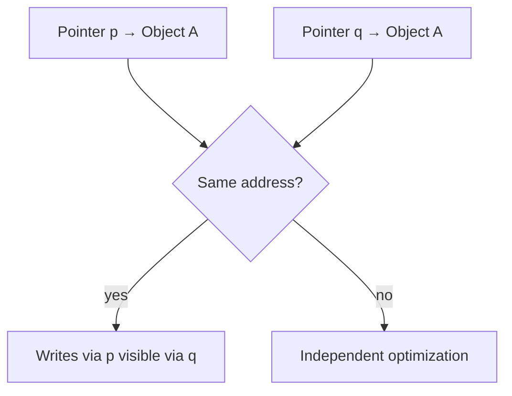
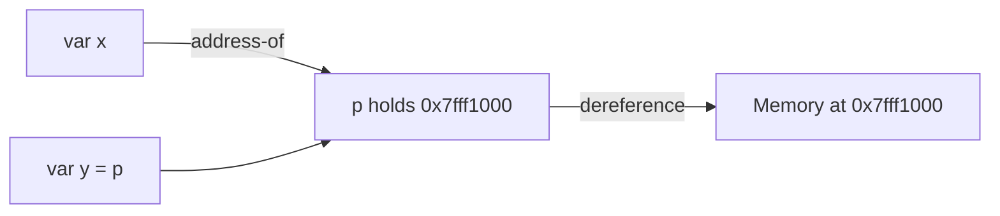
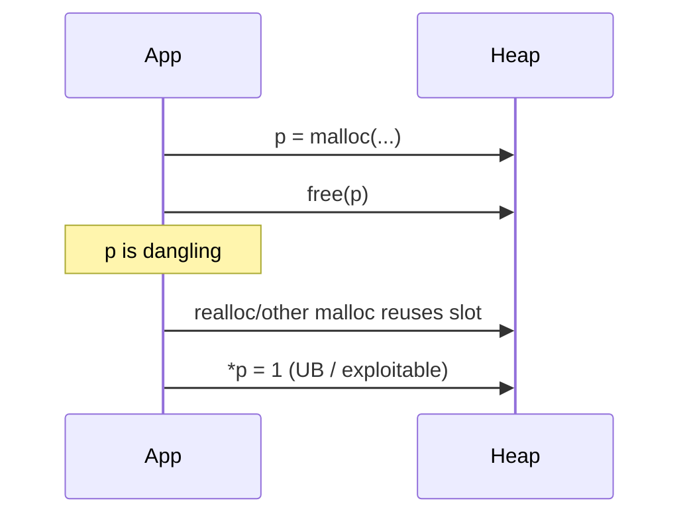

# Pointers References and Aliasing

## Overview

A **pointer** is a value that holds an address (virtual address in user space) to another object in memory. **Dereferencing** follows that address to read or write the target. A **reference** (C++ lvalue reference, Rust borrow, Java object reference) is a language-level abstraction that often compiles to pointer-like mechanics with additional rules—no null (Rust non-null borrow after proven), no reassignment (C++ `T&`), or opaque GC handle (Java).

**Aliasing** occurs when two expressions can access the same memory location during overlapping lifetimes—`x` and `*p` might refer to the same `int`. Aliasing enables efficient sharing but breaks compiler optimizations (strict aliasing in C), causes surprise mutations in JS/Python object graphs, and underlies data races when concurrent without synchronization.

## Learning Objectives

- Explain pointer size, null, and dereference on mapped vs unmapped addresses
- Contrast pointers, references, and handles in C, Rust, JavaScript, Python
- Define aliasing and strict aliasing rule (`restrict`, type-based alias analysis)
- Identify use-after-free, double-free, and dangling pointer bugs
- Reason about borrow checker vs GC vs manual memory for aliasing safety

## Prerequisites

- [[01-Computer-Science/03-Memory-and-Addressing/Address Spaces|Address Spaces]]
- [[01-Computer-Science/03-Memory-and-Addressing/Stack and Heap|Stack and Heap]]
- [[01-Computer-Science/01-Information-and-Representation/Integer Representation|Integer Representation]]

## Difficulty

`intermediate`

## Estimated Time

- Reading: 90 minutes
- Exercises: 3 hours
- Mini project (alias analyzer toy): 4 hours

## History

Machine code always had addresses; high-level pointers entered BCPL/C (1970s). C++ references (1984) added syntactic sugar. Java eliminated raw pointers for security, using GC-managed references. Rust (2010s) formalized **ownership** and **borrow rules** to eliminate data races and use-after-free at compile time. TypeScript adds optional nullability types; Python names bind to objects—"references" everywhere, pointers nowhere in user code.

## Problem It Solves

Pointers/references solve:

- **Indirection**: same API for many object sizes (`void*`, `FILE*`)
- **Sharing**: multiple names for one heap object (graphs, caches)
- **Mutation through parameters**: callee updates caller's buffer
- **Polymorphism**: vtables via pointer to base

Aliasing is the price: writers must know who else can see the same bytes.

## Internal Implementation

### Pointer Representation

On 64-bit Linux user space, pointers are 8-byte virtual addresses (often only lower 48 bits canonical). They live in registers, stack slots, or heap object headers.

Operations:

| Op | Effect |
| --- | --- |
| `&x` | Address-of |
| `*p` | Load/store through p |
| `p + n` | Scale by pointee size (typed) |
| `p == q` | Same address comparison |

Invalid dereference → page fault → `SIGSEGV` (see [[01-Computer-Science/03-Memory-and-Addressing/Memory Safety Fundamentals|Memory Safety Fundamentals]]).

### Aliasing and Optimization

C compilers assume `float*` and `int*` do not alias same memory (strict aliasing). Violation → undefined behavior, wrong optimizations.

`restrict` (C99) promises no alias through other pointers in scope—enables vectorization.



### Language Mapping

| Language | Model |
| --- | --- |
| C/C++ | Raw pointers, explicit ownership |
| Rust | `&T`, `&mut T` (exclusive mut XOR many shared) |
| Java | Object references, no pointer arithmetic |
| JavaScript | Object references; primitives by value |
| Python | Names → objects (reference semantics) |

## Mermaid Diagrams

### Structure



### Sequence / Lifecycle — Use After Free



## Examples

### Minimal Example — C Aliasing

```c
void copy(int * restrict dst, const int * restrict src, size_t n) {
    for (size_t i = 0; i < n; i++)
        dst[i] = src[i];  // compiler may vectorize
}

int x[8];
copy(x, x + 1, 7);  // overlapping — restrict violated if same provenance
```

### TypeScript — Object References

```typescript
const a = { count: 0 };
const b = a;       // same object reference
b.count = 1;
console.log(a.count); // 1 — aliasing

function increment(obj: { count: number }) {
  obj.count++;     // mutates caller's object
}
```

Primitives are not aliased across variables:

```typescript
let x = 1;
let y = x;
y = 2;
console.log(x); // 1
```

### Python — Names as References

```python
lst_a = [1, 2, 3]
lst_b = lst_a          # alias
lst_b.append(4)
assert lst_a is lst_b  # True — same object identity

# id() compares identity, not numeric address safely across runs
```

### Production-Shaped — FFI Pointer Lifetime

Native addon passes buffer pointer to async worker without copying:

```text
BUG: TS/JS GC moves/compacts? (No for ArrayBuffer backing store if pinned)
BUG: Python buffer exported, then object freed before C thread finishes
FIX:  Py_INCREF / N-API persistent reference until async completes
```

Link [[01-Computer-Science/02-Machine-Model/Registers and Calling Conventions|Registers and Calling Conventions]] for pointer args in registers.

## Trade-offs

| Dimension | Raw pointers | GC references | Borrow checker |
| --- | --- | --- | --- |
| **Control** | Maximum | Hidden | Compile-time rules |
| **Safety** | Manual | GC pauses, leaks possible | Reject some valid programs |
| **Performance** | Best when correct | Barrier costs | Zero-cost when compiles |
| **FFI** | Natural | JNI/pinning complexity | `unsafe` blocks |

### When to Use

- Pointers: systems code, kernels, embedded, zero-copy I/O
- References/GC: application logic, rapid development
- `restrict`/unique views: hot numeric kernels

### When Not to Use

- Do not expose interior pointers without documented lifetime
- Do not cast unrelated types to bypass aliasing rules in C

## Exercises

1. Write C function swapping two ints via pointers. Then swap with aliased args—what happens?
2. In Python, demonstrate `is` vs `==` with interned small ints vs lists.
3. Implement a Rust example where `&mut` and `&` coexist—compiler error; fix with scope split.
4. Use `-fstrict-aliasing` violation example with `float`/`int` pun—observe wrong result at `-O2`.

## Mini Project

Build a **lifetime visualizer** for a tiny Rust-like ownership toy language: track borrow conflicts at compile time.

## Portfolio Project

Audit one production FFI boundary for pointer lifetime bugs. Document pinning, refcounting, or copy strategy.

## Interview Questions

1. Pointer vs reference in C++?
2. What is strict aliasing?
3. Explain use-after-free with diagram.
4. Are JavaScript objects passed by reference or value?
5. What does Rust `&mut` guarantee about aliases?

### Stretch / Staff-Level

1. How does C++ `std::span` differ from pointer + length for alias analysis?
2. Explain TBAA in LLVM and miscompilation risk.

## Common Mistakes

- `==` on strings in C (compares pointers not content)
- Assuming `memcpy` handles overlapping regions (use `memmove`)
- Storing pointer to stack across async callback
- Confusing Python `copy` vs `deepcopy` for nested aliasing

## Best Practices

- Document pointer ownership at API boundaries (`/* caller owns */`)
- Use sanitizers (ASan, UBSan) in CI for native code
- Prefer slice/view types (`std::span`, Go slices) over raw pointer + length
- In JS/Python, copy defensively at module boundaries when mutability is unclear

## Summary

Pointers and references are names for indirection: they tell the machine where bytes live. Aliasing is when multiple names reach the same bytes—essential for shared state, dangerous for optimization and concurrency. Production bugs cluster around lifetime (dangling, UAF) and surprise mutation (aliased object graphs). Language choices—manual, GC, or borrow-checked—trade control vs safety vs ergonomics.

## Further Reading

- C standard — strict aliasing clause
- Rust Book — ownership and borrowing
- Jones & Lins, *Garbage Collection* — reference tracing

## Related Notes

- [[01-Computer-Science/03-Memory-and-Addressing/Stack and Heap|Stack and Heap]]
- [[01-Computer-Science/03-Memory-and-Addressing/Memory Safety Fundamentals|Memory Safety Fundamentals]]
- [[01-Computer-Science/03-Memory-and-Addressing/Garbage Collection Models|Garbage Collection Models]]
- [[01-Computer-Science/05-Concurrency-Fundamentals/Race Conditions|Race Conditions]]
- [[02-JavaScript/README|JavaScript]]
- [[03-Python/README|Python]]
- [[18-Security/README|Security]]

## Progress Checklist

- [ ] Explained from first principles
- [ ] Drew at least one Mermaid diagram
- [ ] Implemented a minimal version
- [ ] Documented trade-offs and non-goals
- [ ] Completed exercises
- [ ] Practiced interview questions aloud
- [ ] Linked prerequisites and dependents
