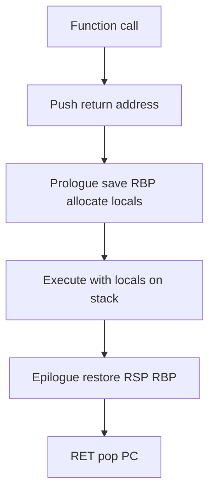
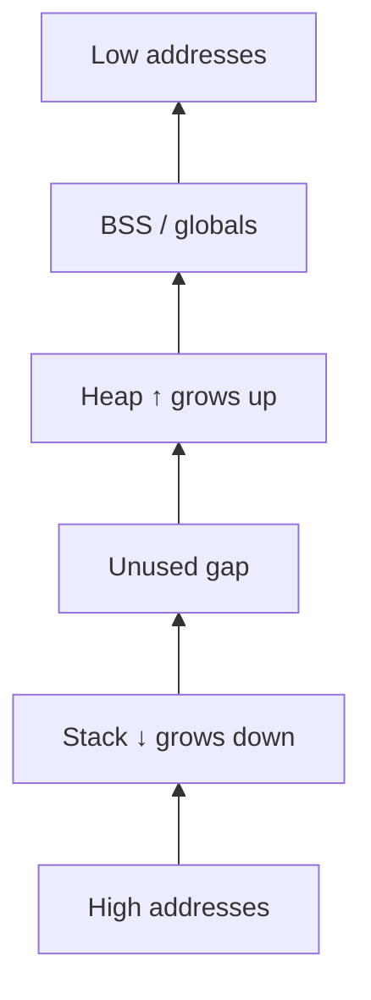
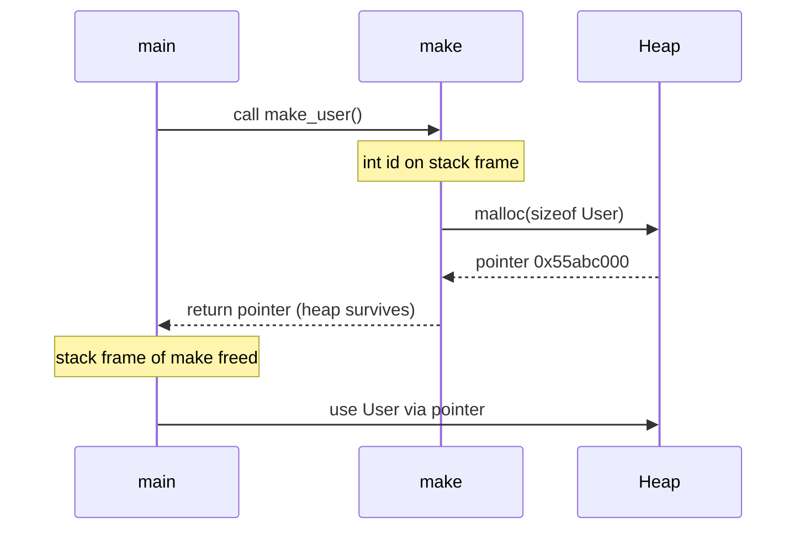

# Stack and Heap

## Overview

The **stack** and **heap** are two primary dynamic memory regions within a process address space, with different allocation semantics and lifetimes.

The **stack** grows and shrinks automatically with function calls: each activation record (frame) holds return addresses, saved registers, and local variables. Allocation is pointer-bump fast; deallocation is implicit on return. Size is bounded (typically 8 MiB default on Linux thread stacks)—stack overflow is a real failure mode.

The **heap** serves longer-lived or dynamically sized allocations via explicit request (`malloc`, `new`, runtime allocators). Lifetime is programmer- or GC-controlled; fragmentation and leaks are classic bugs. Language runtimes (V8, CPython, JVM) implement sophisticated heap strategies atop the OS heap.

Understanding stack vs heap explains performance (cache locality of stack), concurrency (stack per thread vs shared heap), and crash signatures (`SIGSEGV` on stack overflow vs heap corruption).

## Learning Objectives

- Compare stack (LIFO, automatic) vs heap (explicit/GC, flexible) allocation
- Trace stack growth through recursive and nested calls
- Explain why returning pointers to stack locals is undefined behavior in C
- Map language constructs (closures, objects, arrays) to heap behavior in JS/Python
- Diagnose stack overflow vs heap OOM in production

## Prerequisites

- [[01-Computer-Science/03-Memory-and-Addressing/Address Spaces|Address Spaces]]
- [[01-Computer-Science/02-Machine-Model/Registers and Calling Conventions|Registers and Calling Conventions]]

## Difficulty

`intermediate`

## Estimated Time

- Reading: 75 minutes
- Exercises: 2–3 hours
- Mini project (allocator visualizer): 4–5 hours

## History

Stack discipline comes from activation records in Algol-family languages (1960s). Heap allocation via `malloc` (1970s Unix) separated policy from language. Arena allocators and generational GC (1980s–90s) optimized object-heavy languages. Modern runtimes combine **multiple heaps** (V8 young/old spaces, Python pymalloc pools) while still using OS `mmap`/`brk` for growth.

## Problem It Solves

| Need | Stack | Heap |
| --- | --- | --- |
| Short-lived locals | ✓ automatic | Overkill |
| Unknown size at compile time | Limited (VLA discouraged) | ✓ |
| Lifetime beyond callee return | ✗ | ✓ |
| Fast scoped cleanup | ✓ pop frame | Needs free/GC |
| Large buffers | Risk overflow | ✓ with caution |

Splitting regions lets CPUs optimize predictable stack access while supporting arbitrary object graphs.

## Internal Implementation

### Stack Mechanics (x86-64)

- **RSP** points to stack top (lowest address in current frame on SysV)
- **CALL** pushes return address; **PUSH** saves registers
- Locals at negative offsets from frame pointer **RBP** (if used)
- **RET** pops return address; frame vanishes instantly

Guard pages below stack catch overflow → **SIGSEGV** with fault address near stack limit.



### Heap Mechanics

1. Runtime requests pages from OS via `brk` (contiguous) or `mmap` (large/chunked)
2. Allocator metadata tracks free lists, size classes, alignment
3. `free` returns blocks to allocator; may not return pages to OS immediately
4. GC languages trace reachable objects; may compact or generation-promote

See [[01-Computer-Science/03-Memory-and-Addressing/Garbage Collection Models|Garbage Collection Models]].

## Mermaid Diagrams

### Structure



### Sequence / Lifecycle — Stack vs Heap Object



## Examples

### Minimal Example — C Stack U.B.

```c
int *bad(void) {
    int x = 42;
    return &x;  // UB: x dies when bad returns
}
```

Valid pattern: allocate on heap or caller-provided buffer.

### TypeScript — Stack vs Heap (Conceptual)

```typescript
function outer() {
  const n = 10; // primitive in stack frame (engine may optimize to register)
  const obj = { values: new Array<number>(n) }; // object header on V8 heap
  return obj; // safe — heap outlives frame
}

function blowStack(): never {
  return blowStack(); // RangeError: Maximum call stack size exceeded (JS)
}
```

V8 raises catchable error before OS guard page on deep recursion; native code may SIGSEGV first.

### Python — Stack vs Heap

```python
def make_list(n: int) -> list[int]:
    local_count = n          # int object on heap; name on stack frame
    return [i for i in range(local_count)]  # list + elements on heap

import sys
sys.setrecursionlimit(10_000)  # still bounded — stack overflow possible
```

Everything in Python is an object on the heap; stack holds frames and references (pointers to heap objects).

### Production-Shaped — Stack Size Tuning

```bash
# Linux default thread stack often 8 MB × N threads = huge VIRT
ulimit -s          # stack size KB
pthread_attr_setstacksize(...)  # native services

# Node worker threads — stackSize option
# Python threading — OS default; deep C recursion in C extensions can crash
```

Kubernetes OOM kills on **RSS**, but massive thread stacks inflate **VIRT** and complicate sizing—link [[09-System-Design/README|System Design]].

## Trade-offs

| Dimension | Stack | Heap |
| --- | --- | --- |
| **Speed** | Near free (pointer bump) | Metadata + possible lock contention |
| **Size limit** | Small, fixed per thread | Limited by VM and RAM |
| **Lifetime** | Automatic, scoped | Manual/GC — leak risk |
| **Fragmentation** | None (LIFO) | External/internal fragmentation |
| **Thread safety** | Per-thread stack | Shared — needs sync or thread-local arenas |

### When to Use

- Stack: small locals, recursion within known depth, hot paths in native code
- Heap: variable-size objects, cross-function lifetime, language object model

### When Not to Use

- Do not put large arrays on stack in C/C++ (`char buf[1<<20]` → overflow)
- Do not allocate on every request in hot path without pooling (heap churn)

## Exercises

1. Write recursive factorial in TS and Python; measure depth before failure. Increase stack where applicable.
2. Implement a trivial bump allocator on a static byte array (heap simulation). Compare to `malloc`.
3. Use Valgrind or ASan on a C program returning stack pointer; observe error report.
4. Count thread stack memory for a server with 500 worker threads. Compute VIRT contribution.

## Mini Project

**Stack/heap visualizer**: simulate calls pushing/popping frames with locals; parallel heap free-list diagram. Export animation for teaching.

## Portfolio Project

Profile a service for **allocation rate** (Node `--expose-gc`, Python `tracemalloc`). Tie spikes to request handlers; propose object pooling or buffer reuse.

## Interview Questions

1. Stack vs heap: allocation, deallocation, speed, size limits?
2. Why is returning address of local variable invalid in C?
3. Where do JavaScript objects live? What causes stack overflow in JS?
4. What is stack overflow vs heap overflow?
5. How does `alloca` differ from `malloc`?

### Stretch / Staff-Level

1. Explain stack unwinding during C++ exceptions—how does runtime find frames?
2. How do goroutines' small stacks grow dynamically compared to pthread fixed stacks?

## Common Mistakes

- Large stack allocations in C
- Assuming heap allocation is always slower without measuring allocator fast paths
- Ignoring thread stack totals in thread-pool-heavy designs
- Confusing Python stack overflow with heap exhaustion

## Best Practices

- Prefer stack for small scoped data in native code
- Use arena/pool allocators for request-scoped heap in servers
- Set recursion limits and guard native extensions
- Monitor allocator metrics (jemalloc stats, V8 heap snapshots)

## Summary

The stack handles automatic, fast, scoped memory tied to the call chain; the heap handles flexible lifetimes and object graphs at the cost of management complexity. Every language maps its model onto these regions—C exposes both directly; JavaScript and Python hide stacks while heap behavior drives GC pauses and memory leaks. Production issues (stack overflow, OOM, fragmentation) make sense only with this split in mind.

## Further Reading

- Wilson et al., "Dynamic Storage Allocation: A Survey and Critical Review"
- Linux `man 3 malloc`, `man 2 brk`
- V8 memory docs — heap spaces and stack limits

## Related Notes

- [[01-Computer-Science/03-Memory-and-Addressing/Address Spaces|Address Spaces]]
- [[01-Computer-Science/03-Memory-and-Addressing/Pointers References and Aliasing|Pointers References and Aliasing]]
- [[01-Computer-Science/03-Memory-and-Addressing/Garbage Collection Models|Garbage Collection Models]]
- [[01-Computer-Science/03-Memory-and-Addressing/Memory Safety Fundamentals|Memory Safety Fundamentals]]
- [[01-Computer-Science/02-Machine-Model/Registers and Calling Conventions|Registers and Calling Conventions]]
- [[02-JavaScript/README|JavaScript]]
- [[03-Python/README|Python]]
- [[10-Linux/README|Linux]]

## Progress Checklist

- [ ] Explained from first principles
- [ ] Drew at least one Mermaid diagram
- [ ] Implemented a minimal version
- [ ] Documented trade-offs and non-goals
- [ ] Completed exercises
- [ ] Practiced interview questions aloud
- [ ] Linked prerequisites and dependents
