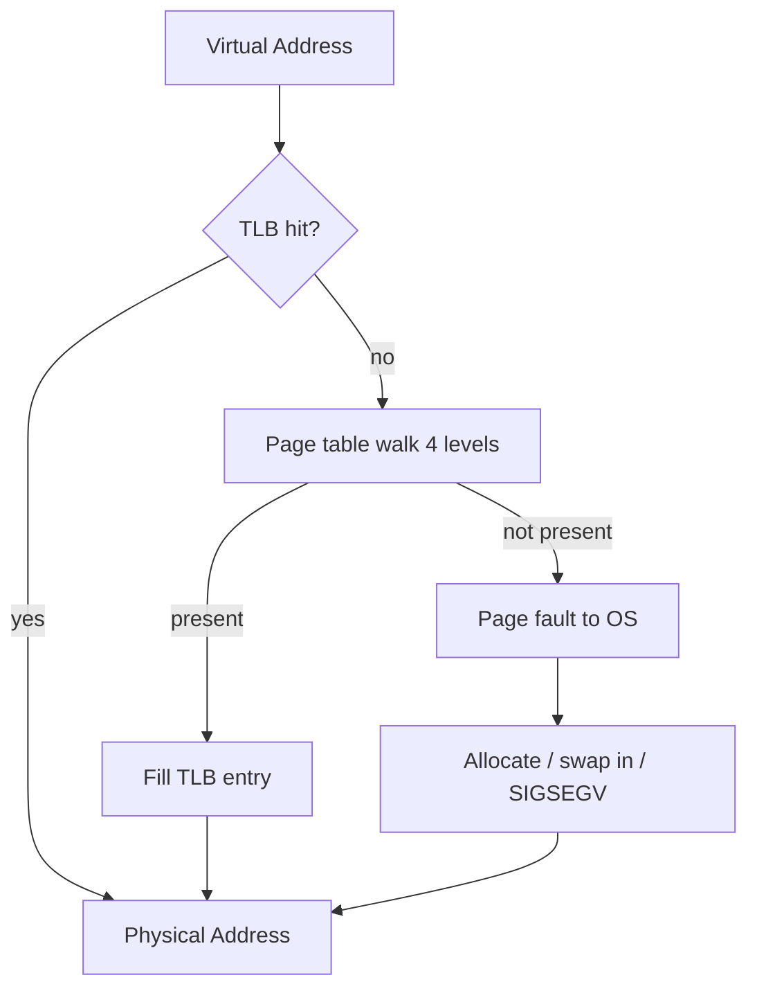
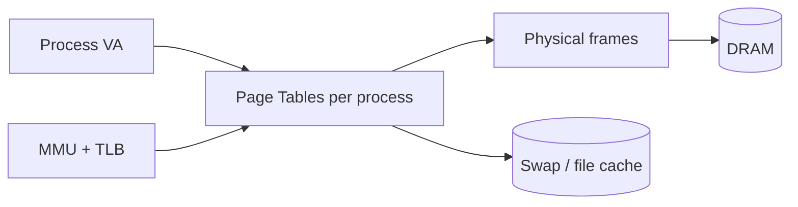
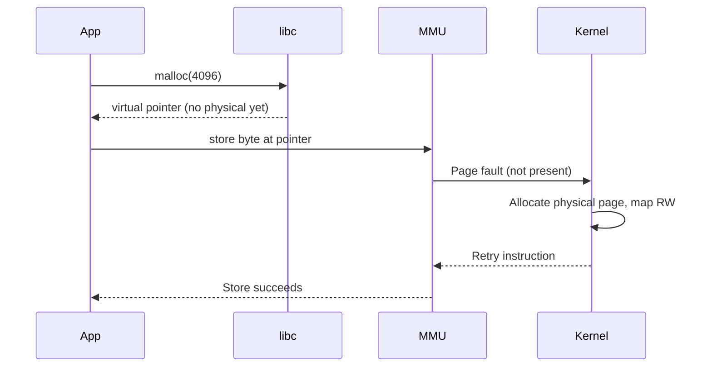

# Virtual Memory

## Overview

**Virtual memory** is the hardware–OS mechanism that maps **virtual addresses** (what programs use) to **physical frames** (RAM locations) through **page tables**, with optional backing on disk (swap). Each page (typically 4 KiB on x86/ARM Linux) has metadata: present bit, read/write/execute permissions, accessed/dirty bits, and optionally a file mapping.

Virtual memory enables isolation (separate page tables per process), overcommit (allocate virtual without immediate physical), demand paging (fault in on first touch), copy-on-write (`fork`), memory-mapped I/O, and large sparse address spaces. The MMU performs translation on every load/store/instruction fetch; the **TLB** caches recent translations for speed.

## Learning Objectives

- Walk a multi-level page table translation for a virtual address
- Explain page faults: major (disk) vs minor (zero-fill, COW)
- Describe TLB role and shootdown on page table changes
- Connect VM to `mmap`, `malloc`, and container memory limits
- Debug OOM killer and swap thrashing from VM perspective

## Prerequisites

- [[01-Computer-Science/03-Memory-and-Addressing/Address Spaces|Address Spaces]]
- [[01-Computer-Science/02-Machine-Model/Hardware Software Interface|Hardware Software Interface]]
- [[01-Computer-Science/02-Machine-Model/Cache Hierarchy and Locality|Cache Hierarchy and Locality]]

## Difficulty

`advanced`

## Estimated Time

- Reading: 2 hours
- Exercises: 3–4 hours
- Mini project (page table simulator): 6 hours

## History

Atlas (1962) pioneered paging. x86 moved from segmentation-heavy to paging-dominated (80386). 64-bit long mode uses 4-level (sometimes 5-level) tables. Linux **transparent huge pages** (2 MiB, 1 GiB) reduce TLB pressure. Cloud VMs add **nested paging** (EPT) for hypervisors—guest virtual → guest physical → host physical.

## Problem It Solves

Without VM:

- Processes could not safely share one machine
- Physical fragmentation would block large allocations
- Files would require explicit read into separate buffers (`mmap` unifies file and memory)
- `fork()` would copy entire memory eagerly

VM trades translation overhead and TLB misses for flexibility and safety.

## Internal Implementation

### x86-64 4-Level Paging (Simplified)

Virtual address splits into:

`[ 9-bit L4 | 9-bit L3 | 9-bit L2 | 9-bit L1 | 12-bit offset ]`

Each table entry (PTE) contains frame number + flags (P, R/W, U/S, XD).

**CR3** register points to PML4 (root). Walk on TLB miss—can cost hundreds of cycles.



### Page Fault Types (Linux)

| Cause | Handler action |
| --- | --- |
| Demand zero | Allocate frame, zero-fill |
| COW read | Share frame, mark read-only |
| COW write | Duplicate frame, remap writable |
| Swap not in RAM | Read page from swap (major fault) |
| Invalid access | `SIGSEGV` to process |

### Swap and Pressure

Under memory pressure, kernel **evicts** clean file-backed pages or swaps anonymous pages. Thrashing—constant faulting—destroys performance. **cgroup v2 memory.max** kills or OOM-scores before host collapse.

## Mermaid Diagrams

### Structure



### Sequence / Lifecycle — First Touch After `malloc`



## Examples

### Minimal Example — `mmap` File as Memory

TypeScript runs on runtime; show C interop pattern:

```c
#include <sys/mman.h>
#include <fcntl.h>
#include <unistd.h>

void map_config(const char *path) {
    int fd = open(path, O_RDONLY);
    size_t len = lseek(fd, 0, SEEK_END);
    void *p = mmap(NULL, len, PROT_READ, MAP_PRIVATE, fd, 0);
    // p..p+len backed by file; page faults pull 4K chunks
    munmap(p, len);
    close(fd);
}
```

Python equivalent:

```python
import mmap

with open("config.bin", "rb") as f:
    with mmap.mmap(f.fileno(), 0, access=mmap.ACCESS_READ) as m:
        magic = m[0:4]  # may fault in pages on access
```

### Production-Shaped — Memory Accounting

```bash
# Per-process VM stats
cat /proc/$PID/status | egrep 'VmPeak|VmSize|VmRSS|VmSwap'

# Container limit vs working set
# Kubernetes memory.limit → cgroup max; OOM if RSS+kernel charges exceed
```

Node `--max-old-space-size` limits V8 heap; OS still sees full process VM including native buffers and thread stacks—multiple layers.

### Copy-on-Write `fork`

```text
Parent and child share PTEs read-only after fork()
First write in either → fault → kernel copies page → updates PTEs
Enables fast process spawn (shell, prefork workers) until mutation
```

Link [[01-Computer-Science/04-Processes-and-Execution/Processes|Processes]].

## Trade-offs

| Dimension | Upside | Downside | When it matters |
| --- | --- | --- | --- |
| **Paging** | Isolation, sparse maps | TLB miss, walk cost | Every load/store |
| **Huge pages** | Fewer TLB misses | Fragmentation, latency to coalesce | Databases, JVM heaps |
| **Overcommit** | Higher density | OOM killer surprises | K8s clusters |
| **Swap** | Survive spikes | Latency death spiral | Laptops, small VMs |

### When to Use

- Reason about container OOM and memory limits
- Use `mmap` for large read-mostly files (zero-copy vs read buffer)
- Tune THP / huge pages for known large working sets

### When Not to Use

- Do not disable swap on databases without understanding major fault cost
- Do not assume `malloc` memory is physically resident immediately

## Exercises

1. Simulate 2-level page table: given VA, compute PTE chain and physical address on paper.
2. Allocate 1 GiB array but touch one page; compare `VmSize` vs `VmRSS` in `/proc/self/status`.
3. Trigger COW: `fork` and write in child; use `/proc/pid/smaps` to see shared vs private pages.
4. Run workload under memory cgroup limit; observe OOM kill vs thrashing with swap enabled/disabled.

## Mini Project

**Page table + TLB simulator**: configurable levels, TLB size, fault injection, statistics (hit rate, walk count).

## Portfolio Project

Capacity study: same service with THP on/off, swap on/off, cgroup limits. Document p99 latency and OOM behavior for [[09-System-Design/01-Capacity-Latency-and-Bottlenecks/Back-of-Envelope Capacity Estimation|Back-of-Envelope Capacity Estimation]].

## Interview Questions

1. Virtual vs physical address; who translates?
2. What is a TLB? What happens on TLB miss?
3. Major vs minor page fault?
4. Explain copy-on-write after `fork`.
5. Why can `VmSize` exceed physical RAM?

### Stretch / Staff-Level

1. Explain 5-level paging and why it was added on x86.
2. How does KSM (Kernel Samepage Merging) interact with security in multi-tenant hosts?

## Common Mistakes

- Confusing V8 heap limit with process RSS limit
- Ignoring page alignment in custom allocators (`mmap` length rounded up)
- Mapping RWX pages in production services
- Assuming `free` returns RAM to OS instantly

## Best Practices

- Monitor major page faults (`/proc/vmstat`, Prometheus node exporter)
- Size pods with headroom for page cache and native memory outside runtime heap
- Use `madvise(MADV_RANDOM|MADV_SEQUENTIAL)` hints for large scans when appropriate
- Test behavior at memory limit before production rollout

## Summary

Virtual memory decouples program addresses from physical RAM through page tables, faults, and optional swap. It is the foundation of process isolation, lazy allocation, file mapping, and fork semantics. Production performance and reliability—OOM kills, swap thrash, TLB effects—make sense only when translation and fault handling are understood, not when memory is treated as an infinite array.

## Further Reading

- Intel SDM Volume 3 — paging
- Linux kernel docs — memory management, THP, overcommit
- *Operating Systems: Three Easy Pieces* — paging chapters

## Related Notes

- [[01-Computer-Science/03-Memory-and-Addressing/Address Spaces|Address Spaces]]
- [[01-Computer-Science/03-Memory-and-Addressing/Memory Hierarchy Trade-offs|Memory Hierarchy Trade-offs]]
- [[01-Computer-Science/03-Memory-and-Addressing/Stack and Heap|Stack and Heap]]
- [[01-Computer-Science/02-Machine-Model/Hardware Software Interface|Hardware Software Interface]]
- [[01-Computer-Science/02-Machine-Model/Cache Hierarchy and Locality|Cache Hierarchy and Locality]]
- [[01-Computer-Science/04-Processes-and-Execution/Processes|Processes]]
- [[10-Linux/03-Memory-Swap-and-OOM/Virtual Memory Ops RSS vs VSZ|Virtual Memory Ops RSS vs VSZ]]
- [[15-Kubernetes/README|Kubernetes]]
- [[08-Databases/README|Databases]] — buffer pool vs OS page cache

## Progress Checklist

- [ ] Explained from first principles
- [ ] Drew at least one Mermaid diagram
- [ ] Implemented a minimal version
- [ ] Documented trade-offs and non-goals
- [ ] Completed exercises
- [ ] Practiced interview questions aloud
- [ ] Linked prerequisites and dependents
