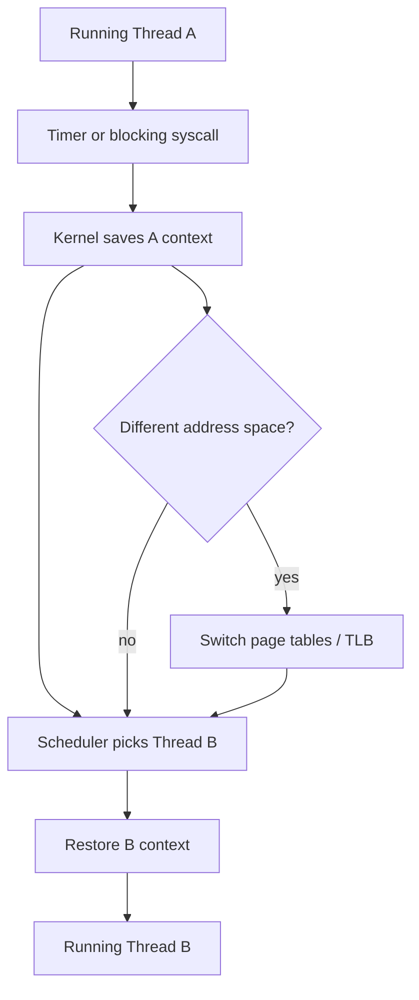
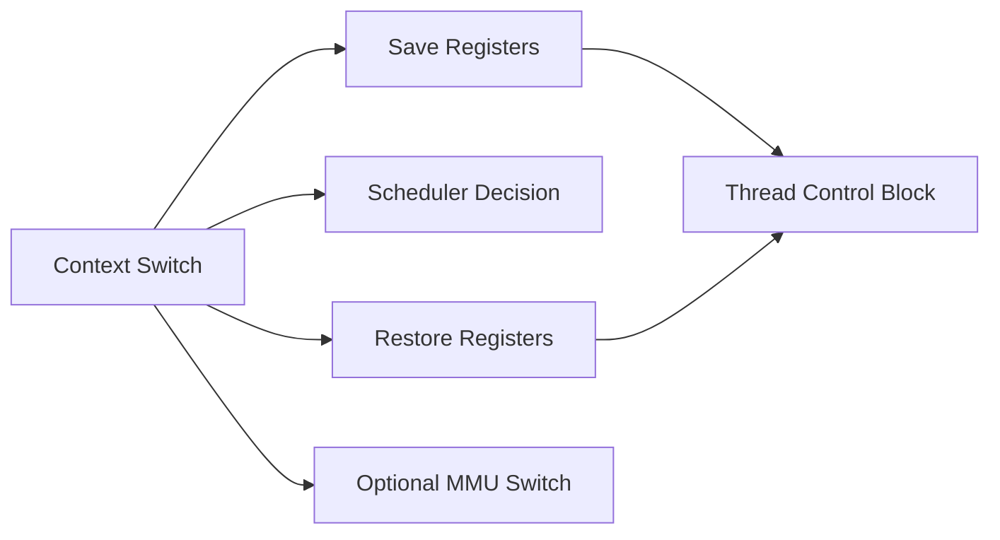
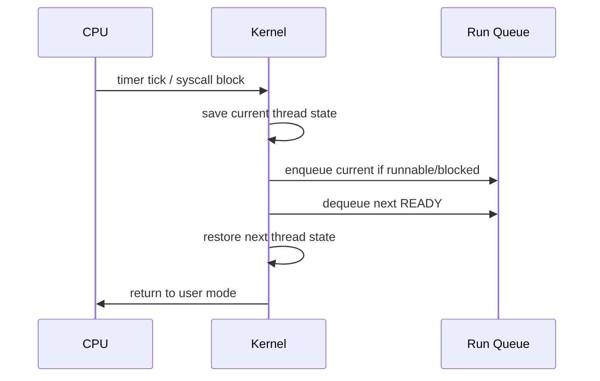

# Context Switching

## Overview

A **context switch** is the kernel operation that stops running one thread (or process) and resumes another on a CPU: save register state, switch address space if needed, update run queues, and restore the next thread's saved context. It is the mechanical heart of **multitasking**—how one core appears to run many programs concurrently.

This note explains **what work the kernel does** and **what it costs**. Profiling tools on Linux (`perf`, `vmstat`) interpret these costs operationally in [[10-Linux/08-Observability-Tracing-and-Profiling/perf CPU Profiles and Flame Graph Intuition|perf CPU Profiles and Flame Graph Intuition]]; here we reason from the machine model upward.

## Learning Objectives

- List hardware and kernel state saved/restored during a context switch
- Distinguish thread-only switches from full process switches (address space change)
- Estimate overhead and cache effects (TLB shootdown, cache cold starts)
- Connect switch frequency to latency tail and throughput ceilings
- Identify when user-space scheduling avoids kernel switches

## Prerequisites

- [[01-Computer-Science/04-Processes-and-Execution/Processes|Processes]]
- [[01-Computer-Science/04-Processes-and-Execution/Threads|Threads]]
- [[01-Computer-Science/02-Machine-Model/Cache Hierarchy and Locality|Cache Hierarchy and Locality]]

## Difficulty

`intermediate`

## Estimated Time

2–3 hours reading, 1 hour measurement exercises

## History

Time-sharing systems needed fast switching between jobs. Early implementations saved minimal state in software; modern CPUs add dedicated structures (TSR, MSRs) and optimized syscall paths, but switching remains one of the dominant fixed costs in high-QPS servers.

## Problem It Solves

Without context switching, a blocked thread would waste the CPU until its I/O completed. Switching lets the scheduler run ready work, improving **utilization** and **responsiveness**. The trade-off is **switch overhead** and **lost locality** in caches and TLB.

## Internal Implementation

**Triggers**: timer interrupt (preemption), blocking syscall, I/O completion, explicit yield.

**Steps (simplified)**:

1. Trap to kernel on interrupt or syscall path
2. Save GPRs, PC, stack pointer, flags to thread's kernel stack / PCB
3. If switching processes: switch page tables → TLB flush or ASID tag change
4. Select next runnable thread from run queue
5. Restore registers, return-from-trap into user mode on new thread



**Order-of-magnitude**: thread switch ~1–10 µs; process switch higher due to TLB/cache effects (workload-dependent, not a universal constant).

## Mermaid Diagrams

### Structure



### Sequence / Lifecycle



## Examples

### Minimal Example

Voluntary yield pattern (educational—not a production scheduler):

TypeScript:

```typescript
// Cooperative "yield" via await — event loop schedules other tasks (no OS thread switch per tick)
async function task(name: string) {
  for (let i = 0; i < 3; i++) {
    console.log(name, i);
    await Promise.resolve(); // yield to microtask queue
  }
}
await Promise.all([task("A"), task("B")]);
```

Python:

```python
import threading, time

def spin(name: str) -> None:
    for _ in range(3):
        print(name)
        time.sleep(0)  # OS may reschedule; not a guaranteed yield API

t1 = threading.Thread(target=spin, args=("A",))
t2 = threading.Thread(target=spin, args=("B",))
t1.start(); t2.start(); t1.join(); t2.join()
```

### Production-Shaped Example

High connection churn causing excessive switching—mitigation via batching and fewer runnable threads:

```typescript
// Anti-pattern: 10k active OS threads → scheduler overhead dominates
// Prefer: event loop + async I/O + bounded worker pool for CPU slices
const POOL_SIZE = Math.min(32, require("node:os").cpus().length);
```

Measure with Linux `pidstat -w` (ops track) vs CS model understanding here.

## Trade-offs

| Dimension | Upside | Downside | When it matters |
| --- | --- | --- | --- |
| Responsiveness | Short tasks run quickly with preemption | More switches → higher overhead | Interactive UI, RPC p99 |
| Throughput | — | Cache/TLB cold after switch | CPU-bound thread pools |
| Fairness | Time slices prevent starvation | Quantum too small → switch storm | Mixed workloads |
| Design | Kernel handles preemption | User-space schedulers must cooperate | Coroutines, runtimes |

### When to Use

- Always—kernel switching is mandatory for preemptive multitasking
- Design **fewer, longer** runnable units when switch cost dominates

### When Not to Use

- "Switch more" is never a goal; **reduce** unnecessary runnable threads and blocking patterns instead

## Exercises

1. Explain why switching between two threads in the **same process** is cheaper than between processes.
2. Sketch how a timer interrupt causes preemption even in a tight infinite loop.
3. Estimate switch count if 1000 requests/sec each hold a thread for 2 ms on 8 cores.
4. Compare cooperative (async/await) vs preemptive (OS threads) scheduling for tail latency.

## Mini Project

Write a micro-benchmark: spawn N threads that either spin or sleep; record wall time and (on Linux) voluntary vs involuntary context switches via `/proc/self/status`. Document findings in an engineering journal entry.

## Portfolio Project

In [[01-Computer-Science/projects/Concurrent Runtime and Protocol Workbench/README|Concurrent Runtime and Protocol Workbench]], add a metrics panel comparing thread-pool size vs context-switch rate under load.

## Interview Questions

1. What state must be saved on a context switch?
2. Why does switching processes flush or complicate TLB behavior?
3. How does preemption differ from cooperative multitasking?
4. What symptoms suggest your service is switch-bound rather than CPU-bound?
5. How do async event loops reduce OS context switches for I/O workloads?

### Stretch / Staff-Level

1. Explain how **NUMA** and **cache affinity** (`sched_setaffinity`) interact with switch costs on large servers.

## Common Mistakes

- Ignoring involuntary context switches when profiling "CPU usage"
- Creating thousands of runnable threads expecting linear speedup
- Assuming `async` eliminates all switching (still switches at await boundaries and in thread pools)
- Confusing **system call overhead** with full context switch (related but distinct)

## Best Practices

- Right-size thread pools; align with core count for CPU work
- Prefer batching and event-driven I/O for connection-heavy servers ([[06-NodeJS/README|Node.js]], [[07-Backend/README|Backend]])
- Use affinity and NUMA awareness only after measurement ([[10-Linux/02-Processes-Signals-and-Job-Control/Job Control Nice and Affinity Ops|Job Control Nice and Affinity Ops]], [[10-Linux/03-Memory-Swap-and-OOM/NUMA Basics for Host Operators|NUMA Basics for Host Operators]])
- Watch run-queue length and switch rates as leading indicators of overload

## Summary

Context switching is how the kernel time-shares CPUs: save state, pick the next runnable thread, restore state, optionally switch address spaces. It enables multitasking at the cost of microseconds per switch and lost cache warmth. Production performance tuning often means reducing unnecessary switches—not eliminating them—by choosing appropriate concurrency models and pool sizes.

## Further Reading

- [[01-Computer-Science/04-Processes-and-Execution/Scheduling Concepts|Scheduling Concepts]]
- [[01-Computer-Science/02-Machine-Model/Cache Hierarchy and Locality|Cache Hierarchy and Locality]]
- [[01-Computer-Science/05-Concurrency-Fundamentals/Asynchronous Event-Driven Models|Asynchronous Event-Driven Models]]

## Related Notes

- [[01-Computer-Science/04-Processes-and-Execution/Scheduling Concepts|Scheduling Concepts]]
- [[01-Computer-Science/04-Processes-and-Execution/System Calls|System Calls]]
- [[01-Computer-Science/04-Processes-and-Execution/Threads|Threads]]
- [[10-Linux/08-Observability-Tracing-and-Profiling/perf CPU Profiles and Flame Graph Intuition|perf CPU Profiles and Flame Graph Intuition]]
- [[10-Linux/03-Memory-Swap-and-OOM/NUMA Basics for Host Operators|NUMA Basics for Host Operators]]
- [[01-Computer-Science/code/README|code labs]]

## Progress Checklist

- [ ] Explained from first principles
- [ ] Drew at least one Mermaid diagram
- [ ] Implemented a minimal version
- [ ] Documented trade-offs and non-goals
- [ ] Completed exercises
- [ ] Practiced interview questions aloud
- [ ] Linked prerequisites and dependents
