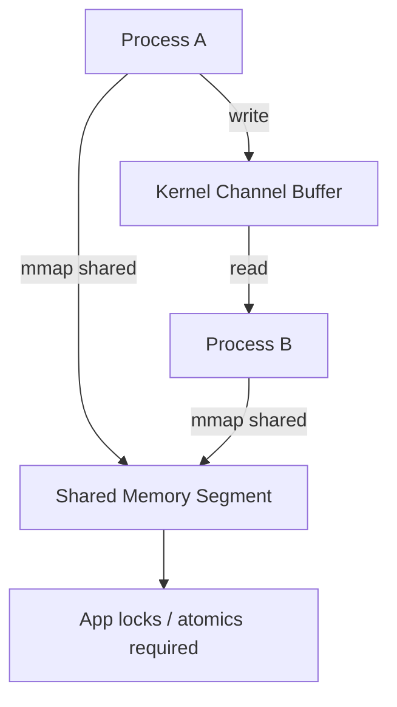
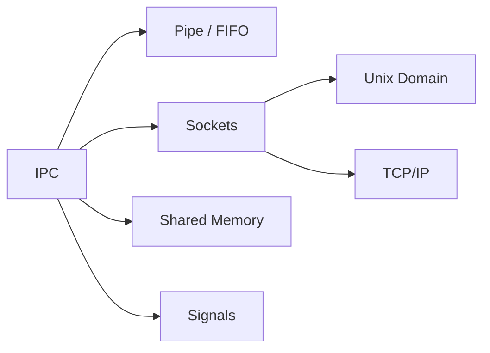
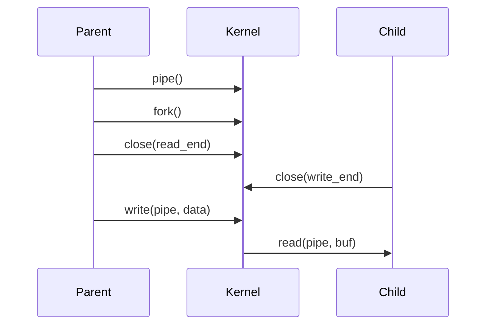

# Interprocess Communication Fundamentals

## Overview

**Interprocess communication (IPC)** lets isolated processes exchange data and synchronize without sharing arbitrary memory unsafely. Mechanisms include pipes, message queues, shared memory (with explicit synchronization), signals, and sockets. Each trades copying cost, latency, durability, and cross-machine reach differently.

This note teaches **IPC as a CS model**—semantics, ordering, and failure modes. Message brokers, gRPC, and service meshes in [[07-Backend/README|Backend]] build on these primitives; Unix domain socket ops and `ipcs` tooling live in [[10-Linux/README|Linux]].

## Learning Objectives

- Compare byte-stream vs message-boundary IPC abstractions
- Explain pipe inheritance across `fork` and socket IPC across hosts
- Identify when shared memory beats copying and what synchronization it requires
- Reason about ordering, duplication, and partial failure in IPC
- Map IPC choices to microservice vs monolith boundaries

## Prerequisites

- [[01-Computer-Science/04-Processes-and-Execution/Processes|Processes]]
- [[01-Computer-Science/04-Processes-and-Execution/System Calls|System Calls]]
- [[01-Computer-Science/05-Concurrency-Fundamentals/Locks and Critical Sections|Locks and Critical Sections]] (for shared memory)

## Difficulty

`intermediate`

## Estimated Time

4 hours reading, 3 hours labs

## History

Unix pipes (1970s) composed filter pipelines; System V IPC added message queues and shared segments; BSD sockets unified local and network communication. Modern systems add high-performance shared-memory rings (e.g., between GPU and CPU, or io_uring completion queues).

## Problem It Solves

Processes cannot safely read each other's heaps. IPC provides **controlled channels** so compilers, shells, databases, and services cooperate: shell `|` pipelines, Chrome multiprocess tabs, database connection protocols, and worker pools communicating with supervisors.

## Internal Implementation

| Mechanism | Copying | Scope | Typical use |
| --- | --- | --- | --- |
| Anonymous pipe | Kernel buffer copy | Parent/child relatives | Shell pipelines |
| Named pipe (FIFO) | Kernel buffer | Same machine | Legacy local IPC |
| Unix domain socket | Kernel buffer; optional SCM_RIGHTS fd pass | Same machine | Local RPC, Docker |
| TCP/UDP socket | Network stack | Cross-host | Services |
| Shared memory | Mapped pages, app-level sync | Same machine | High-throughput rings |
| Signals | Minimal data (signum) | Same process group | Lifecycle, timers |



## Mermaid Diagrams

### Structure



### Sequence / Lifecycle



## Examples

### Minimal Example

TypeScript (Node.js IPC via child process stdio):

```typescript
import { spawn } from "node:child_process";

const child = spawn("node", ["-e", "process.stdin.on('data',d=>process.stdout.write(d))"]);
child.stdin.write("ping\n");
child.stdout.on("data", (d) => console.log("pong:", d.toString()));
```

Python (anonymous pipe pattern via `multiprocessing`):

```python
from multiprocessing import Process, Pipe

def echo(conn):
    msg = conn.recv()
    conn.send(msg.upper())
    conn.close()

parent, child = Pipe()
p = Process(target=echo, args=(child,))
p.start()
parent.send(b"hello")
print(parent.recv())
p.join()
```

### Production-Shaped Example

Local supervisor ↔ worker JSON lines over Unix domain socket with length prefix and backpressure:

```python
# Framed messages: 4-byte big-endian length + payload
# On EAGAIN: register with epoll; apply max pending bytes — see Backpressure note
import struct, socket, os

sock = socket.socket(socket.AF_UNIX, socket.SOCK_STREAM)
path = "/tmp/supervisor.sock"
if os.path.exists(path):
    os.unlink(path)
sock.bind(path)
sock.listen(128)
```

Cross-host equivalent: TCP + TLS + application framing ([[07-Backend/README|Backend]]). Lab: [[01-Computer-Science/code/README|code labs]] framing + runtime modules.

## Trade-offs

| Dimension | Upside | Downside | When it matters |
| --- | --- | --- | --- |
| Pipes/sockets | Kernel-enforced boundaries | Copy overhead | Moderate throughput IPC |
| Shared memory | Lowest latency at scale | Complex sync, crash safety | Ring buffers, SHM queues |
| TCP | Universal, routable | Latency + serialization cost | Microservices |
| Signals | Lightweight notifications | Not a data channel | Graceful shutdown |

### When to Use

- **Pipes/sockets** for most parent/worker and local service IPC
- **Shared memory** when profiling proves copy cost dominates and invariants are strict
- **TCP/gRPC** when failure domains or teams require network boundaries

### When Not to Use

- Shared memory without a documented synchronization protocol
- Signals for bulk data transfer
- Pipes for cross-host communication

## Exercises

1. Trace FD inheritance for `cmd1 | cmd2 | cmd3`; draw open FDs per process after setup.
2. Implement length-prefixed framing over a pipe; handle partial reads.
3. Compare latency: pipe vs Unix socket vs shared-memory ring (hypothesis + benchmark).
4. List failure modes if the writer dies mid-message on a byte stream.

## Mini Project

Build **paired IPC echo servers** (TS + Python): Unix domain and TCP variants, framed JSON, max message size, graceful shutdown on SIGTERM. Integrate with [[01-Computer-Science/projects/Socket Workshop/README|Socket Workshop]].

## Portfolio Project

Extend [[01-Computer-Science/projects/Concurrent Runtime and Protocol Workbench/README|Concurrent Runtime and Protocol Workbench]] with a supervisor protocol over IPC including heartbeat and restart policy.

## Interview Questions

1. Difference between pipe and Unix domain socket?
2. Why does shared memory still need synchronization primitives?
3. How do you delimit messages on a byte stream?
4. What happens to unread pipe data when the writer exits?
5. When would you choose IPC over a shared database for coordination?

### Stretch / Staff-Level

1. Design IPC for a sandboxed plugin host: capability passing, FD inheritance limits, and denial-of-service via full pipes.

## Common Mistakes

- Assuming `write` atomicity beyond PIPE_BUF for pipes (POSIX nuance)
- No framing on streams → stuck parsers
- Shared memory without crash recovery semantics
- Ignoring backpressure when producer outruns consumer

## Best Practices

- Use explicit message framing and schema versioning
- Apply timeouts and max buffer limits on all IPC reads
- Pass `FD_CLOEXEC` and least-privilege credentials for child processes
- For production service IPC patterns, continue to [[07-Backend/README|Backend]]; for socket tuning [[10-Linux/README|Linux]]

## Summary

IPC channels let processes cooperate while preserving isolation: kernel-mediated pipes and sockets copy data but simplify correctness; shared memory inverts that trade-off. Byte-stream abstractions require application-level framing and flow control. Microservice architectures are IPC at scale—with network latency and partial failure added.

## Further Reading

- [[01-Computer-Science/07-Networking-Fundamentals/Sockets Programming Model|Sockets Programming Model]]
- [[01-Computer-Science/05-Concurrency-Fundamentals/Backpressure and Resource Contention|Backpressure and Resource Contention]]
- [[01-Computer-Science/01-Information-and-Representation/Data Serialization Fundamentals|Data Serialization Fundamentals]]

## Related Notes

- [[01-Computer-Science/04-Processes-and-Execution/Processes|Processes]]
- [[01-Computer-Science/04-Processes-and-Execution/System Calls|System Calls]]
- [[01-Computer-Science/05-Concurrency-Fundamentals/Semaphores and Condition Variables|Semaphores and Condition Variables]]
- [[07-Backend/README|Backend]]
- [[10-Linux/README|Linux]]
- [[01-Computer-Science/code/README|code labs]]

## Progress Checklist

- [ ] Explained from first principles
- [ ] Drew at least one Mermaid diagram
- [ ] Implemented a minimal version
- [ ] Documented trade-offs and non-goals
- [ ] Completed exercises
- [ ] Practiced interview questions aloud
- [ ] Linked prerequisites and dependents
