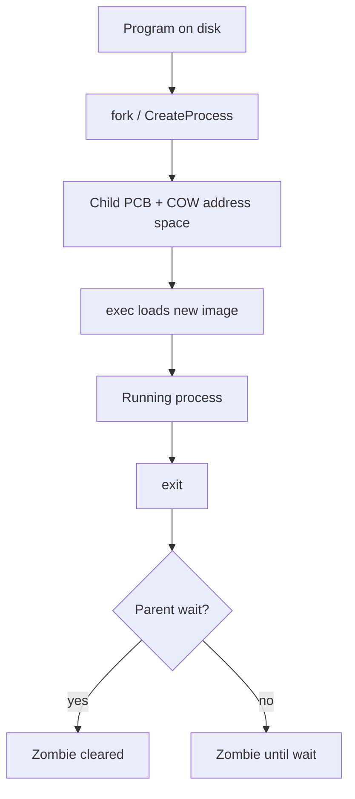
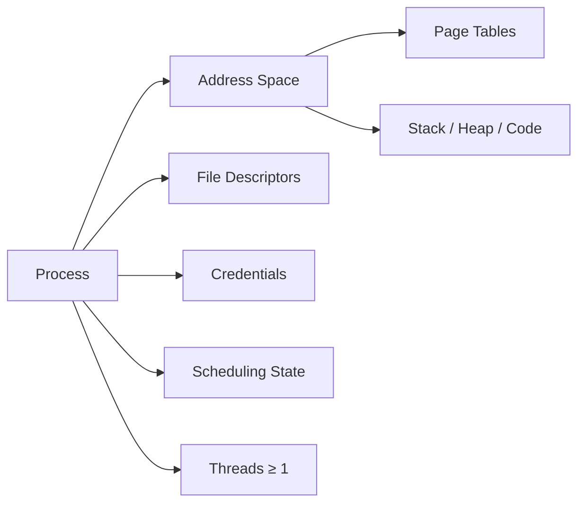
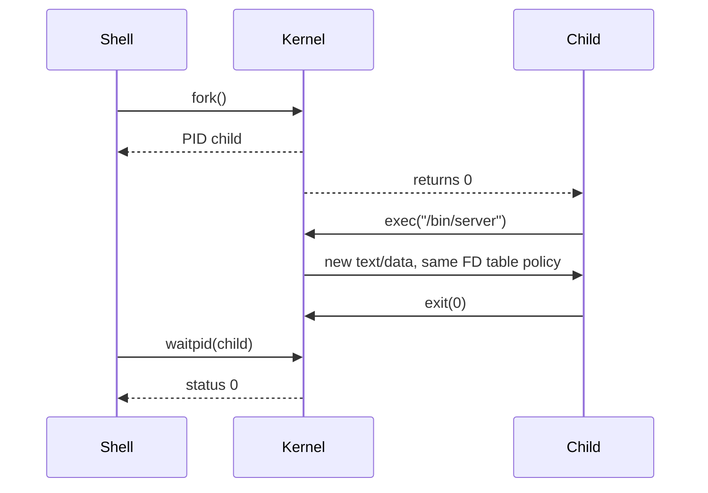

# Processes

## Overview

A **process** is the operating system's unit of **resource ownership and isolation**: an address space, a set of file descriptors, credentials, scheduling state, and one or more threads of execution. From first principles, a process is how the kernel multiplexes a single machine among many programs without letting them corrupt each other's memory or I/O state.

This note teaches the **CS process model**—what the kernel guarantees, what data structures represent a process, and how creation/termination works. Operational commands (`ps`, `top`, cgroups, systemd) live in [[10-Linux/02-Processes-Signals-and-Job-Control/Process Lifecycle ps and procfs|Process Lifecycle ps and procfs]], [[10-Linux/07-Cgroups-Namespaces-and-Isolation/cgroup v2 Controllers CPU Memory IO|cgroup v2 Controllers]], and [[10-Linux/06-systemd-Timers-and-Logging/Unit Types Dependencies and Targets|Unit Types Dependencies and Targets]]; here we build the mental model those tools inspect.

## Learning Objectives

- Define a process in terms of address space, file table, credentials, and execution context
- Explain how `fork`/`exec` (Unix) or `CreateProcess` (Windows) compose program startup
- Distinguish process isolation from thread sharing within a process
- Map process states to scheduler behavior and I/O blocking
- Relate the CS model to production concerns: OOM kills, zombie children, and blast radius

## Prerequisites

- [[01-Computer-Science/03-Memory-and-Addressing/Address Spaces|Address Spaces]]
- [[01-Computer-Science/03-Memory-and-Addressing/Virtual Memory|Virtual Memory]]
- [[01-Computer-Science/02-Machine-Model/Hardware Software Interface|Hardware Software Interface]]

## Difficulty

`intermediate`

## Estimated Time

3–4 hours reading, 2 hours exercises, 4–6 hours mini project

## History

Early batch systems ran one job at a time. Multiprogramming (1960s) kept the CPU busy by loading multiple programs into memory and switching when one blocked on I/O. The **process abstraction** formalized each program as an independent entity with protected memory, replacing ad-hoc overlays and shared-memory hacks that caused cross-program corruption.

## Problem It Solves

Without processes, every program would share one flat address space—any bug becomes a system-wide fault. Processes provide:

- **Isolation**: one buggy service cannot read another's heap
- **Accounting**: CPU time, memory, and I/O attributable per program
- **Security**: credentials and capabilities scoped per process
- **Failure containment**: kill one process without rebooting the machine

## Internal Implementation

Kernel process control block (PCB) typically tracks:

| Field | Purpose |
| --- | --- |
| PID | Unique identifier |
| Page tables | Virtual → physical mapping |
| File descriptor table | Open files, sockets, pipes |
| Signal disposition | Pending/handlers |
| Scheduling state | Priority, run queue membership |
| Parent/child links | Process tree, exit status propagation |

**Creation**: parent duplicates address space (copy-on-write on modern Unix), child may `exec` a new program image. **Termination**: release resources; zombie state until parent reaps exit code.



## Mermaid Diagrams

### Structure



### Sequence / Lifecycle



## Examples

### Minimal Example

TypeScript (Node.js child process — user-space wrapper over OS process):

```typescript
import { spawn } from "node:child_process";

const child = spawn("node", ["-e", "console.log(process.pid); process.exit(0)"]);
child.on("exit", (code) => console.log(`child exited ${code}`));
```

Python:

```python
import subprocess

proc = subprocess.Popen(["python", "-c", "import os; print(os.getpid())"])
code = proc.wait()
print(f"child exited {code}")
```

### Production-Shaped Example

A worker pool that isolates crash-prone parsing in child processes (blast-radius control):

```typescript
// Parent supervises N parser workers; OOM in one child does not take down the API.
import { fork } from "node:child_process";

function runParserJob(payload: Buffer): Promise<unknown> {
  return new Promise((resolve, reject) => {
    const worker = fork("./parser-worker.js", { stdio: ["pipe", "pipe", "pipe", "ipc"] });
    worker.send(payload);
    worker.on("message", resolve);
    worker.on("error", reject);
    worker.on("exit", (code) => {
      if (code !== 0) reject(new Error(`parser worker exit ${code}`));
    });
  });
}
```

Observability hooks: log `pid`, exit code, RSS at peak, and wall time per job.

## Trade-offs

| Dimension | Upside | Downside | When it matters |
| --- | --- | --- | --- |
| Isolation | Strong fault/security boundary | Higher memory overhead per instance | Untrusted code, parsers, plugins |
| Startup cost | — | fork+exec or container spin is milliseconds–seconds | Serverless cold starts, shell scripts |
| IPC overhead | — | Cross-process data needs pipes/sockets/shared mem | High-frequency microservice chatter |
| Simplicity | One failure domain per PID | Harder to share in-memory caches | Monolith vs microservice split |

### When to Use

- Running untrusted or crash-prone code (sandboxes, browser renderers)
- Long-lived services needing independent restart and resource limits
- CPU-bound parallelism when GIL or single-thread runtime blocks true threads

### When Not to Use

- Tight in-memory sharing with microsecond latency (prefer threads or shared memory with care)
- Thousands of tiny tasks where process overhead dominates (consider async I/O or thread pool)

## Exercises

1. Draw the process tree after a shell runs `a | b | c` (three processes, two pipes). Label FD inheritance.
2. Explain why a zombie exists and write the minimal parent code that creates one intentionally, then fixes it.
3. Compare memory footprint of 50 processes vs 50 threads running idle loops (hypothesize, then measure on your OS).
4. Trace what happens to open file descriptors across `fork` then `exec` with `FD_CLOEXEC` set.

## Mini Project

Build a **supervised worker** in TypeScript and Python: parent accepts JSON jobs on stdin, forks/spawns a child to run a CPU-heavy task with a timeout, kills on overrun, and logs exit status + peak RSS. Reuse patterns from [[01-Computer-Science/code/README|code labs]] runtime module.

## Portfolio Project

Extend [[01-Computer-Science/projects/Concurrent Runtime and Protocol Workbench/README|Concurrent Runtime and Protocol Workbench]] with a multi-process job runner that enforces memory limits and graceful shutdown on SIGTERM.

## Interview Questions

1. What is stored in a process that is *not* shared with its threads?
2. Walk through `fork`, `exec`, `wait` for `ls | wc -l`.
3. Why can a child process become a zombie? Who is responsible for cleanup?
4. How does copy-on-write make `fork` cheaper than full duplication?
5. When would you choose processes over threads for a web server?

### Stretch / Staff-Level

1. Design process isolation for a multi-tenant SaaS running user-supplied Python: address space, seccomp, cgroups, and failure modes when limits are misconfigured.

## Common Mistakes

- Confusing **process** (isolation boundary) with **program** (file on disk) or **job** (shell concept)
- Forgetting to `wait` on children → zombie accumulation
- Assuming `fork` duplicates all memory eagerly (modern OS uses COW)
- Using processes for fine-grained parallelism without measuring startup/IPC cost

## Best Practices

- Set `FD_CLOEXEC` on sensitive descriptors before `exec`
- Reap children (`waitpid` with `WNOHANG` in event loops) in long-running supervisors
- Apply resource limits (rlimit, cgroups) at process boundary in production
- Log PID + command line + exit code for operability; map to [[01-Computer-Science/09-Correctness-and-Reliability/Observability Fundamentals|Observability Fundamentals]]

## Summary

A process is the kernel's container for memory, files, and scheduling: it buys isolation and accountability at the cost of startup and IPC overhead. Threads run *inside* a process and share its address space; the next note covers that split. Operational tooling on Linux inspects this model—see [[10-Linux/02-Processes-Signals-and-Job-Control/Process Lifecycle ps and procfs|Process Lifecycle ps and procfs]]—but debugging production outages requires understanding PCBs, fork/exec semantics, and exit propagation first.

## Further Reading

- [[01-Computer-Science/04-Processes-and-Execution/Threads|Threads]]
- [[01-Computer-Science/04-Processes-and-Execution/System Calls|System Calls]]
- [[01-Computer-Science/04-Processes-and-Execution/Interprocess Communication Fundamentals|Interprocess Communication Fundamentals]]
- [[10-Linux/02-Processes-Signals-and-Job-Control/Process Lifecycle ps and procfs|Process Lifecycle ps and procfs]] for `ps`/`procfs`
- [[10-Linux/02-Processes-Signals-and-Job-Control/Signals Delivery and Common Handlers|Signals Delivery and Common Handlers]]
- [[10-Linux/07-Cgroups-Namespaces-and-Isolation/cgroup v2 Controllers CPU Memory IO|cgroup v2 Controllers CPU Memory IO]]
- [[10-Linux/06-systemd-Timers-and-Logging/Unit Types Dependencies and Targets|Unit Types Dependencies and Targets]]

## Related Notes

- [[01-Computer-Science/04-Processes-and-Execution/Threads|Threads]]
- [[01-Computer-Science/04-Processes-and-Execution/Context Switching|Context Switching]]
- [[01-Computer-Science/03-Memory-and-Addressing/Virtual Memory|Virtual Memory]]
- [[06-NodeJS/README|Node.js]] — event loop vs worker threads/processes
- [[07-Backend/README|Backend]] — service boundaries and blast radius
- [[01-Computer-Science/code/README|code labs]]

## Progress Checklist

- [ ] Explained from first principles
- [ ] Drew at least one Mermaid diagram
- [ ] Implemented a minimal version
- [ ] Documented trade-offs and non-goals
- [ ] Completed exercises
- [ ] Practiced interview questions aloud
- [ ] Linked prerequisites and dependents
