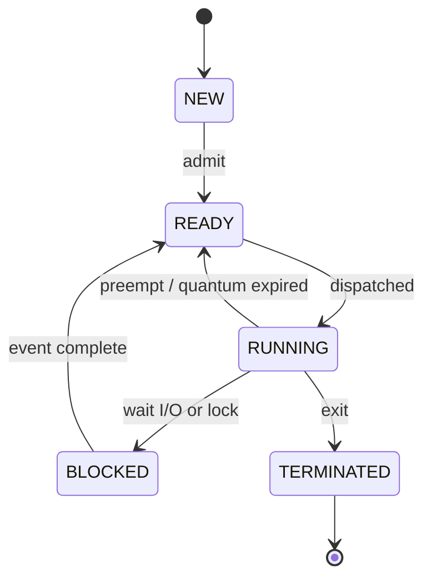
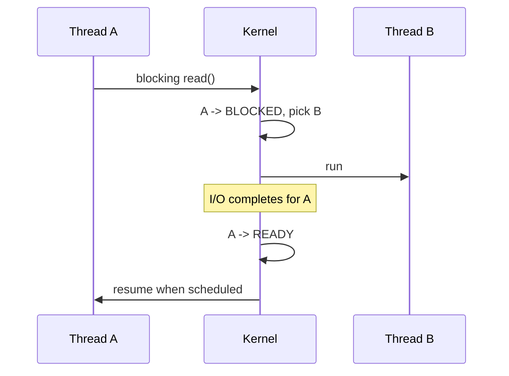

# Scheduling Concepts

## Overview

**Scheduling** is the policy and mechanism by which the kernel chooses which runnable thread executes on which CPU and for how long. Goals often conflict: maximize throughput, minimize response time, enforce fairness, respect priorities, and meet deadlines. This note teaches classic policies (FCFS, SJF, round-robin, multilevel feedback) and maps them to modern CFS-like behavior conceptually—without duplicating Linux sysctl tuning covered in [[10-Linux/README|Linux]].

## Learning Objectives

- Define process/thread states: NEW, READY, RUNNING, BLOCKED, TERMINATED
- Compare scheduling policies and their starvation/fairness properties
- Explain preemption, time quanta, and priority inversion at a conceptual level
- Relate scheduler choices to p99 latency in server workloads
- Connect user-space schedulers (runtime, thread pools) to OS scheduling

## Prerequisites

- [[01-Computer-Science/04-Processes-and-Execution/Processes|Processes]]
- [[01-Computer-Science/04-Processes-and-Execution/Threads|Threads]]
- [[01-Computer-Science/04-Processes-and-Execution/Context Switching|Context Switching]]

## Difficulty

`intermediate`

## Estimated Time

3 hours reading, 2 hours simulation exercises

## History

Batch FCFS evolved to multiprogramming with short-job preference, then **time-sharing** (1960s CTSS) introduced quanta and preemption so interactive users received regular CPU slices. Real-time and proportional-share schedulers followed for audio, virtualization, and cloud fairness.

## Problem It Solves

With more runnable threads than CPUs, something must decide **who runs next**. Poor scheduling wastes CPU on long jobs while interactive tasks stall, or starves low-priority batch work forever. Scheduling converts competing demands into predictable progress.

## Internal Implementation

**State machine**:



**Classic policies**:

| Policy | Idea | Risk |
| --- | --- | --- |
| FCFS | First ready, first run | Convoy effect behind slow jobs |
| SJF | Shortest job first | Starvation of long jobs |
| Round-robin | Fixed quantum per ready queue | High quantum → poor response; low → switch overhead |
| Priority | Highest priority first | Starvation without aging |
| MLFQ | Dynamic priority by behavior | Tunable but complex |

Modern general-purpose OS schedulers (e.g., Linux CFS) use **virtual runtime** to approximate fair CPU sharing among equal niceness, with cgroup weights for containers.

## Mermaid Diagrams

### Structure

```mermaid
flowchart LR
    Sched[Scheduler] --> RQ[Run Queues per CPU]
    Sched --> Policy[Fairness / Priority Policy]
    Sched --> Preempt[Preemption Timer]
    RQ --> CPU[CPU Core]
    Blocked[Blocked Queues] --> RQ : wakeup
```

### Sequence / Lifecycle



## Examples

### Minimal Example

Simulate round-robin with a toy queue (TypeScript):

```typescript
type Job = { name: string; remaining: number };
const quantum = 2;
const queue: Job[] = [
  { name: "A", remaining: 5 },
  { name: "B", remaining: 3 },
];

while (queue.some((j) => j.remaining > 0)) {
  const job = queue.shift()!;
  const slice = Math.min(quantum, job.remaining);
  job.remaining -= slice;
  console.log(`${job.name} runs ${slice}, left ${job.remaining}`);
  if (job.remaining > 0) queue.push(job);
}
```

Python equivalent:

```python
from collections import deque

quantum = 2
q = deque([("A", 5), ("B", 3)])
while q:
    name, rem = q.popleft()
    slice_ = min(quantum, rem)
    rem -= slice_
    print(f"{name} runs {slice_}, left {rem}")
    if rem > 0:
        q.append((name, rem))
```

### Production-Shaped Example

Backend service mixing **latency-sensitive** RPC handlers and **batch** exporters on one host—separate cgroup CPU weights or run batch on dedicated nodes ([[07-Backend/README|Backend]], [[10-Linux/README|Linux]] ops):

```text
API cgroup:   cpu.weight = 100  → protected share
Batch cgroup: cpu.weight = 10   → best-effort
```

Without isolation, batch jobs inflate RPC p99 via run-queue contention even if mean CPU looks fine.

## Trade-offs

| Dimension | Upside | Downside | When it matters |
| --- | --- | --- | --- |
| Fairness | Predictable share per tenant | May sacrifice global throughput | Multi-tenant SaaS |
| Response time | Small quanta help interactive tasks | More context switches | UI, API gateways |
| Throughput | Long quanta for batch | Interactive starvation | Analytics pipelines |
| Priority | Critical work first | Inversion, starvation | Real-time audio/video |

### When to Use

- OS scheduler for general computation—default for almost all threads
- **Additional** user-space prioritization for task queues (HTTP priority lanes)

### When Not to Use

- Do not reimplement a full preemptive OS scheduler in application code unless building a runtime ([[01-Computer-Science/05-Concurrency-Fundamentals/Asynchronous Event-Driven Models|event-driven models]] compose instead)

## Exercises

1. Construct an arrival schedule where SJF minimizes average wait time but starves a long job.
2. Compute average wait for three jobs under FCFS vs RR (quantum=2) given burst times (6,2,8).
3. Explain **priority inversion** with the classic Mars Pathfinder example pattern.
4. Map Node.js libuv thread pool tasks to OS-level READY threads under load.

## Mini Project

Build a **discrete-event scheduler simulator** (TS + Python) supporting FCFS, RR, and priority with aging; output wait time and turnaround metrics. Compare policies on mixed interactive/batch traces.

## Portfolio Project

Document scheduler assumptions in [[01-Computer-Science/projects/Concurrent Runtime and Protocol Workbench/README|Concurrent Runtime and Protocol Workbench]] load tests: thread count, CPU quota, and observed p99.

## Interview Questions

1. What is the convoy effect?
2. Difference between preemptive and non-preemptive scheduling?
3. How does multilevel feedback queue adapt to job behavior?
4. Why might mean CPU utilization be low while latency is high?
5. What is priority inversion and how can priority inheritance help?

### Stretch / Staff-Level

1. Design scheduling for a hybrid server: sync RPC threads, async I/O, and periodic cron—where do you enforce isolation?

## Common Mistakes

- Equating "low CPU%" with "healthy latency"
- Running CPU-heavy batch on same cgroup as user-facing API without weights
- Ignoring **run-queue latency** as a metric
- Assuming more threads always improves scheduling fairness

## Best Practices

- Separate latency-critical and batch workloads by cgroup, node, or queue
- Size thread pools near CPU capacity for compute-bound work
- Measure p50/p99/p999, not just averages ([[01-Computer-Science/07-Networking-Fundamentals/Latency Bandwidth Throughput and Tail Latency|Tail Latency]])
- Document niceness/affinity decisions in runbooks ([[10-Linux/README|Linux]])

## Summary

Scheduling decides which ready thread runs on which CPU under competing goals. Classic policies illustrate fairness, starvation, and response-time trade-offs that persist in modern fair-share schedulers. Application architects still must align thread counts, cgroup limits, and workload placement with those kernel policies to protect tail latency.

## Further Reading

- [[01-Computer-Science/04-Processes-and-Execution/Context Switching|Context Switching]]
- [[01-Computer-Science/05-Concurrency-Fundamentals/Backpressure and Resource Contention|Backpressure and Resource Contention]]
- [[09-System-Design/README|System Design]] — capacity planning

## Related Notes

- [[01-Computer-Science/04-Processes-and-Execution/Processes|Processes]]
- [[01-Computer-Science/04-Processes-and-Execution/Threads|Threads]]
- [[01-Computer-Science/04-Processes-and-Execution/System Calls|System Calls]]
- [[06-NodeJS/README|Node.js]]
- [[07-Backend/README|Backend]]
- [[10-Linux/README|Linux]]
- [[01-Computer-Science/code/README|code labs]]

## Progress Checklist

- [ ] Explained from first principles
- [ ] Drew at least one Mermaid diagram
- [ ] Implemented a minimal version
- [ ] Documented trade-offs and non-goals
- [ ] Completed exercises
- [ ] Practiced interview questions aloud
- [ ] Linked prerequisites and dependents
