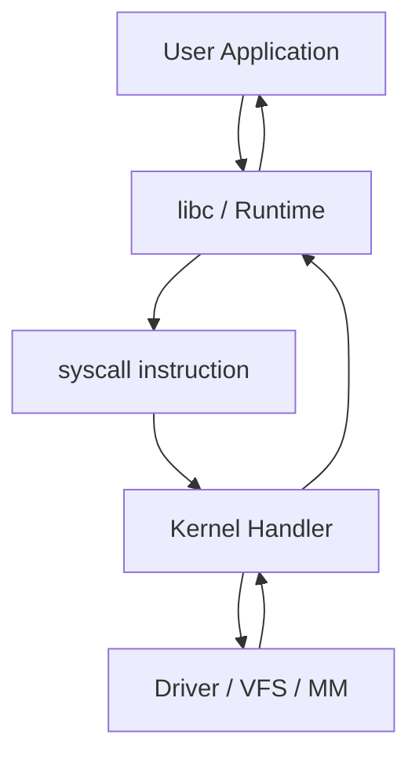
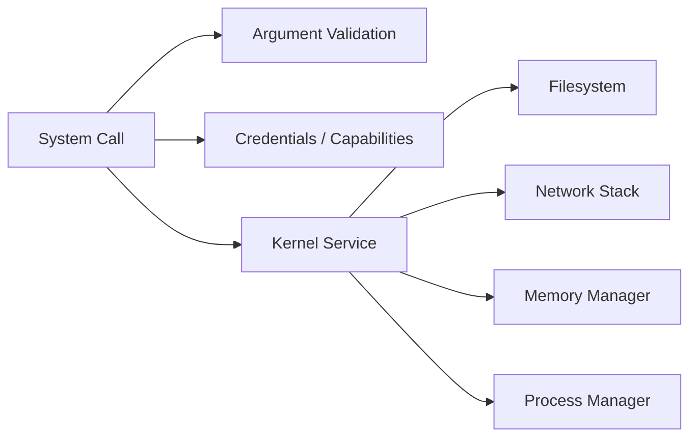
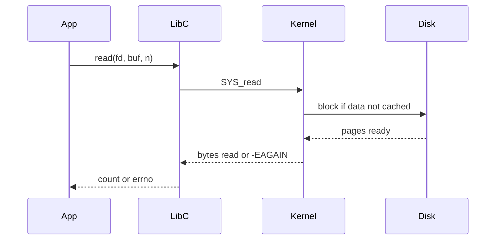

# System Calls

## Overview

A **system call** is the controlled gateway from user mode to kernel mode: user programs request privileged services (I/O, memory mapping, process creation, networking) via a trap instruction with a syscall number and arguments. The kernel validates credentials and parameters, performs the operation, and returns a result or error code. Every file read, socket send, and `malloc` page fault path eventually crosses this boundary.

This note explains the **mechanism** (trap, syscall table, return paths). Tracing syscalls in production (`strace`, eBPF) belongs to [[10-Linux/README|Linux]]; understanding traps explains *why* those traces look the way they do.

## Learning Objectives

- Describe user mode vs kernel mode and why syscalls exist
- Walk through a representative syscall path (e.g., `read`, `write`)
- Interpret errno-style errors and partial I/O semantics
- Estimate syscall frequency impact on high-QPS servers
- Map language standard libraries to underlying syscalls

## Prerequisites

- [[01-Computer-Science/04-Processes-and-Execution/Processes|Processes]]
- [[01-Computer-Science/02-Machine-Model/Hardware Software Interface|Hardware Software Interface]]
- [[01-Computer-Science/02-Machine-Model/Registers and Calling Conventions|Registers and Calling Conventions]]

## Difficulty

`intermediate`

## Estimated Time

3 hours reading, 2 hours tracing exercises

## History

Early OSes exposed full machine access; Multics and Unix introduced **rings of protection** and explicit syscall interfaces so applications could not arbitrarily manipulate devices or other processes' memory. Modern x86-64 uses `syscall`/`sysenter` fast paths; ARM uses `svc`.

## Problem It Solves

User code cannot safely:

- Touch device registers directly
- Modify page tables
- Switch processes

Syscalls centralize policy (permissions, quotas) and mechanism (drivers, filesystems) in the kernel, giving a stable ABI across kernel versions for userland.

## Internal Implementation

Typical path:

1. User wrapper (libc, Node libuv) marshals args
2. `syscall` instruction → kernel entry stub saves user registers
3. Dispatch via **syscall table** indexed by number
4. Kernel handler runs (may block → schedule away)
5. Return value in register; errors often `-errno` (Linux) or `NTSTATUS` (Windows)



**Blocking syscalls** and **non-blocking** + multiplexing (`poll`, `epoll`) connect to [[01-Computer-Science/06-IO-and-Persistence/Blocking Nonblocking and Multiplexed IO|Blocking and Multiplexed I/O]].

## Mermaid Diagrams

### Structure



### Sequence / Lifecycle



## Examples

### Minimal Example

TypeScript (indirect syscall via fs — still crosses kernel boundary):

```typescript
import { readFileSync } from "node:fs";

const buf = readFileSync("config.json"); // open + read + close syscalls inside
console.log(buf.length);
```

Python:

```python
with open("config.json", "rb") as f:
    data = f.read()
print(len(data))
```

Raw exposure (Python `os` — educational):

```python
import os
fd = os.open("config.json", os.O_RDONLY)
try:
    chunk = os.read(fd, 4096)
finally:
    os.close(fd)
```

### Production-Shaped Example

HTTP server syscall profile: accept loop + epoll + non-blocking reads reduces **thread blocking** but not necessarily **syscall count**:

```typescript
// Each accepted socket: fcntl O_NONBLOCK, epoll_ctl ADD, read/write in edge-triggered loop
// Tuning: readv/writev, sendfile, TCP cork — see Backend + Linux tracks
```

Log syscall errors with errno mapping; retry `EINTR`, backoff on `EAGAIN` with epoll wait.

## Trade-offs

| Dimension | Upside | Downside | When it matters |
| --- | --- | --- | --- |
| Safety | Centralized permission checks | User/kernel transition cost | Microsecond RPC fanout |
| Stability | ABI versioning | Semantic differences across OS | Cross-platform servers |
| Blocking | Simple programming model | Thread tied up or scheduler work | Connection pools |
| Batching | `readv`, io_uring reduces entries | Complexity | High throughput I/O |

### When to Use

- Always for privileged operations—there is no alternative in standard OS models
- Batch and buffer to amortize syscall cost in hot paths

### When Not to Use

- Avoid **chatty** syscalls in inner loops (per-byte read/write)
- Do not busy-poll when blocking or epoll would yield CPU

## Exercises

1. List syscalls likely invoked by `fetch("https://example.com")` end-to-end (DNS, socket, TLS userland, write/read).
2. Explain why `write` may return fewer bytes than requested and how robust code handles it.
3. Compare cost model: 1 syscall reading 1 MB vs 1000 syscalls reading 1 KB each.
4. Trace a minimal C or Python program with `strace -c` and categorize syscall hotspots.

## Mini Project

Implement a **syscall counter wrapper** around a tiny HTTP client (TS + Python): log counts per request phase. Relate to [[01-Computer-Science/code/README|code labs]] runtime/socket exercises.

## Portfolio Project

Include a syscall/epoll diagram in [[01-Computer-Science/projects/Socket Workshop/README|Socket Workshop]] documentation.

## Interview Questions

1. What happens CPU-wise when user code executes a syscall?
2. Difference between a function call and a syscall?
3. Why can `read` block, and how does non-blocking mode change behavior?
4. What is `EINTR` and how should libraries handle it?
5. How does io_uring change the syscall story on Linux?

### Stretch / Staff-Level

1. A service shows high `sendmsg` syscall rate but low bandwidth—what layers would you inspect?

## Common Mistakes

- Assuming library I/O is "pure user space" (often buffered syscalls)
- Ignoring partial writes on sockets and pipes
- Retrying all errors blindly without classifying transient vs fatal
- Confusing **syscall** with **context switch** (many syscalls block and cause switches, but not every syscall switches)

## Best Practices

- Use buffered I/O or vector I/O for bulk transfers
- Handle `EINTR`, partial I/O, and `EAGAIN` explicitly in network code
- Profile with `strace -c`, `perf`, or eBPF before micro-optimizing ([[10-Linux/README|Linux]])
- Document platform-specific syscall behavior in portable services ([[07-Backend/README|Backend]])

## Summary

System calls are the kernel API: trap, dispatch, validate, execute, return. They enforce protection and unify device access at the cost of transition overhead and blocking behavior. High-performance servers reduce syscall frequency and pair non-blocking fds with multiplexers—building on this model, not bypassing it unsafely.

## Further Reading

- [[01-Computer-Science/06-IO-and-Persistence/Blocking Nonblocking and Multiplexed IO|Blocking Nonblocking and Multiplexed IO]]
- [[01-Computer-Science/04-Processes-and-Execution/Interprocess Communication Fundamentals|Interprocess Communication Fundamentals]]
- [[01-Computer-Science/07-Networking-Fundamentals/Sockets Programming Model|Sockets Programming Model]]

## Related Notes

- [[01-Computer-Science/04-Processes-and-Execution/Processes|Processes]]
- [[01-Computer-Science/04-Processes-and-Execution/Context Switching|Context Switching]]
- [[10-Linux/README|Linux]]
- [[06-NodeJS/README|Node.js]] — libuv syscall batching
- [[07-Backend/README|Backend]]
- [[01-Computer-Science/code/README|code labs]]

## Progress Checklist

- [ ] Explained from first principles
- [ ] Drew at least one Mermaid diagram
- [ ] Implemented a minimal version
- [ ] Documented trade-offs and non-goals
- [ ] Completed exercises
- [ ] Practiced interview questions aloud
- [ ] Linked prerequisites and dependents
