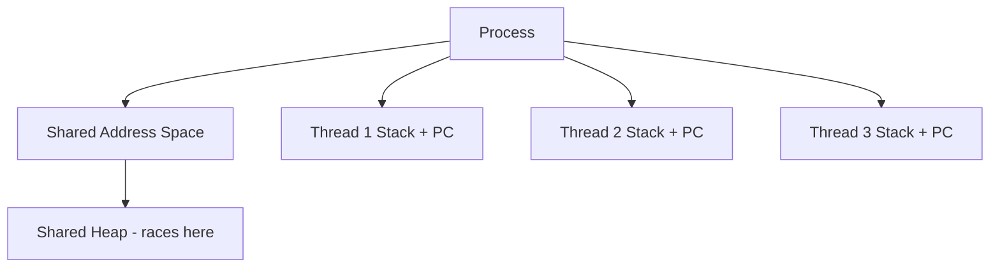
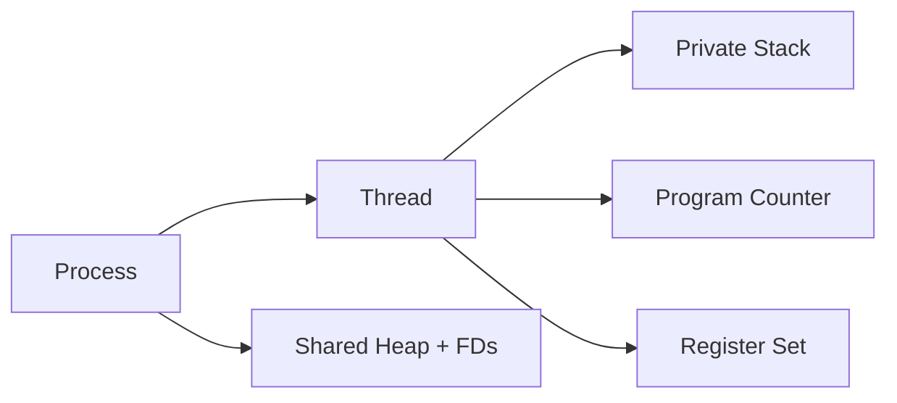
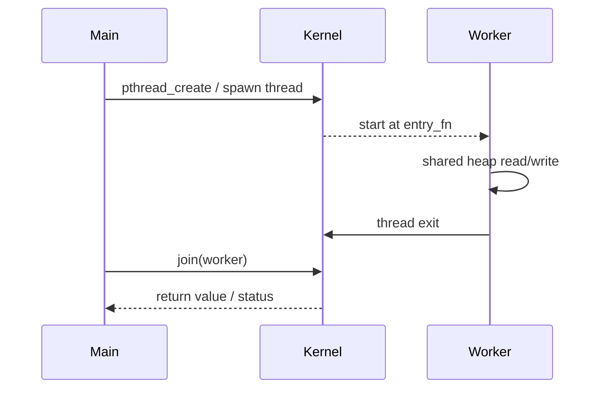

# Threads

## Overview

A **thread** is a schedulable unit of execution **within** a process. Threads share the process address space, file descriptors, and credentials, but each has its own stack, program counter, and register set. Multiple threads let one program exploit I/O overlap and multi-core CPUs without paying full process isolation costs.

This note covers the **CS thread model**: kernel vs user threads, creation cost, shared mutable state hazards, and mapping to language runtimes. Language-specific APIs (`Worker`, `asyncio`, pthread wrappers) are developed further in [[06-NodeJS/README|Node.js]] and [[03-Python/README|Python]].

## Learning Objectives

- Explain what threads share vs what remains private per thread
- Compare kernel-thread and user-thread (M:N) models
- Predict race conditions when threads mutate shared heap data
- Choose threads vs processes vs async I/O for a given workload
- Relate thread count to scheduler load and memory (stack per thread)

## Prerequisites

- [[01-Computer-Science/04-Processes-and-Execution/Processes|Processes]]
- [[01-Computer-Science/03-Memory-and-Addressing/Stack and Heap|Stack and Heap]]
- [[01-Computer-Science/02-Machine-Model/Registers and Calling Conventions|Registers and Calling Conventions]]

## Difficulty

`intermediate`

## Estimated Time

3 hours reading, 2 hours labs, 3 hours mini project

## History

OS/360 ran single-threaded jobs. Threads emerged as **lightweight processes** inside a shared address space (1980s–90s, e.g., Solaris, pthreads) so servers could handle many concurrent connections without duplicating memory for each client state machine.

## Problem It Solves

A single-threaded process blocks entirely on slow I/O. Threads allow:

- **Concurrent progress** while one thread waits on disk or network
- **Parallel CPU work** on multiple cores sharing read-mostly data
- **Lower overhead** than processes for frequent task switching (same page tables)

They introduce **shared-memory concurrency bugs**—the subject of [[01-Computer-Science/05-Concurrency-Fundamentals/Race Conditions|Race Conditions]] and synchronization primitives.

## Internal Implementation

| Per-thread | Per-process (shared) |
| --- | --- |
| Stack (typically MB-scale) | Heap |
| Program counter, registers | Code segment |
| Thread-local storage (TLS) | File descriptor table |
| Kernel scheduling entity (1:1 model) | Page tables, credentials |

**1:1 model** (Linux NPTL, Windows): each user thread maps to a kernel schedulable entity. **M:N model** (historical green threads): many user threads multiplexed on fewer kernel threads—lower kernel overhead, harder blocking syscall handling.



## Mermaid Diagrams

### Structure



### Sequence / Lifecycle



## Examples

### Minimal Example

TypeScript (Worker Threads — separate V8 isolates, not OS threads inside one isolate, but OS threads under the hood):

```typescript
import { Worker, isMainThread, parentPort, workerData } from "node:worker_threads";

if (isMainThread) {
  const w = new Worker(new URL(import.meta.url), { workerData: { n: 40 } });
  w.on("message", (fib) => console.log("fib", fib));
} else {
  function fib(n: number): number {
    return n < 2 ? n : fib(n - 1) + fib(n - 1);
  }
  parentPort!.postMessage(fib(workerData.n));
}
```

Python (`threading` — OS threads; GIL limits CPU parallelism for CPython bytecode):

```python
import threading

def work(n: int) -> None:
    total = sum(i * i for i in range(n))
    print(f"thread {threading.current_thread().name} -> {total}")

t = threading.Thread(target=work, args=(1_000_000,))
t.start()
t.join()
```

### Production-Shaped Example

Thread pool with bounded queue and graceful shutdown (contrast with unbounded `new Thread` per request):

```python
from concurrent.futures import ThreadPoolExecutor, as_completed
import time

def fetch(url: str) -> str:
    time.sleep(0.05)  # stand-in for I/O
    return f"body:{url}"

with ThreadPoolExecutor(max_workers=32) as pool:
    futures = [pool.submit(fetch, u) for u in urls]
    for fut in as_completed(futures):
        handle(fut.result())
```

Pair with [[01-Computer-Science/05-Concurrency-Fundamentals/Backpressure and Resource Contention|Backpressure and Resource Contention]] when the queue grows without bound.

## Trade-offs

| Dimension | Upside | Downside | When it matters |
| --- | --- | --- | --- |
| Memory | Shared heap, cheaper than processes | ~1 MB stack × thread count | 10k-thread designs |
| CPU parallelism | True multi-core on native code | GIL, JS single-thread default | CPU-bound Python/Node |
| Debugging | Single address space | Heisenbugs from races | Shared mutable caches |
| Failure | — | One thread fault can kill process | Untrusted plugins |

### When to Use

- Blocking I/O-heavy workloads with a thread-per-request or bounded pool model
- Native extensions releasing the GIL (NumPy, some Node native addons)
- Shared read-heavy caches where lock overhead is acceptable

### When Not to Use

- CPU-bound parallelism in CPython without multiprocessing or native code
- Default Node.js HTTP handlers (prefer event loop + async I/O; see [[06-NodeJS/README|Node.js]])
- Fine-grained tasks where synchronization dominates (consider batching or atomics)

## Exercises

1. List five variables in a typical web server that would be **shared** vs **thread-local**.
2. Create two threads that increment a shared counter 1e6 times each without synchronization; explain the result distribution.
3. Measure context-switch overhead: thread pool size 1 vs 64 on I/O-bound vs CPU-bound tasks.
4. Diagram why `malloc` must be thread-safe internally even if your code uses no locks.

## Mini Project

Implement a **bounded thread pool** in TypeScript and Python with: submit, shutdown, and in-flight task metrics. Compare throughput to `asyncio` / `Promise.all` on simulated I/O. Lab reference: [[01-Computer-Science/code/README|code labs]] `runtime`.

## Portfolio Project

Add a thread-pool stage to [[01-Computer-Science/projects/Concurrency Zoo/README|Concurrency Zoo]] demonstrating queue saturation and graceful drain.

## Interview Questions

1. What do threads share that processes do not?
2. Why might 10,000 threads hurt performance even on a 64-core machine?
3. Explain the difference between kernel threads and green threads.
4. How does the Python GIL affect CPU-bound vs I/O-bound threading?
5. When is `fork` in a multi-threaded process dangerous?

### Stretch / Staff-Level

1. A service uses 500 threads and p99 latency spikes—walk through scheduler run-queue length, lock contention, and stack memory as hypotheses.

## Common Mistakes

- Treating threads as "free parallelism" without measuring synchronization cost
- Sharing mutable singletons across request threads without locks
- Creating unbounded threads under load (thread explosion)
- Confusing **concurrency** (structure) with **parallelism** (simultaneous execution)—see [[01-Computer-Science/05-Concurrency-Fundamentals/Concurrency vs Parallelism|Concurrency vs Parallelism]]

## Best Practices

- Prefer bounded pools; expose queue depth metrics
- Minimize shared mutable state; use message passing where practical
- Document thread-safety of libraries you call from worker threads
- For Linux ops (limits, `ulimit`, thread counts in `ps`), hand off to [[10-Linux/README|Linux]]

## Summary

Threads are lightweight execution units inside a process: they share memory and file state, so they enable cheap concurrency but require explicit synchronization for correctness. Processes isolate; threads cooperate. Production systems combine both—processes for blast radius, threads or async I/O for throughput—guided by workload and runtime constraints.

## Further Reading

- [[01-Computer-Science/05-Concurrency-Fundamentals/Race Conditions|Race Conditions]]
- [[01-Computer-Science/04-Processes-and-Execution/Context Switching|Context Switching]]
- [[03-Python/README|Python]] — GIL and multiprocessing
- [[06-NodeJS/README|Node.js]] — libuv thread pool and worker threads

## Related Notes

- [[01-Computer-Science/04-Processes-and-Execution/Processes|Processes]]
- [[01-Computer-Science/04-Processes-and-Execution/Scheduling Concepts|Scheduling Concepts]]
- [[01-Computer-Science/05-Concurrency-Fundamentals/Locks and Critical Sections|Locks and Critical Sections]]
- [[07-Backend/README|Backend]]
- [[01-Computer-Science/code/README|code labs]]

## Progress Checklist

- [ ] Explained from first principles
- [ ] Drew at least one Mermaid diagram
- [ ] Implemented a minimal version
- [ ] Documented trade-offs and non-goals
- [ ] Completed exercises
- [ ] Practiced interview questions aloud
- [ ] Linked prerequisites and dependents
