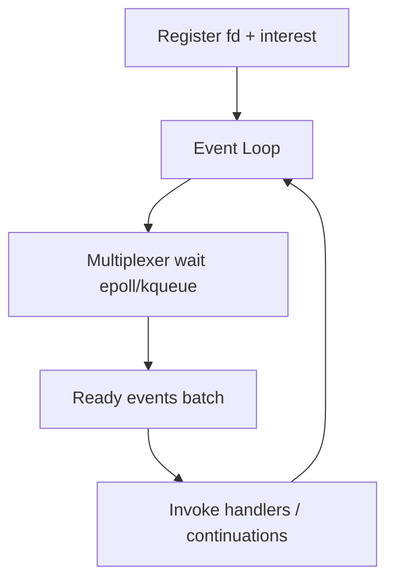
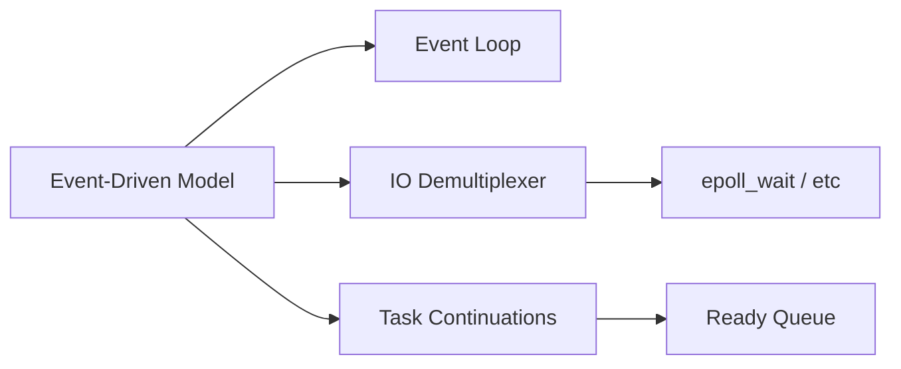

# Asynchronous Event-Driven Models

## Overview

An **asynchronous event-driven** program structures work as **tasks** driven by an **event loop** (or reactor): register interest in I/O or timers, continue other work while waits are outstanding, resume via callbacks or `async/await` continuations when events fire. One thread can manage many concurrent I/O-bound operations without one thread per connection.

This is a **concurrency model**, not automatic **parallelism**. Node.js, asyncio, and Java NIO embody variants; kernel multiplexers (`epoll`, `kqueue`, IOCP) sit below—see [[01-Computer-Science/06-IO-and-Persistence/Blocking Nonblocking and Multiplexed IO|Multiplexed I/O]] and [[10-Linux/05-Networking-Stack-and-Host-Firewall/TCP UDP Sockets ss and Conntrack|TCP UDP Sockets ss and Conntrack]] ops for tuning.

## Learning Objectives

- Diagram event loop phases: poll, dispatch callbacks, microtasks
- Contrast callback, Promise, and async/await styles
- Explain why CPU-bound work blocks the loop and how to offload
- Map libuv / asyncio architecture to syscall multiplexing
- Design services that remain responsive under I/O latency

## Prerequisites

- [[01-Computer-Science/05-Concurrency-Fundamentals/Concurrency vs Parallelism|Concurrency vs Parallelism]]
- [[01-Computer-Science/04-Processes-and-Execution/System Calls|System Calls]]
- [[01-Computer-Science/06-IO-and-Persistence/Blocking Nonblocking and Multiplexed IO|Blocking Nonblocking and Multiplexed IO]]

## Difficulty

`intermediate`

## Estimated Time

4 hours reading, 4 hours event-loop labs

## History

Reactor pattern (Schmidt, 1990s) formalized demultiplexing events to handlers. Node.js (2009) popularized single-threaded JS + libuv for web I/O; Python `asyncio` (3.4+) brought native syntax; all build on decades of `select`/`poll`/`epoll` evolution.

## Problem It Solves

Thread-per-connection models exhaust memory and scheduler capacity at tens of thousands of idle connections. Event-driven I/O **overlaps waits** on one or few threads, improving **connection scalability** and reducing context switches—core to modern gateways and realtime servers ([[06-NodeJS/README|Node.js]], [[07-Backend/README|Backend]]).

## Internal Implementation



**Phases (Node-like)**:

1. Timers
2. Pending callbacks
3. Poll I/O
4. Check (`setImmediate`)
5. Close callbacks
6. Microtasks (`Promise.then`) often interleaved per turn

Blocking the loop during CPU work delays **all** I/O callbacks—starvation at application level.

## Mermaid Diagrams

### Structure



### Sequence / Lifecycle

```mermaid
sequenceDiagram
    participant Handler
    participant Loop
    participant Kernel
    participant Socket
    Handler->>Loop: await read(socket)
    Loop->>Kernel: epoll_ctl ADD
    Loop->>Loop: run other tasks
    Socket->>Kernel: data arrives
    Kernel->>Loop: epoll_wait returns
    Loop->>Handler: resume continuation
```

## Examples

### Minimal Example

TypeScript (async HTTP fetch overlap):

```typescript
async function main() {
  const [a, b] = await Promise.all([
    fetch("https://httpbin.org/delay/1").then((r) => r.status),
    fetch("https://httpbin.org/delay/1").then((r) => r.status),
  ]);
  console.log(a, b); // ~1s total, not 2s — concurrent waits
}
await main();
```

Python (`asyncio`):

```python
import asyncio

async def fetch_sim(label: str, delay: float) -> str:
    await asyncio.sleep(delay)  # yields to loop
    return label

async def main():
    results = await asyncio.gather(fetch_sim("a", 1), fetch_sim("b", 1))
    print(results)

asyncio.run(main())
```

### Production-Shaped Example

Offload CPU from event loop — TypeScript:

```typescript
import { Worker } from "node:worker_threads";

async function hashPassword(pw: string): Promise<string> {
  // bcrypt on main thread blocks all requests — use worker pool
  return new Promise((resolve, reject) => {
    const w = new Worker("./hash-worker.js", { workerData: pw });
    w.on("message", resolve);
    w.on("error", reject);
  });
}
```

Python:

```python
import asyncio
from concurrent.futures import ProcessPoolExecutor

executor = ProcessPoolExecutor(max_workers=4)

async def heavy(n: int) -> int:
    loop = asyncio.get_running_loop()
    return await loop.run_in_executor(executor, lambda: sum(i*i for i in range(n)))
```

## Trade-offs

| Dimension | Upside | Downside | When it matters |
| --- | --- | --- | --- |
| Scalability | Many idle connections | CPU work needs offload | WebSockets, APIs |
| Simplicity | No locks for shared JS heap | Callback/promise complexity | Single-thread runtimes |
| Latency | Fewer OS threads | Head-of-line blocking on loop | Mixed workloads |
| Debugging | Ordered turn model | Stack traces across await | Async stack tooling |

### When to Use

- I/O-bound servers with high connection counts
- Latency-sensitive gateways overlapping upstream calls
- Embedded/realtime supervisors with clear event sources

### When Not to Use

- CPU-bound pipelines without worker offload
- Teams unable to enforce non-blocking discipline in libraries
- Simple CRUD with low concurrency (threads may suffice)

## Exercises

1. Draw timeline: sync vs async three parallel 100ms I/O ops.
2. Demonstrate event-loop stall with 5s CPU loop in Node/asyncio handler.
3. Implement tiny echo server: blocking vs `asyncio.start_server`.
4. Trace libuv thread pool involvement for `fs.readFile` in Node ([[06-NodeJS/README|Node.js]]).

## Mini Project

Build **async echo server + load generator** (TS + Python) reporting throughput and p99; add worker offload for echo-with-hash variant. Tie to [[01-Computer-Science/code/README|code labs]] runtime.

## Portfolio Project

Event-loop architecture doc for [[01-Computer-Science/projects/Socket Workshop/README|Socket Workshop]] including failure modes under CPU load.

## Interview Questions

1. How does an event loop differ from OS preemption?
2. Why does async not parallelize CPU work on one thread?
3. What runs first: `setImmediate`, `setTimeout(0)`, or `Promise.then` in Node?
4. How would you structure a Node service doing JWT verify + DB + HTTP fanout?
5. Reactor vs proactor pattern?

### Stretch / Staff-Level

1. Design backpressure across async HTTP handlers and downstream Kafka producer ([[01-Computer-Science/05-Concurrency-Fundamentals/Backpressure and Resource Contention|Backpressure]]).

## Common Mistakes

- Blocking syscalls in async handlers (`time.sleep`, sync DB drivers)
- Unbounded `create_task` without semaphores
- Shared mutable state without locks across worker threads **and** loop
- Assuming `gather`/`all` implies parallelism for CPU

## Best Practices

- Use async-native drivers end-to-end
- Offload CPU/blocking to pools with bounds
- Instrument loop lag / event loop delay metrics
- Apply timeouts and cancellation tokens on all awaits

## Summary

Event-driven models multiplex many I/O waits on few threads via a loop and kernel demultiplexer—concurrency without thread-per-request cost. They excel when waits dominate but require strict non-blocking discipline and explicit CPU offload. Node and asyncio are reference implementations built on this CS pattern.

## Further Reading

- [[01-Computer-Science/06-IO-and-Persistence/Blocking Nonblocking and Multiplexed IO|Blocking Nonblocking and Multiplexed IO]]
- [[01-Computer-Science/05-Concurrency-Fundamentals/Backpressure and Resource Contention|Backpressure and Resource Contention]]
- [[06-NodeJS/README|Node.js]]
- [[03-Python/README|Python]] — asyncio depth

## Related Notes

- [[01-Computer-Science/05-Concurrency-Fundamentals/Concurrency vs Parallelism|Concurrency vs Parallelism]]
- [[01-Computer-Science/04-Processes-and-Execution/Threads|Threads]]
- [[07-Backend/README|Backend]]
- [[01-Computer-Science/code/README|code labs]]

## Progress Checklist

- [ ] Explained from first principles
- [ ] Drew at least one Mermaid diagram
- [ ] Implemented a minimal version
- [ ] Documented trade-offs and non-goals
- [ ] Completed exercises
- [ ] Practiced interview questions aloud
- [ ] Linked prerequisites and dependents
