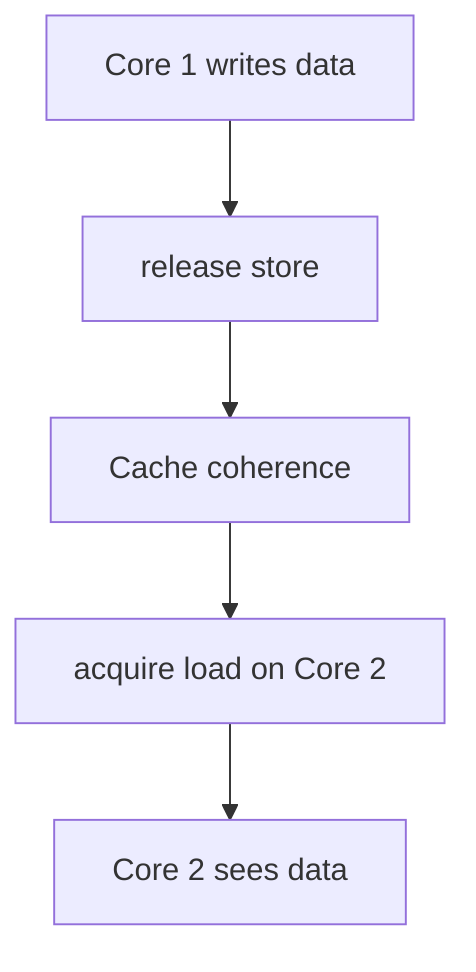
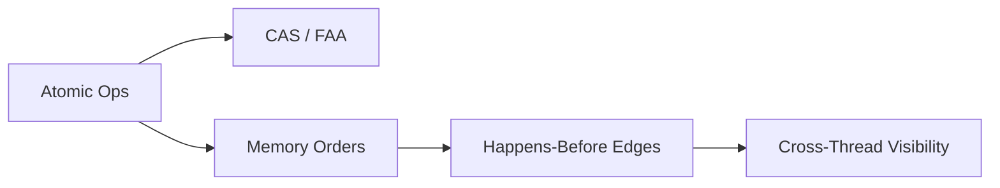
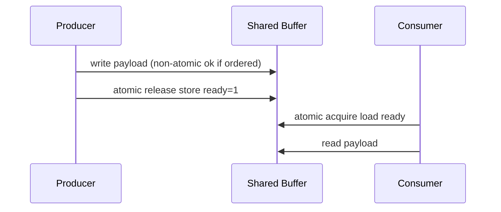

# Atomics and Memory Ordering

## Overview

**Atomic operations** execute as indivisible units from the perspective of other threads: read-modify-write like compare-and-swap (CAS) happens without interleaving. **Memory ordering** constraints define which writes become visible to other cores and in what order—hardware and compilers reorder for performance unless constrained.

Atomics enable lock-free algorithms (counters, queues, RCU-like patterns) with lower contention than mutexes—but they do **not** eliminate the need for careful design. This note teaches hardware intuition and API-level ordering; language memory models are deepened in [[02-JavaScript/README|JavaScript]] and [[03-Python/README|Python]] where applicable.

## Learning Objectives

- Explain why plain loads/stores are insufficient for cross-thread visibility
- Use atomics for counters and simple lock-free structures
- Compare memory orders: relaxed, acquire, release, seq_cst
- Identify when atomics replace mutexes vs when they do not
- Recognize ABA problem and false sharing in production tuning

## Prerequisites

- [[01-Computer-Science/05-Concurrency-Fundamentals/Race Conditions|Race Conditions]]
- [[01-Computer-Science/05-Concurrency-Fundamentals/Locks and Critical Sections|Locks and Critical Sections]]
- [[01-Computer-Science/02-Machine-Model/Cache Hierarchy and Locality|Cache Hierarchy and Locality]]

## Difficulty

`advanced`

## Estimated Time

4–5 hours reading, 4 hours labs

## History

Multiprocessors exposed cache coherence (MESI) and visible reordering. Lock-free research (1990s–2000s) and standardized memory models (C++11, Java, C11) gave programmers portable fences and atomics instead of ad-hoc `volatile` misuse.

## Problem It Solves

Mutexes serialize even uncontended hot paths and forbid concurrent reads during tiny updates. Atomics provide **wait-free or lock-free** progress for simple operations. Memory ordering controls **which optimizations remain legal** while preserving happens-before relationships programmers rely on.

## Internal Implementation

**Compare-and-swap**:

```text
CAS(addr, expected, new):
  atomically if *addr == expected: *addr = new; return true
  else: return false
```

**Memory orders (conceptual)**:

| Order | Guarantee |
| --- | --- |
| relaxed | Atomicity only; no ordering |
| acquire | Subsequent reads/writes not hoisted before |
| release | Prior reads/writes not sunk after |
| seq_cst | Global total order (simplest, often costlier) |



**False sharing**: independent atomics on same cache line cause coherence traffic—pad hot counters.

## Mermaid Diagrams

### Structure



### Sequence / Lifecycle



## Examples

### Minimal Example

TypeScript (`Atomics` on SharedArrayBuffer):

```typescript
const buf = new SharedArrayBuffer(4);
const view = new Int32Array(buf);

// Worker increments with atomic add — no lost updates
Atomics.add(view, 0, 1);
const v = Atomics.load(view, 0); // specify ordering in lower-level APIs as needed
```

Python (`threading` lacks user atomics; use C extension or simulate with lock):

```python
from threading import Lock

class AtomicInt:
    def __init__(self, value: int = 0):
        self._value = value
        self._lock = Lock()

    def increment(self) -> int:
        with self._lock:
            self._value += 1
            return self._value

# Production CPU atomics: multiprocessing.Value('i', lock=True) or C/Rust extension
```

For true lock-free Python, extensions or `asyncio` single-thread models are common—document parity limits in [[01-Computer-Science/code/README|code labs]].

### Production-Shaped Example

Lock-free metrics counter with sharded atomics ([[07-Backend/README|Backend]] observability):

```typescript
const shards = Array.from({ length: 16 }, () => new Int32Array(new SharedArrayBuffer(4)));

function record(shardKey: number) {
  const s = shards[shardKey & 15];
  Atomics.add(s, 0, 1);
}

function snapshot(): number {
  return shards.reduce((sum, s) => sum + Atomics.load(s, 0), 0);
}
```

Shading reduces false sharing vs one global counter.

## Trade-offs

| Dimension | Upside | Downside | When it matters |
| --- | --- | --- | --- |
| vs Mutex | Lower contention hot paths | Hard to prove correct | Metrics, ref counts |
| relaxed order | Faster | Easy to get wrong | Expert-only paths |
| seq_cst | Mental model simpler | May limit reorder opts | Default when unsure |
| Lock-free structures | Progress guarantees | ABA, complexity | Queues at scale |

### When to Use

- Simple counters, flags, statistics
- Expert-reviewed lock-free queues/ stacks
- Cross-thread handoff with release/acquire pair on flag

### When Not to Use

- Multi-field invariants without careful protocol
- When mutex clarity outweighs microsecond savings
- Replacing DB transactions

## Exercises

1. Implement spinlock with CAS; discuss fairness issues.
2. Show publication safety bug: thread sets `ready=true` before data visible without release/acquire.
3. Explain false sharing; pad struct layout to fix benchmark.
4. When does CAS loop in `push` on lock-free stack fail under ABA?

## Mini Project

Build **sharded atomic counter** and **mutex counter** (TS + Python lock-based); compare throughput vs thread count. Document memory order choices in TS `Atomics`.

## Portfolio Project

Add lock-free metrics module to [[01-Computer-Science/projects/Concurrent Runtime and Protocol Workbench/README|Concurrent Runtime and Protocol Workbench]] with correctness argument.

## Interview Questions

1. What does CAS do?
2. Difference between atomicity and memory visibility?
3. When is `volatile` in Java/C **not** enough?
4. Explain acquire/release pairing.
5. What is false sharing?

### Stretch / Staff-Level

1. Outline happens-before for a lock-free queue enqueue/dequeue with minimal ordering.

## Common Mistakes

- Using relaxed everywhere to "go fast" without proof
- Assuming `counter++` is atomic in C/Java without `atomic`/`volatile`/锁
- One giant atomic struct instead of separating hot fields
- Lock-free code without formal invariant documentation

## Best Practices

- Default to mutex; promote to atomics with benchmarks and proofs
- Use release/acquire for handoff patterns; seq_cst when team lacks expertise
- Pad/shard hot counters; align to cache lines in native code
- Test under `-ThreadSanitizer` / stress harnesses

## Summary

Atomics provide indivisible operations and, with memory orders, controlled visibility across cores. They enable high-performance counters and lock-free structures but demand happens-before reasoning beyond mutex simplicity. Production use starts with sharded metrics and clear acquire/release handoffs—not full lock-free lists without review.

## Further Reading

- [[01-Computer-Science/05-Concurrency-Fundamentals/Race Conditions|Race Conditions]]
- [[01-Computer-Science/02-Machine-Model/Cache Hierarchy and Locality|Cache Hierarchy and Locality]]
- [[01-Computer-Science/05-Concurrency-Fundamentals/Locks and Critical Sections|Locks and Critical Sections]]

## Related Notes

- [[01-Computer-Science/05-Concurrency-Fundamentals/Locks and Critical Sections|Locks and Critical Sections]]
- [[01-Computer-Science/05-Concurrency-Fundamentals/Deadlocks Livelocks and Starvation|Deadlocks Livelocks and Starvation]]
- [[06-NodeJS/README|Node.js]] — SharedArrayBuffer constraints
- [[01-Computer-Science/code/README|code labs]]

## Progress Checklist

- [ ] Explained from first principles
- [ ] Drew at least one Mermaid diagram
- [ ] Implemented a minimal version
- [ ] Documented trade-offs and non-goals
- [ ] Completed exercises
- [ ] Practiced interview questions aloud
- [ ] Linked prerequisites and dependents
