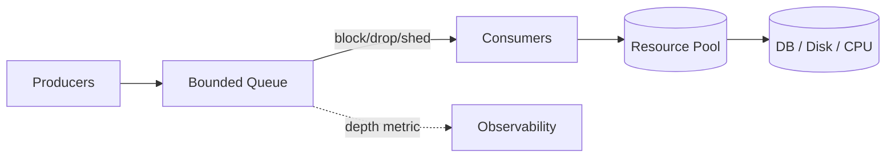
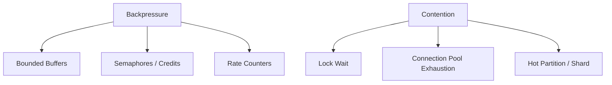
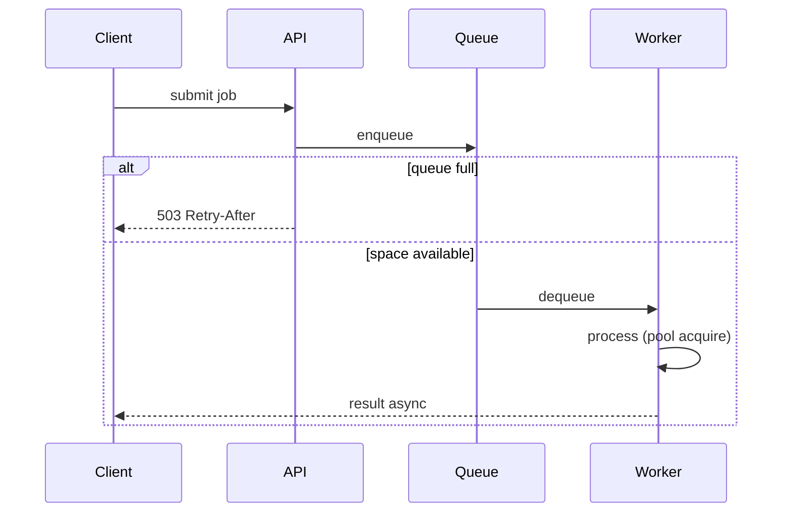

# Backpressure and Resource Contention

## Overview

**Backpressure** is a system's mechanism to signal upstream producers to **slow down** when downstream consumers or shared resources are saturated—preventing unbounded queues, memory exhaustion, and latency cliffs. **Resource contention** occurs when multiple workers compete for finite resources (CPU, locks, DB connections, disk I/O), increasing wait time and tail latency superlinearly.

Together they explain why "just add threads" or "unbounded buffer" fails in production. This note connects CS primitives (bounded buffers, semaphores) to API and infrastructure patterns in [[07-Backend/README|Backend]] and runtime behavior in [[06-NodeJS/README|Node.js]].

## Learning Objectives

- Define backpressure vs rate limiting vs load shedding
- Implement bounded queues with drop, block, or reject policies
- Predict latency inflation under contention using queueing intuition
- Choose metrics: queue depth, wait time, saturation, error rate
- Design graceful degradation paths when overload persists

## Prerequisites

- [[01-Computer-Science/05-Concurrency-Fundamentals/Semaphores and Condition Variables|Semaphores and Condition Variables]]
- [[01-Computer-Science/05-Concurrency-Fundamentals/Asynchronous Event-Driven Models|Asynchronous Event-Driven Models]]
- [[01-Computer-Science/04-Processes-and-Execution/Scheduling Concepts|Scheduling Concepts]]

## Difficulty

`intermediate`

## Estimated Time

3 hours reading, 3 hours overload labs

## History

Telephony and packet networks used explicit flow control for decades. Software systems rediscovered backpressure as microservices and event-driven architectures removed implicit OS-level throttling—unbounded in-memory queues became outage multipliers.

## Problem It Solves

Without backpressure:

- Producers accept work faster than consumers finish → memory grows until OOM
- Latency hides in queues—clients see timeouts while server CPU looks "fine"
- Retry storms amplify overload ([[01-Computer-Science/09-Correctness-and-Reliability/Failure Modes and Fault Models|Failure Modes]])

Contention without bounds converts parallel design into serialized bottlenecks at locks, connection pools, or single hot shards.

## Internal Implementation

**Little's Law** (steady state): `L = λ × W`

- `L` = average items in system
- `λ` = arrival rate
- `W` = average time in system

Unbounded `L` ⇒ unbounded `W` as λ exceeds service capacity.



**Backpressure strategies**:

| Policy | Behavior | User impact |
| --- | --- | --- |
| Block | Producer waits on full queue | Latency rises, memory bounded |
| Drop | Discard new or old items | Data loss, need idempotency |
| Reject | Return 503 / error fast | Client retries with jitter |
| Shed | Degrade non-critical work | Partial functionality |

## Mermaid Diagrams

### Structure



### Sequence / Lifecycle



## Examples

### Minimal Example

TypeScript (async semaphore limiting in-flight requests):

```typescript
class Semaphore {
  private permits: number;
  private queue: Array<() => void> = [];
  constructor(n: number) { this.permits = n; }
  async acquire(): Promise<void> {
    if (this.permits > 0) { this.permits--; return; }
    await new Promise<void>((r) => this.queue.push(r));
    this.permits--;
  }
  release(): void {
    this.permits++;
    const next = this.queue.shift();
    if (next) next();
  }
}

class Limiter {
  private sem = new Semaphore(3);
  async run<T>(fn: () => Promise<T>): Promise<T> {
    await this.sem.acquire();
    try { return await fn(); }
    finally { this.sem.release(); }
  }
}

const limiter = new Limiter();
await Promise.all(urls.map((u) => limiter.run(() => fetch(u))));
```

Python (bounded queue with blocking backpressure):

```python
import asyncio

async def producer(q: asyncio.Queue, n: int):
    for i in range(n):
        await q.put(i)  # blocks when full — backpressure to producer coroutine
        print("produced", i)

async def slow_consumer(q: asyncio.Queue):
    while True:
        item = await q.get()
        await asyncio.sleep(0.1)
        q.task_done()

async def main():
    q = asyncio.Queue(maxsize=10)
    prod = asyncio.create_task(producer(q, 100))
    cons = asyncio.create_task(slow_consumer(q))
    await prod
    await q.join()
    cons.cancel()

asyncio.run(main())
```

### Production-Shaped Example

HTTP gateway with queue depth + 503 ([[07-Backend/README|Backend]]):

```typescript
const MAX_INFLIGHT = 500;
let inflight = 0;

function handle(req, res) {
  if (inflight >= MAX_INFLIGHT) {
    res.setHeader("Retry-After", "1");
    return res.status(503).json({ error: "overloaded" });
  }
  inflight++;
  process(req)
    .then((body) => res.json(body))
    .finally(() => { inflight--; });
}
```

Pair with client retry jitter and circuit breakers—never unbounded retry on 503.

## Trade-offs

| Dimension | Upside | Downside | When it matters |
| --- | --- | --- | --- |
| Block | No data loss | Thread/coro pile-up | Internal pipelines |
| Reject fast | Protects memory | Requires client cooperation | Public APIs |
| Drop | Keeps freshest work | Loses messages | Metrics streams |
| Larger queue | Absorbs bursts | Hides overload, hurts p99 | "Fix" that fails |

### When to Use

- Every producer–consumer boundary in production services
- Connection pools sized with wait timeouts and metrics
- Stream processing (Kafka, SSE) with explicit lag monitoring

### When Not to Use

- Unbounded in-memory buffering "temporarily" during incidents
- Retries without backoff on overload signals

## Exercises

1. Simulate λ > μ with bounded vs unbounded queue; plot latency vs time.
2. Implement three policies on full queue: block, drop-new, drop-oldest.
3. Identify contention point in stack: 100 threads, pool size 10 DB connections.
4. Design Retry-After strategy for 503 that avoids retry storm.

## Mini Project

**Overload lab** (TS + Python): multi-client hammering server with configurable max queue, pool size, and policy; export p50/p99 and rejection rate. Use [[01-Computer-Science/code/README|code labs]] runtime patterns.

## Portfolio Project

Load-test report for [[01-Computer-Science/projects/Concurrent Runtime and Protocol Workbench/README|Concurrent Runtime and Protocol Workbench]] documenting knee in latency curve.

## Interview Questions

1. Define backpressure; how differs from rate limiting?
2. Why do unbounded queues cause OOM but "fix" latency temporarily?
3. What happens when all DB pool connections are busy?
4. Explain Little's Law intuitively.
5. How should clients respond to 503 with Retry-After?

### Stretch / Staff-Level

1. Design multi-tier backpressure from edge CDN → API → queue → workers with observability at each hop.

## Common Mistakes

- Monitoring CPU only while queue depth explodes
- Infinite client retries on overload
- One global lock under high parallel load
- Scaling consumers without scaling contended resource (DB primary)

## Best Practices

- Bound every queue; expose depth and wait time metrics
- Fail fast with actionable errors (429/503 + Retry-After)
- Size pools from measured service time and SLA, not guesses
- Load test beyond expected peak ([[09-System-Design/README|System Design]])

## Summary

Backpressure propagates saturation signals upstream so systems reject or slow work instead of collapsing under unbounded queues. Resource contention amplifies latency when parallel paths serialize on pools, locks, or hot keys. Bounded buffers, semaphores, and explicit reject policies—observed via queue metrics—are the bridge from CS primitives to reliable backend operation.

## Further Reading

- [[01-Computer-Science/07-Networking-Fundamentals/Latency Bandwidth Throughput and Tail Latency|Latency Bandwidth Throughput and Tail Latency]]
- [[01-Computer-Science/05-Concurrency-Fundamentals/Deadlocks Livelocks and Starvation|Deadlocks Livelocks and Starvation]]
- [[01-Computer-Science/09-Correctness-and-Reliability/Observability Fundamentals|Observability Fundamentals]]

## Related Notes

- [[01-Computer-Science/05-Concurrency-Fundamentals/Semaphores and Condition Variables|Semaphores and Condition Variables]]
- [[01-Computer-Science/05-Concurrency-Fundamentals/Asynchronous Event-Driven Models|Asynchronous Event-Driven Models]]
- [[07-Backend/README|Backend]]
- [[06-NodeJS/README|Node.js]]
- [[10-Linux/README|Linux]] — cgroup memory/CPU limits as hard backpressure
- [[01-Computer-Science/code/README|code labs]]

## Progress Checklist

- [ ] Explained from first principles
- [ ] Drew at least one Mermaid diagram
- [ ] Implemented a minimal version
- [ ] Documented trade-offs and non-goals
- [ ] Completed exercises
- [ ] Practiced interview questions aloud
- [ ] Linked prerequisites and dependents
